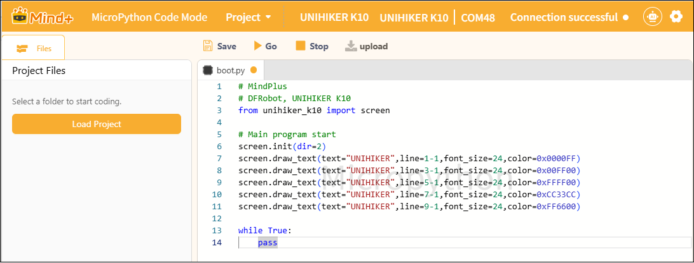
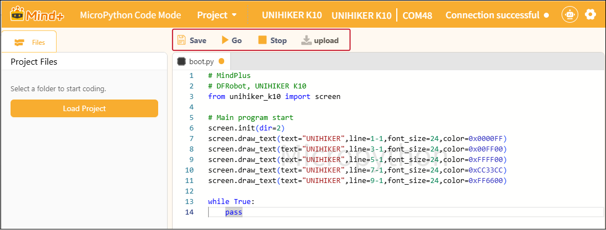

# 3.5.4 Programming Area

The coding area is the core space for writing MicroPython code. It offers features such as syntax highlighting and automatic indentation, making MicroPython code structure clearer and coding more efficient.

Here, you can write all the code—from initialization to the main program logic—and then use the Save, Run, Stop, and Upload buttons in the toolbar above to execute or save the program directly on the device.

**Note**: You must connect the device before running the program.

