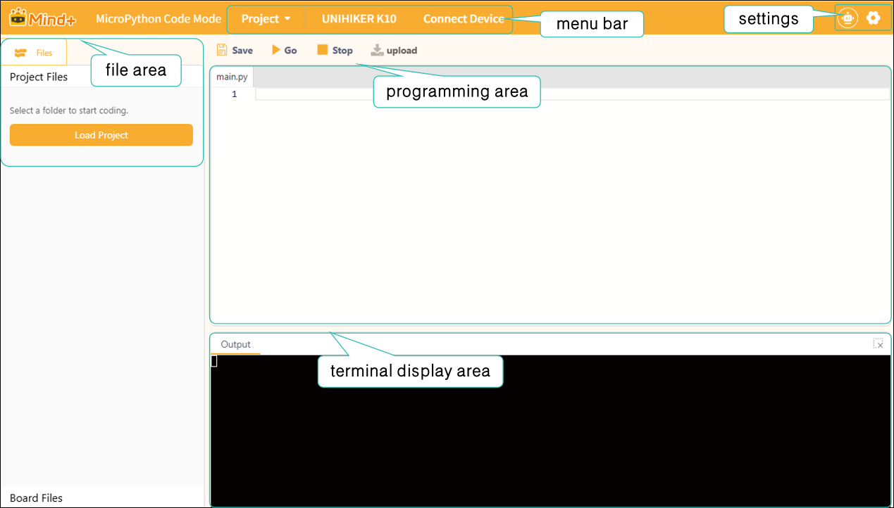

# 3.5 Micropython Code Mode

MicroPython Code Mode is a pure code development mode designed specifically for MicroPython hardware such as the UNIHIKER K10, Zhankong Board, and ESP32.

You can write standard MicroPython code directly, upload it with a single click via the serial port, and debug in real time to quickly implement embedded projects such as sensor control and IoT interactions.Compared to the block-based mode, this approach adheres more closely to native MicroPython syntax. It is suitable for users with some programming experience, allowing for more flexible hardware control and the implementation of complex logic, making it an efficient tool for advanced hardware development.

## Understanding the Interface

Once you enter upload mode, you will see the following screen.

The interface is divided into five areas: the menu bar, settings, the file area, the programming area, and the terminal display area.

Next, we’ll take a closer look at these sections. For a detailed overview of each section’s features, click here:

| [Menu Bar](351MenuBar.md) | [Settings](352Settings.md) | [file area](353FileArea.md) | [Programming area](354ProgrammingArea.md) | [**Terminal display area**](355TerminalDisplayArea.md) |
| :--------------------: | :---------------------: | ------------------------ | :------------------------------------: | --------------------------------------------------------- |

### Frequently Asked Questions

Click to view [FAQ](../../FAQ/Coding/MicroPythonCodeMode/index.md)
