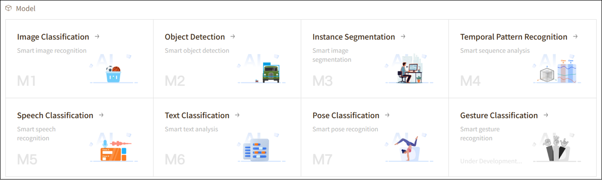
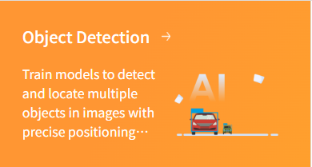
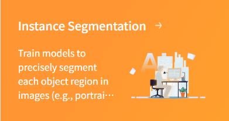
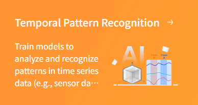
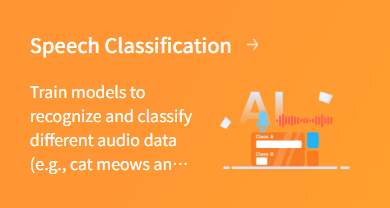
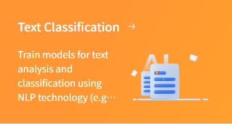
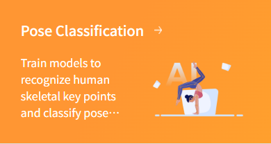

In **Mind+**, **Model** is not only the core of AI projects but also the starting point for exploring intelligent applications. Whether it’s recognizing images, analyzing speech, or understanding text and motion data, you can use different training functions to teach the computer to **see, hear, read, and move**.

Next, we will explore each **Model** module one by one to see what interesting and practical capabilities they can help you achieve.

## 1. **Image Classification（M1）**

### Function Overview

Image Classification is one of the fundamental tasks in artificial intelligence, enabling computers to automatically recognize the category of an image. By analyzing the content of an image, a computer can determine whether the objects depicted are cats, dogs, traffic signs, or other specified categories.

It can not only identify static images but also analyze real-time footage captured by a camera, quickly determining the categories of objects in the current scene for dynamic recognition and monitoring. This makes **Image Classification** suitable not only for photo organization and educational demonstrations but also for applications in security, intelligent driving, pet recognition, and many other scenarios.

### Application Scenarios

- **Object Recognition:** Identify animals, plants, traffic signs, and more, enabling the computer to automatically classify image content.
- **Industrial Inspection:** Check product appearance or detect defects to improve production efficiency and quality control.
- **Education & Research:** Used for rapid experiments, teaching demonstrations, or research data analysis, helping users understand the principles and applications of artificial intelligence.

### Operation Guide

Please choose the learning mode that suits you and follow the corresponding tutorial:

- [**Image Classification — Quick Experience**](https://www.yuque.com/joanna-rqvih/ilxuhv/uazqevn601vxqvtd) (suitable for beginners, complete training quickly)
- [**Image Classification — Advanced Mode**](https://www.yuque.com/joanna-rqvih/ilxuhv/cxcvw4obvfpsamog) (suitable for advanced users, supports custom parameters and in-depth optimization)

## 2. Object Detection（M2）

### Function Overview  

**Object Detection** is a computer vision capability that not only identifies the categories of objects present in an image but also accurately locates their positions using bounding boxes. Unlike simple image classification, **Object Detection** focuses on “finding what is in the image,” enabling the recognition of multiple objects simultaneously even in complex scenes.

To use this function, you can collect and label a dataset containing different objects and train a model. Once the model is trained, the system can identify multiple objects in new images or real-time video streams and output their categories.

### Application Scenarios  

- **Smart Security:** Automatically detect people, vehicles, or suspicious objects in surveillance footage, enabling intelligent alerts and security inspections.
- **Autonomous Driving:** Recognize pedestrians, vehicles, traffic signs, and traffic lights on the road, providing a foundation for autonomous driving and safety decisions.
- **Retail & Logistics:** Automatically detect goods, packages, or shelf items in warehouses and retail environments for inventory and sorting purposes.
- **Industrial Inspection:** Identify components, product defects, or foreign objects on production lines to improve quality and efficiency.

### Operation Guide

- [**Object Detection — Quick Experience**](https://www.yuque.com/joanna-rqvih/ilxuhv/kp5cr5b19cvy9mmk) (suitable for beginners, complete training quickly)
- [**Object Detection — Advanced Mode**](https://www.yuque.com/joanna-rqvih/ilxuhv/zg2qaae4t9o427iu) (suitable for advanced users, supports custom parameters and in-depth optimization)

## 3. Instance Segmentation（M3）  

### Function Overview  

**Instance Segmentation** is an advanced computer vision capability that builds upon **Object Detection**. It not only identifies the categories and positions of objects in an image but also generates precise pixel-level masks for each object, distinguishing the exact contours and shapes of individual instances within the same category.

Unlike **Object Detection**, which uses only bounding boxes, **Instance Segmentation** can **accurately outline each object**, even when multiple objects of the same category overlap or are closely positioned. By training a model, the system can perform pixel-level recognition for every instance in images or videos, enabling more detailed analysis and processing.

### Application Scenarios  

- **Intelligent Image Editing:** Precisely separate people, animals, or objects in photos or videos for background replacement, removal, or special effects.
- **Autonomous Driving & Traffic Analysis:** Identify the exact contours of every vehicle, pedestrian, or traffic facility on the road, providing more accurate data for path planning and collision prediction.
- **Industrial Quality Inspection:** Perform pixel-level detection of components or products on production lines to quickly identify defects, cracks, or abnormal shapes, improving production quality.
- **Medical Imaging Analysis:** Accurately segment organs, cells, or lesion areas to assist doctors in diagnosis and surgical planning.
- **Robot Vision & Interaction:** Enable robots to accurately recognize and manipulate different instances of similar objects for tasks such as grasping, sorting, or obstacle avoidance.

### Operation Guide

- [**Instance Segmentation — Quick Experience**](https://www.yuque.com/joanna-rqvih/ilxuhv/ns1n8me2s15684gm) (suitable for beginners, complete training quickly)
- [**Instance Segmentation — Advanced Mode**](https://www.yuque.com/joanna-rqvih/ilxuhv/zfbteg84k4mxqgp8) (suitable for advanced users, supports custom parameters and in-depth optimization)

## 4. Temporal Pattern Recognition（M4）  

### Function Overview  

**Temporal Pattern Recognition** is an intelligent recognition capability based on time-series data. It records continuous data collected by hardware sensors over a period of time and trains a model to automatically recognize dynamic processes or actions. Unlike single instantaneous data points, **Temporal Pattern Recognition** considers the trends and patterns of data over time, enabling more accurate capture of motion characteristics.

For example, using the accelerometer on the **UNIHIKER K10** to collect hand movement data, actions such as “waving,” “shaking,” or “tapping” can be recorded as data curves on the platform. After model training, when similar motion trajectories are detected again, the system can automatically predict and identify the user’s actions.

### Application Scenarios  

- **Motion Interaction:** Recognize different gestures or actions to enable game control or interactive experiences, such as “wave to start the game” or “shake to exit.”
- **Activity Detection:** Monitor movements like running, jumping, or swinging, assisting in exercise habit analysis or intelligent workout guidance.
- **Safety Monitoring:** Detect falls, sudden shakes, or other abnormal movements for safety alerts in smart wearable devices.
- **Smart Home Control:** Trigger control of home devices, such as turning lights on/off or playing music, through simple action recognition like tapping or gestures.

### Operation Guide

- [**Temporal Pattern Recognition — Quick Experience**](https://www.yuque.com/joanna-rqvih/ilxuhv/feg55z1op746fz0k) (suitable for beginners, complete training quickly)
- [**Temporal Pattern Recognition — Advanced Mode**](https://www.yuque.com/joanna-rqvih/ilxuhv/gdy3dxdhw2ocqg4e) (suitable for advanced users, supports custom parameters and in-depth optimization)

## 5. Speech Classification（M5）  

### Function Overview  

**Speech Classification** is an intelligent recognition capability based on audio signals. It analyzes collected audio data and automatically classifies it into different categories. The system can not only identify the type of sound but also determine the event or emotional characteristics represented by the audio based on the trained model.

Through training, a **Speech Classification** model can learn patterns from multiple audio features, such as frequency, intensity, duration, and rhythm, enabling efficient and accurate recognition.

### Application Scenarios  

- **Environmental Monitoring:** Recognize bird calls, traffic noise, or machine sounds for ecological monitoring or equipment status detection.
- **Smart Home:** Detect doorbells, knocking, or calling sounds to automatically trigger control of home devices.
- **Health & Safety:** Monitor baby cries, elderly calls for help, or abnormal sounds for intelligent alerts and health management.
- **Entertainment & Interaction:** In games or interactive projects, recognize voice commands, clapping, or musical instrument sounds to enable sound-based control and multi-sensory interaction.

### Operation Guide

- [**Speech Classification — Quick Experience**](https://www.yuque.com/joanna-rqvih/ilxuhv/qm4m7g1ut6ghf6u2)

## 6. Text Classification （M6） 

### Function Overview  

**Text Classification** is an intelligent recognition capability based on Natural Language Processing (NLP). It analyzes input text and automatically assigns it to predefined categories. The system learns the language features, word distributions, and semantic patterns of different text categories through model training, enabling it to quickly determine the category of new text.

**Text Classification** can handle short sentences or keywords as well as long paragraphs, achieving efficient information organization and content recognition.

### Application Scenarios  

- **Spam Filtering:** Automatically identify spam emails, advertisements, or inappropriate content to enhance information security and user experience.
- **Sentiment Analysis:** Analyze the emotional tendency of comments, feedback, or social media content, such as positive, negative, or neutral.
- **Intelligent Customer Service:** Classify user queries to quickly match corresponding answers or automatically route them to relevant departments.
- **News & Content Management:** Automatically categorize news, articles, or documents by topic for easier retrieval and management.

### Operation Guide

- [**Text Classification — Quick Experience**](https://www.yuque.com/joanna-rqvih/ilxuhv/zqvwv6gszslrguy1)

## 7. Pose Classification（M7）  

### Function Overview  

**Pose Classification** is an intelligent recognition capability based on human keypoint information. By analyzing human poses in images or videos, the system can classify different actions or postures into predefined categories. For example, it can determine whether a person is **standing**, **waving**, or **squatting**.

Unlike general action recognition, **Pose Classification** focuses on the relative positions and movement patterns of body parts. Therefore, it can not only recognize static poses but also support motion-based interaction, enabling real-time engagement with users.

### Application Scenarios  

- **Fitness & Exercise:** Recognize running, squats, push-ups, yoga, and other exercise poses to help users correct their movements.
- **Health Monitoring:** Detect sitting, standing, or sleeping postures to remind users of poor posture and assist in office ergonomics or rehabilitation training.
- **Intelligent Interaction:** Control devices using specific gestures or body poses, such as waving to switch pages or raising a hand to answer a call.
- **Education & Training:** Used in sports teaching or dance training to analyze movement accuracy and provide feedback.
- **Safety Monitoring:** Detect dangerous postures (e.g., excessive bending, falling) to enable real-time alerts and safety protection.

### Operation Guide

- [**Pose Classification — Quick Experience**](https://www.yuque.com/joanna-rqvih/ilxuhv/yye0mcobnnturgub)
