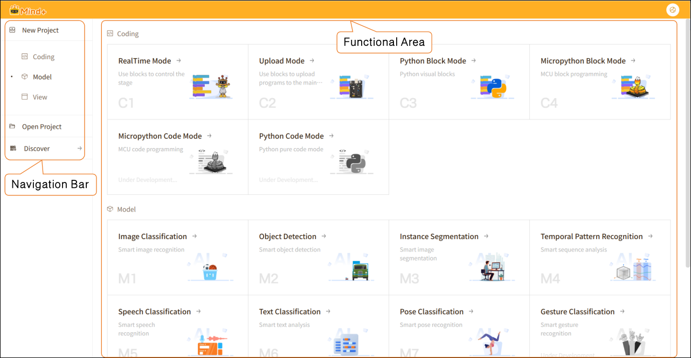
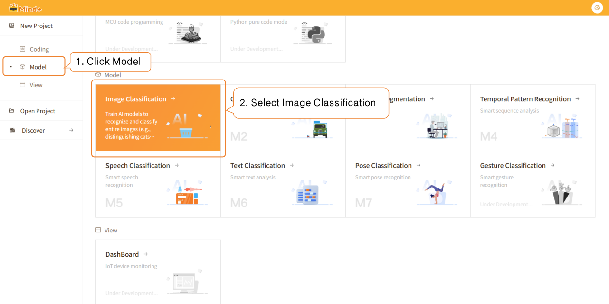
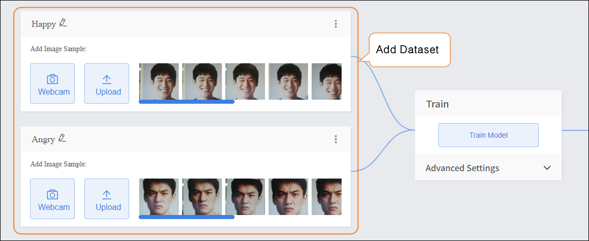
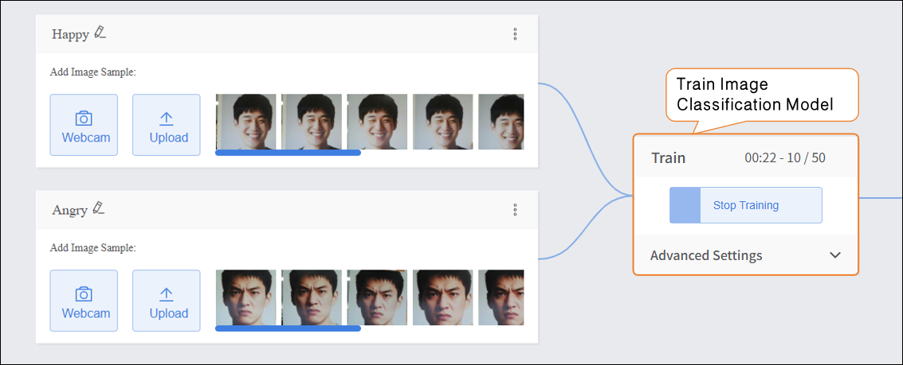
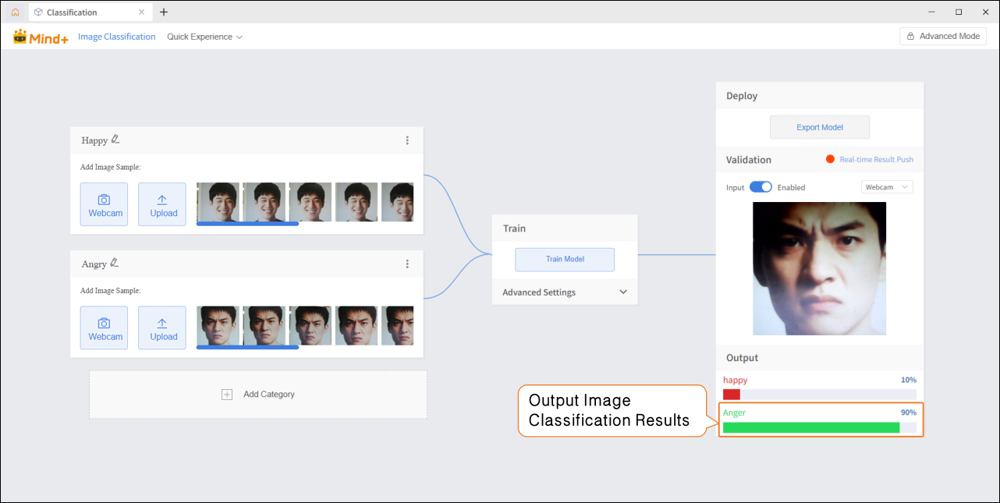

## 1. **Quick Preview**

The new version of the **Mind+ main interface** adopts a **left-side navigation bar + right-side functional area** layout, providing clear partitioning and intuitive operation, which allows users to quickly create and manage projects. The overall design is clean and straightforward, mainly using a **card-style display**, with all functional entrances clearly visible.

**Interface Features:**

- **Card-Style Layout:** Each functional module is displayed independently, accompanied by icons and brief descriptions, making it easy to understand at a glance.
- **Visual Icons:** Clear and intuitive icons help users quickly grasp the purpose of each function.
- **Clear Categorization:** Panels for programming, model training, and data visualization are distinctly separated, allowing users to quickly select the desired function.

## 2. **Operation Example**

The example operation uses **Image Classification** as a case study to demonstrate the basic workflow of **Model** training, helping users quickly get started.

- **Create New Project**

- Add Dataset  

- Train Model

- Model Validation  

