## 1. Function Overview

Real-time Result Push is another Model Deploy method. Unlike exporting the model to run on hardware, real-time result push performs inference on the platform and instantly transmits the prediction results to the SIoT platform or external devices. In this way, users can experience the model’s performance in real-world applications without loading the full model locally or on hardware.

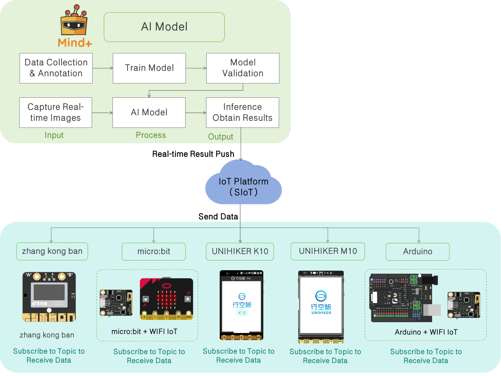

**Features**

- **Lightweight:** The hardware does not need to perform inference computations and only receives results pushed from the platform, reducing performance requirements on the device.
- **Real-time:** Model outputs are pushed instantly, facilitating interaction and rapid verification.
- **Flexible:** Can interact with different terminals, such as visualization panels, smart cars, or IoT devices.
- **Easy to Use:** No complex deployment operations are required, making it suitable for teaching experiments and rapid prototyping.

## 2. Application Scenarios  

- **Teaching Demonstration:** Students can visually observe the model’s recognition results and interact with the hardware.
- **Prototype Verification:** Quickly verify model feasibility in the early stages of a project without waiting for full deployment.
- **IoT Integration:** Combine with smart hardware, e.g., trigger car movement or lighting control based on recognition results.
- **Data Visualization:** Display inference results in real time on the platform or terminal for analysis and demonstration.

## 3. Operation Guide  

This guide focuses on demonstrating the workflow and specific steps for real-time result push of Image Classification on the UNIHIKER K10.
The following operation steps are mainly for real-time result push after the model validation meets the expected results. For detailed steps on model training, please refer to the corresponding model Operation Guide.  

### 3.1 Hardware List

- Hardware Preparation

| 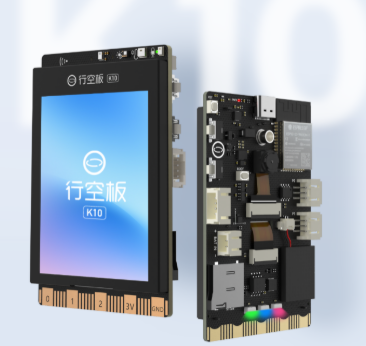 | 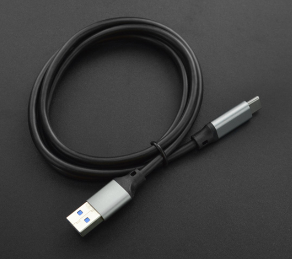 |
| ------------------------------------------------------------ | ------------------------------------------------------------ |
| [UNIHIKER K10](https://www.dfrobot.com.cn/goods-4014.html)   | [USB数据线](https://www.dfrobot.com.cn/goods-2977.html)      |

- Hardware Connection  

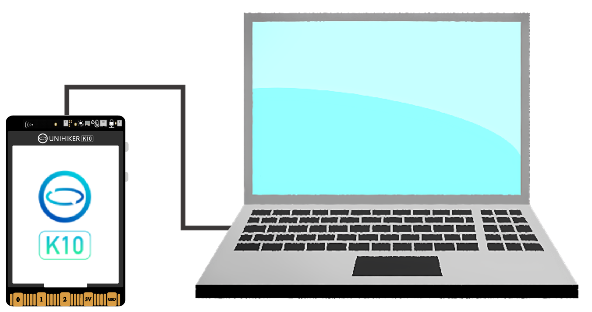

### 3.2 Environment Preparation

Real-time result push relies on MQTT for wireless network transmission, so the actual IP address of the computer needs to be entered. The operation steps are as follows: first, start the data transmission tool (run the .bat batch file), then obtain the computer’s IP address.

Do not close the transmission tool while it is running.

-  SIoT Tool Download Links：

- - Tencent Weiyun (Recommended): Link: https://share.weiyun.com/6SFhgLQj
  - Baidu Netdisk: Link: https://pan.baidu.com/s/17clVjJXWTZh02FteKy3mcA?pwd=mind Extraction Code: mind
  - Alibaba Cloud Drive: https://www.aliyundrive.com/s/tCqwJwGtZzL Extraction Code: 3h4x
  - Google Drive: Link: [Click to Download](https://drive.google.com/drive/folders/16Lf0itQ-v2oZrUJEFHrOhjfgS68eN6bn)

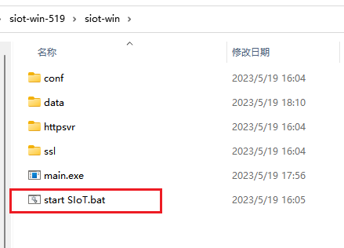

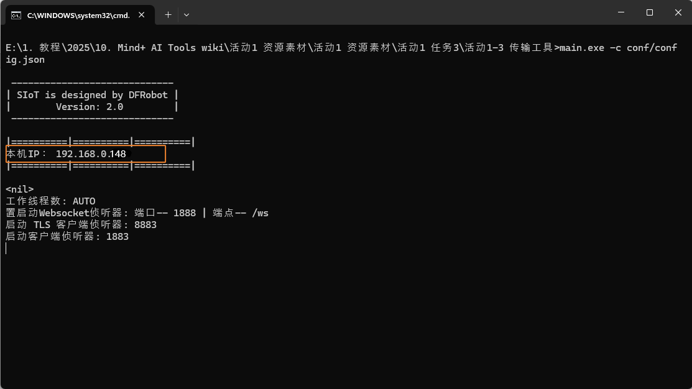

###  3.3 Real-Time Result Push Application  

- Real-Time Result Push  

- -  After the model validation is completed and meets the requirements, click “Real-Time Result Push.” In the “Real-Time Push Server Settings,” change the MQTT server address to the local IP address (can be viewed in the Data Transmission Tool).  

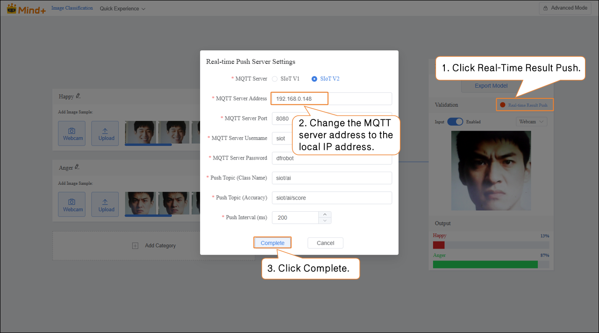

- Once the server connection is successful, the Real-Time Result Push button turns green.

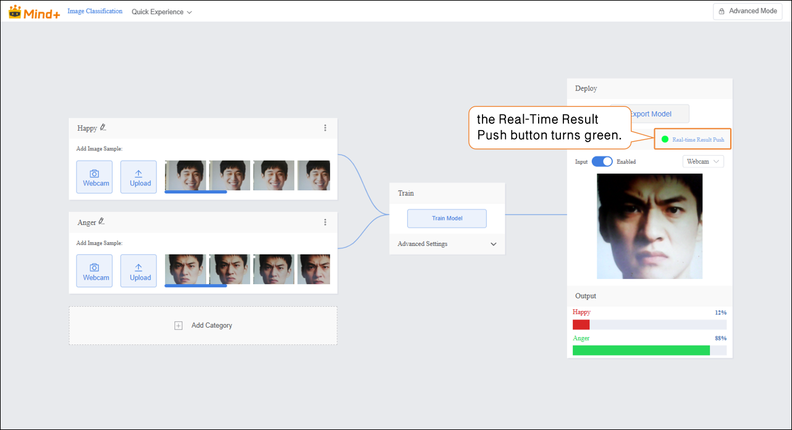

-  Programming  

- - Add Main Controller: Click “Extensions,” then in “Board,” download and add “UNIHIKER K10.”  

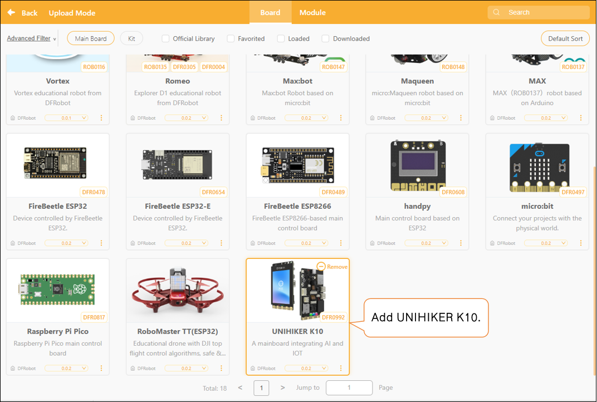

- Add Extension Libraries: Click “Extensions,” then in the search box of “Model,” enter “Wi-Fi” and “MQTT” separately, download and add them.

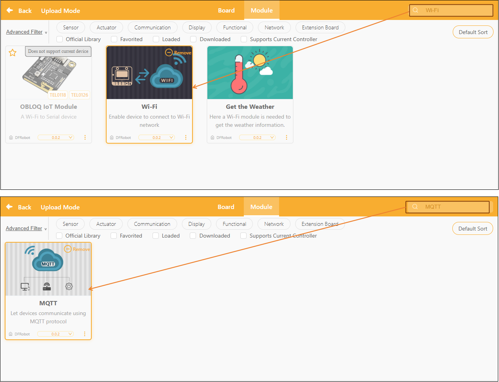

-  Program Example  

 Receive real-time result messages pushed to MQTT and analyze the MQTT messages. If the MQTT message is "happy," the RGB light on the UNIHIKER K10 will display yellow; if the MQTT message is "angry," the RGB light on the UNIHIKER K10 will display red.  

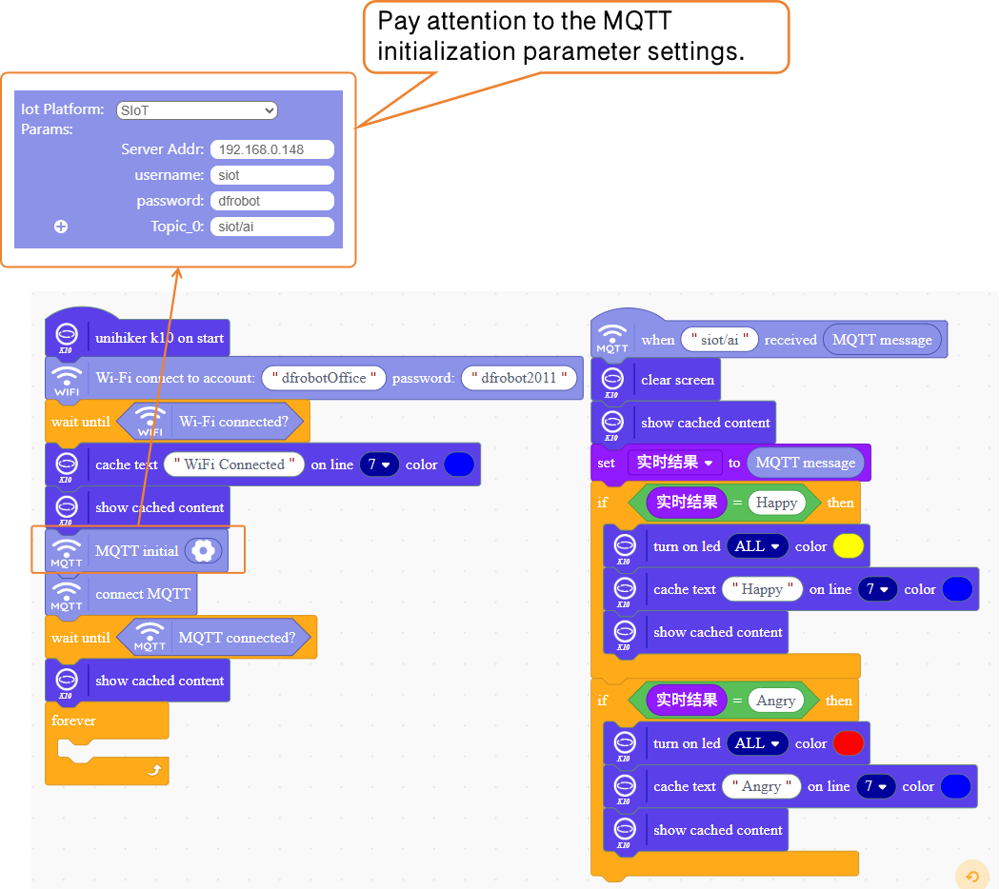

- **Test & Run**

| **Real-time Result Push**                                    | **UNIHIKER K10 Execution Result**                            |
| ------------------------------------------------------------ | ------------------------------------------------------------ |
| 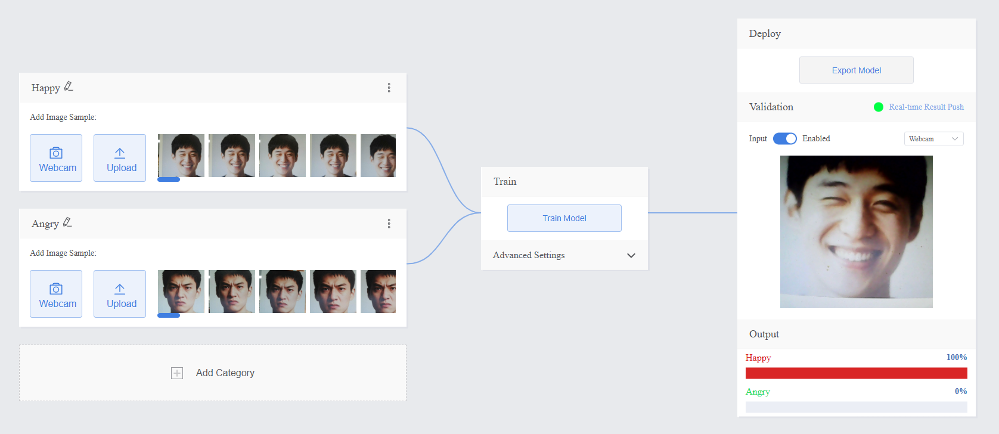 | 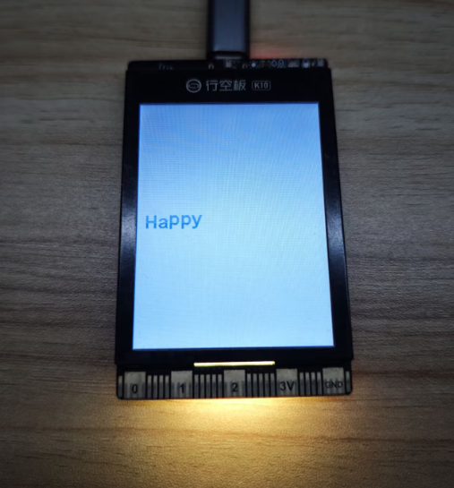 |
| 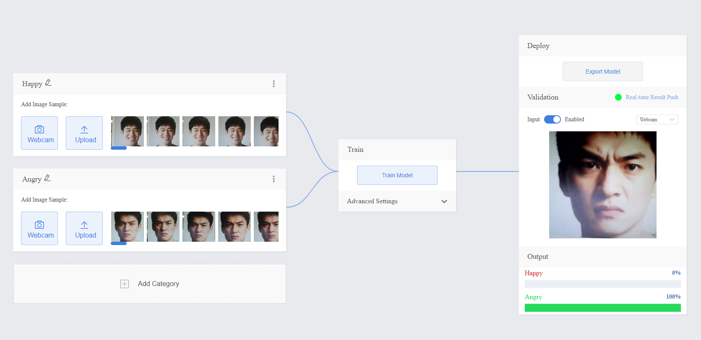 |  |

## 4. More Real-Time Result Push Application Cases

| Model               | Application Case                                             | Case Description                                             |
| ------------------- | ------------------------------------------------------------ | ------------------------------------------------------------ |
| Pose Classification | [Based Face-Tracking Oscillating Fan](https://h7dvigefi0.feishu.cn/drive/folder/GDiff1318lt85fdrwsYcXofbnff) | This project implements an intelligent fan capable of real-time face keypoint detection and automatic tracking. Unlike ordinary fans that blow in a fixed direction, it intelligently adjusts its angle based on the user’s face position, achieving precise airflow that follows the person’s movement. |

- Real-time result push is an efficient model deployment method that can transmit inference results over the network to a specified platform or device in real time. In addition to the UNIHIKER K10 mainboard used in the example, this feature is also applicable to UNIHIKER M10, micro:bit, Arduino, Makernotes boards, and other mainboards, and can even run directly in real-time mode to achieve cross-hardware data interaction and result display.
- 如需进一步学习，可前往[SioT使用教程](https://mindplus.dfrobot.com.cn/siot)查看详细说明。
- Special note: When using micro:bit or Arduino as the mainboard, the OBLOQ IoT WiFi module is required.