# 【Image Classification】 Advanced Mode

This project uses **“Traffic Sign Recognition”** as a case study to guide users in completing an **image classification** task in **Advanced Mode**. Through this case, users can not only master the basic workflow (data setup, data labeling, model training) but also explore advanced features in **Advanced Mode**, such as customizing training parameters, monitoring training curves, and adjusting data augmentation strategies. This allows finer control over the training process and helps improve model performance.

Once the model training is complete, the system can accurately recognize traffic turn signs in new images, enabling automatic detection and classification of traffic turn signs.

**Effect:** The model can correctly identify traffic turn signs in images or real-time camera feeds, label the category name (e.g., left, right, straight), and display the prediction confidence.

### Mode Switching

- Open **Mind+**, select **“New Project”** from the menu bar, and then click **“Model”**.
- In the training options, find **“Image Classification (M1)”** and click it to create the project.

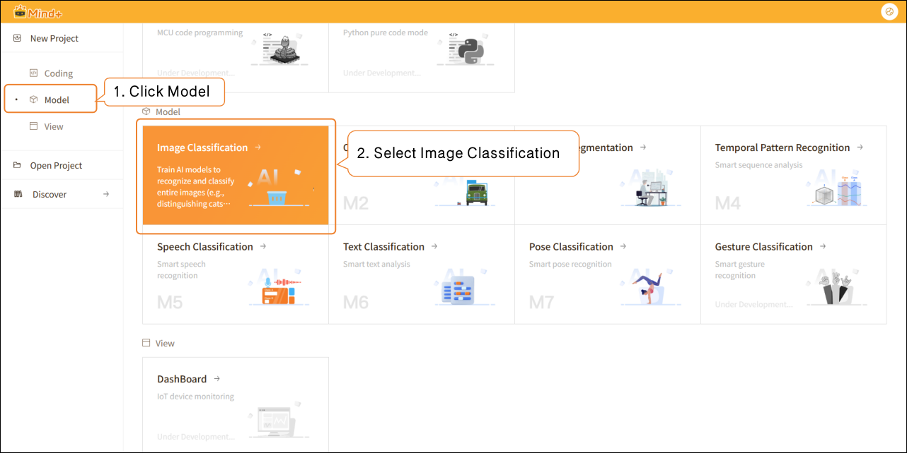

- Click **"Advanced Mode"** in the top-right corner of the interface to switch modes. Once switched successfully, the menu bar will add the following modules: **Data Settings**, **Annotation Settings**, **Model Training**, and **Model Validation**.

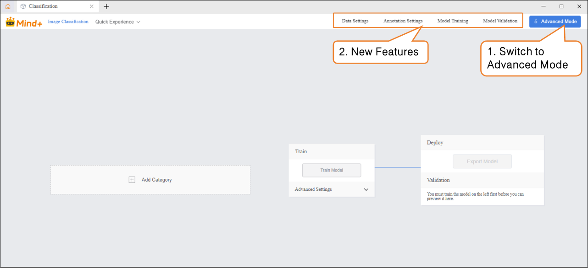

### Data Settings

- Switch to "Data Settings" → Click "Create" at the top left, for example, create a dataset named Traffic Sign Recognition.  

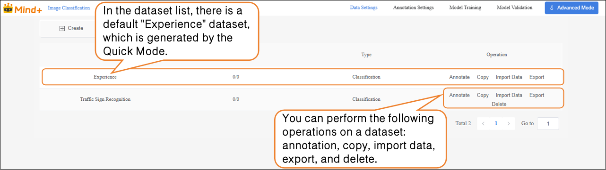

- After switching to Advanced Mode, the dataset list will display a default "Experience" dataset, which is generated from the Quick Experience mode. Users can perform the following operations on newly created datasets: annotation, copy, import data, export, and delete.  

 Note: The default dataset cannot be deleted.  

- Next, perform the **Import Data** operation for the newly created Traffic Sign Recognition dataset. The system supports two import methods: **with annotations** and **No annotations**.  
-  Import Method 1: **No annotations**

- - Suitable for uploading only raw images (e.g., images containing mixed traffic signs such as straight, left turn, right turn, with at least 20 images per category).
  - **Steps:** Select No annotations as the import type → Click Click to Upload → Choose images from the local computer → Click Confirm to complete the import.  

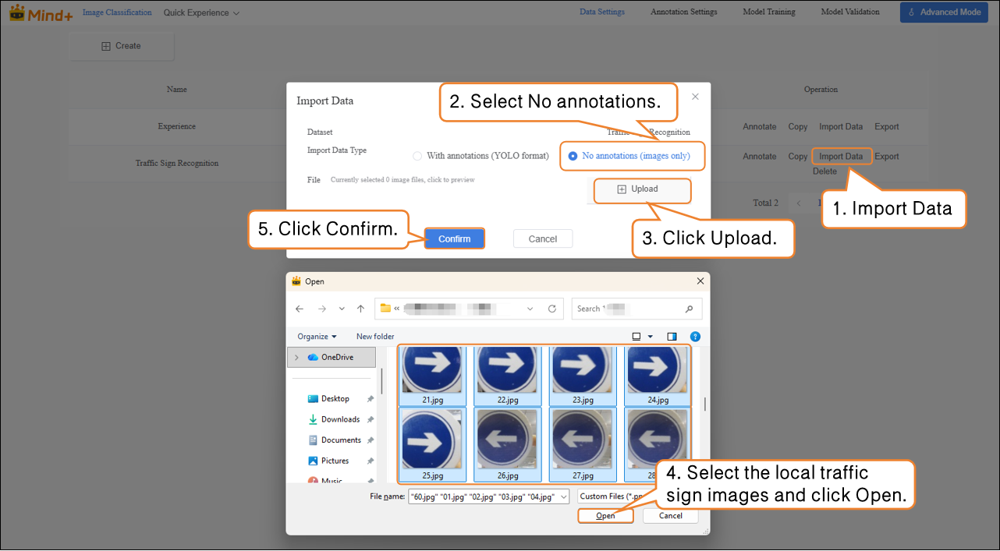

- Import Method 2: **With Annotations**

- - Directly upload YOLO-formatted annotated data (.zip file).
  - Organize the folder structure according to platform requirements. After uploading, manual annotation is not needed, and the system will directly proceed to model training.  

### **Annotation Settings**

- After the traffic sign images are successfully imported, the annotation progress bar will simultaneously display the number of imported images and their corresponding annotations.  

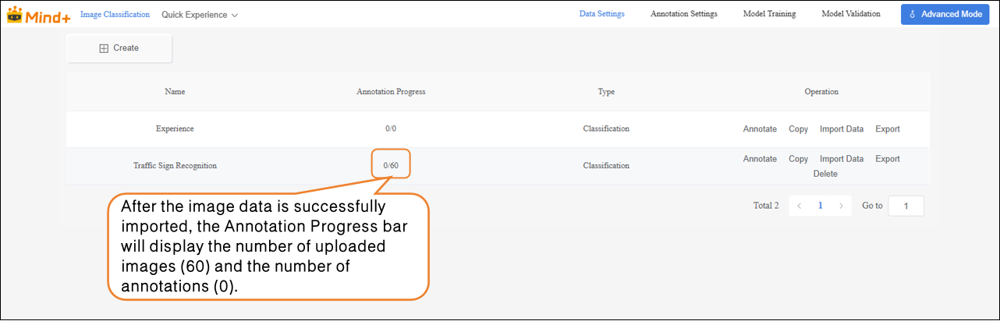

- Click **Annotate** in the **Actions** column to enter the traffic sign annotation settings interface.

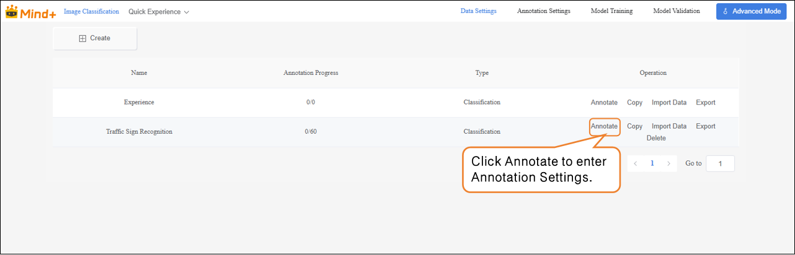

- Follow the on-screen instructions to create labels (**Left Turn**, **Right Turn**, **Straight**) for annotating different types of traffic signs.

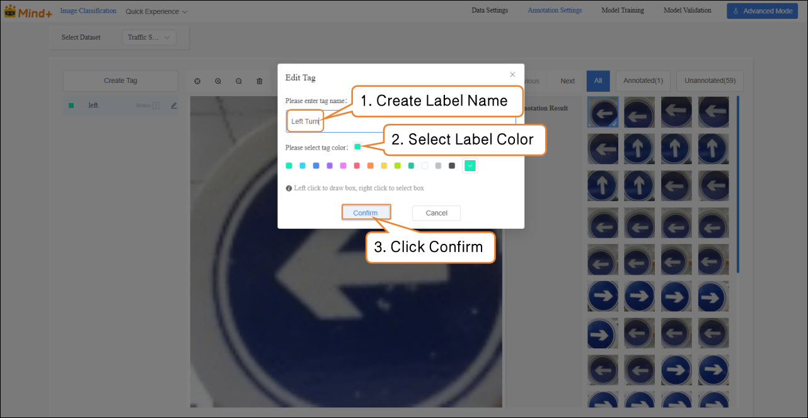

- **Next, annotate each image in the image area on the far right of the interface:**

- - Left-turn sign → click the “Left” label
    Right-turn sign → click the “Right” label
    Straight sign → click the “Straight” label

After labeling, a blue √ will appear at the bottom-right corner of the image, and the annotation results will be shown in the annotation results panel.
**Note:** All images need to be annotated.

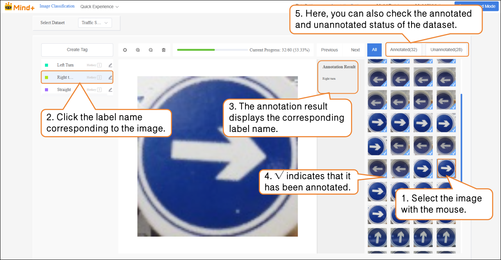

### Model Training

-  After all images have been annotated, switch to the **Model Training** module.

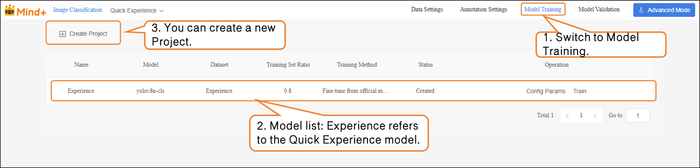

-  Click **“Create Project”**, and in the pop-up window, set the following:  

- - **Name**: Traffic Sign Recognition Model (rename as needed)
    **Model**: Select according to your needs (default is also fine)
    **Training Method**: Select according to your needs (default is also fine)
    **Dataset**: Traffic Sign Recognition (in **Data Settings**, we have already created and named the dataset “Traffic Sign Recognition”; in **Annotation Settings**, all images have been annotated and organized. At this point, the data has the complete structure required for training. Next, the system will extract features and learn patterns from this dataset, gradually enabling classification and recognition of traffic signs. Therefore, the dataset must be set to Traffic Sign Recognition.)
    **Training Set Ratio**: Select according to your needs (default is also fine)  

| Task Parameter     | Purpose                                                      | Description                                                  |
| ------------------ | ------------------------------------------------------------ | ------------------------------------------------------------ |
| Name               | Used only to distinguish and manage different training tasks; does not affect model performance. | Like giving this experiment a name, making it easier to review and compare later. |
| Model              | Determines which neural network structure to use for training. | Different models have different “learning methods” and “understanding abilities.” For example, some models are suitable for small datasets, while others are better for complex classification tasks. |
| Training Method    | Determines the training approach, such as classification, regression, or detection. | Tells the model “what you want it to learn.”                 |
| Dataset            | Specifies which data the model should learn from.            | Acts like a textbook; the model learns to recognize different traffic signs from the images and labels in this dataset. |
| Training Set Ratio | Determines what proportion of the dataset is used for training and validation. | **Training set** = examples used for the model to learn. **Validation set** = examples to check the model’s learning performance (images the model has not seen before). |

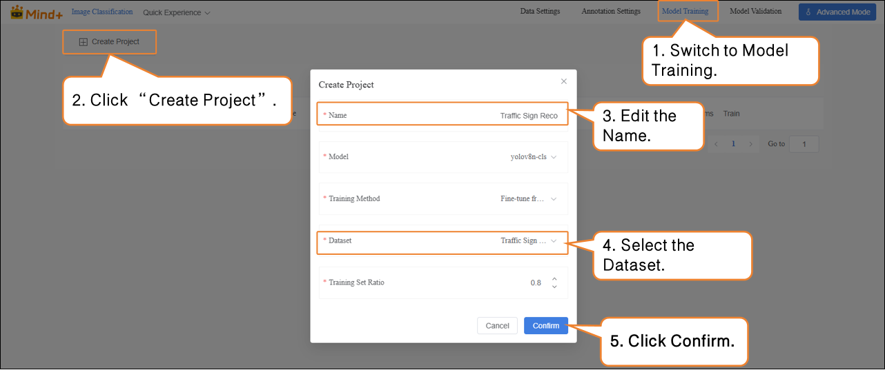

- After the model training task is successfully created, click **Config Params** to enter the training parameter configuration interface. You can adjust the parameters according to your needs, or start training directly with the default settings.

- - **Basic Parameters**: Image size, Batch size, Epochs.
  - **Advanced Parameters**: **Advanced Parameters**: Save Period, Vertical Flip Probability, fliplr, Optimizer, etc.  

| Advanced Parameter        | Description                                                  | Explanation                                                  |      |
| ------------------------- | ------------------------------------------------------------ | ------------------------------------------------------------ | ---- |
| Save Period               | The interval at which the model is saved during training to prevent data loss in case of unexpected interruptions. | Save Period = 5 → The model is saved every 5 epochs. Save Period = -1 → No automatic saving; only the last model is kept. |      |
| Vertical Flip Probability | During data augmentation, the system randomly decides whether to flip the image along the horizontal axis (up-down), helping the model learn to recognize images in different orientations. | Probability = 0 → Never flips (augmentation not applied). Example: A cat photo flipped vertically will appear upside down. For some tasks (e.g., face recognition), vertical flipping may distort features, so use based on the task. |      |
| fliplr                    | Flips the image horizontally (mirror image).                 | Probability = 0 → Never flips. Example: A cat photo flipped horizontally will change the cat facing left to facing right. This operation is common in many image classification and object detection tasks, such as recognizing cats, dogs, people, vehicles, etc. |      |

- Click **Train** to start the model training.

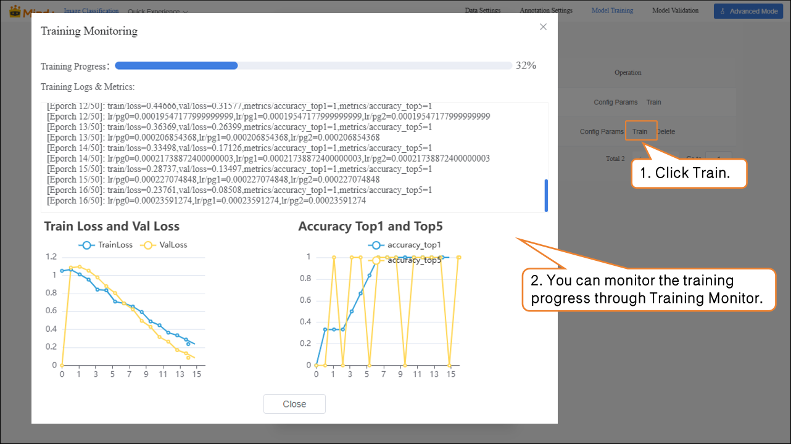

- After the model training is completed, you can delete, export, or view result of the trained model from the operation bar.

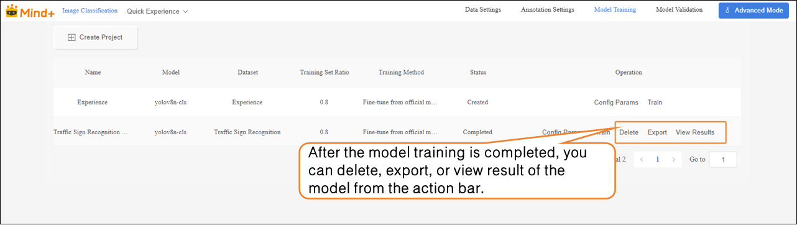

###  Model Validation  

- Switch to the **Model Validation** module, select the training project: **Traffic Sign Recognition Model**; select the model: **best.pt**. Other parameters can be set according to your needs, or you can use the default settings.  

| File    | Save Timing                                                  | Meaning                                    | Use Case                        |
| ------- | ------------------------------------------------------------ | ------------------------------------------ | ------------------------------- |
| last.pt | The model saved at the last step during training             | Final state at the end of training         | Continue training / fine-tuning |
| best.pt | The model that performed best on the validation set during training | Model with the best validation performance | Testing / deployment            |

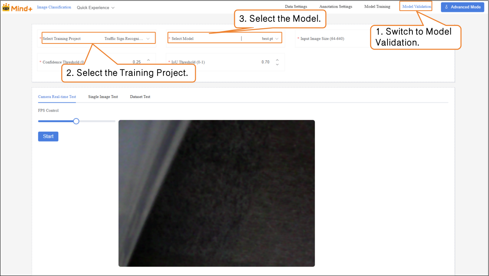

-  Model validation supports two methods: real-time camera testing and single image testing.  

- - **Real-time Camera Testing**: Recognizes traffic signs in real time through the camera.  

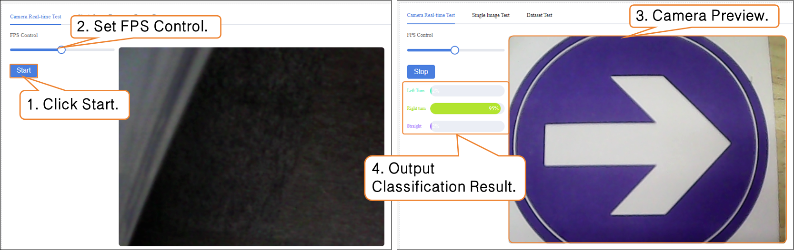

- **Single Image Testing:** Upload an image for recognition and validation.

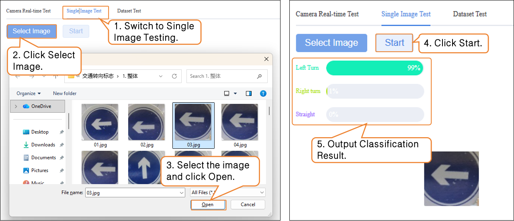

If you are not satisfied with the model’s performance, you can go to the **Model Training** module to create a new task, adjust the parameters, and retrain the model to further improve recognition accuracy.

###  Model Export  

-  When the model test results meet your requirements, switch to the **Model Training** module to export the model.  

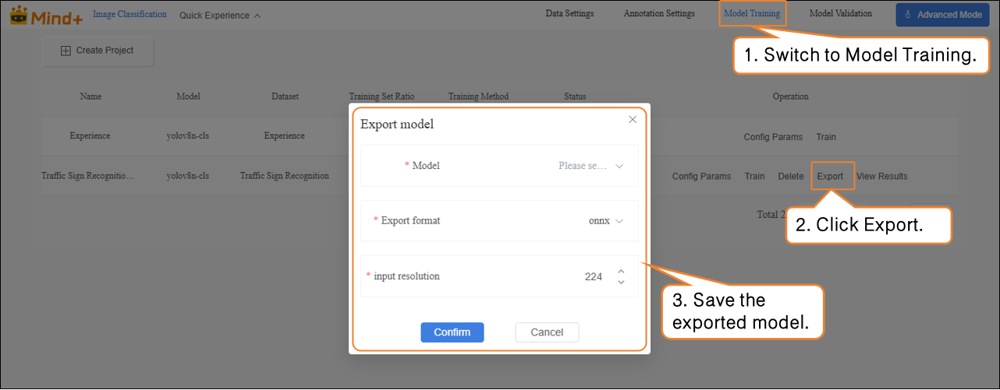

The exported model can be used for deployment. To learn how to operate model deployment, you can refer to Section [4.1.4 Model Deploy.](https://www.yuque.com/joanna-rqvih/ilxuhv/aepmmgw4s77247vi)

### **Common Issues**

| Common Issue                                          | Possible Causes & Solutions                                  |
| ----------------------------------------------------- | ------------------------------------------------------------ |
| Low recognition accuracy of the trained model         | **Possible Causes:** Incomplete or incorrect data annotation Missing annotations or incorrect image labels. **Solutions:** Carefully check the annotation of each image to ensure all images are annotated and labels are correct. |
| Data import fails or format mismatch in Data Settings | **Possible Causes:** For unannotated data, image formats do not meet requirements. For annotated data, YOLO format is not standardized. **Solutions:** Prepare images and annotation files in advance and upload strictly according to platform requirements. |
| Default dataset cannot be deleted causing confusion   | **Possible Causes:** The Experience dataset cannot be deleted, which may lead to forgetting to select the dataset when setting labels.**Solutions:** Always select the correct dataset during annotation, model training, and model validation. |
| Inaccurate recognition in real-time camera testing    | **Possible Causes:** Lighting, angle, or complex background prevents the model from accurate recognition .**Solutions:** Test under even lighting and with the camera facing the sign directly, or increase data augmentation during training. |
