The “Quick Experience” operation steps for **Image Classification** use a “Cat vs. Dog” case to guide users through the training process of an image classification model. This case mainly demonstrates the practical application of image classification: the model can not only identify cats or dogs in pictures but also classify real-time footage captured by the camera, helping users intuitively understand the basic principles and application value of image classification.

**Effect:** By using the camera or uploading images, each picture or real-time frame can be recognized as “Cat” or “Dog,” with the prediction label and corresponding confidence displayed on the screen, visually demonstrating the model’s classification capability.

The process of training an image classification model is divided into five steps:

1. **Create Project** ：Create an image classification project and prepare the dataset.
2. **Add Categories**：Add classification labels to be recognized (e.g., “Cat” and “Dog”) and collect corresponding image data via the camera or upload from local files.
3. **Train Model**： Train the image classification model using the platform.
4. **Model Validation**：Test and verify the model’s performance.
5. **Model Deploy**： After training, the model can be exported and deployed to hardware devices for local execution and application. Users can also choose to push the model’s recognition results in real time for remote monitoring and management.

### Step 1: Create Project

- Open Mind+, select “New Project” from the menu bar, then click “Model”. In the training options, locate “Image Classification (M1)” and click it to create the project.

- After the project is successfully created, it will jump to the new **Image Classification – Quick Start** interface.

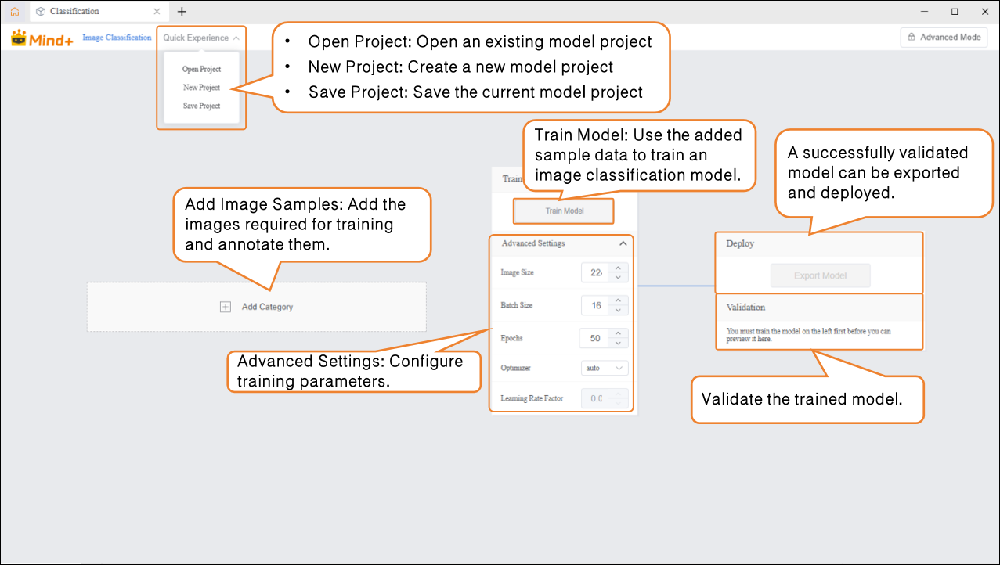

### Step 2: Add Category

- Click the **“Add Category”** button to add the required categories for the image classification task. Users can add multiple categories according to project needs, which will be used for subsequent data collection and model training.

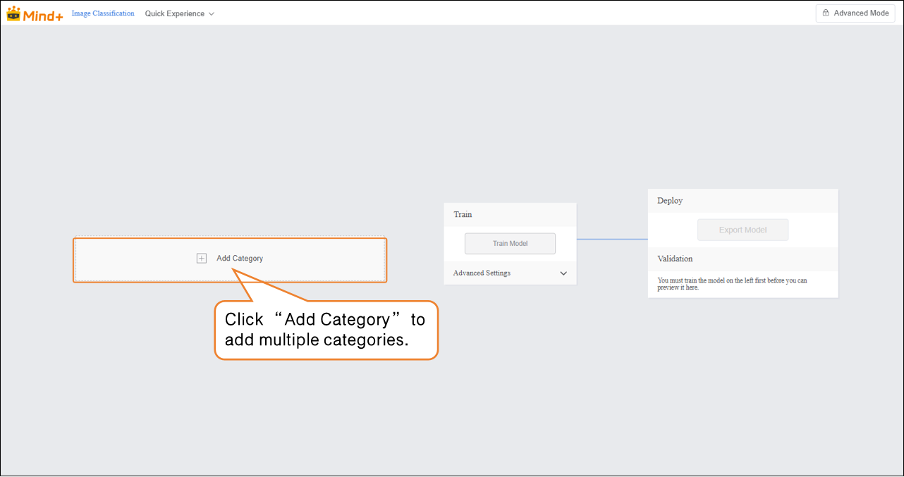

- Once categories are created successfully, images can be added in two ways:

- - **Webcam**: Suitable for on-site shooting, quickly obtaining real-time images, convenient for directly collecting data during experiments.
  - **Upload**: Suitable for importing pre-prepared image materials, allowing batch addition and management of existing data.

- These two methods enable users to flexibly build datasets and prepare for subsequent model training.

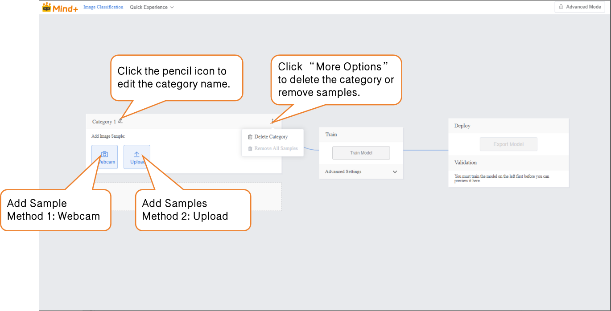

-  Sample Addition Method 1: Webcam Capture  

- - Click the webcam and point it at the target. Use the preview window to check whether the captured image is valid, then press “Record” to collect samples. After completing the image sample collection, click “×” to exit the capture screen.  
  - Note: If the desktop does not have a built-in webcam, an external USB webcam can be used.  

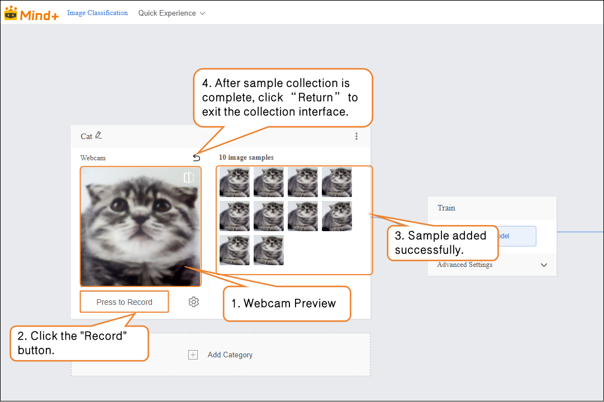

- - During sample data collection, you can use the “Settings” button to adjust the webcam’s frame rate (number of images captured per second; higher values result in faster capture).
  - Note: If the FPS is too high, the captured images will have minimal differences, which is not very useful for training.  

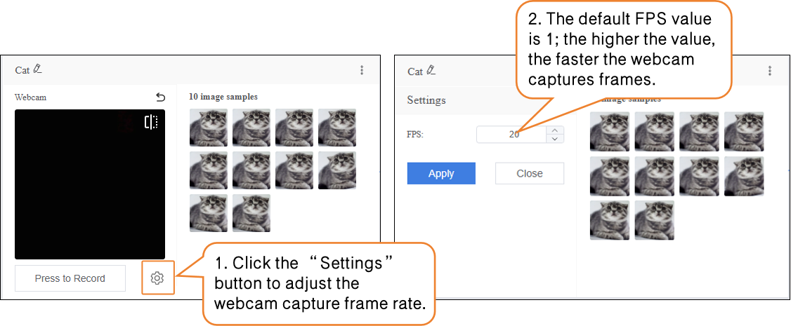

- Sample Addition Method 2: Upload

- - Click “Add Category” to create another category (e.g., “Dog”) → Click “Select Files to Upload” to batch import images from your computer.

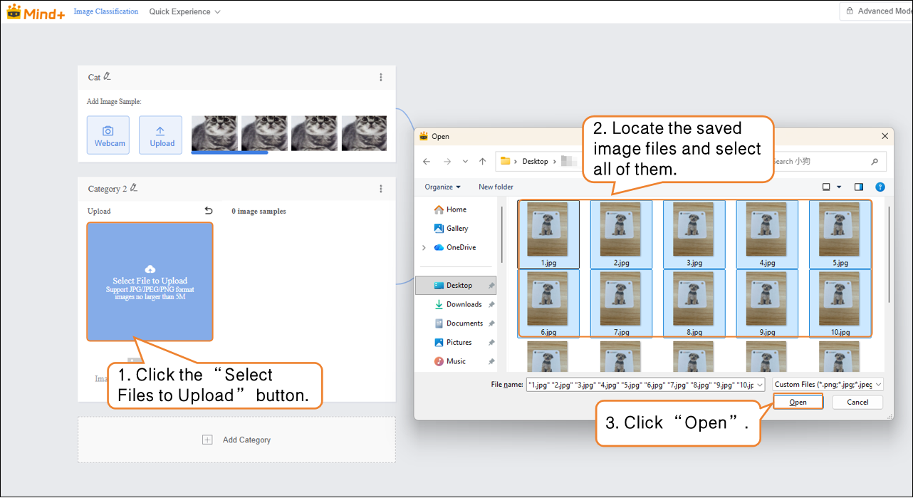

Tips for sample data:

- Prepare 20–50 diverse images for each category (different angles, lighting, backgrounds), and try to keep the number of images balanced across categories.
- It’s recommended to give each category a simple name, such as ‘Cat’ or ‘Dog’; avoid using overly complex symbols or long names.

### Step 3: Train Model

- Before training the model, click “Advanced Settings” to configure training parameters such as batch size, number of epochs, and optimizer.

| Parameter        | Description                                                  | Category Explanation                                         | Recommended Setting                                          |
| ---------------- | ------------------------------------------------------------ | ------------------------------------------------------------ | ------------------------------------------------------------ |
| Batch Size       | The number of data samples fed into the model for training at one time. When the dataset is large, feeding all data at once may exceed computing capacity, so data is divided into batches. For example, the default batch size is 16, meaning 16 images are used for each training step. | How much content to learn each time                          | Batch Size: 16 (default)                                     |
| Number of Epochs | One epoch means the model has seen all training data once. Learning once may not be enough, so multiple epochs are needed to reinforce patterns. For example, the default is 100 epochs. | How many times to learn                                      | Number of Epochs: 20 (for small datasets, fewer epochs can be used) |
| Optimizer        | Determines how the model updates parameters during training, i.e., which direction and step size to adjust after each learning step. It affects training efficiency and model performance. | Learning method (memorization, summarization, generalization?) | Optimizer: auto (default)                                    |

- After completing the training parameter setup, click **“Train Model”** to start training. (If no settings are adjusted, the system default parameters will be used.)

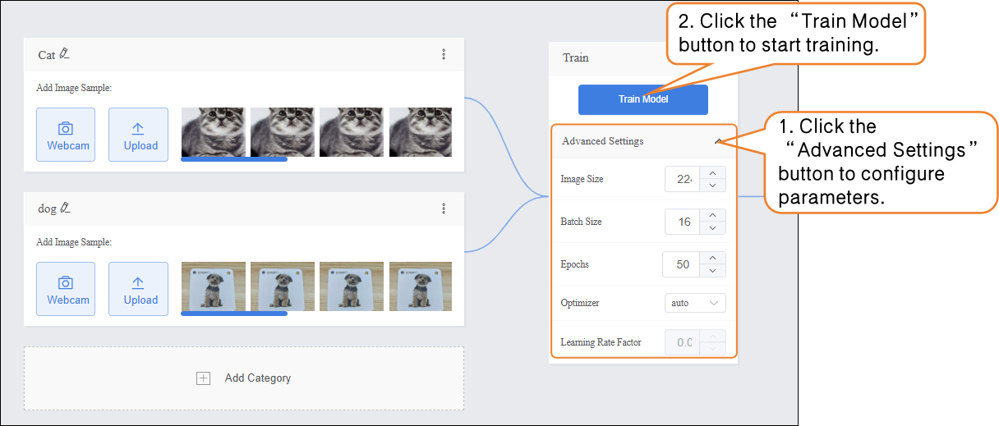

- During the model training process, you can click the **“Learn More”** button to view training monitoring data:  

- - **Training Loss (train loss):** The prediction error of the model on the training data. Lower loss indicates more accurate predictions on the training set.
    **Validation Loss (val loss):** The prediction error of the model on the validation data (data not used for training). A continuously decreasing validation loss indicates improving model generalization.
    **Top 1 Accuracy (accuracy top 1):** The proportion of predictions where the model's highest-probability class matches the true label. For example, if the true class is “cat” and the model predicts “cat” as the highest probability, it is considered correct.
    **Top 5 Accuracy (accuracy top 5):** The proportion of predictions where the true label is within the top five highest-probability classes predicted by the model. For example, if the true class is “cat” and the top five predicted classes are “dog, cat, rabbit, bird, cow,” it is considered correct.  

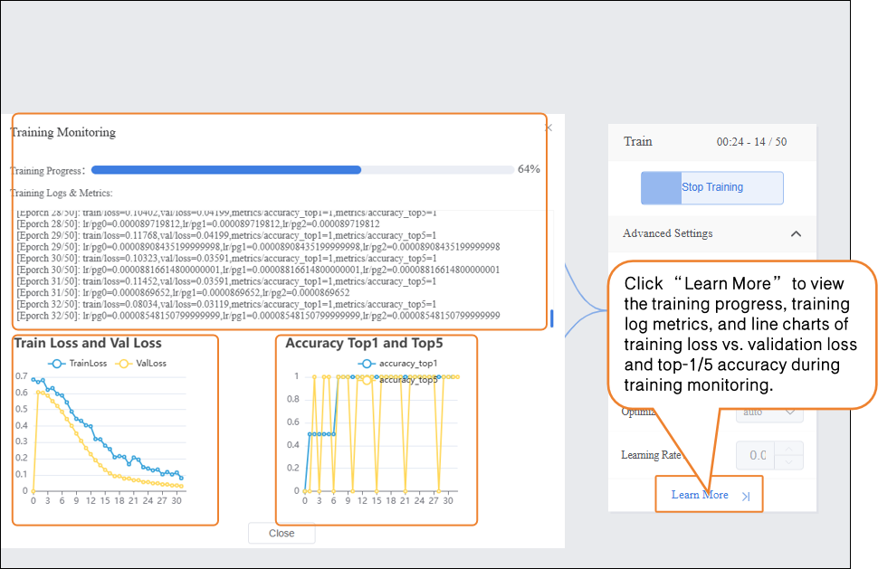

### Step 4: Model Validation  

- After completing model training, you can validate the model performance in the validation area. There are two validation methods: **Webcam** and **File**.
  Tip: Using new images that were not part of the training set provides a more accurate reflection of the model’s real-world performance.
- Validation Method 1: Webcam

- - Point the webcam at an image of a cat and check the classification result output.

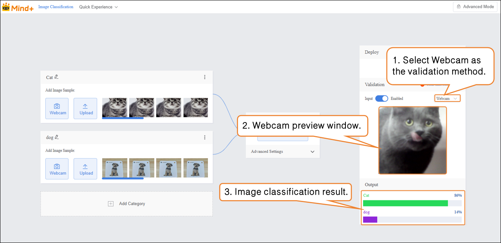

- Verification Method 2: File

- - Change the verification method to "File", click "Upload File", select an image, and open it.

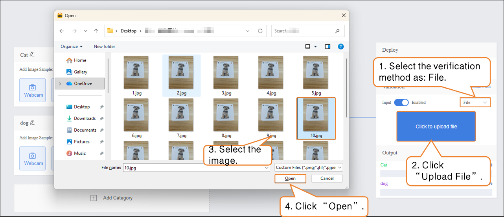

- After the image is successfully uploaded, the image classification result will be displayed.

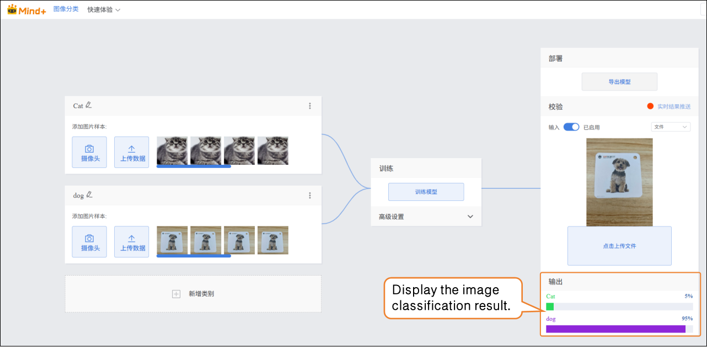

### Step 5: Model Deploy

-  Once the model validation results meet the requirements, you can proceed to deployment

- - “Deploy” → Click “Export Model”.
  - The platform supports exporting the model in ONNX format, making it easy to use in other environments or for secondary development.

- Tip: ONNX is an open model format that can run across various deep learning frameworks and devices. This allows you not only to test on the platform but also to apply the model in real projects.  

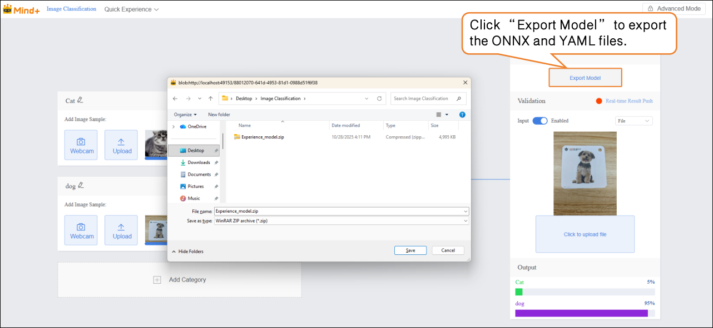

After validation, the model can push prediction results in real time. Click “Real-time Result Push” to synchronize the output to the SIoT platform. Hardware can receive the data from the platform and perform corresponding actions based on it.

Although the data is sent to the SIoT platform in real time, it is not stored in the platform's database, so it cannot be viewed via the SIoT web interface.

For instructions on model deployment and real-time result push, please refer to section [4.1.4 Model Deploy](https://www.yuque.com/joanna-rqvih/ilxuhv/aepmmgw4s77247vi) & [4.1.5Real-Time Result Push.](https://www.yuque.com/joanna-rqvih/ilxuhv/ph3e9rp4q7c7x1oe)

### Common Issues in Model Training  

- During model training, you may encounter various issues such as slow training speed, unsatisfactory accuracy, or improper parameter settings. The following lists common problems and suggested solutions to help you complete model training more smoothly.  

| Common Issue       | Possible Causes & Solutions                                  |
| ------------------ | ------------------------------------------------------------ |
| Low model accuracy | **Possible Causes:** • Insufficient number of sample data • Imbalanced sample classes **Solutions:** • Ensure that samples for each class cover different angles, lighting conditions, and backgrounds. • Try to keep the number of samples balanced across classes to improve model accuracy. |
| Long training time | **Possible Causes:** • Batch size set too small, so each training iteration processes only a few samples, requiring more iterations. • Number of training epochs set too high, causing the model to repeat learning excessively. **Solutions:** • Increase the batch size appropriately to process more samples per iteration. • Adjust the number of training epochs according to data size and task requirements to avoid unnecessary repetition. |