# 【Instance Segmentation】 Advanced Mode

This project uses **“Fruit Recognition”** as a case study to guide users through an **Instance Segmentation** task in **Advanced Mode**. Through this example, users can not only learn the basic workflow (data setup, data annotation, model training) but also explore advanced features in Advanced Mode, such as customizing training parameters, observing training curves, and adjusting data augmentation strategies. This allows users to gain fine-grained control over the training process and continuously optimize model performance.

**Effect:** The system can perform real-time recognition and segmentation of fruits in uploaded images or camera feeds. Different colored masks are used to outline fruits such as apples, bananas, and pears, providing a clear visualization of the segmentation results.

### Mode Switching

- Open Mind+, select “New Project” from the menu bar, then click “Model”. In the training options, locate “Instance Segmentation (M3)” and click it to create the project.

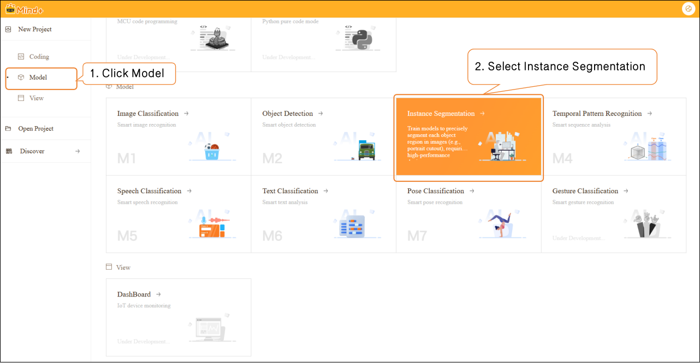

- Click **"Advanced Mode"** in the top-right corner of the interface to switch modes. Once switched successfully, the menu bar will add the following modules: **Data Settings**, **Annotation Settings**, **Model Training**, and **Model Validation**.

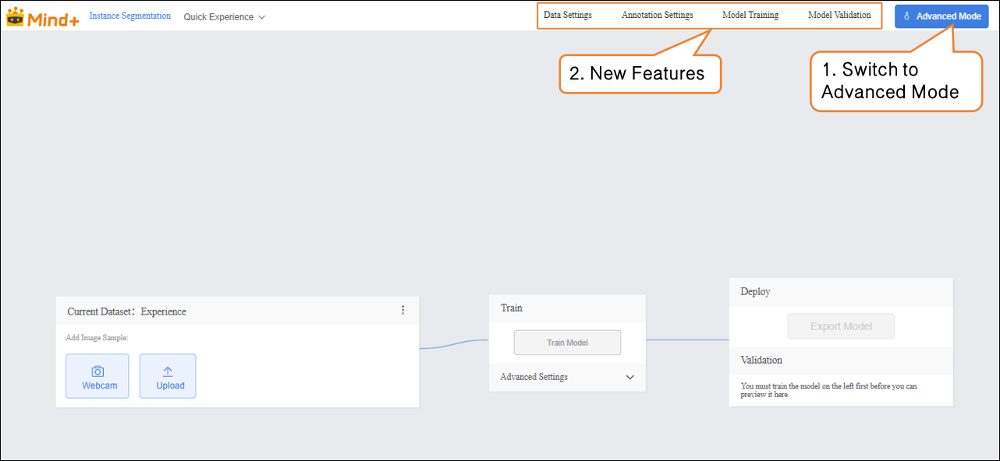

### Data Settings

- Switch to "Data Settings" → Click "Create" at the top left, for example, create a dataset named **Fruit Recognition**.  

- After switching to Advanced Mode, the dataset list will display a default "Experience" dataset, which is generated from the Quick Experience mode. Users can perform the following operations on newly created datasets: annotation, copy, import data, export, and delete.  

 Note: The default dataset cannot be deleted.  

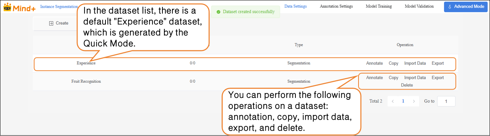

- Next, perform the “Import Data” operation for the newly created Fruit Recognition dataset. The system supports two import methods: **Labeled Data** and **Unlabeled Data**.  
- Import Method 1: Unlabeled Data  

- - Suitable for uploading only raw images (e.g., images containing a mix of apples, pears, and bananas, with at least 20 images per category).  

**Steps:**

1. Select the import type as **NO annotations.**
2. Click **Import Data.**
3. Choose images from your local device.
4. Click **Confirm** to complete the import.

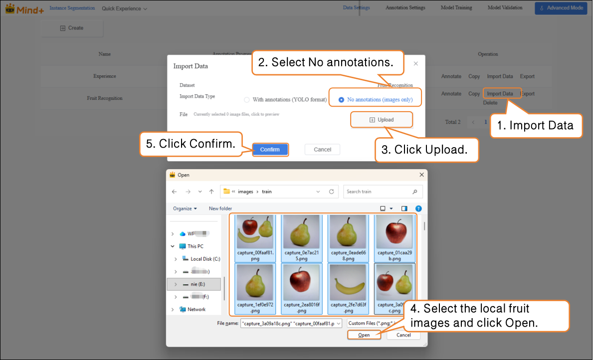

- Import Method 2: **With Annotations**

- - Directly upload YOLO-formatted annotated data (.zip file).
  - Organize the folder structure according to platform requirements. After uploading, manual annotation is not needed, and the system will directly proceed to model training.  

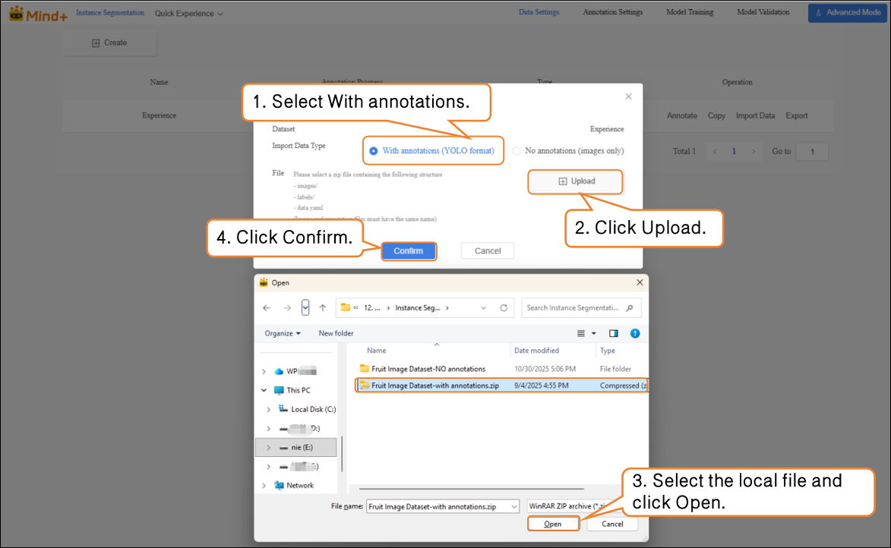

### **Annotation Settings**

- After the fruit images are successfully imported, the annotation progress bar will simultaneously display the number of imported images and their corresponding annotations. 

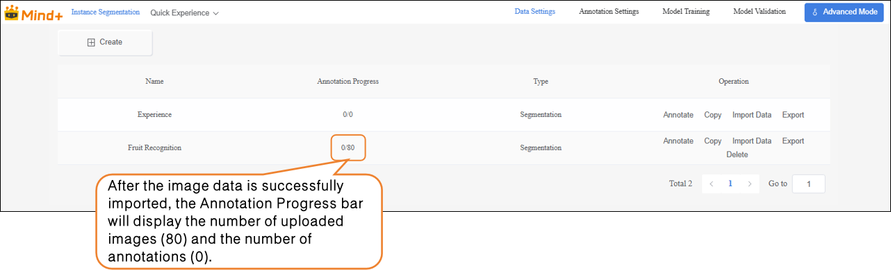

- Click **Annotate** in the **Operations** panel to enter the annotation settings for Fruit Recognition.

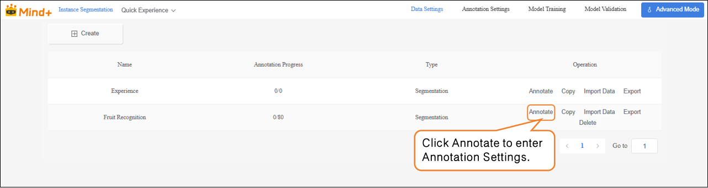

- Follow the on-screen prompts to create labels (**Apple**, **Pear**, **Banana**) for annotating different fruit categories.

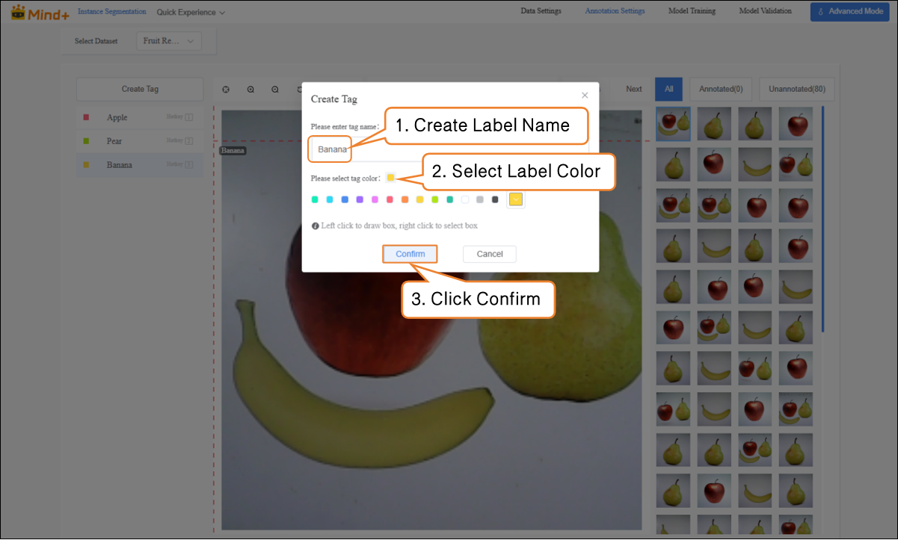

-  Next, annotate the dataset. During annotation, first click the corresponding label name, then trace along the object’s edge to form a closed contour.  

 **Notes for dataset annotation:**  

- Every image in the dataset must be annotated one by one.
- If an image contains multiple objects, each object must be annotated individually.

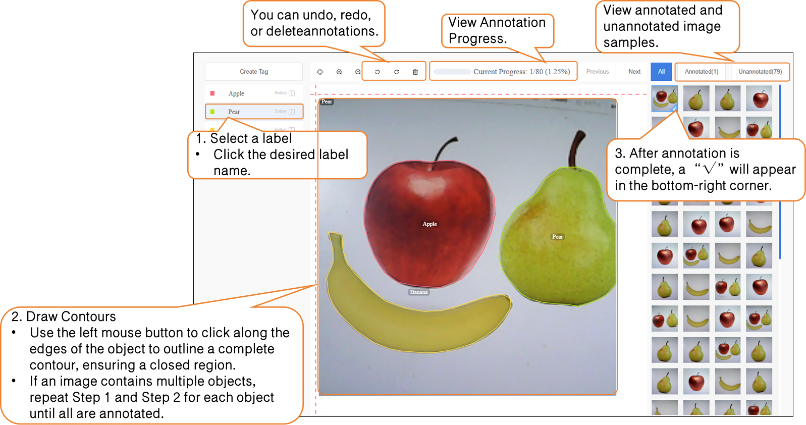

### Model Training

- After all images have been annotated, switch to the **Model Training** module.

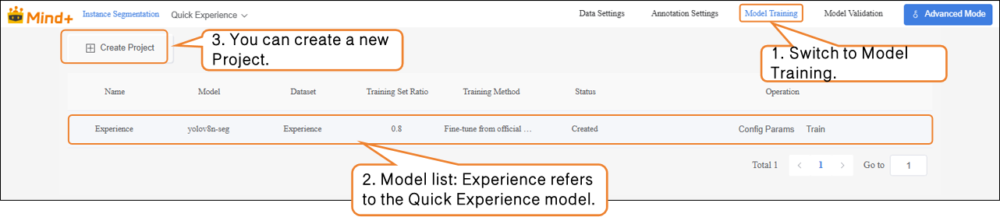

- Click **“Create Project”**, and in the pop-up window, set the following:  

**Name**: Fruit Recognition Model (rename as needed).

**Model**: Select according to your needs (default is also fine).

**Training Method**: Select according to your needs (default is also fine).

**Dataset**: Fruit Recognition (In **Data Settings**, we have already created and named the dataset **“Fruit Recognition”**; in **Annotation Settings**, the images have also been annotated and organized. At this point, the dataset has the complete structure required for training. Next, proceed to the **Model Training** stage, where the system will extract features and learn patterns from this dataset, gradually enabling the model to classify and recognize fruits. Therefore, the dataset selected here must be **Fruit Recognition**.).

**Training Set Ratio**: Select according to your needs (default is also fine)  .

| **Task Parameter** | **Purpose**                                                  | **Description**                                              |
| ------------------ | ------------------------------------------------------------ | ------------------------------------------------------------ |
| Name               | Used only to distinguish and manage different training tasks; does not affect model performance | Acts as a name for this experiment, making it easier to review and compare later |
| Model              | Determines which neural network structure to use for training | Different models have different “learning methods” and “capabilities.” For example, some models are suitable for small datasets, while others are better for complex classification tasks |
| Training Type      | Specifies the training method, e.g., classification, regression, or detection | Tells the model “what you want it to learn”                  |
| Dataset            | Specifies which data the model should learn from             | Acts as the “textbook”; the model learns to recognize objects from the images and labels in this dataset |
| Training Ratio     | Determines the proportion of the dataset used for training versus validation | Training set = examples for the model to learn fromValidation set = examples for checking model performance (images the model has not seen) |

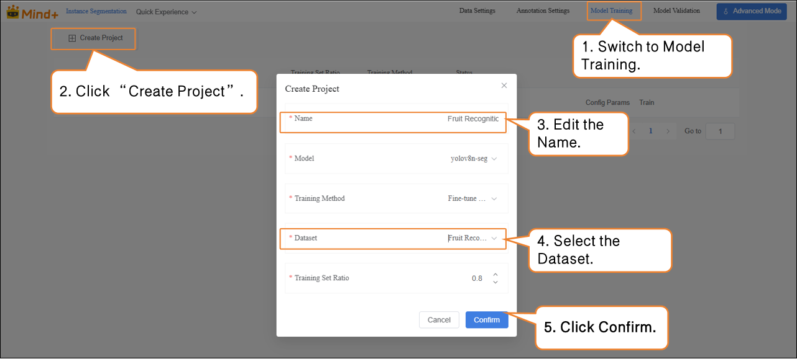

- After the model training task is successfully created, click **Config Params** to enter the training parameter configuration interface. You can adjust the parameters according to your needs, or start training directly with the default settings.

- - **Basic Parameters**: Image size, Batch size, Epochs.
  - **Advanced Parameters**: Save Period, Vertical Flip Probability, fliplr, Optimizer, etc.  

| **Advanced Parameter**    | **Description**                                              | **Explanation**                                              |
| ------------------------- | ------------------------------------------------------------ | ------------------------------------------------------------ |
| Save Period               | The interval at which the model is saved during training to prevent data loss in case of unexpected interruptions. | Save Period = 5 → The model is saved every 5 epochs. Save Period = -1 → No automatic saving; only the last model is kept. |
| Vertical Flip Probability | During data augmentation, the system randomly decides whether to flip the image along the horizontal axis (up-down), helping the model learn to recognize images in different orientations. | Probability = 0 → Never flips (augmentation not applied).    |
| fliplr                    | Flips the image horizontally (mirror image).                 | Probability = 0 → Never flips. Example: An apple image, when flipped horizontally, changes orientation from left-to-right to right-to-left. |

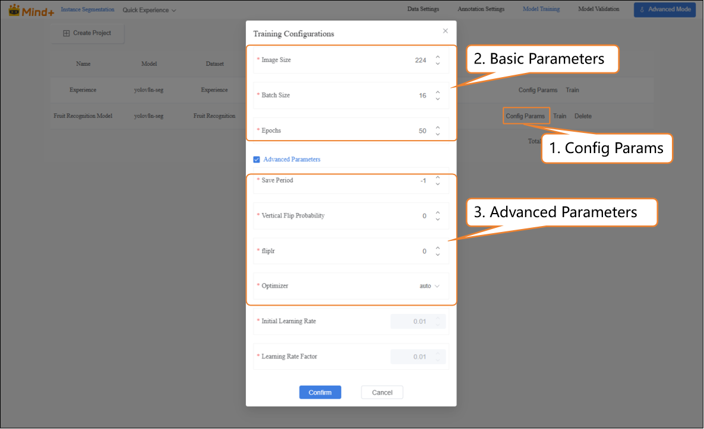

- Click **Train** to start the model training.

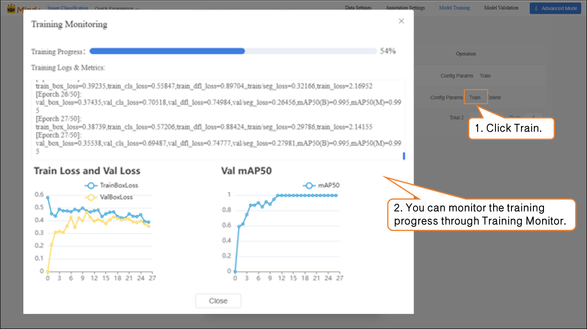

- During model training, you can view relevant data through the **Training Monitoring** window.

- - **Training Loss (train loss):** The prediction error of the model on the training data. Lower loss indicates the model predicts the training data more accurately.
  - **Validation Loss (val loss):** The prediction error on the validation data (data not used for training). A consistently decreasing validation loss indicates improved model generalization.
  - **Validation mAP50 (Val mAP50):** Indicates the accuracy on the validation set where a prediction is considered correct only if the predicted box overlaps with the ground truth box by more than 50%. Higher values indicate better detection accuracy.

- After the model training is completed, you can delete, export, or view result of the trained model from the operation bar.

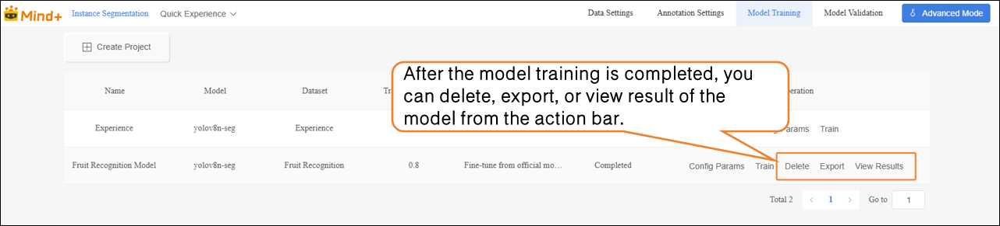

### Model Validation  

- Switch to the **Model Validation** module, select the training project: **Fruit Recognition Model**; select the model: **best.pt**. Other parameters can be set according to your needs, or you can use the default settings.  

| File    | Save Timing                                                  | Meaning                                    | Use Case                        |
| ------- | ------------------------------------------------------------ | ------------------------------------------ | ------------------------------- |
| last.pt | The model saved at the last step during training             | Final state at the end of training         | Continue training / fine-tuning |
| best.pt | The model that performed best on the validation set during training | Model with the best validation performance | Testing / deployment            |

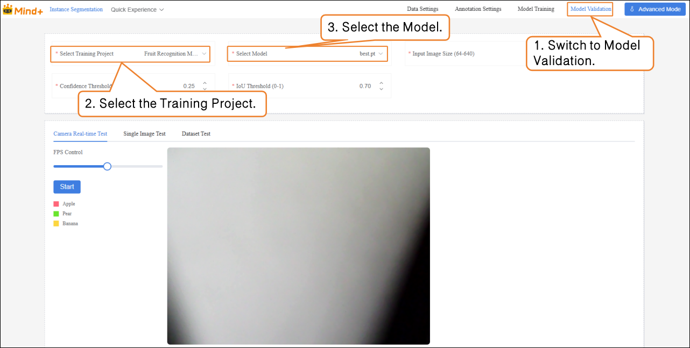

- **Model Validation** supports two methods: **Camera Real-Time Test** and **Single Image Test**.  

- - **Camera Real-Time Test**: Recognize fruits in real time through the camera, and generate masks to cover the contours of the identified fruits, visually displaying the segmentation results.  

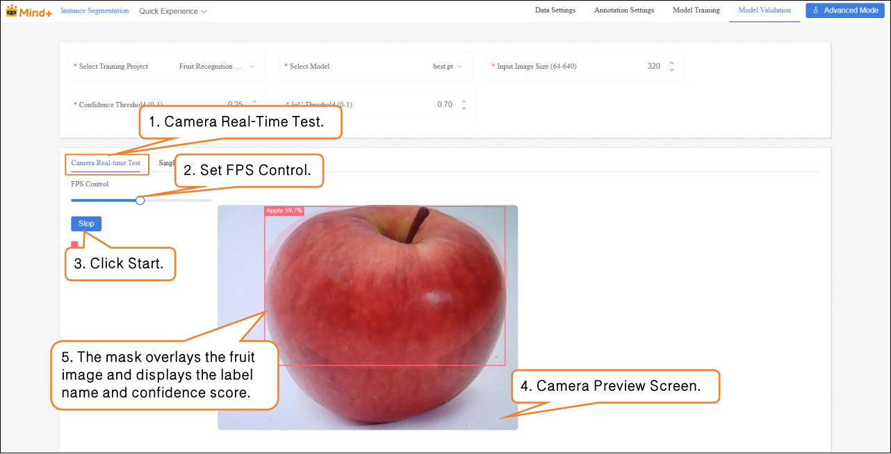

- **Single Image Test**: Upload an image for recognition and validation.

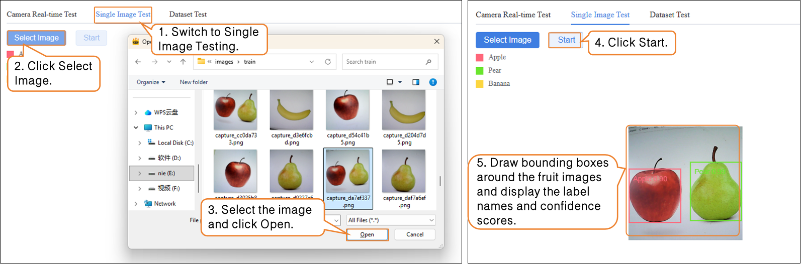

If you are not satisfied with the model’s performance, you can go to the **Model Training** module to create a new task, adjust the parameters, and retrain the model to further improve recognition accuracy.

### Model Export  

- When the model test results meet your requirements, switch to the **Model Training** module to export the model.  

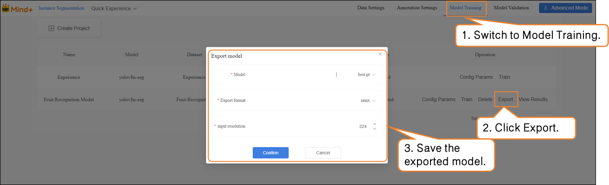

The exported model can be used for deployment. To learn how to operate model deployment, you can refer to Section [4.1.4 Model Deploy.](https://www.yuque.com/joanna-rqvih/ilxuhv/aepmmgw4s77247vi)

### **Common Issues**

When performing instance segmentation tasks in **Advanced Mode**, if issues occur, you can first refer to the table below for self-check and troubleshooting.

| Problem                                          | Possible Cause                                               | Solution                                                     |
| ------------------------------------------------ | ------------------------------------------------------------ | ------------------------------------------------------------ |
| Error or unrecognized when uploading dataset     | Folder structure does not conform to YOLO format, or compressed file is incorrect | Organize images and labels folders according to platform requirements and re-upload |
| Dataset is empty after importing unlabeled data  | Unsupported image format                                     | Use JPG/PNG format, and ensure each class has ≥20 samples    |
| Poor recognition performance                     | Annotation boundaries are not closed or inaccurate           | Draw closed polygons along object contours to ensure accurate boundaries |
| Incomplete segmentation / inaccurate recognition | Training samples are not diverse enough, or data augmentation not enabled | Increase samples from different environments and enable data augmentation |