The quick experience example for instance segmentation uses **“Geometric Shape Segmentation”** as a case study to guide users through the model training process.
This example demonstrates how instance segmentation works in real-world applications: the model can not only **identify** objects in an image (e.g., triangles or rectangles) but also **generate a mask (Mask)** for each object to precisely outline its **shape and position**.

Through this case, users can clearly see how the model independently detects and segments each object in the image — helping them understand the difference between **instance segmentation** and **image classification** (which only identifies object types without position or shape information).
It also illustrates the **practical value** of instance segmentation in real-world scenarios, such as **autonomous driving, robotics, or medical imaging**.

**Effect:**The model can analyze images captured by the camera or uploaded locally and use color masks to highlight **triangles** and **rectangles**, displaying their corresponding **category labels** on the screen.

**The instance segmentation model training process consists of five steps:**

1. **Create Project**:  Create a dedicated instance segmentation project.
2. **Add and Annotate Image Samples**:  Collect or upload image samples, annotate the targets, and generate **masks** to ensure accurate object contours.
3. **Train Model**:  Train the instance segmentation model using the platform.
4. **Model Validation**:  Test the model to check mask accuracy and recognition performance.
5. **Model Deploy**:  After training, export and deploy the model to hardware for local operation and application. Users can also choose to push the recognition results to the SIoT platform in real time for remote monitoring and management.

## **Step 1: Create Project**

- Open Mind+, select “New Project” from the menu bar, then click “Model”. In the training options, locate “Instance Segmentation (M3)” and click it to create the project.

- After the project is successfully created, it will jump to the new **Instance Segmentation – Quick Start** interface.

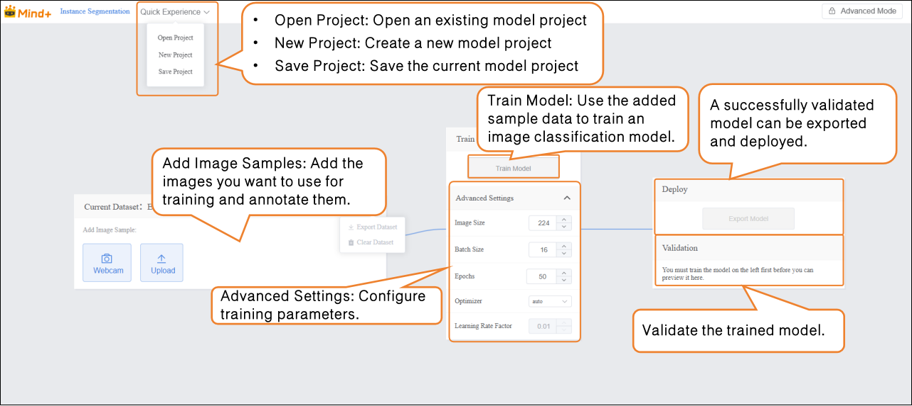

## Step 2: Add and Label Image Samples  

- Adding samples is the foundation of model training. It’s essential to ensure **high-quality images** and **accurate annotations**. This process consists of two parts: **Sample Addition** and **Sample Annotation**.  
- **Add Image Sample:**

- - -  Within the current dataset, you can add image samples using **two methods**:  

- - - - **Camera Capture:** Suitable for real-time data collection, allowing you to quickly capture live images during experiments.
      - **Local Upload:** Ideal for importing pre-prepared sample materials, making it easy to batch add and manage existing data.

To ensure optimal training performance of the object detection model, please make sure your dataset samples meet the following requirements, including **the number of samples per category**, **object clarity**, **annotation completeness**, and **background lighting conditions**.

| **Category**                | **Requirement**                                    | **Description**                                              |
| --------------------------- | -------------------------------------------------- | ------------------------------------------------------------ |
| **Sample Quantity**         | At least 20 images per class                       | Each class should have at least 20 image samples. If the objects have diverse shapes or colors, increase the number of samples to cover more variations. |
| **Class Balance**           | Keep class quantities as balanced as possible      | Large differences in sample numbers between classes may cause the model to favor classes with more data. Maintain balance, e.g., 20 triangles, 20 rectangles. |
| **Object Clarity**          | Targets must be clearly visible in the image       | Ensure each target is complete and sharp, not blurry or occluded. Small or complex-shaped targets must be accurately outlined during annotation. |
| **Annotation Completeness** | All targets must be labeled with closed boundaries | Every target in the image must be Labeled, and boundaries must be closed. For multi-object images, label each target individually; otherwise, mask generation will fail. |
| **Background & Lighting**   | Simple background and even lighting                | Keep the background clean and reduce distractions. Ensure uniform lighting—avoid underexposure or overexposure—to improve model training accuracy. |

- Sample Addition Method 1: Webcam Capture  

- - Click the webcam and point it at the target. Use the preview window to check whether the captured image is valid, then press “Record” to collect samples. After completing the image sample collection, click “×” to exit the capture screen.  
  - Note: If the desktop does not have a built-in webcam, an external USB webcam can be used.  

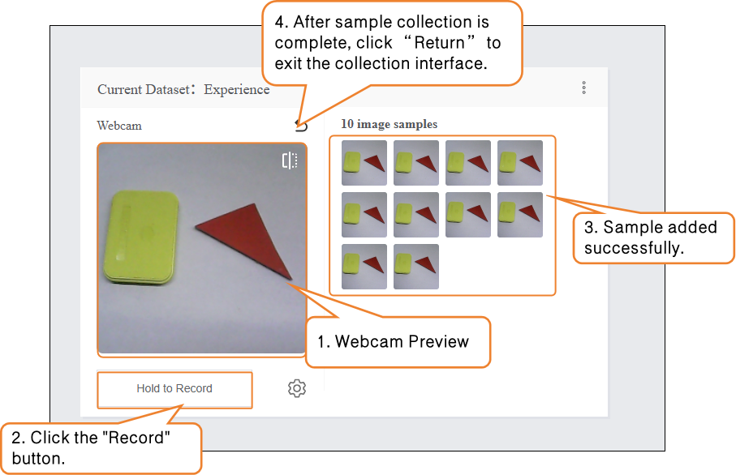

- - During sample data collection, you can use the “Settings” button to adjust the webcam’s frame rate (number of images captured per second; higher values result in faster capture).
  - Note: If the FPS is too high, the captured images will have minimal differences, which is not very useful for training.  

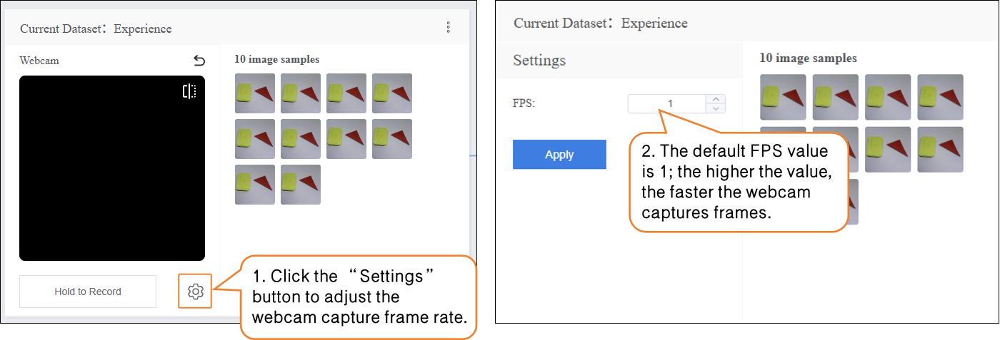

- Method 2: Upload  

Local upload can be divided into Unlabeled Data and **Labeled Data**:

- - **Unlabeled Data:** Only upload image samples. Targets in the images need to be Labeled manually later. This is suitable for learning the workflow in this example.
  - **Labeled Data:** Image samples are already Labeled and corresponding masks are generated. These can be used directly for model training without additional annotation.

**Upload – Unlabeled Data:**

- - Click the **Upload** button, select Unlabeled Data under **Import Data Type**, then click **Select File Upload**.
  - In your local folder, find the prepared image samples, select all, and upload them to the dataset. This completes the addition of Unlabeled Data.

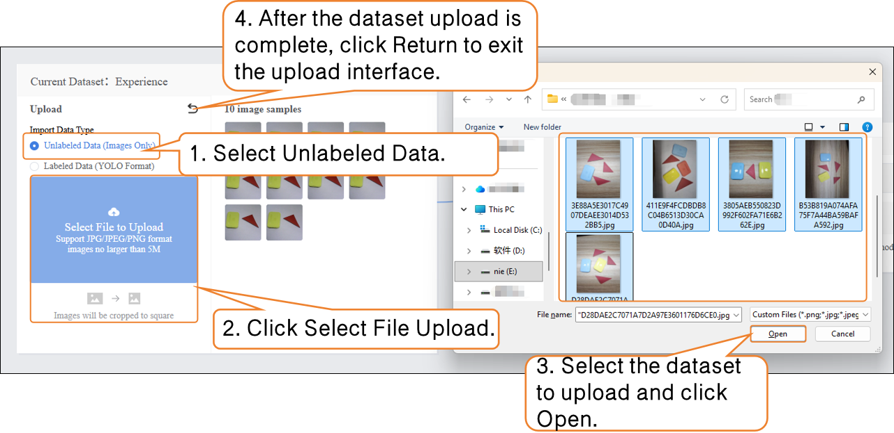

- **Upload – Labeled Data:**

- - Click the **Upload** button, select **Labeled Data** under **Import Data Type**, then click **Select File Upload**.
  - In your local folder, locate the prepared YOLO-format dataset file (**.zip**) and upload it. This completes the addition of Labeled data.

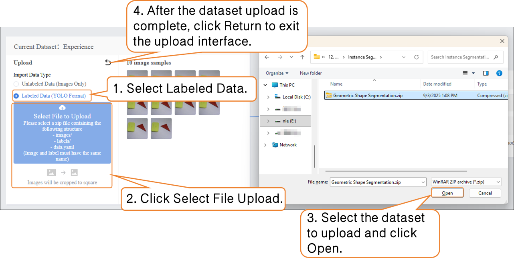

- Once the labeled data is successfully uploaded, there is no need to annotate it manually. You can proceed directly to **Step 3** and start training the model.

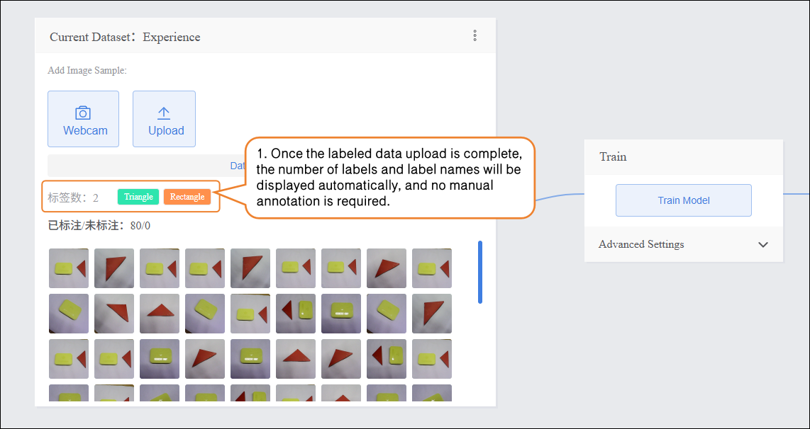

- Click **“Annotate Data”** and follow the prompts to create two labels: **Triangle** and **Rectangle**.

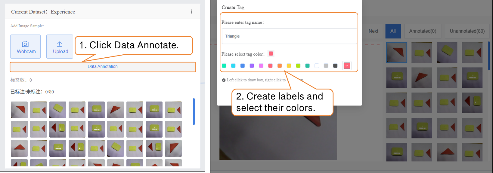

-  Next, annotate the dataset. During annotation, first click the corresponding label name, then trace along the object’s edge to form a closed contour.  

 **Notes for dataset annotation:**  

- Every image in the dataset must be annotated one by one.
- If an image contains multiple objects, each object must be annotated individually.

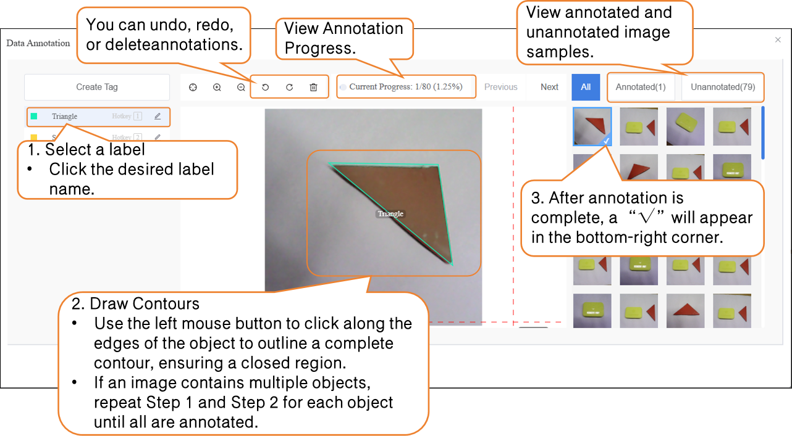

##  Step 3: Train Model  

- After annotating all images in the dataset, set the training parameters and click **Train Model** to start training.  

| **Parameter**  | **Description**                                              | **Category Explanation**                                     | **Recommended Setting**                                    |
| -------------- | ------------------------------------------------------------ | ------------------------------------------------------------ | ---------------------------------------------------------- |
| **Batch Size** | The number of data samples fed into the model at one time. When the dataset is large, feeding all data at once may exceed the computer’s capacity, so it’s divided into batches. For example, the default batch size is 16, meaning 16 images are used per training step. | How much the model learns at once                            | Batch Size: 16 (default)                                   |
| **Epochs**     | One complete pass of all training data through the model is called an epoch. Learning once may not be sufficient, so repeating multiple epochs helps the model better memorize patterns. For example, the default epochs are 100. | How many times to learn                                      | Epochs: 20 (for small datasets, you can reduce the number) |
| **Optimizer**  | The optimizer determines how the model updates its parameters during training, i.e., the direction and step size after each learning step. It affects training efficiency and effectiveness. | Learning method (memorization, generalization, or extrapolation) | Optimizer: auto (default)                                  |

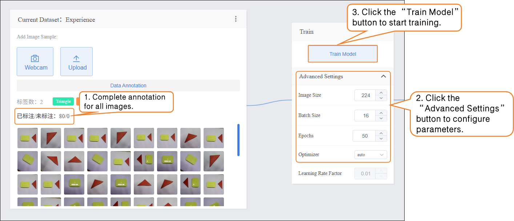

-  During model training, you can click the **Learn More** button to view training monitoring data:  

- - **Training Loss (train loss):** The prediction error of the model on the training data. Lower loss indicates the model predicts the training data more accurately.
  - **Validation Loss (val loss):** The prediction error on the validation data (data not used for training). A consistently decreasing validation loss indicates improved model generalization.
  - **Validation mAP50 (Val mAP50):** Indicates the accuracy on the validation set where a prediction is considered correct only if the predicted box overlaps with the ground truth box by more than 50%. Higher values indicate better detection accuracy.

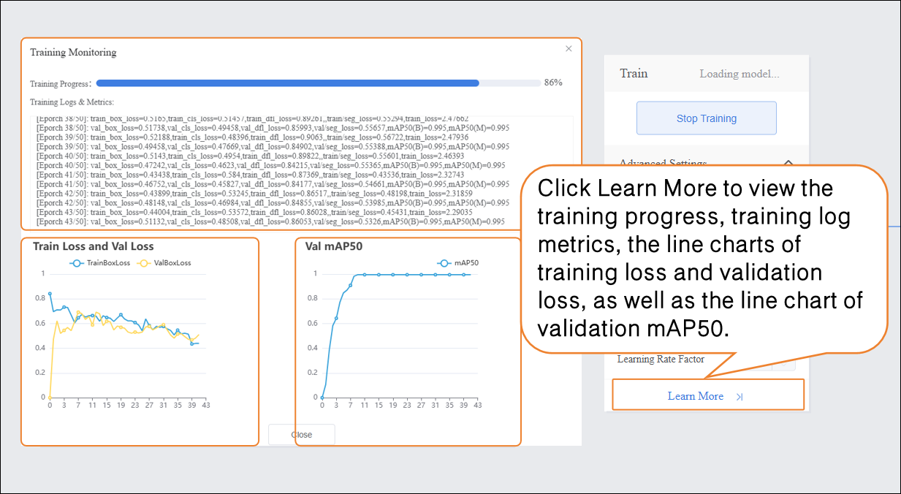

## Step 4: Model Validation  

- After model training is complete, you can validate the model’s performance in the **Validation** section. There are two validation methods: **Webcam** and **File**.  
- **Validation Method 1: Webcam**
- Point the camera at images of **Triangle** and **Rectangle** and observe the output results.

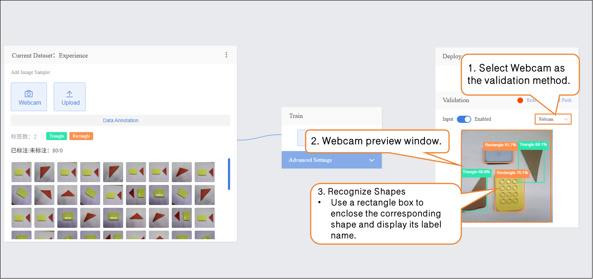

- **Verification Method 2: File**

- - Change the verification method to "File", click "Upload File", select an image, and open it.

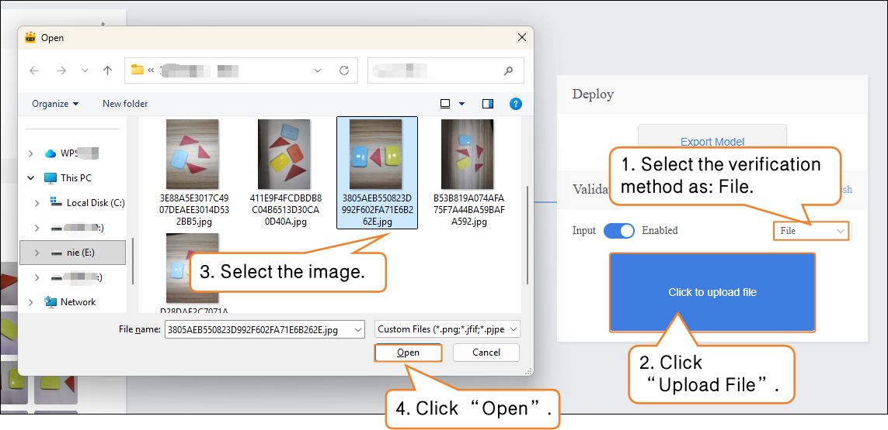

- After the image is successfully uploaded, the recognition results will be displayed.

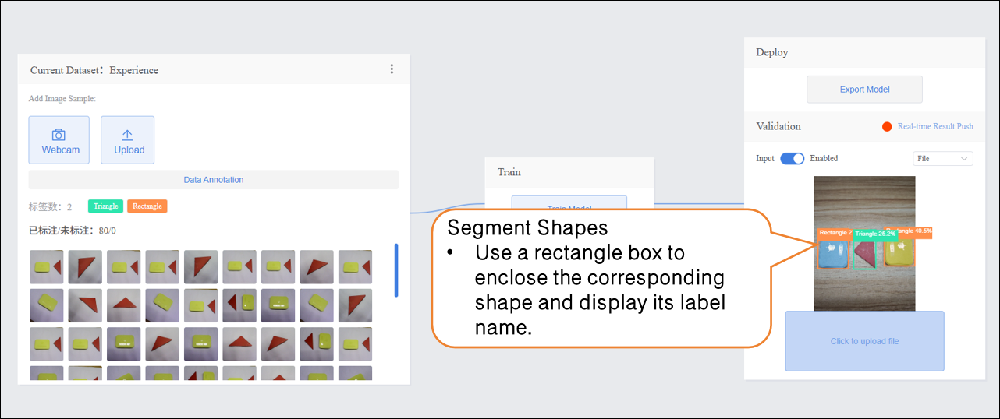

## Step 5: Model Deploy

-  Once the model validation results meet the requirements, you can proceed to deployment

- - “Deploy” → Click “Export Model”.
  - The platform supports exporting the model in ONNX format, making it easy to use in other environments or for secondary development.

Tip: ONNX is an open model format that can run across various deep learning frameworks and devices. This allows you not only to test on the platform but also to apply the model in real projects.  

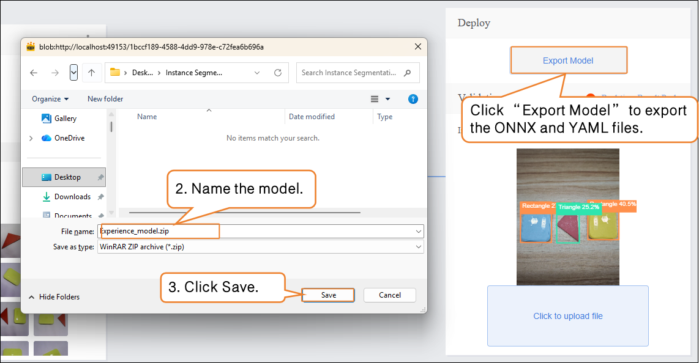

After validation, the model can push prediction results in real time. Click “Real-time Result Push” to synchronize the output to the SIoT platform. Hardware can receive the data from the platform and perform corresponding actions based on it.

Although the data is sent to the SIoT platform in real time, it is not stored in the platform's database, so it cannot be viewed via the SIoT web interface.

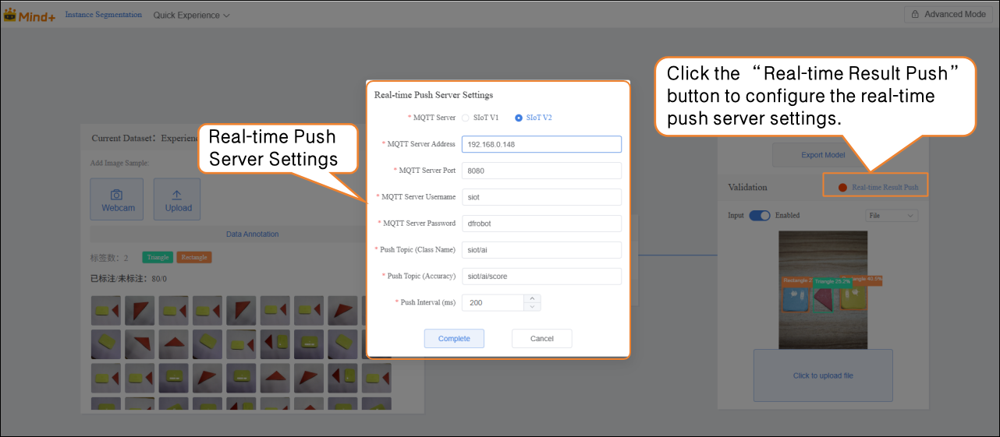

For instructions on model deployment and real-time result push, please refer to section [4.1.4 Model Deploy](https://www.yuque.com/joanna-rqvih/ilxuhv/aepmmgw4s77247vi) & [4.1.5Real-Time Result Push.](https://www.yuque.com/joanna-rqvih/ilxuhv/ph3e9rp4q7c7x1oe)

## Common Issues in Model Training  

| **Issue**                           | **Possible Cause**                                    | **Solution**                                                 |
| ----------------------------------- | ----------------------------------------------------- | ------------------------------------------------------------ |
| Inaccurate target recognition       | Target is blurry, occluded, or unevenly lit           | Ensure targets are clear and complete, with uniform lighting; increase sample quantity if necessary |
| Annotation errors or incompleteness | Contours not closed, missing or duplicate annotations | Trace closed contours along target edges and annotate each target individually |
| Class imbalance causing model bias  | Some classes have too few or too many samples         | Keep the number of samples per class balanced; add samples to underrepresented classes if needed |
| Excessive training time             | Batch size too large or too many epochs               | Adjust batch size and number of epochs; reduce epochs if needed |