# 【Object Detection】 Advanced Mode

This project uses **“Wild Animal Recognition”** as a case study to guide users through performing an object detection task in professional mode. Through this example, users can not only learn the basic workflow (data setup, data annotation, model training) but also experience advanced features in professional mode, such as customizing training parameters, observing training curves, and adjusting data augmentation strategies. This allows for more precise control over the model training process and continuous optimization of model performance. Once the model training is complete, the system can accurately detect and recognize wild animals in new images.

● **Effect**: The system can perform real-time recognition and bounding box marking of wild animals in uploaded images or camera feeds. Different colored rectangles indicate the positions of targets such as **buffalo**, **elephant**, **rhino**, and **zebra**.

### Mode Switching

- Open Mind+, select “New Project” from the menu bar, then click “Model”. In the training options, locate “Object Detection (M2)” and click it to create the project.

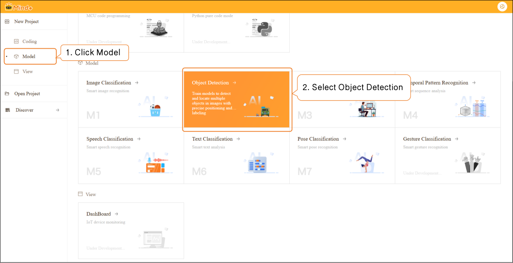

- Click **"Advanced Mode"** in the top-right corner of the interface to switch modes. Once switched successfully, the menu bar will add the following modules: **Data Settings**, **Annotation Settings**, **Model Training**, and **Model Validation**.

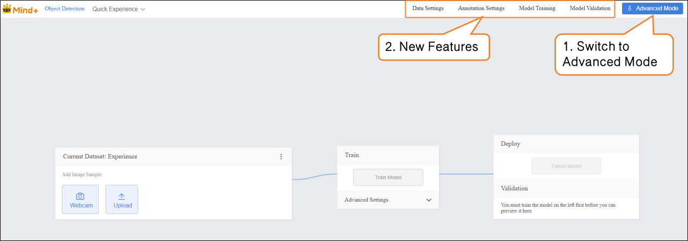

### Data Settings

- Switch to "Data Settings" → Click "Create" at the top left, for example, create a dataset named **Wild Animal Recognition**.  

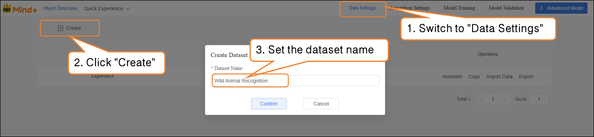

- After switching to Advanced Mode, the dataset list will display a default "Experience" dataset, which is generated from the Quick Experience mode. Users can perform the following operations on newly created datasets: annotation, copy, import data, export, and delete.  

 Note: The default dataset cannot be deleted.  

- Next, perform the “Import Data” operation for the newly created **Wild Animal Recognition** dataset. The system supports two import methods: **Labeled Data** and **Unlabeled Data**.  
- Import Method 1: Unlabeled Data  

- - Suitable for uploading only raw images (e.g., images containing a mix of apples, pears, and bananas, with at least 20 images per category).  

**Steps:**

1. Select the import type as **NO annotations.**
2. Click **Import Data.**
3. Choose images from your local device.
4. Click **Confirm** to complete the import.

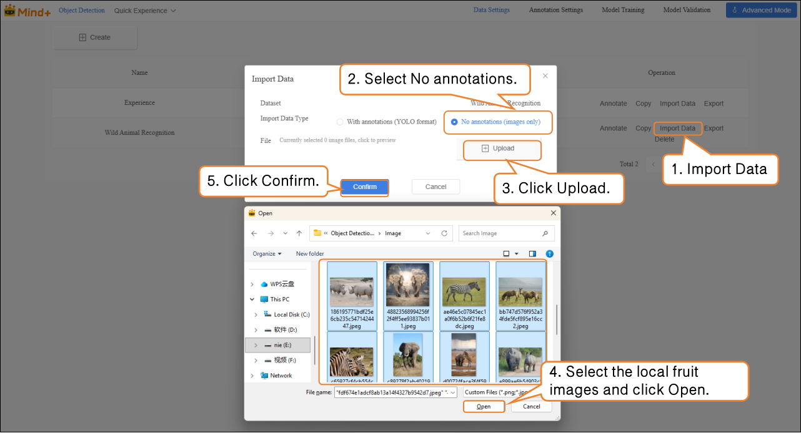

Import Method 2: **With Annotations**

- Directly upload YOLO-formatted annotated data (.zip file).
- Organize the folder structure according to platform requirements. After uploading, manual annotation is not needed, and the system will directly proceed to model training.  

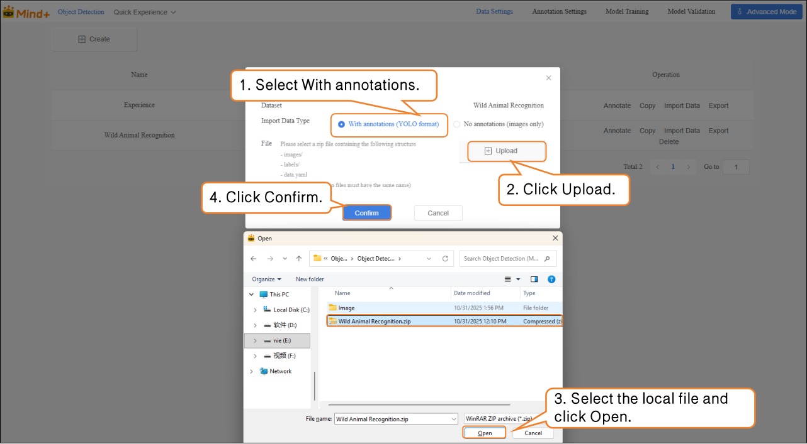

### **Annotation Settings**

- After successfully importing the **wild animal images (With annotations Data)**, the annotation progress bar will automatically display the number of imported images and the corresponding number of annotations.

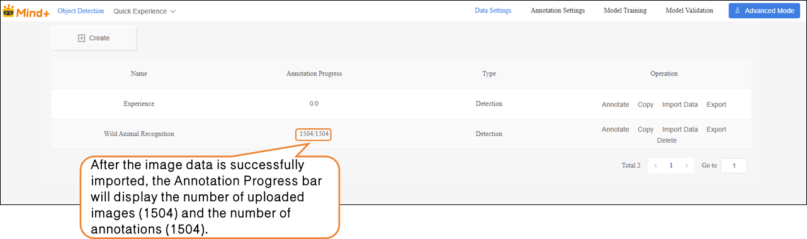

- If it shows **No annotations Data (1504/1525)**, you need to manually annotate the remaining data.

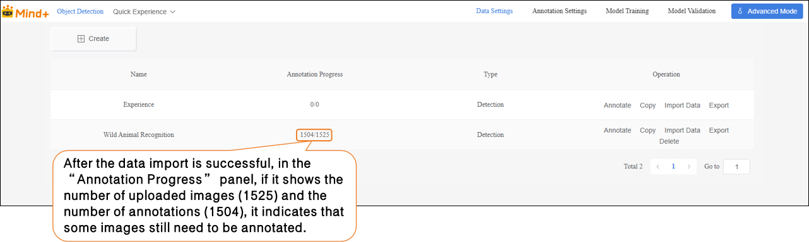

- Click **“Annotate”** in the **“Actions”** panel to enter the annotation settings interface for Wild Animal Recognition.

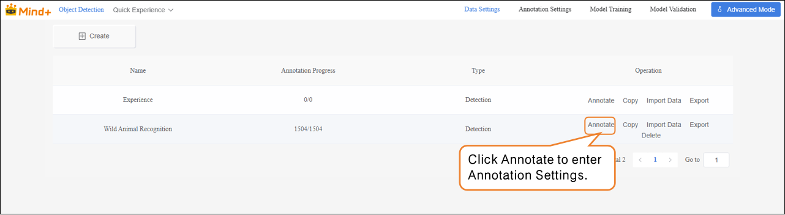

Follow the interface prompts to create labels (**buffalo**, **elephant**, **rhino**, **zebra**) for annotating different categories of wildlife.

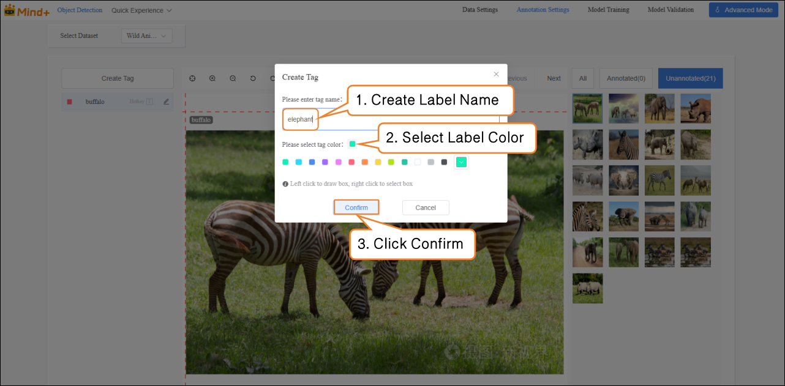

Next, annotate the dataset. When annotating, first click the corresponding label name, then use the left mouse button to click one corner of the target, drag to the opposite corner, and click again to form a rectangular box that fully encloses the target.
Press **Ctrl + number key (1/2/3 …)** to quickly switch between different labels.

**Notes for dataset annotation:**

1. During annotation, all images in the dataset must be annotated one by one.
2. If an image contains multiple wildlife targets, each target must be annotated separately.

### Model Training

- After all images have been annotated, switch to the **Model Training** module.

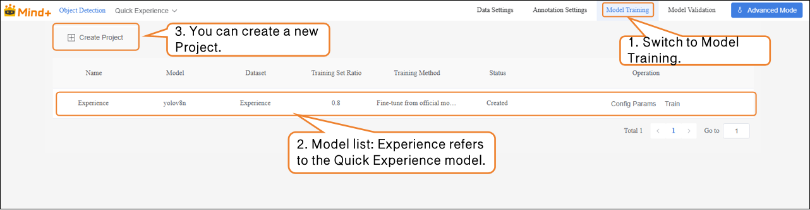

-  Click **“Create Project”**, and in the pop-up window, configure the following settings:
  **Name**: Wild Animal Recognition Model (customize as needed)
  **Model**: Select according to your requirements (or keep the default)
  **Training Method**: Select according to your requirements (or keep the default)
  **Dataset**: Wild Animal Recognition (In Data Settings, we have created and named the dataset **“Wild Animal Recognition”**; in Data Annotation, all images have been labeled and organized. The dataset is now fully prepared for training. The system will use this dataset to extract features and learn patterns from the images, gradually enabling the model to classify different wild animals. Therefore, make sure to select the **Wild Animal Recognition** dataset here.)
  **Training Ratio**: Select according to your requirements (or keep the default)  

| Task Parameter | Purpose                                                      | Description                                                  |
| -------------- | ------------------------------------------------------------ | ------------------------------------------------------------ |
| Name           | Used only to distinguish and manage different training tasks; does not affect model performance. | Like giving a name to this experiment, making it easier to review and compare later. |
| Model          | Determines which neural network architecture to use for training. | Different models have different "learning methods" and "capabilities". For example, some models are suitable for small datasets, while others are better for complex classification tasks. |
| Training Type  | Specifies the type of training, such as classification, regression, or detection. | Tells the model "what you want it to learn".                 |
| Dataset        | Indicates which data the model should learn from.            | Acts like a textbook; the model will learn to recognize different traffic signs from the images and labels in this dataset. |
| Training Ratio | Determines what proportion of the dataset is used for training and what proportion for validation. | Training set = examples for the model to learn from Validation set = examples to check the model’s learning performance (unseen by the model). |

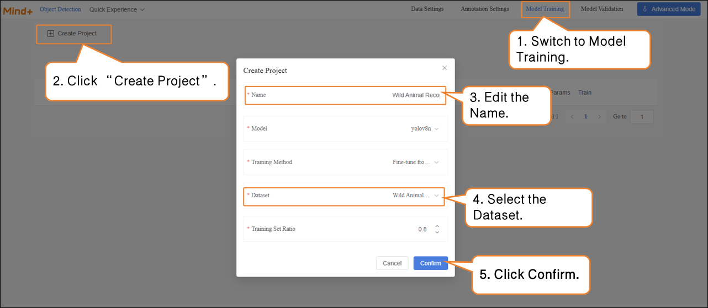

- After the model training task is successfully created, click **Config Params** to enter the training parameter configuration interface. You can adjust the parameters according to your needs, or start training directly with the default settings.

- - **Basic Parameters**: Image size, Batch size, Epochs.
  - **Advanced Parameters**:  Save Period, Vertical Flip Probability, fliplr, Optimizer, etc.  

| Parameter                 | Description                                                  | Explanation                                                  |
| ------------------------- | ------------------------------------------------------------ | ------------------------------------------------------------ |
| Save Period               | The interval at which the model is saved during training, preventing data loss in case of unexpected interruptions. | Save Frequency = 5 → Save the model every 5 epochs. Save Frequency = -1 → Do not save automatically, only keep the final model. |
| Vertical Flip Probability | During data augmentation, the system randomly decides whether to flip the image along the vertical axis (top-bottom) so the model can learn to recognize objects in different orientations. | Probability = 0 → Never flip (augmentation is disabled). Example: A photo of a rhino, after vertical flip, appears upside down. For some tasks (e.g., face recognition), vertical flip may destroy features, so enable it based on the task. |
| fliplr                    | Randomly flips the image horizontally (mirror image).        | Probability = 0 → Never flip. Example: An image of an elephant, after horizontal flip, changes its head-to-tail orientation from left-to-right to right-to-left. |

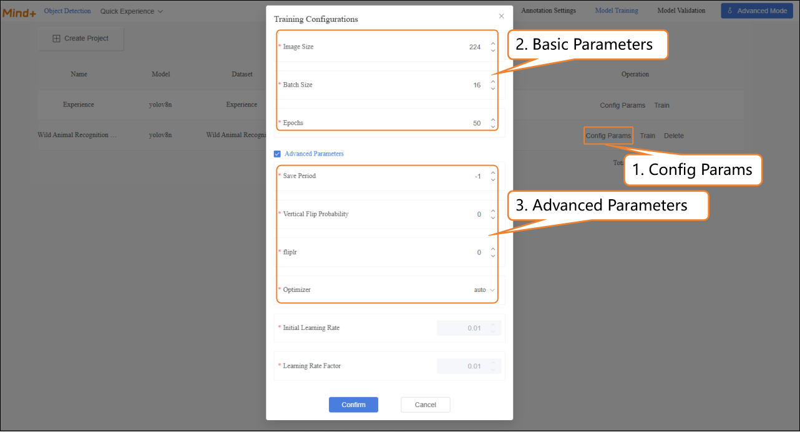

- Click **Train** to start the model training.

- During model training, you can view relevant data through the **Training Monitoring** window.

- - **Training Loss (train loss):** The prediction error of the model on the training data. Lower loss indicates the model predicts the training data more accurately.
  - **Validation Loss (val loss):** The prediction error on the validation data (data not used for training). A consistently decreasing validation loss indicates improved model generalization.
  - **Validation mAP50 (Val mAP50):** Indicates the accuracy on the validation set where a prediction is considered correct only if the predicted box overlaps with the ground truth box by more than 50%. Higher values indicate better detection accuracy.

- After the model training is completed, you can delete, export, or view result of the trained model from the operation bar.

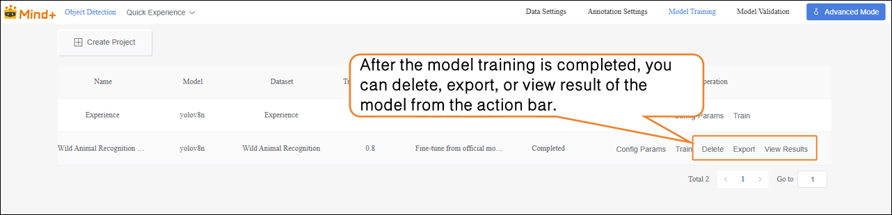

### Model Validation  

- Switch to the **Model Validation** module, select the training project: **Wild Animal Recognition Model**; select the model: **best.pt**. Other parameters can be set according to your needs, or you can use the default settings.  

| File    | Save Timing                                                  | Meaning                                    | Use Case                        |
| ------- | ------------------------------------------------------------ | ------------------------------------------ | ------------------------------- |
| last.pt | The model saved at the last step during training             | Final state at the end of training         | Continue training / fine-tuning |
| best.pt | The model that performed best on the validation set during training | Model with the best validation performance | Testing / deployment            |

- **Model Validation** supports two methods: **Camera Real-Time Test** and **Single Image Test**.  

- - **Camera Real-Time Test**: Recognize fruits in real time through the camera, and generate masks to cover the contours of the identified fruits, visually displaying the segmentation results.  

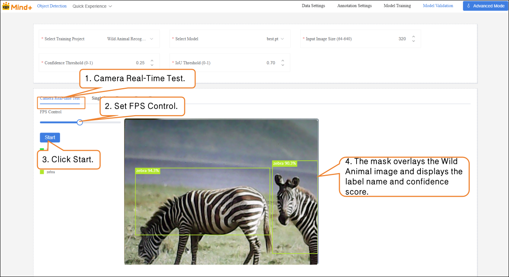

- **Single Image Test**: Upload an image for recognition and validation.

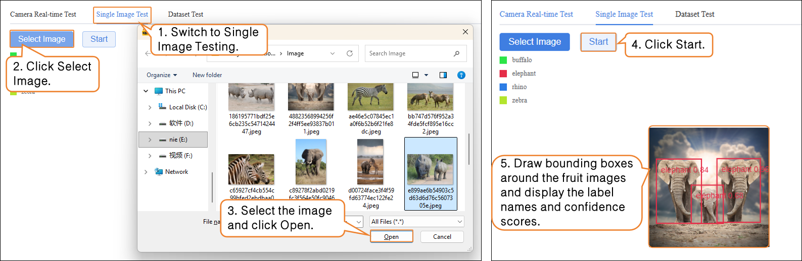

If you are not satisfied with the model’s performance, you can go to the **Model Training** module to create a new task, adjust the parameters, and retrain the model to further improve recognition accuracy.

### Model Export  

- When the model test results meet your requirements, switch to the **Model Training** module to export the model.  

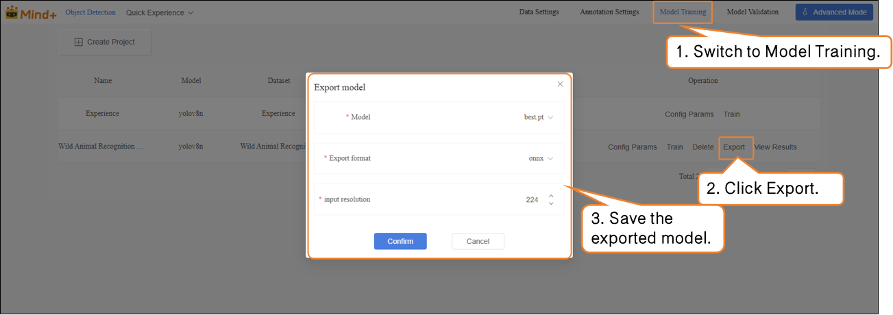

The exported model can be used for deployment. To learn how to operate model deployment, you can refer to Section [4.1.4 Model Deploy.](https://www.yuque.com/joanna-rqvih/ilxuhv/aepmmgw4s77247vi)

### **Common Issues**

When performing instance segmentation tasks in **Advanced Mode**, if issues occur, you can first refer to the table below for self-check and troubleshooting.

| Problem                                          | Possible Cause                                               | Solution                                                     |
| ------------------------------------------------ | ------------------------------------------------------------ | ------------------------------------------------------------ |
| Error or unrecognized when uploading dataset     | Folder structure does not conform to YOLO format, or compressed file is incorrect | Organize images and labels folders according to platform requirements and re-upload |
| Dataset is empty after importing unlabeled data  | Unsupported image format                                     | Use JPG/PNG format, and ensure each class has ≥20 samples    |
| Poor recognition performance                     | Annotation boundaries are not closed or inaccurate           | Draw closed polygons along object contours to ensure accurate boundaries |
| Incomplete segmentation / inaccurate recognition | Training samples are not diverse enough, or data augmentation not enabled | Increase samples from different environments and enable data augmentation |