The quick experience for object detection takes *“*Wild Animal Detection*”* (e.g., zebra, elephant) as an example to guide users through the full workflow of training an object detection model.

This case demonstrates how object detection works in real applications: the model can not only recognize target categories (such as zebras or elephants) in an image, but also generate **bounding boxes** for each detected object, accurately marking its position and size.

Through this visualized process, users can clearly understand how object detection differs from regular image classification — which only identifies categories without location information — and appreciate its value in real-world scenarios such as **intelligent sorting** and **security monitoring**.

**Effect:**
The trained model can detect targets like zebras and rhinos in both real-time camera feeds and uploaded images, drawing bounding boxes around them and displaying corresponding category labels (e.g., *“zebra”*, *“rhino”*) along with confidence scores (indicating how certain the model is about each prediction).  

**The model training workflow includes five main steps:**

1. **Create Project**:  Create a dedicated project for object detection.
2. **Add and Annotate Images**:  Collect or upload image samples, label the target objects, and draw accurate bounding boxes for each.
3. **Train Model**: Train the object detection model using the platform.
4. **Model Validation**:  Test the model’s bounding box precision and classification accuracy.
5. **Model Deploy**:  Export and deploy the trained model to hardware for local operation and applications. Optionally, users can enable **real-time result push** to the SIoT platform for remote monitoring and management.

## Step 1: Create Project  

Open **Mind+**, select **“New Project”** from the menu bar, then click **“Model”.**In the training options, find **“Object Detection (M2)”** and click it to complete project creation.

After the project is successfully created, it will jump to the new **Object Detection – Quick Start** interface.

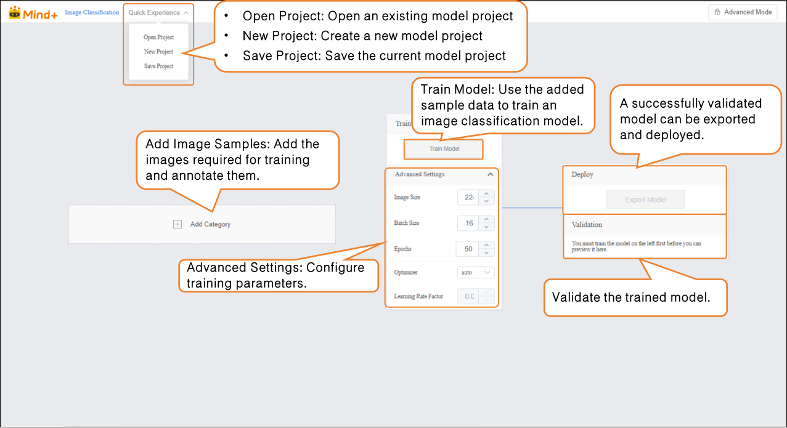

##  Step 2: Add and Label Image Samples  

Adding samples is the foundation of model training. It’s essential to ensure **high-quality images** and **accurate annotations**. This process consists of two parts: **Sample Addition** and **Sample Annotation**.  

**Add Image Sample:**

- Within the current dataset, you can add image samples using **two methods**:  

- - **Camera Capture:** Suitable for real-time data collection, allowing you to quickly capture live images during experiments.
  - **Local Upload:** Ideal for importing pre-prepared sample materials, making it easy to batch add and manage existing data.

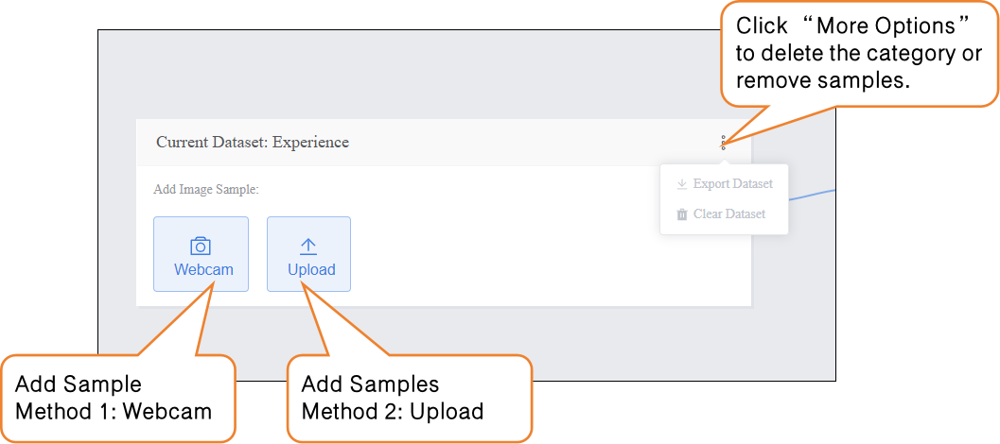

To ensure optimal training performance of the object detection model, please make sure your dataset samples meet the following requirements, including **the number of samples per category**, **object clarity**, **annotation completeness**, and **background lighting conditions**.

| **Requirement Item**        | **Requirement**                                    | **Description**                                              |
| --------------------------- | -------------------------------------------------- | ------------------------------------------------------------ |
| **Sample Quantity**         | At least 20–50 images per class                    | Each class should contain at least 20–50 image samples. If the objects have diverse shapes or colors, increase the number of samples to cover more variations. |
| **Class Balance**           | Keep class quantities as balanced as possible      | Significant differences in the number of samples across classes may cause the model to favor classes with more data. Try to maintain balance (e.g., 50 zebras, 50 elephants, 50 buffalo). |
| **Object Clarity**          | Targets must be clearly visible in the image       | Ensure each target is complete and sharp, not blurry or occluded. For small or complex-shaped objects, ensure the annotation can accurately outline the object. |
| **Annotation Completeness** | All targets must be labeled with closed boundaries | Every target in the image must be annotated, and boundaries must be closed. For multi-object images, label each target separately to avoid bounding box generation errors. |
| **Background & Lighting**   | Simple background and even lighting                | Keep the background clean and reduce distractions. Ensure uniform lighting—avoid underexposure or overexposure—to improve model training accuracy. |

**Method 1: Camera Capture**  

- Click the **Webcam** option, point the camera toward the target, and use the **preview window** to check whether the captured image is valid.
- Click **Record** to start collecting image samples.
- After the image sample collection is complete, click **×** to exit the capture screen.
  If you are using a desktop computer without a built-in camera, you can connect an **external USB camera** for image capture.  

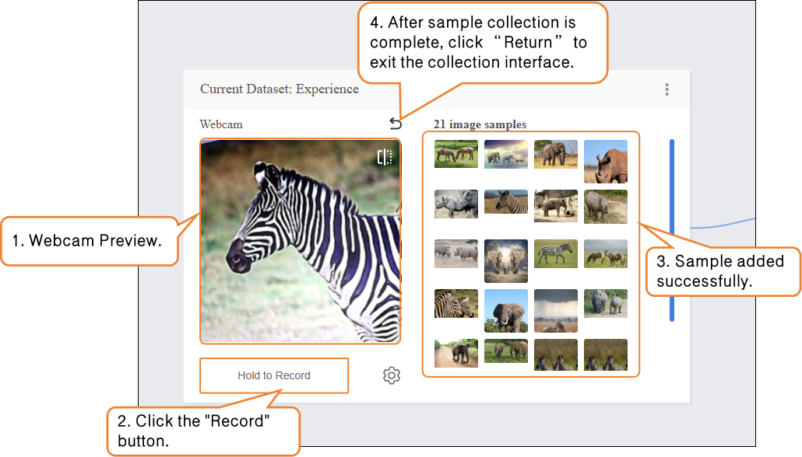

During sample data collection, you can use the “Settings” button to adjust the webcam’s frame rate (number of images captured per second; higher values result in faster capture).

Note: If the FPS is too high, the captured images will have minimal differences, which is not very useful for training.  

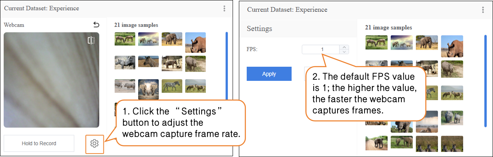

- **Data Annotate method, see instructions below.**

- Method 2: Upload  

Local upload can be divided into Unlabeled Data and **Labeled Data**:

- - **Unlabeled Data:** Only upload image samples. Targets in the images need to be Labeled manually later. This is suitable for learning the workflow in this example.
  - **Labeled Data:** Image samples are already Labeled and corresponding masks are generated. These can be used directly for model training without additional annotation.

**Upload – Unlabeled Data:**

- - Click the **Upload** button, select Unlabeled Data under **Import Data Type**, then click **Select File Upload**.
  - In your local folder, find the prepared image samples, select all, and upload them to the dataset. This completes the addition of Unlabeled Data.

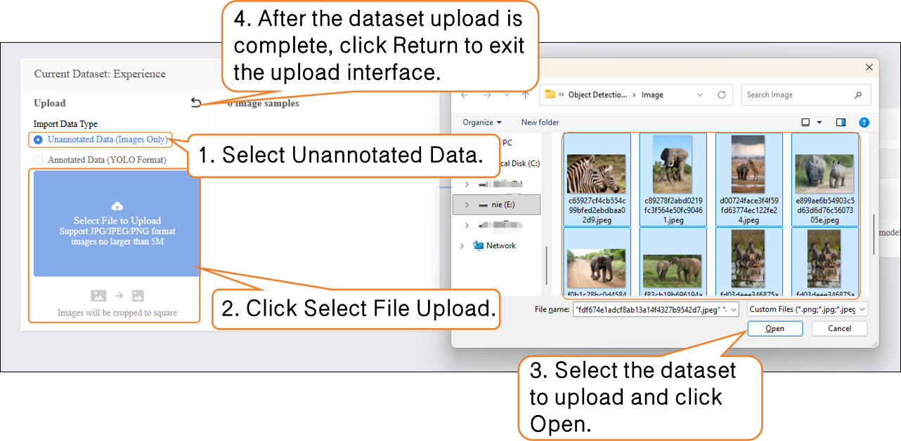

- **Sample Annotation Procedure (for Unlabeled Data)**  

- - Step 1: Create Labels. Click the **"Data Annotate"** button on the interface. In the pop-up **"Create Label"** window, enter the names of the target categories in order (e.g., "zebra", "rhino", "elephant") and select a label color (to help distinguish different categories). Click **"Confirm"** to complete the label creation.  

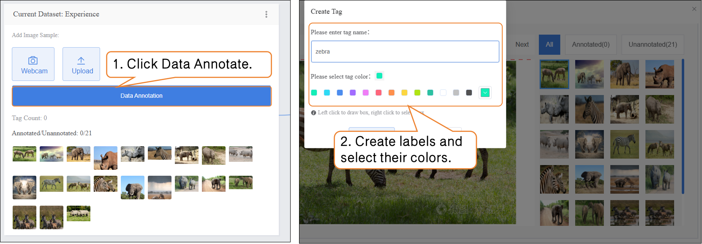

- - Step 2: Draw Bounding Boxes. During annotation, first click the corresponding label name in the label list on the left (e.g., "zebra"), then use the left mouse button to draw a rectangular bounding box along the edges of the target in the image, ensuring the box fully encloses the target. If an image contains multiple targets (e.g., both a zebra and a rhino), repeat the "Select Label → Draw Bounding Box" steps until all targets are annotated.  
  - Manually mark targets using the mouse:  

- - - Move the mouse and click the left button at the vertices of the target object.
    - Drag the mouse until the white box fully encloses the target, then click the left button again.  

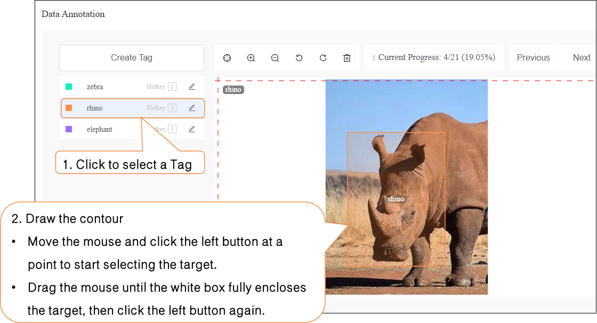

- - If adjustment is needed, right-click on the box to move it or resize its area.

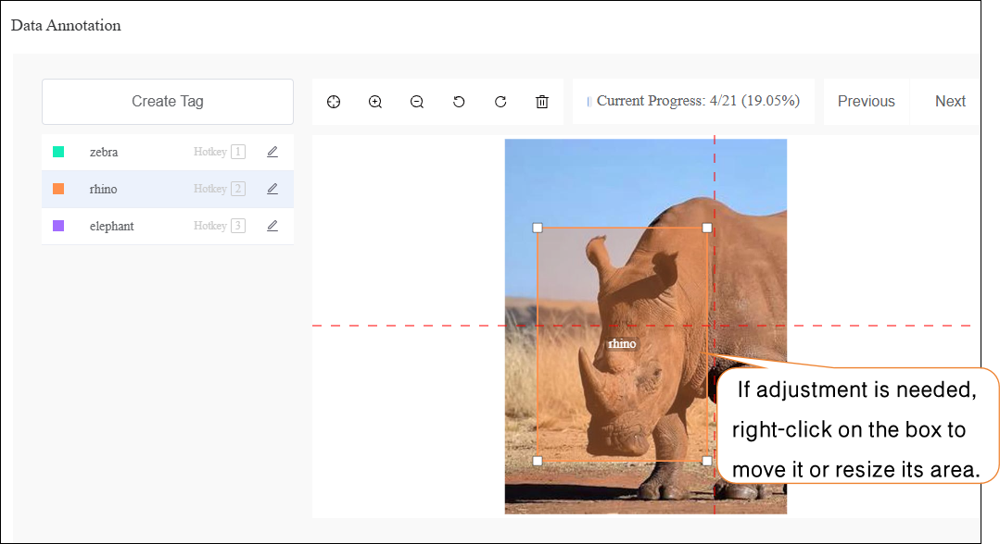

- - If an image contains multiple objects, each object must be annotated individually.

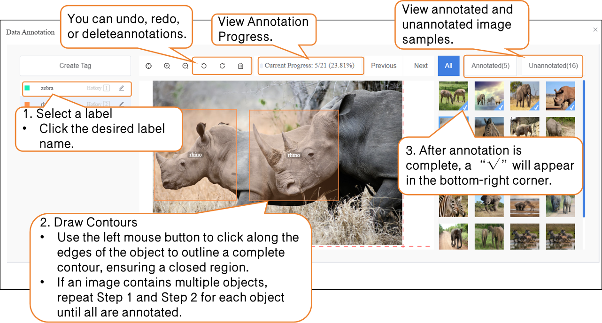

- **Upload – Labeled Data:**

- - Click the **Upload** button, select **Labeled Data** under **Import Data Type**, then click **Select File Upload**.
  - **In your local folder, locate the prepared YOLO-format dataset file (.zip) and upload it. This completes the addition of Labeled data.**

**Professional Note:** YOLO format annotations require the bounding box coordinates to be normalized, meaning the center x-coordinate, center y-coordinate, width, and height are all scaled relative to the image dimensions to fall within the 0–1 range. This ensures the model can consistently handle images of different sizes.

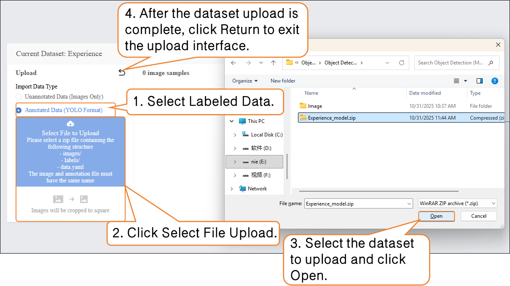

- Once the labeled data is successfully uploaded, there is no need to annotate it manually. You can proceed directly to **Step 3** and start training the model.

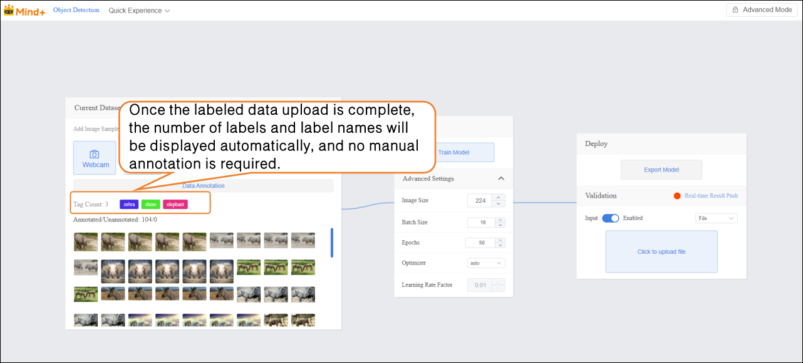

## tep 3: Train Model  

- After annotating all images in the dataset, set the training parameters and click **Train Model** to start training.  

| **Parameter**  | **Description**                                              | **Category Explanation**                                     | **Recommended Setting**                                    |
| -------------- | ------------------------------------------------------------ | ------------------------------------------------------------ | ---------------------------------------------------------- |
| **Batch Size** | The number of data samples fed into the model at one time. When the dataset is large, feeding all data at once may exceed the computer’s capacity, so it’s divided into batches. For example, the default batch size is 16, meaning 16 images are used per training step. | How much the model learns at once                            | Batch Size: 16 (default)                                   |
| **Epochs**     | One complete pass of all training data through the model is called an epoch. Learning once may not be sufficient, so repeating multiple epochs helps the model better memorize patterns. For example, the default epochs are 100. | How many times to learn                                      | Epochs: 20 (for small datasets, you can reduce the number) |
| **Optimizer**  | The optimizer determines how the model updates its parameters during training, i.e., the direction and step size after each learning step. It affects training efficiency and effectiveness. | Learning method (memorization, generalization, or extrapolation) | Optimizer: auto (default)                                  |

- During model training, you can click the **Learn More** button to view training monitoring data:  

- - **Training Loss (train loss):** The prediction error of the model on the training data. Lower loss indicates the model predicts the training data more accurately.
  - **Validation Loss (val loss):** The prediction error on the validation data (data not used for training). A consistently decreasing validation loss indicates improved model generalization.
  - **Validation mAP50 (Val mAP50):** Indicates the accuracy on the validation set where a prediction is considered correct only if the predicted box overlaps with the ground truth box by more than 50%. Higher values indicate better detection accuracy.

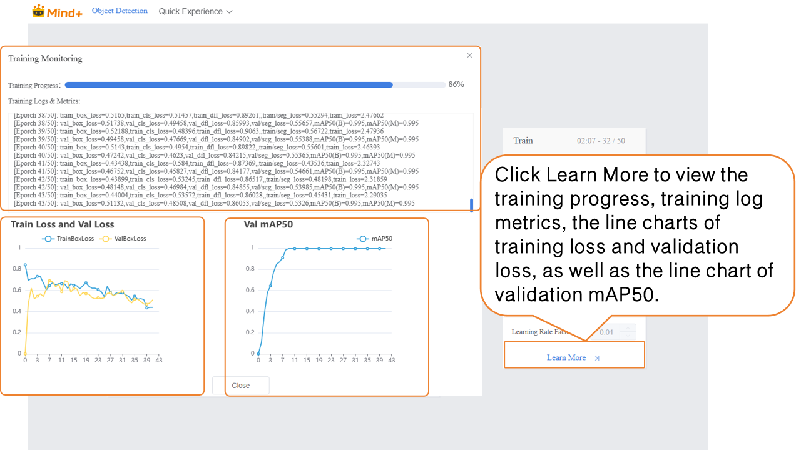

## Step 4: Model Validation  

- After model training is complete, you can validate the model’s performance in the **Validation** section. There are two validation methods: **Webcam** and **File**.  
- **Validation Method 1: Webcam**
- Point the camera at images of **Triangle** and **Rectangle** and observe the output results.

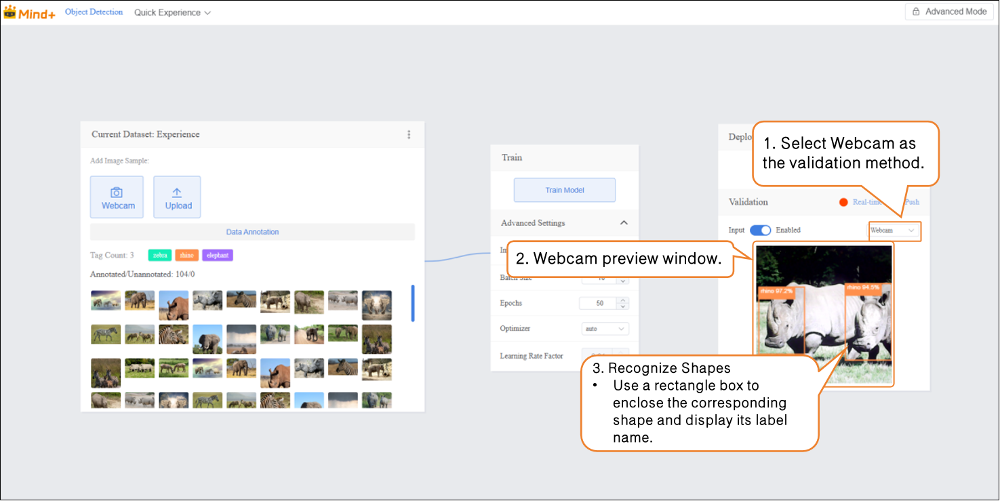

- **Verification Method 2: File**

- - Change the verification method to "File", click "Upload File", select an image, and open it.

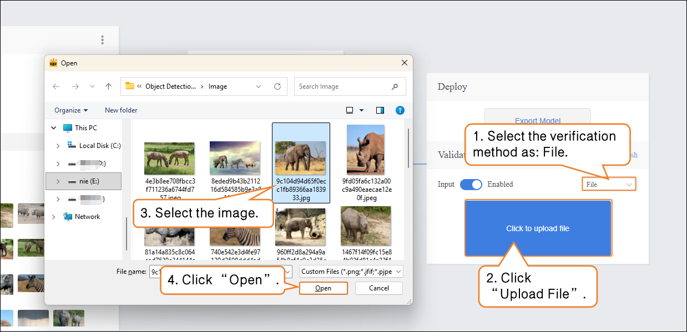

- After the image is successfully uploaded, the recognition results will be displayed.

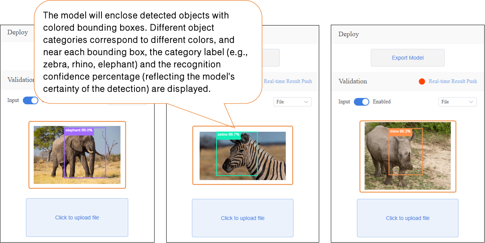

## Step 5: Model Deploy

-  Once the model validation results meet the requirements, you can proceed to deployment

- - “Deploy” → Click “Export Model”.
  - The platform supports exporting the model in ONNX format, making it easy to use in other environments or for secondary development.

Tip: ONNX is an open model format that can run across various deep learning frameworks and devices. This allows you not only to test on the platform but also to apply the model in real projects.  

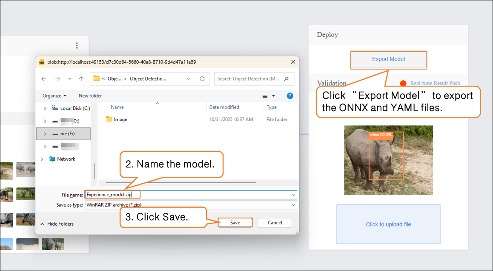

After validation, the model can push prediction results in real time. Click “Real-time Result Push” to synchronize the output to the SIoT platform. Hardware can receive the data from the platform and perform corresponding actions based on it.

Although the data is sent to the SIoT platform in real time, it is not stored in the platform's database, so it cannot be viewed via the SIoT web interface.

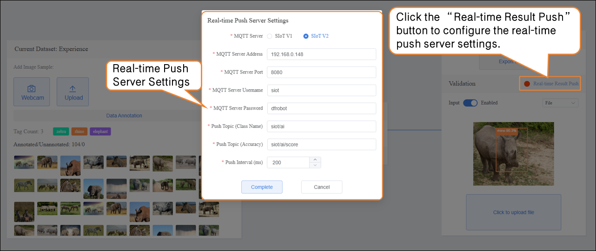

For instructions on model deployment and real-time result push, please refer to section [4.1.4 Model Deploy](https://www.yuque.com/joanna-rqvih/ilxuhv/aepmmgw4s77247vi) & [4.1.5Real-Time Result Push.](https://www.yuque.com/joanna-rqvih/ilxuhv/ph3e9rp4q7c7x1oe)

## Common Issues in Model Training  

| **Issue**                           | **Possible Cause**                                    | **Solution**                                                 |
| ----------------------------------- | ----------------------------------------------------- | ------------------------------------------------------------ |
| Inaccurate target recognition       | Target is blurry, occluded, or unevenly lit           | Ensure targets are clear and complete, with uniform lighting; increase sample quantity if necessary |
| Annotation errors or incompleteness | Contours not closed, missing or duplicate annotations | Trace closed contours along target edges and annotate each target individually |
| Class imbalance causing model bias  | Some classes have too few or too many samples         | Keep the number of samples per class balanced; add samples to underrepresented classes if needed |
| Excessive training time             | Batch size too large or too many epochs               | Adjust batch size and number of epochs; reduce epochs if needed |