The quick experience for posture classification uses the **“Classroom Posture Recognition”** case as an example, guiding users through the complete workflow of training a posture classification model. This case is designed to intuitively demonstrate the practical application of posture classification: the model can recognize and classify posture images captured in real-time via camera or uploaded locally (e.g., distinguishing **“Sitting Upright,” “Raising Hand”**), helping users clearly understand the core principles of posture classification (based on image feature extraction and category matching) and its application value (such as classroom posture monitoring, exercise tracking, security surveillance, and health care assistance).  

- **Effect:** Accurately distinguish three common classroom postures, including Sitting Upright, Raising Hand.  

The posture classification model training process consists of six steps:  

- **Create Project**:  Create a posture classification project and prepare the dataset.
- **Background Samples**:  Capture background images of the current environment to reduce environmental interference and improve model accuracy.
- **Add Categories**:  Add posture classification labels (e.g.,  **“Sitting”**) and collect corresponding posture images via camera (hold to record) or local upload.
- **Train Model**:  Train the posture classification model on the platform.
- **Model Validation**:  Test the model’s performance.
- **Model Deploy**:  Once training is complete, export the model and deploy it to hardware for local operation. Users can also choose to **push the model’s recognition results in real-time to the SIoT platform** for remote monitoring and management.  

### Step 1: Create Project

- Open Mind+, select “New Project” from the menu bar, then click “Model”. In the training options, locate “Pose Classification (M7) ” and click it to create the project.

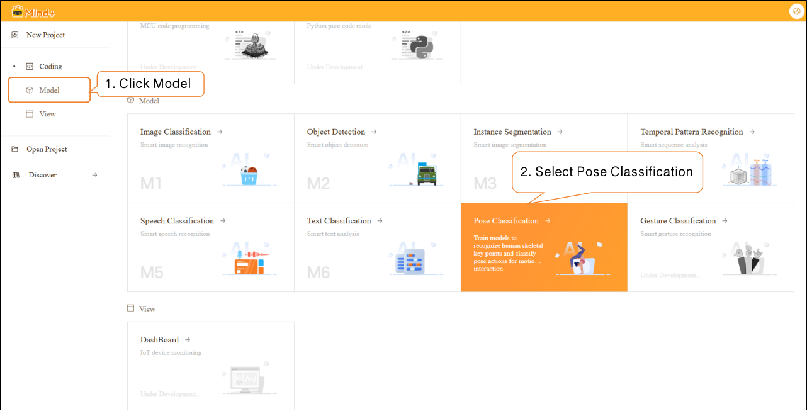

- After the project is successfully created, it will jump to the new **Pose Classification – Quick Experience** interface.

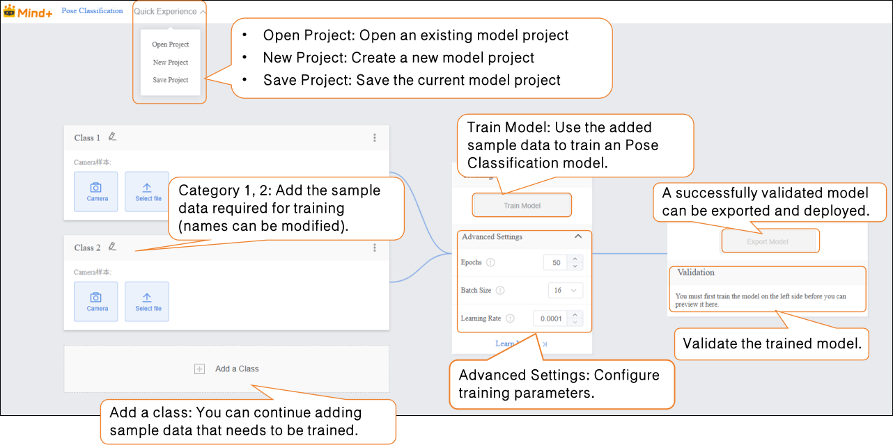

### Step 2: Background Samples  

- To improve model robustness, or in cases where the detection scene has a complex background and higher accuracy is required, it is recommended to add background image samples of the current environment. (It is suggested to cover different areas and lighting conditions in the environment, such as near windows, corners, indoor lighting, or natural light changes.) This helps prevent the model from being overly sensitive to environmental variations.  

**Tip for Data Samples:** Background samples should match the environment where posture samples will be collected (e.g., both in an indoor living room scene). If the application environment changes later, corresponding background samples should be re-collected.  

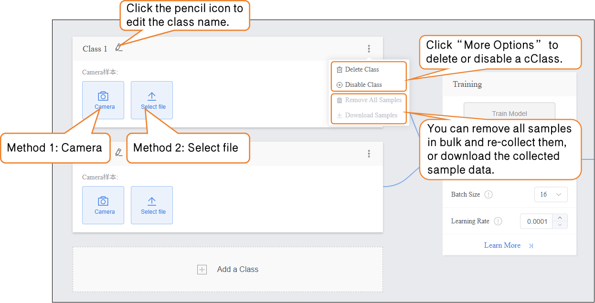

- Samples can be added in the following two ways, allowing users to choose flexibly based on actual needs:  

- - **Camera Collection:** Suitable for capturing real-time environmental backgrounds on-site. It is convenient to operate and ensures maximum consistency with the real scene used later for posture data collection.  
  - **Local Upload:** Suitable for importing pre-prepared image materials (such as photos of the environment taken in advance). It supports batch uploading, making it easier to efficiently manage data for fixed scenes.  

- By using these two methods, users can flexibly build datasets and prepare for subsequent model training.  

- - **Sample Collection Method 1: Camera Collection**  

- - - Click the **“Camera”** button on the interface, and the system will display a list of available cameras. Select the camera currently available on the device (e.g., built-in laptop camera or external USB camera). If no camera is detected, check the device connection status or driver installation.  

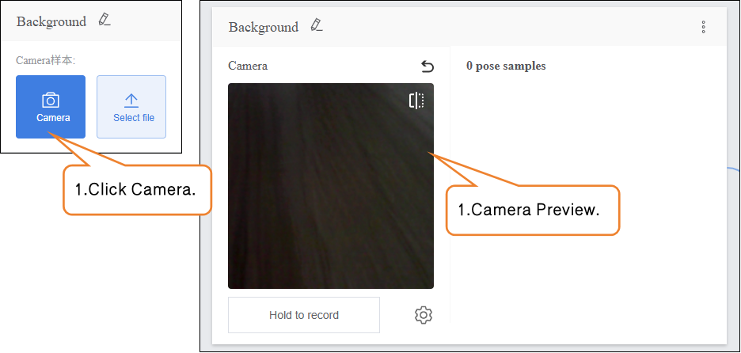

**Note:** If you are using a desktop computer without a built-in camera, you need to connect a compatible USB camera and ensure that the system has correctly recognized it.  

 If the camera preview does not appear in the capture interface, troubleshoot as follows:  

- Check whether the camera is occupied by another application (such as a video conferencing tool).
- Make sure the camera lens is not blocked.
- Restart **Mind+** and try again.

- - **Press and hold** the “Hold to Record” button to start capturing the background. During recording, keep the camera steady to avoid image blur or shaking. **Release** the button to stop recording.  
  - The system will automatically extract static images from the recorded video stream as samples. If you need to add more samples, repeat the “press to record – release to stop” operation until the number of samples meets your expectations (**recommended: 100–200 samples**).  

 Once this type of sample collection is complete, click **“Return”** to exit the capture interface.  

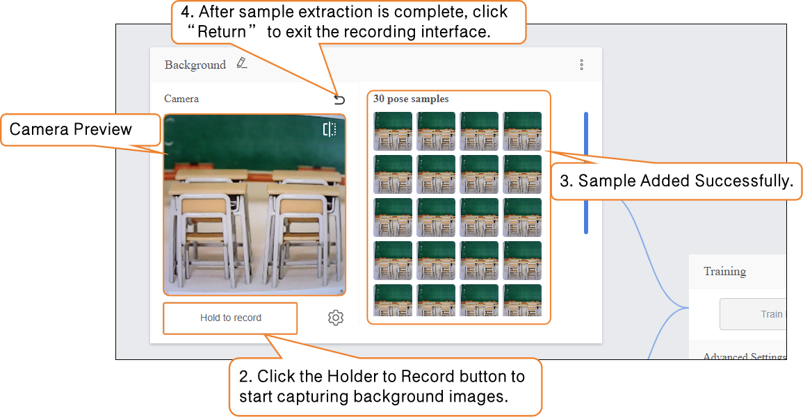

- - - You can individually remove collected samples, remove all samples in bulk and recapture, or download the collected sample data.

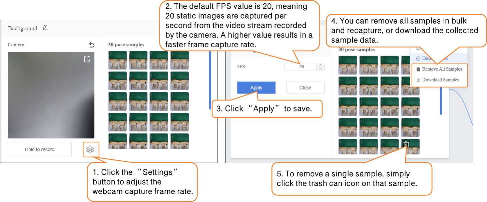

### Step 3: Adding Samples  

- After collecting background samples, you can start adding samples for the target posture categories. Edit the default “Class2” label below by clicking the pencil icon next to it, and rename the category to a specific posture (e.g., “Raise Hand”) to complete the posture sample type naming.  

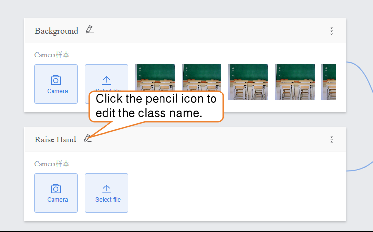

- **Sample Addition Method 2: Local Upload**  

- - Under the target posture category (e.g., “Raise Hand”), click the **“Upload”** button to enter the posture sample upload interface.  
  - Click the **“Select File Upload”** button, and in the local file manager, choose the prepared posture image files (supports single or multiple selections, formats supported: JPG/JPEG/PNG, with each image ≤ 5MB) or the sample ZIP file.  

- - - Click **“Open”** to complete the sample upload. Click **“Return”** to exit the capture interface.  

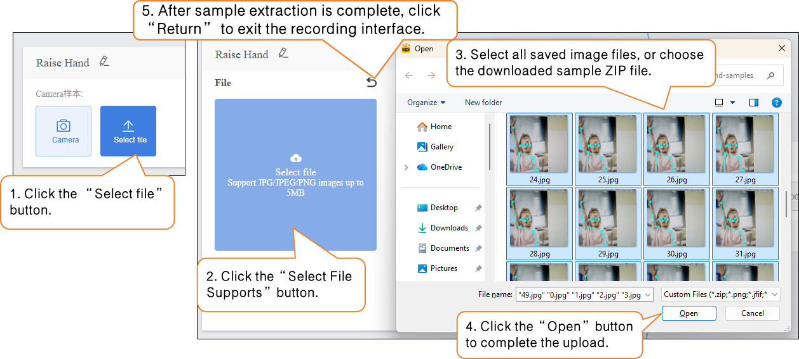

 You can continue uploading new samples or supplement them via camera capture.  

- -  Click **“Add a Class”** to create another category (e.g., “Sit Upright”) and repeat the above sample addition steps until all categories have been added.  

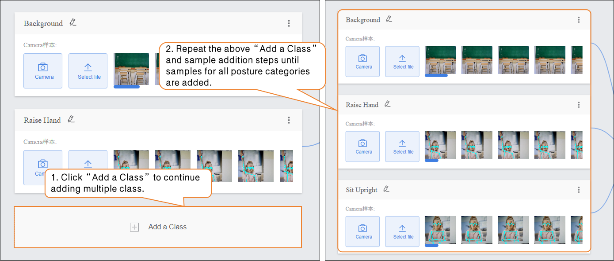

 Tips for Data Samples:  

- - - -  Prepare 100–200 diverse sample images for each category, keeping the number of samples balanced across categories.  
      -  Use simple names for categories; avoid overly complex symbols or long names.  

### Step 4: Train Model  

- **Advanced Parameter Settings**  

- - Before training the model, click **“Advanced”** to configure the training parameters. You can set the following three core parameters:  

| Parameter     | Description                                                  | Notes                                                        | Recommended Settings                                         |
| ------------- | ------------------------------------------------------------ | ------------------------------------------------------------ | ------------------------------------------------------------ |
| Epochs        | One epoch means all samples in the training dataset have been fed to the model once and the parameters updated. | Reflects the depth of the model's learning on the training data. Too few epochs may cause underfitting (low classification accuracy); too many may cause overfitting (poor generalization to new data). | • Basic scenario (5 postures, 10–20 samples per category): 50–100• Complex scenario (high sample variability): 100–200, adjust based on validation results to avoid overfitting |
| Batch Size    | Number of samples processed simultaneously during each training step. | Affects training speed and model stability: too small increases training time (more iterations needed); too large may cause memory issues or hinder convergence. | • Standard PC (≥4GB RAM): 8–16• High-performance device (≥8GB RAM): 16–32, adjust according to memory to avoid lag |
| Learning Rate | Controls the step size of each parameter update; determines how much weights are adjusted based on error. | Determines training convergence speed and final accuracy: too high causes unstable training; too low slows training (more epochs required). | • Initial recommendation: 0.001• If loss decreases slowly: increase to 0.005• If loss fluctuates heavily: decrease to 0.0001 |

- **Start Model Training**  

- - After setting the training parameters, click **“Train Model”** to begin training. (If no parameters are set, the system will use the default settings.)  

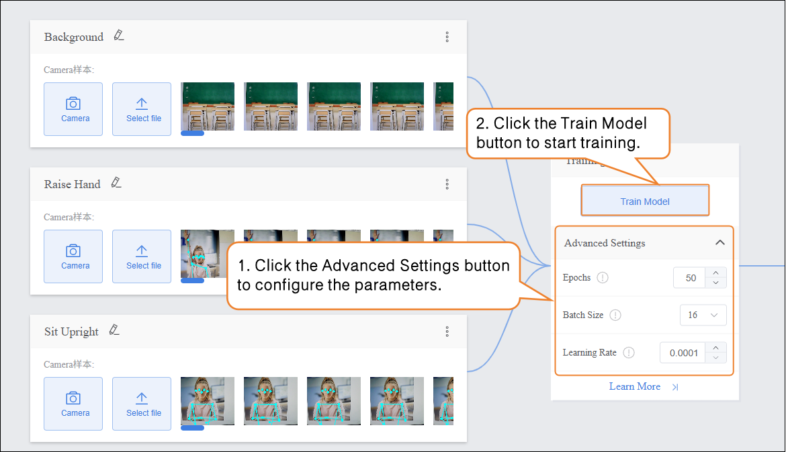

- - During training, make sure to keep this tab open. Switching pages or closing the browser may interrupt the training process.  

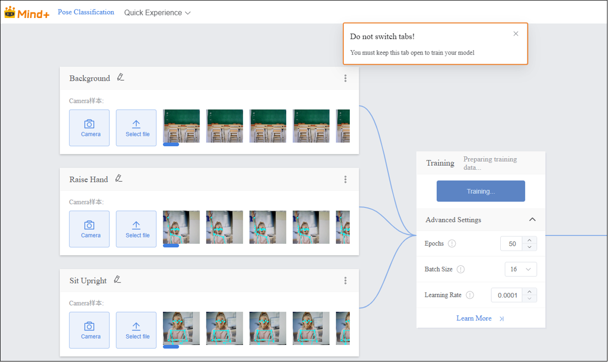

- - **raining Process Monitoring**  
  - During model training, you can click the **“Learn More”** button to view relevant training monitoring data:  

- - - **Accuracy per class**: Indicates the proportion of samples in each posture category (e.g., Background, Standing, Hand-Raising, Sitting Upright) for which the model’s predictions match the actual labels.  
    - **Confusion matrix**: A matrix showing the prediction performance of the model across all posture categories, providing a clear view of how actual posture labels correspond to predicted labels.  
    - **Accuracy per epoch**: Refers to the proportion of correct predictions over all samples during one complete pass (epoch) of the training dataset.  
    - **Loss per epoch**: Quantifies the error between the model’s predicted values and the true values for that epoch.  

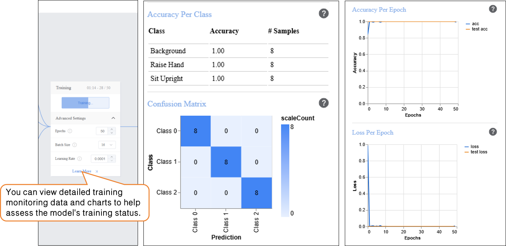

### Step 5: Model Validation  

- After the model training is completed, you can validate the model in the **Model Validation** area. There are two validation methods: **Camera** and **File**.  
- **Tip:** Using new images that were not included in the training set for testing will better reflect the model’s actual performance.  

- Validation Method 1: Camera  

- - Ask the subject to maintain the target posture. The system will capture posture images in real time, automatically extract features, and predict the category. The **Output** area on the interface will display the real-time classification results.  

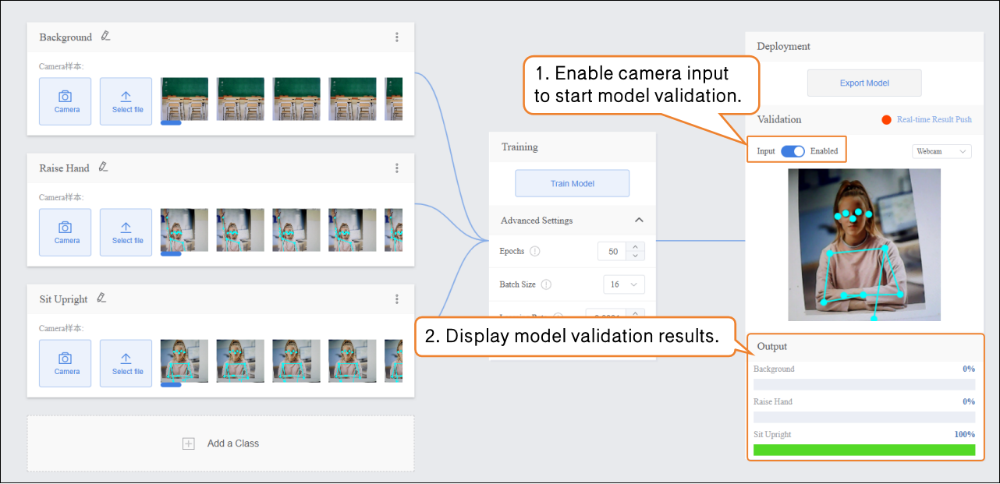

- Validation Method 2: File  

- - Switch the validation method to “File”, click “Upload File”, select an image, and open it.  

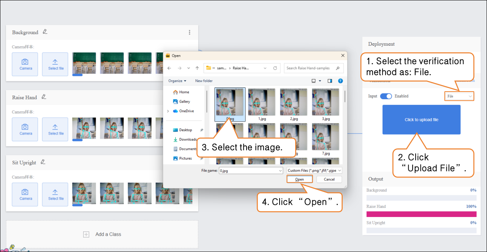

- - fter the image is successfully uploaded, the pose classification result of the image will be displayed.  

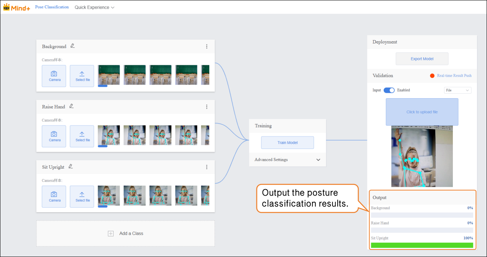

### Step 6: Model Deploy

- Once the model validation results meet the requirements, you can proceed to the deployment stage.  

- - Go to **“Deploy”** → Click **“Export Model”**.  
  - The platform supports exporting the model in **ZIP format**, making it easy to use in other environments or for secondary development.  

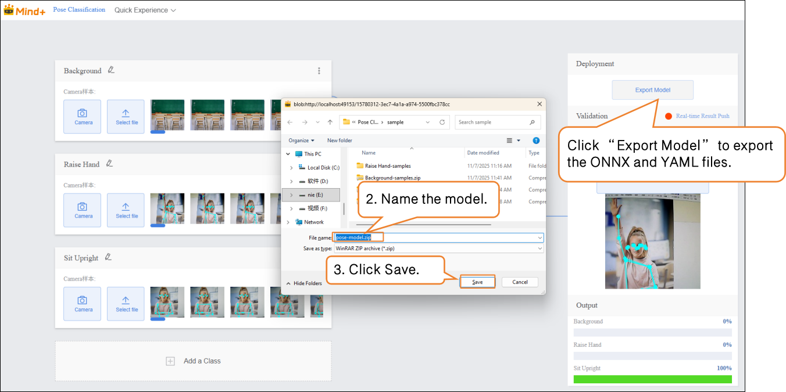

- After validation is complete, the model can **push prediction results in real time**. Click **“Real-Time Result Push”** to synchronize the output results to the SIoT platform, enabling online monitoring and data visualization, and allowing interaction with hardware.

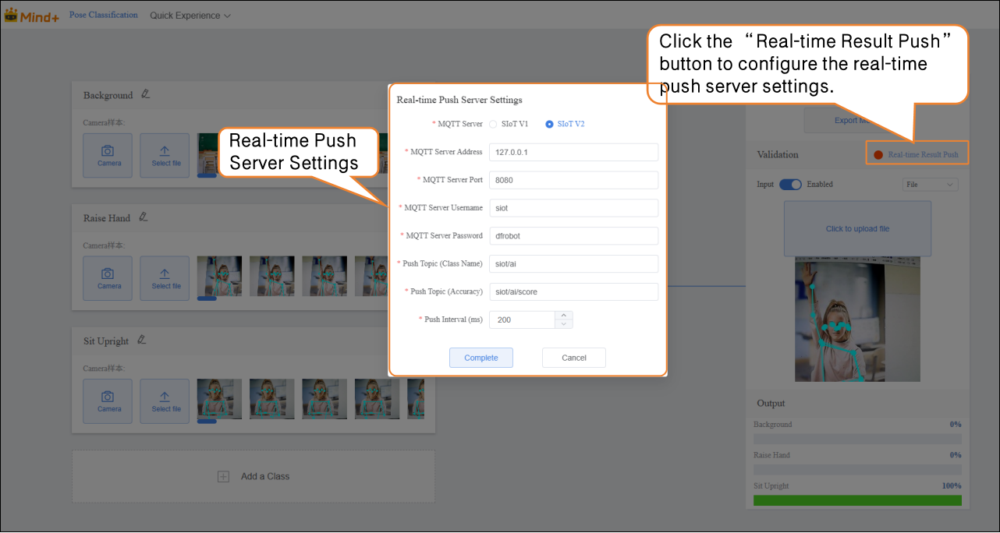

For instructions on model deployment and real-time result push, please refer to section [4.1.4 Model Deploy](https://www.yuque.com/joanna-rqvih/ilxuhv/aepmmgw4s77247vi) & [4.1.5Real-Time Result Push.](https://www.yuque.com/joanna-rqvih/ilxuhv/ph3e9rp4q7c7x1oe)

### Common Issues in Model Training  

- During model training, you may encounter various issues, such as slow training speed, low accuracy, or incorrect parameter settings. The following summarizes common problems and suggested solutions to help you complete model training more smoothly.

| **Common Issue**       | **Possible Causes & Solutions**                              |
| ---------------------- | ------------------------------------------------------------ |
| **Low Model Accuracy** | **Possible Causes:**Insufficient sample dataImbalanced sample categoriesImproper training parameter settings**Solutions:**Add more samples: Increase each category to 20–30 samples, covering different expression styles and sentiment tendencies.Keep the number of samples balanced across categories to improve accuracy.Adjust training parameters such as epochs, batch size, and learning rate. |
| **Long Training Time** | **Possible Causes:**Batch size set too small, so each training iteration processes too few texts, requiring more iterations.Epochs set too high, causing excessive repetition of learning.**Solutions:**Increase batch size appropriately so the model processes more samples per iteration, speeding up training.Adjust the number of epochs based on data volume and task requirements to avoid unnecessary repeated training. |