The quick experience of speech classification takes the **“Music Genre Recognition”** case as an example, guiding users to learn the training process of a speech classification model.
This case demonstrates how speech classification works in real applications: the model can recognize and classify music genres from real-time audio captured by a microphone, helping users intuitively understand the basic principles and application value of speech classification.

- **Effect:** Accurately distinguishes between five different music genres — **Country, Classical, Jazz, Blues, and Rock.**

The **speech classification model training process** consists of six steps:

- **Create Project**:  Create a speech classification project and prepare the dataset.
- **Background Noise**:  Collect background sound samples from the current environment to ensure the model’s ability to recognize speech accurately under complex noise conditions.
- **Add Samples**:  Add classification labels to be recognized (e.g., “Rock,” “Classical”) and collect (or upload) corresponding audio samples via the microphone.
- **Train Model**:  Train the model through the platform to obtain a speech classification model.
- **Model Validation**:  Test and evaluate the model’s performance.
- **Model Deploy**:  After training, export and deploy the model to hardware devices for local execution and application.
  Additionally, users can choose to push real-time recognition results to the **SIoT platform** for remote monitoring and management.

### Step 1: Create Project

- Open Mind+, select “New Project” from the menu bar, then click “Model”. In the training options, locate “Speech Classification（M5）” and click it to create the project.

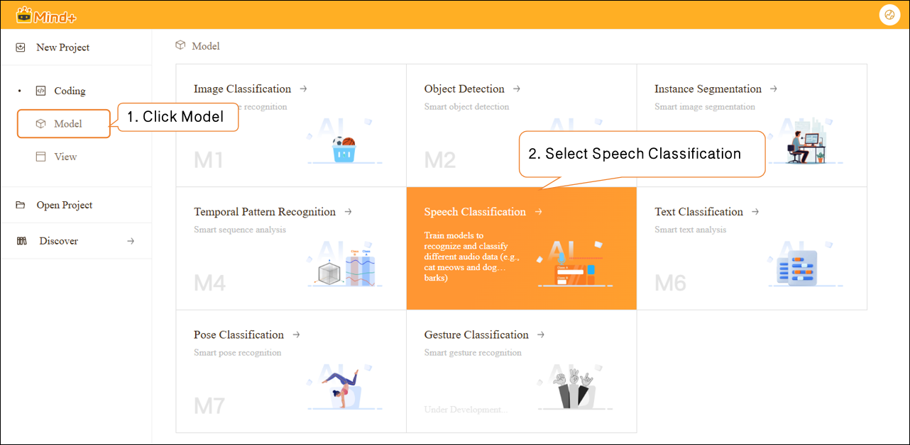

- After the project is successfully created, it will jump to the new **Speech Classification – Quick Start** interface.

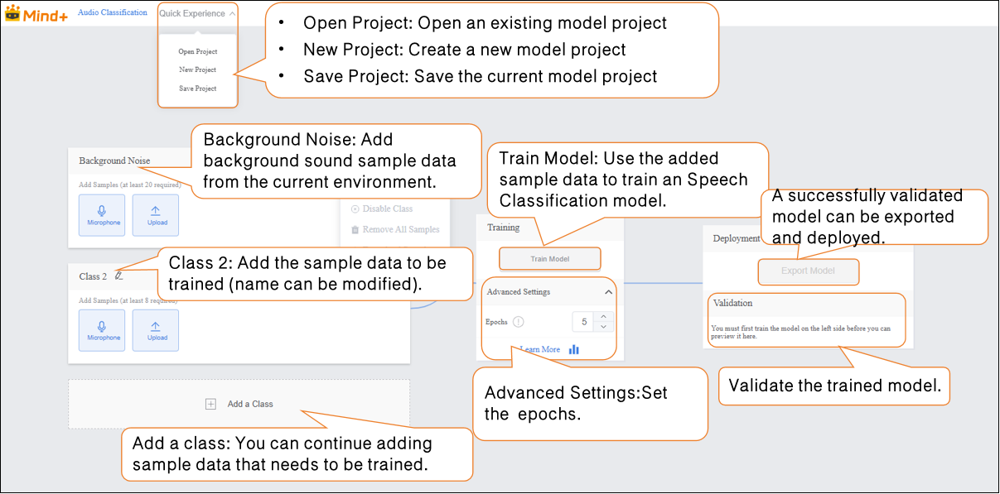

### **Step 2: Background Noise**

- Add background sound sample data from the current environment.

**Data Tip:** This category requires at least 20 samples.  

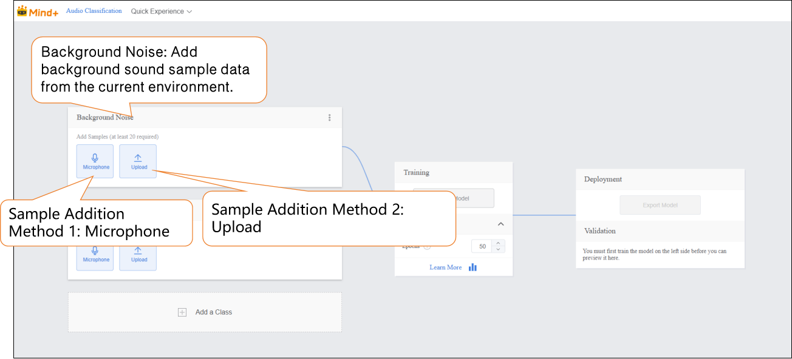

-  Audio samples can be added in two ways:  

- - **Microphone Recording**: Suitable for on-site recording, allowing you to quickly capture real-time speech and conveniently collect data directly during experiments.
  -  **Local Upload**: Suitable for importing pre-prepared audio files, making it easy to add and manage existing data in batches.  

-  These two methods enable users to flexibly build datasets and prepare for subsequent model training.  
- **Sample Addition Method 1: Microphone Recording**  

- - Click the microphone and select an available microphone on your computer.  

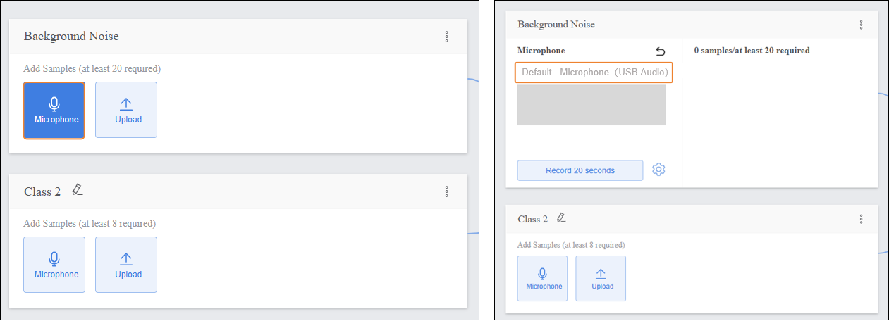

**Note:** If your desktop does not have a built-in microphone, you can use an external microphone.  

- - Click **“Record 20 seconds”** to start capturing audio samples. The recording will automatically stop when the 20-second countdown ends.  

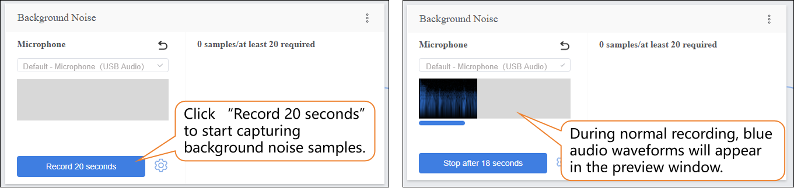

- - Click **“Extract”** to extract samples from the audio segment.

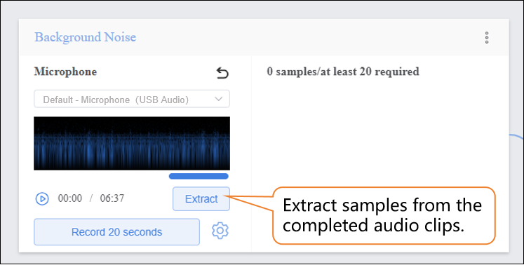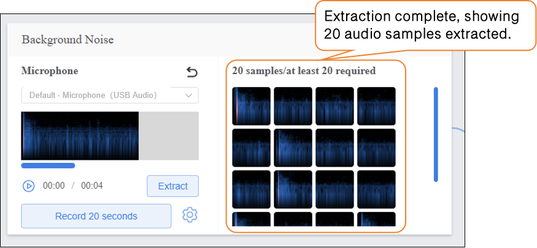

- - After extraction is complete, click **“return”** to exit the recording interface.  

- - - -  After extracting samples, the interface will display the number of samples collected so far. If the minimum of 20 samples per category has not been reached, repeat the recording/upload and extraction process.  

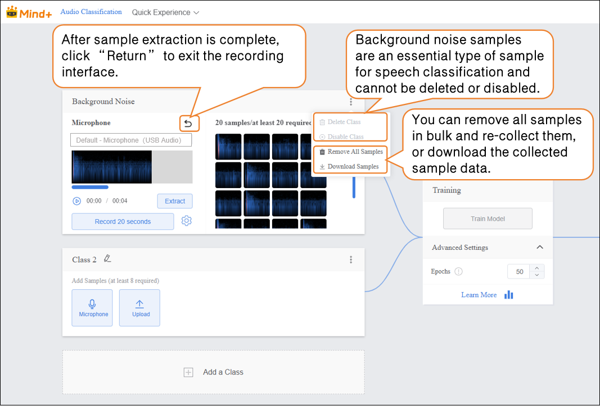

- - Recording Status Check  

**Note:** If the recording displays as shown below, please check whether the microphone is turned on or properly connected.  

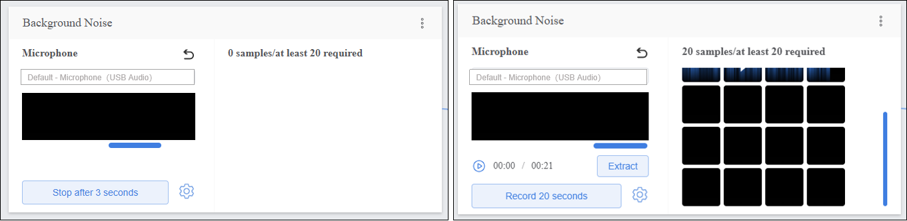

- - Audio Recording Settings

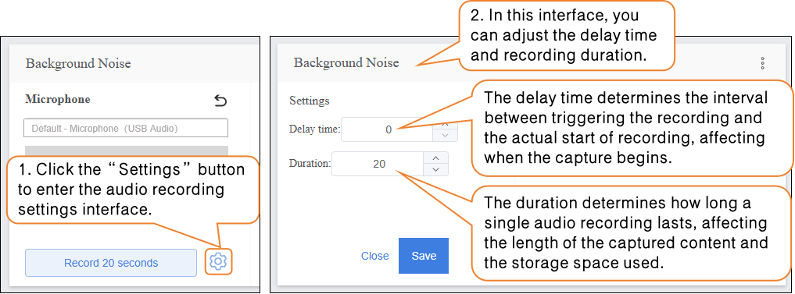

### Step 3: Adding Samples  

- After completing the background noise collection, you can add samples for other categories. First, rename **“Class2”** to define the audio sample type, for example, **“Rock”**.  

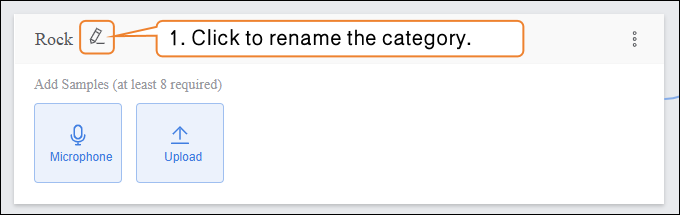

- **Sample Addition Method 2: Local Upload**  

- - Click the **“Upload”** button to enter the audio sample upload interface.  
  -  Click **“Select File Upload”** and choose the `.zip` file created using the **“Download Sample”** function from your local files.  
  - Click **“Open”** to complete the sample upload.  

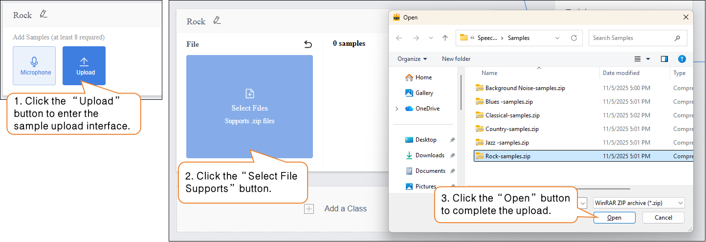

- - After audio sample extraction is complete, click **“Return”** to exit the recording interface.  

- - - After extracting samples, the interface will display the number of samples collected so far. If the minimum of 20 samples per category has not been reached, repeat the recording/upload and extraction process.  

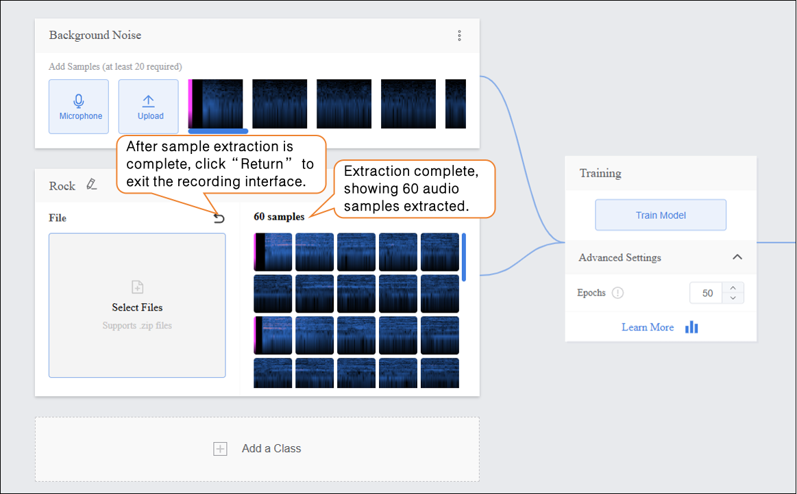

- Click **“Add a Class”** to create a new category (e.g., **“Classical”**) and repeat the sample addition steps above until all categories have been added.

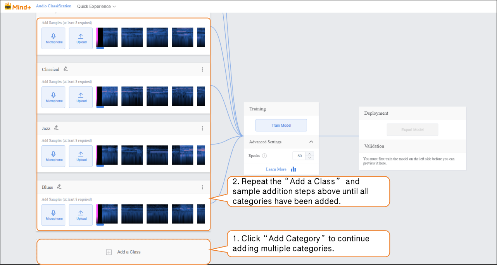

Tips for Data Samples:  

- - - For each category, prepare audio samples that are as distinct and clear as possible, and try to keep the number of samples balanced across categories.  
    -  It is recommended to give each category a simple name without using overly complex symbols or excessively long names.  

### Step 4: Train Model  

- **Advanced Parameter Settings**  

- - Before training the model, click **“Advanced Settings”** to set the training parameter **“Epochs”**.  

| Parameter | Description                                                  | Category Explanation                                         | Recommended Setting                                          |
| --------- | ------------------------------------------------------------ | ------------------------------------------------------------ | ------------------------------------------------------------ |
| Epochs    | One epoch means that every sample in the training dataset has been fed into the model at least once. For example, if you set the epochs to 50, the model will iterate over the entire training dataset 50 times. Generally, the higher this value, the better the model learns to predict the data, as long as overfitting does not occur. | The total number of complete iterations over the training dataset, reflecting how thoroughly the model traverses the data during learning. | Can be increased up to 100. You may need to fine-tune (usually increase) this value until the model achieves good prediction results. |

- **Start Model Training**  

- - After setting the training parameters, click **“Train Model”** to start training. (If no settings are made, the system default parameters will be used.)

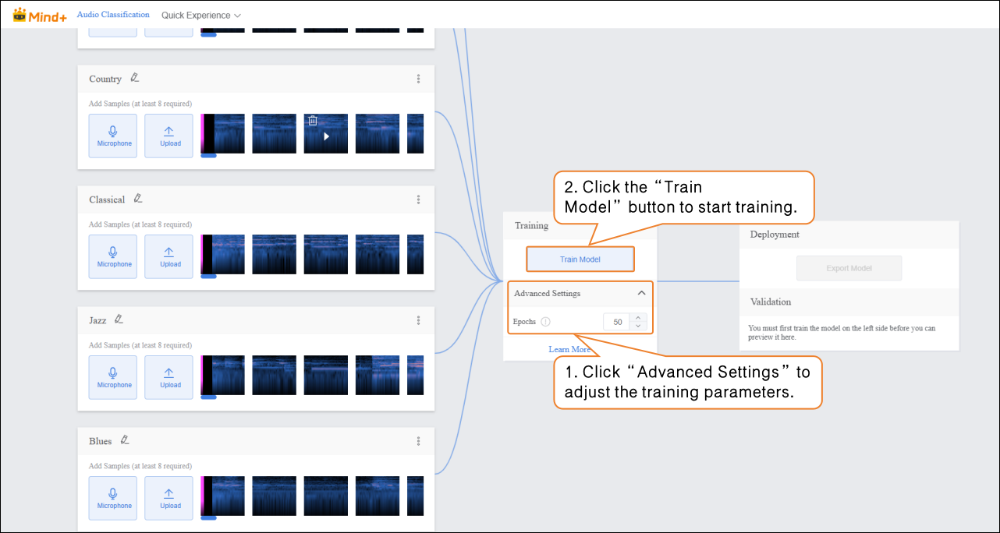

- - During training, make sure to keep this tab open. Switching pages or closing the browser may interrupt the training process.

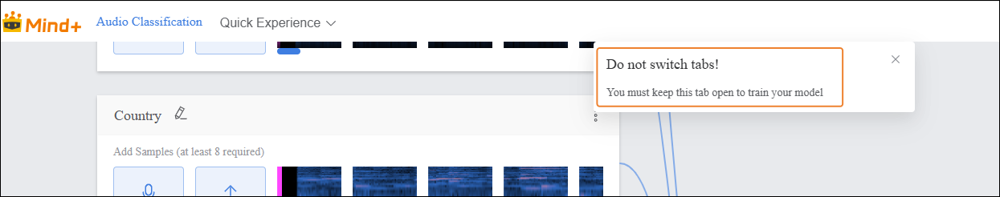

- **Training Process Monitoring**  

- - During model training, you can click the **“Learn More”** button to view training monitoring data.  

- - - **Accuracy per Epoch**: The proportion of model predictions that match the actual results within one epoch (i.e., one complete iteration over the entire training dataset).  
    - **Loss per Epoch**: A quantitative measure of the error between the model’s predicted values and the true values during that epoch.  

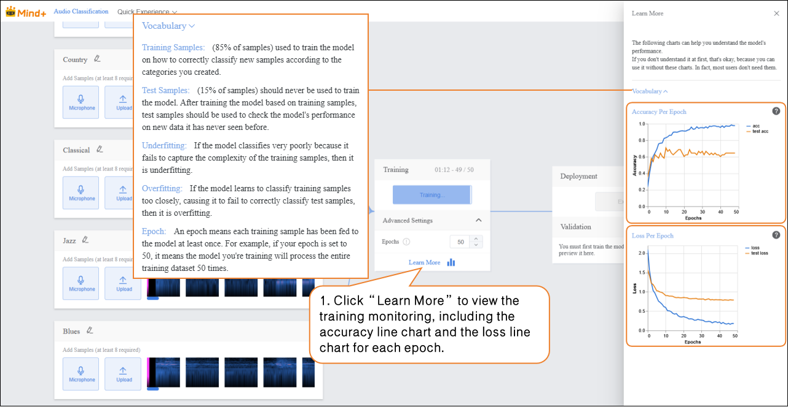

- - - - **Accuracy Line Chart per Epoch**  
      - The blue line (**acc**) represents the model’s accuracy on the training data for each epoch. From the chart, you can see that as the number of epochs increases, the training accuracy rises rapidly and eventually stabilizes near 1.0, indicating that the model is increasingly fitting the training data well. The orange line (**test acc**) represents the model’s accuracy on the test data for each epoch. It rises slightly at first but quickly stabilizes around 0.6, much lower than the training accuracy. This shows that while the model performs very well on the training data, its performance on unseen test data is moderate, indicating limited generalization ability.  
      - **Loss Line Chart per Epoch**  
      -  The blue line (**loss**) represents the model’s loss on the training data for each epoch. The loss decreases rapidly as training progresses and stabilizes at a very low level, consistent with the trend observed in training accuracy, showing that prediction errors on the training data are decreasing. The orange line (**test loss**) represents the model’s loss on the test data for each epoch. It decreases initially but then stabilizes at a value higher than the training loss. Combined with the test accuracy, this indicates that prediction errors on the test data are larger than on the training data, further demonstrating that the model is overfitting the training data and has suboptimal generalization on unseen data.  

### Step 5: Model Validation  

- After the model training is complete, you can use the validation area to test the model’s performance. The validation is done by **real-time audio capture via the microphone**.
  **Tip:** Testing with new audio that was not used during training better reflects the model’s actual performance.  
- Bring the audio source close to the microphone and play the new, unseen audio for testing, then observe the real-time classification results.  

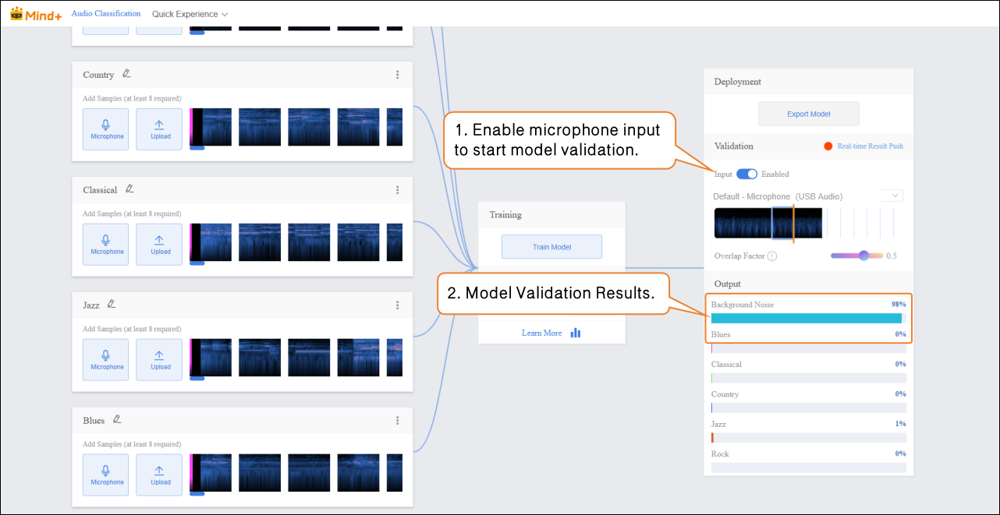

### Step 6: Model Deploy

- Once the model validation results meet your requirements, you can proceed to deployment.  

- - Go to **“Deploy”** → Click **“Export Model”**.  
  - The platform supports exporting the model as a .zip file, making it easy to use in other environments or for further development.  

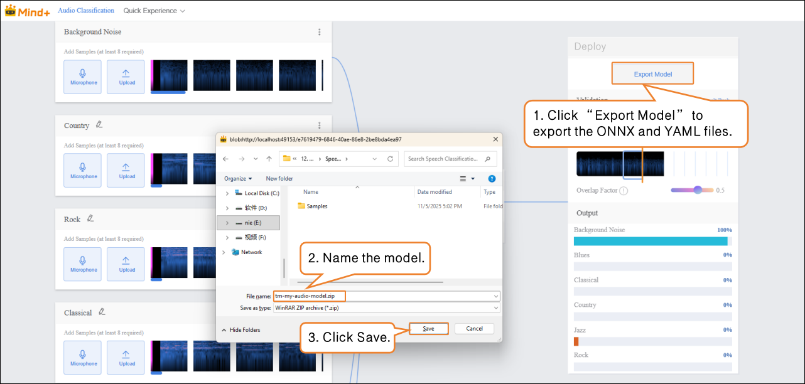

- After validation, the model can push prediction results in real time. Click “Real-time Result Push” to synchronize the output to the SIoT platform. Hardware can receive the data from the platform and perform corresponding actions based on it.
- Although the data is sent to the SIoT platform in real time, it is not stored in the platform's database, so it cannot be viewed via the SIoT web interface.

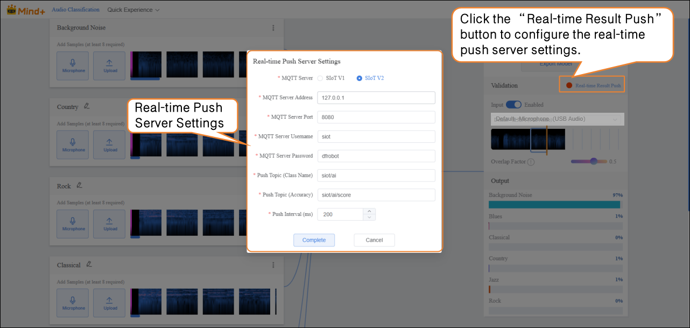

For instructions on model deployment and real-time result push, please refer to section [4.1.4 Model Deploy](https://www.yuque.com/joanna-rqvih/ilxuhv/aepmmgw4s77247vi) & [4.1.5Real-Time Result Push.](https://www.yuque.com/joanna-rqvih/ilxuhv/ph3e9rp4q7c7x1oe)

## Common Issues in Model Training  

- During the model training process, you may encounter various issues such as slow training speed, unsatisfactory accuracy, or improper parameter settings. The following section summarizes common problems and their solutions to help you complete model training more smoothly.

| **Common Issue**       | **Possible Causes and Solutions**                            |
| ---------------------- | ------------------------------------------------------------ |
| **Low Model Accuracy** | **Possible Causes:**• Insufficient amount of sample data.• Imbalanced sample categories.**Solutions:**• When adding sample data, ensure each category includes samples with varying volumes and recording environments (not just background noise from training).• Try to keep the number of samples in each category balanced to improve model accuracy. |
| **Long Training Time** | **Possible Causes:**• Batch size is set too small, causing the model to process fewer samples per iteration and prolonging training time.• Too many epochs are set, leading the model to repeatedly learn the same data.**Solutions:**• Increase the batch size appropriately so the model processes more samples per iteration, speeding up training.• Adjust the number of epochs reasonably based on the dataset size and task needs to avoid unnecessary retraining. |
