The **Quick Experience for Text Classification (M6)** uses the *“Movie Review Sentiment Classification”* case as an example to guide users through the complete process of training a text classification model.
This case demonstrates the practical application of text classification — the model can recognize and categorize movie review texts (e.g., **“Positive,” “Negative,”** and **“Neutral”**). It helps users clearly understand the **core principles** (such as text semantics, sentiment words, and feature extraction) and the **practical value** (e.g., movie reputation analysis, audience feedback collection, and review filtering on film platforms).  

**Effect:** 

The model can accurately distinguish among three common sentiment categories in movie reviews:**Positive**, **Negative**, and **Neutral**.

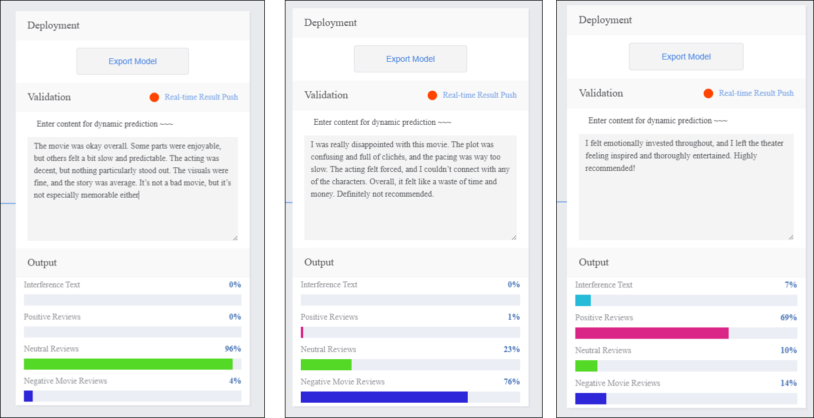

The quick experience for text classification consists of **five steps**:

1. **Create a New Project**:  Create a text classification project and prepare the dataset.
2. **Add Categories and Corresponding Samples**: Add classification labels (e.g., *Positive*, *Negative*, *Neutral*) and obtain text datasets for each category by manually entering text or uploading `.txt` files.
3. **Train Model**: Train the text classification model on the platform.
4. **Model Validation**: Test the model’s performance and accuracy.
5. **Model Deploy**: After training, export and deploy the model to hardware devices for local execution and application.
   Additionally, users can enable **real-time result push** to the **SIoT platform** for remote monitoring and management.

### **Step 1: Create Project**

- Open Mind+, select “New Project” from the menu bar, then click “Model”. In the training options, locate “**Text Classification (M6)**” and click it to create the project.

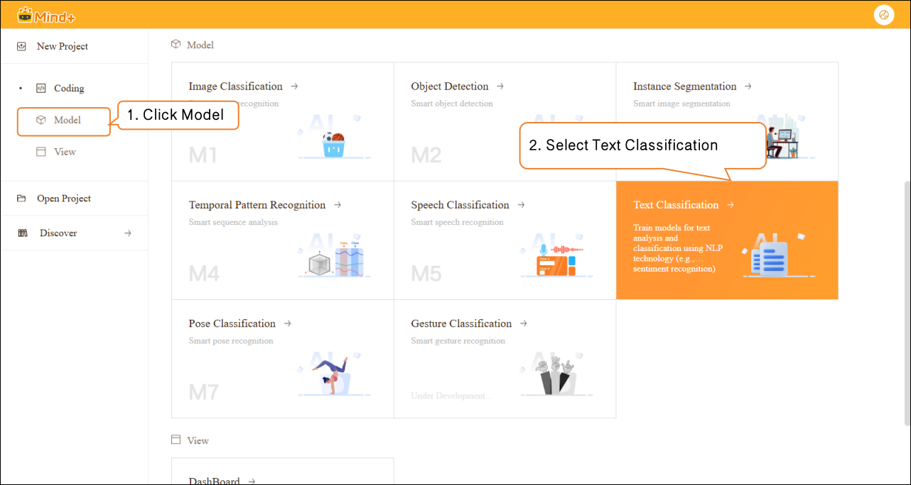

- After the project is successfully created, it will automatically redirect to the new **Text Classification Quick Experience** interface.

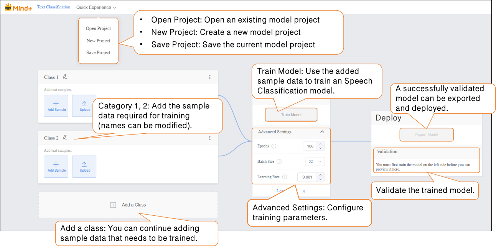

### **Step 2: Add Class and Corresponding Samples**  

- Click the **pencil icon** to rename the category and add the corresponding text sample data.  

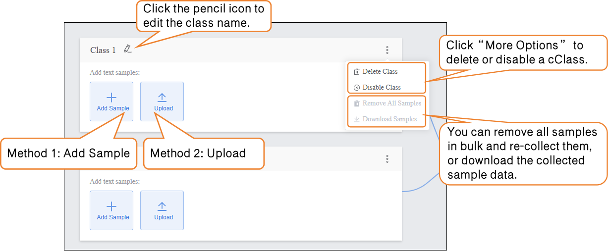

-  Samples can be added in the following two ways, allowing users to flexibly choose according to their needs:  

- - **Manual Input:** Suitable for generating a small amount of interference text on the spot (e.g., entering unrelated content such as “asdfg12345” or “The weather is nice today, not related to the movie”). This method is convenient and helps quickly capture interference features relevant to the current scenario.  
  - **Local Upload:** Suitable for importing pre-prepared batches of text materials (e.g., pre-collected positive review .txt files), making it easier to manage text data efficiently.  

-  By using these two methods, users can flexibly build datasets and prepare for subsequent model training.  

- -  **Naming Class**

- - -  Continue modifying the default label **“Class1”** by clicking the pencil icon next to it. Rename the category to a specific text type (e.g., **“Interference Text”**) to complete the naming of this text sample Class.  

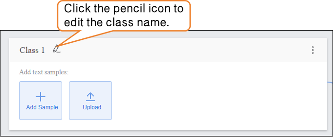

-  **Sample Addition Method 1: Manual Input**  

- -  Click the **“Add Sample”** button on the interface. A text input box will pop up, allowing you to enter a single piece of interference text (e.g., “qwertyuiop” or “This content is not related to the movie”). It is recommended to keep each text entry between **10–200 characters** to avoid overly short, meaningless text or excessively long entries that may increase the model’s processing load.  

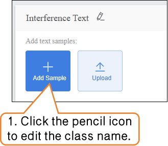

- - After entering the text, click the **“Add Sample”** button. The text will automatically be categorized under **Interference Text**. To add more samples, repeat the **“Enter Text → Add Sample”** process until the desired number of samples is reached. It is recommended to include a variety of interference types.

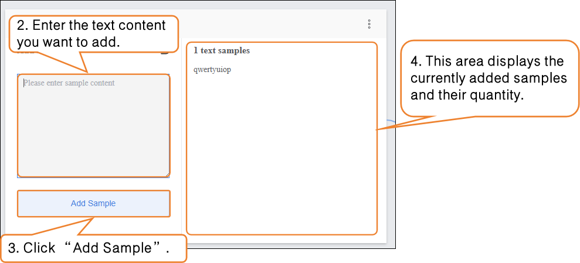

- - You can **delete individual interference text samples, delete in bulk, or export in bulk** (export format supports `.txt`) to facilitate sample management and updates.  
  -  After completing the collection of this sample type, click the **“Return”** button at the top right of the input box to exit the input interface.  

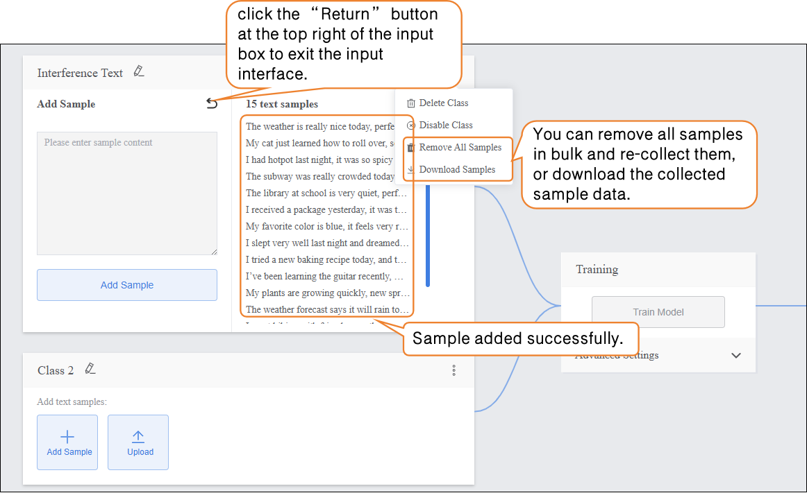

- **Sample Addition Method 2: Local Upload**  

   First, continue modifying the default label **“Class2”** below by clicking the pencil icon next to it. Rename the category to a specific text type (e.g., **“Positive Reviews”**) to complete the naming of this text sample category.  

- - Click the **“Upload”** button to enter the text sample upload interface.  
  -  Click the **“Upload”** button to enter the text sample upload interface; then click **“Select File Upload”** and choose a pre-prepared movie review text file from your local computer. The file must be in **txt format**.  

**Note:** The content in the file should be separated by **line breaks** (i.e., each sentence or phrase should be on a new line).  

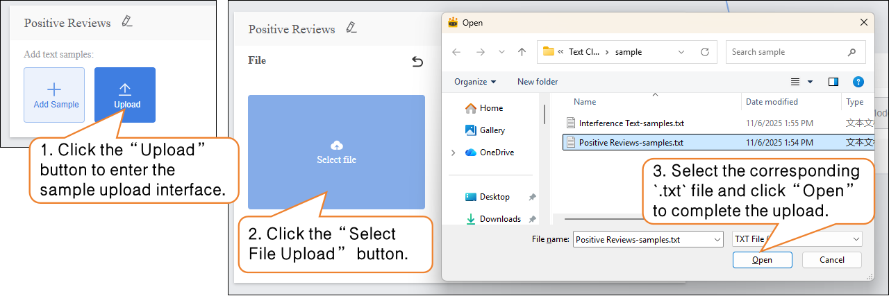

- - - After completing the sample upload, click **“Return”** to exit the input interface.

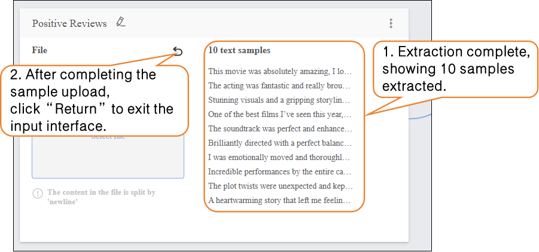

On this basis, continue uploading and adding new samples to supplement the dataset.  

- - Click **“Add a Class”** to create a new category (e.g., **“Neutral Reviews”**) and repeat the sample addition steps above until all categories have been added.  

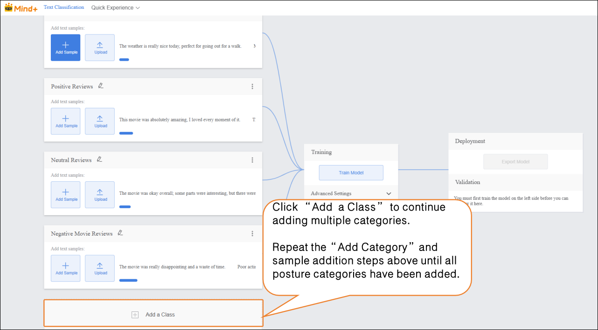

Tips for Data Samples:  

- Prepare diverse text samples for each category, and try to keep the number of samples balanced across categories.
- It is recommended to give each category a simple name without using overly complex symbols or excessively long names.  

### Step 3: Train Model  

- **Advanced Parameter Settings**  

- - Before training the model, click **“Advanced”** to set the training parameters. You can configure the following three core parameters:  

| **Parameter**     | **Description**                                              | **Category Explanation**                                     | **Recommended Setting** |
| ----------------- | ------------------------------------------------------------ | ------------------------------------------------------------ | ----------------------- |
| **Epochs**        | One epoch means that all text samples in the training dataset have been fed to the model once and a parameter update has been completed. For example, setting epochs to 30 means the model iterates over the entire training dataset 30 times. | Reflects the depth of the model’s learning on training text features: too few epochs may lead to underfitting (low classification accuracy, unable to recognize common movie review categories); too many epochs may lead to overfitting (high accuracy on training text but large errors on new text). | 100                     |
| **Batch Size**    | The number of text samples the model processes simultaneously in one training iteration. For example, a batch size of 12 means 12 text samples are drawn from the training set each time for feature computation (e.g., sentiment word extraction, semantic encoding) and parameter update. | Affects training speed and model stability: too small a batch increases training time (requires more iterations) and causes high variance in parameter updates; too large a batch may cause memory issues (text feature processing consumes memory) or make convergence difficult (too many samples updated at once, making parameter adjustment harder). | 32                      |
| **Learning Rate** | Controls the step size of each parameter update, i.e., how much the model adjusts weights based on classification error. For example, a learning rate of 0.001 means each parameter update moves 0.001 times the gradient value. | Determines the convergence speed and final accuracy of the model: a too high learning rate may cause oscillation (error fluctuates, unable to converge stably); a too low learning rate slows training (requires more epochs to reach low error) and may get stuck in local minima. | 0.001                   |

- **Start Model Training**  

- - After setting the training parameters, click **“Train Model”** to begin training. (If no settings are adjusted, the system will use the default parameters.)  

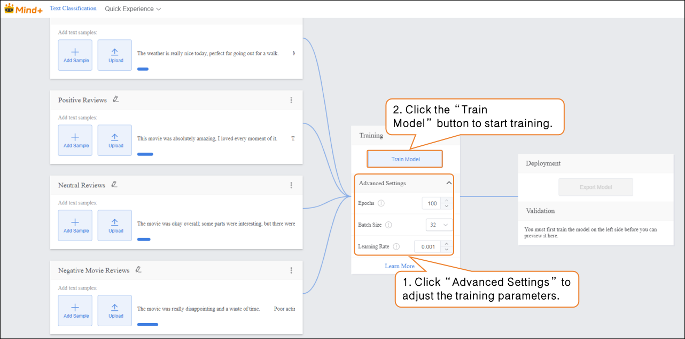

During training, make sure to **keep this tab open** to avoid interruptions caused by switching pages or closing the browser.  

- - **Training Monitoring**  

   While the model is training, you can click **“Learn More”** to view relevant training metrics:  

- - - **Accuracy per Epoch:** The proportion of predictions that match the actual results within one epoch (i.e., one complete iteration over the entire training dataset).  
    - **Loss per Epoch:** A quantitative measure of the error between the model’s predictions and the true values within that epoch.  

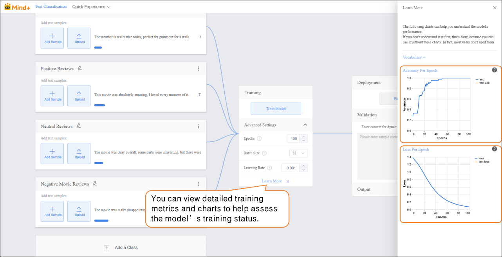

### Step 4: Model Validation  

-  After the model training is complete, you can validate its performance in the validation area.  

**Tip:** Testing with new texts that were not part of the training set better reflects the model’s actual performance.  

- Validation Method: Text Input  

- - In the **“Input”** area, click **“Manual Input”** and enter new movie review text in the text box. The **“Output”** area will display the real-time classification results.  

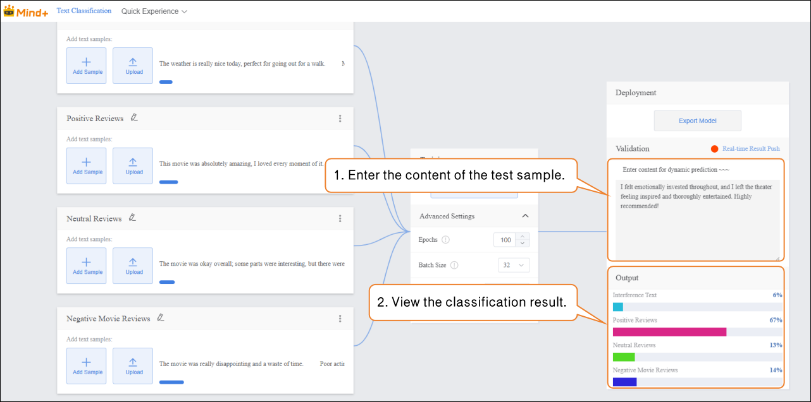

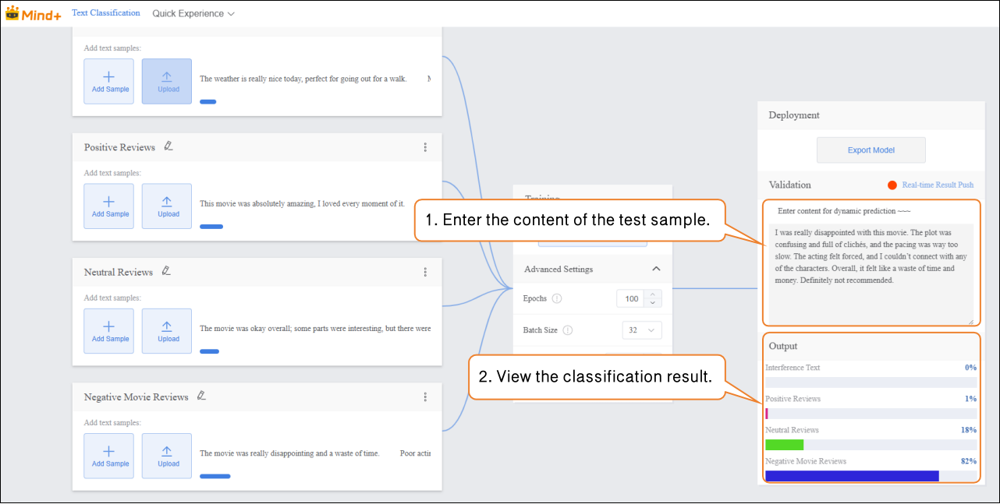

Validation Result Analysis:  

- If the validation accuracy ≥ 80%: The model meets the basic application requirements and can proceed to the deployment stage.  
- If the validation accuracy is between 65%–80%: The model needs optimization, and additional samples for this category can be added.  

### Step 5: Model Deploy

- Once the model validation results meet the requirements, you can proceed to the deployment stage.  

- - Go to **“Deploy”** → Click **“Export Model”**.  
  - The platform supports exporting the model in **ZIP format**, making it easy to use in other environments or for secondary development.  

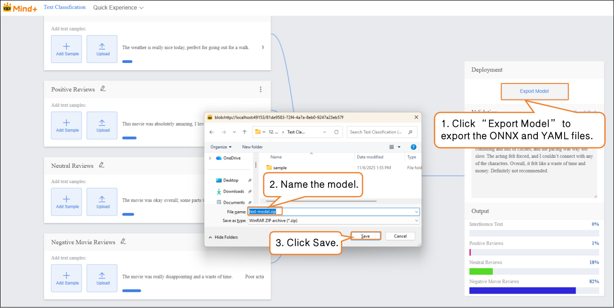

- After validation is complete, the model can **push prediction results in real time**. Click **“Real-Time Result Push”** to synchronize the output results to the SIoT platform, enabling online monitoring and data visualization, and allowing interaction with hardware.

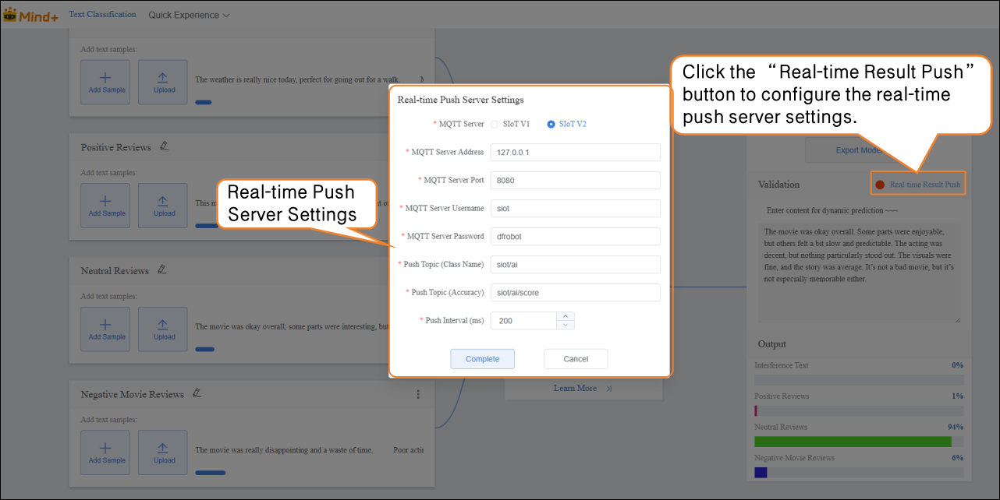

For instructions on model deployment and real-time result push, please refer to section [4.1.4 Model Deploy](https://www.yuque.com/joanna-rqvih/ilxuhv/aepmmgw4s77247vi) & [4.1.5Real-Time Result Push.](https://www.yuque.com/joanna-rqvih/ilxuhv/ph3e9rp4q7c7x1oe)

### Common Issues in Model Training  

- During model training, you may encounter various issues, such as slow training speed, low accuracy, or incorrect parameter settings. The following summarizes common problems and suggested solutions to help you complete model training more smoothly.

| **Common Issue**       | **Possible Causes & Solutions**                              |
| ---------------------- | ------------------------------------------------------------ |
| **Low Model Accuracy** | **Possible Causes:**Insufficient sample dataImbalanced sample categoriesImproper training parameter settings**Solutions:**Add more samples: Increase each category to 20–30 samples, covering different expression styles and sentiment tendencies.Keep the number of samples balanced across categories to improve accuracy.Adjust training parameters such as epochs, batch size, and learning rate. |
| **Long Training Time** | **Possible Causes:**Batch size set too small, so each training iteration processes too few texts, requiring more iterations.Epochs set too high, causing excessive repetition of learning.**Solutions:**Increase batch size appropriately so the model processes more samples per iteration, speeding up training.Adjust the number of epochs based on data volume and task requirements to avoid unnecessary repeated training. |