# 【Temporal Pattern Recognition】 Advanced Mode

This project takes **“K10 Acceleration-Based Motion Recognition”** as an example to demonstrate how to perform temporal pattern recognition in **Advanced Mode**. Through this case, users will not only learn the complete workflow — including **data setup, data annotation, and model training** — but also gain experience with the advanced features available in this mode.

After the model training is completed, the system can analyze and recognize real-time acceleration sensor data, enabling **classification and prediction of different motion patterns**.

Before getting started, it’s essential to prepare and organize the corresponding **temporal datasets**, which serve as the foundation for model training and recognition.
For this project, which aims to detect **three motion types (clapping, waving, and stillness)**, two types of UNIHIKER K10 datasets are provided:

- **Labeled temporal dataset:** for model training and validation.
- **Unlabeled temporal dataset:** for exploring the detailed workflow of Advanced Mode.

This tutorial mainly uses **UNIHIKER K10** as an example to demonstrate how to utilize the acceleration sensor for temporal pattern recognition — from data collection to practical application. However, the same process can also be applied to other microcontrollers equipped with sensors and serial communication capabilities, such as **UNIHIKER M10**, **micro:bit**, or **zhangkongban**.

**Result:**
The trained model can recognize different motion patterns — such as **Applausing**, **waving**, and **stillness** — based on the **x, y, and z-axis acceleration data** collected from the UNIHIKER K10 sensor.

## Mode Switching

- Click the **Home** icon to return to the Mind+ homepage. In the menu bar, select **Create New Project**, then click **Model**. In the training options, find **Temporal Pattern Recognition (M4)** and click it to create the project.

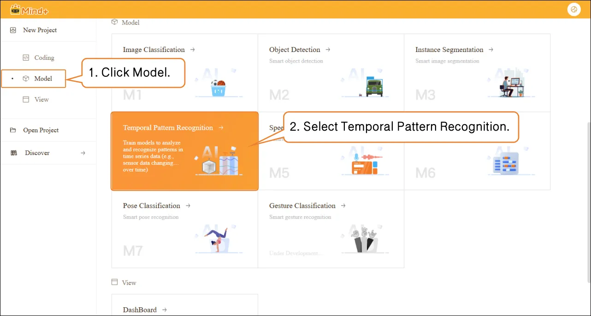

- Click **"Advanced Mode"** in the top-right corner of the interface to switch modes. Once switched successfully, the menu bar will add the following modules: **Data Settings**, **Annotation Settings**, **Model Training**, and **Model Validation**.

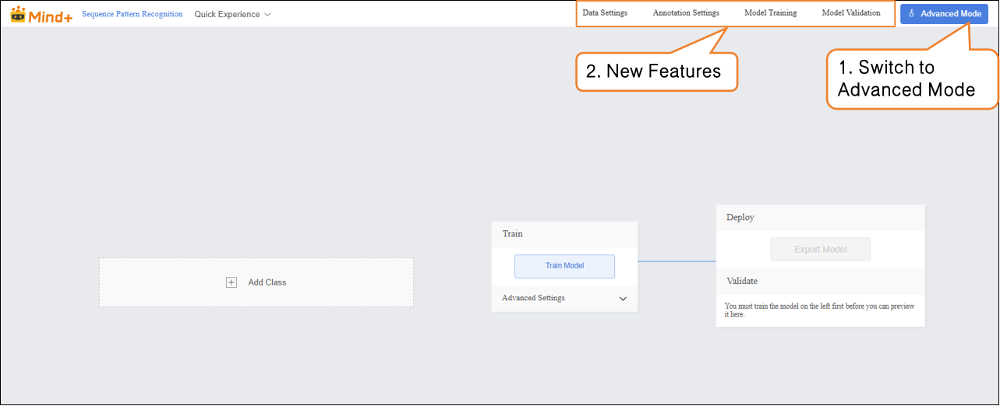

## Data Settings

- Switch to **“Data Settings”** → click the **“Create Dataset”** button in the upper-left corner, and create a dataset named **“K10 Motion Recognition”** as an example.

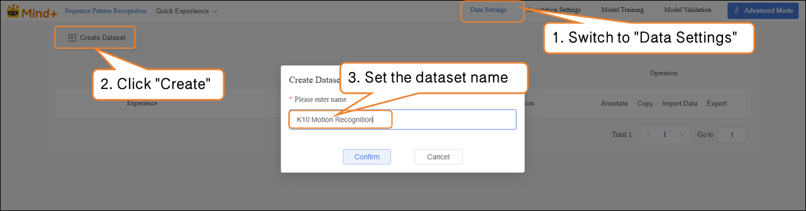

- After switching to Advanced Mode, the dataset list will display a default "Experience" dataset, which is generated from the Quick Experience mode. Users can perform the following operations on newly created datasets: annotation, copy, import data, export, and delete.  

 Note: The default dataset cannot be deleted.  

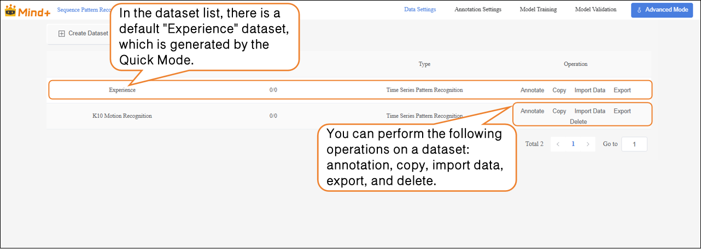

- Next, perform the **Import Data** operation for the newly created Traffic Sign Recognition dataset. The system supports two import methods: **Annotation Data** and **Unannotation Data.**
-  Import Method 1: **Unannotation Data**

- - Suitable for uploading only raw images (e.g., images containing mixed traffic signs such as straight, left turn, right turn, with at least 20 images per category).
  - **Steps:** Select **Unannotation Data** as the import type → Click Click to Upload → Choose images from the local computer → Click Confirm to complete the import.  

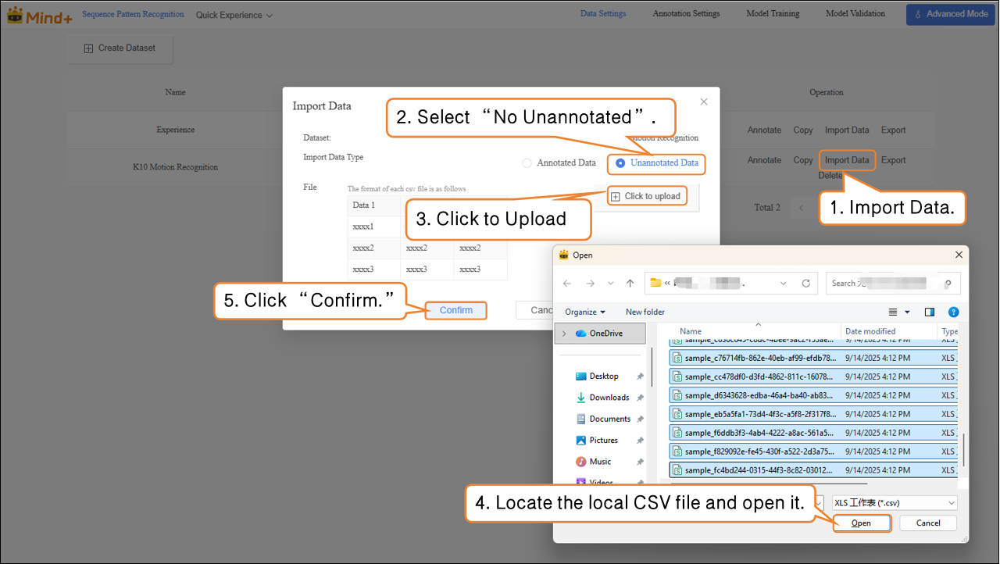

- **Import Method 2: Annotation Data**

- - Directly upload **Annotation Data** in CSV format (as a .zip archive).
  - Organize the folder structure according to platform requirements. After uploading, manual labeling is not required — you can proceed directly to model training.

## Annotation Settings

- After the traffic sign images are successfully imported, the annotation progress bar will simultaneously display the number of imported images and their corresponding annotations.  

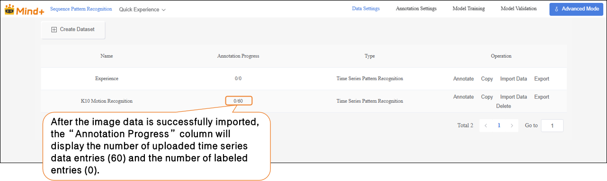

- Click **Annotate** in the **Actions** column to enter the traffic sign annotation settings interface.

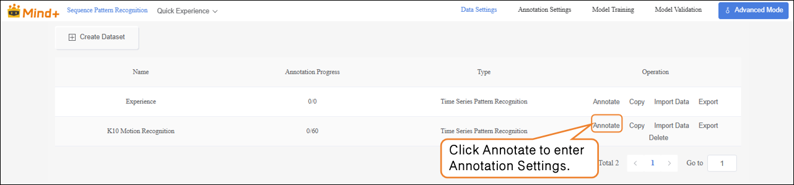

- Follow the on-screen instructions to create labels (**Applause**, **Wave**, **Still**) for annotating different action categories.  

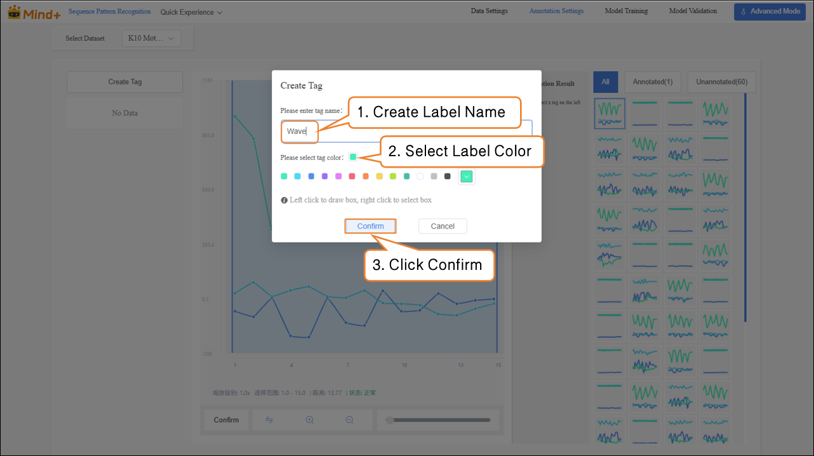

- Next, in the **Temporal Data** area on the far right of the interface, annotate the data one by one:

| **Temporal Data Chart**                                      | **Corresponding Label Name** |
| ------------------------------------------------------------ | ---------------------------- |
| 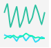 | Applause                     |
| 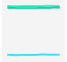 | Still                        |
| 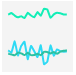 | Wave                         |

- After labeling, a blue **√** will appear at the bottom-right corner of the temporal data, and the labeling results will be shown in the **Annotation Results** column.
  **Note:** All temporal data must be labeled.

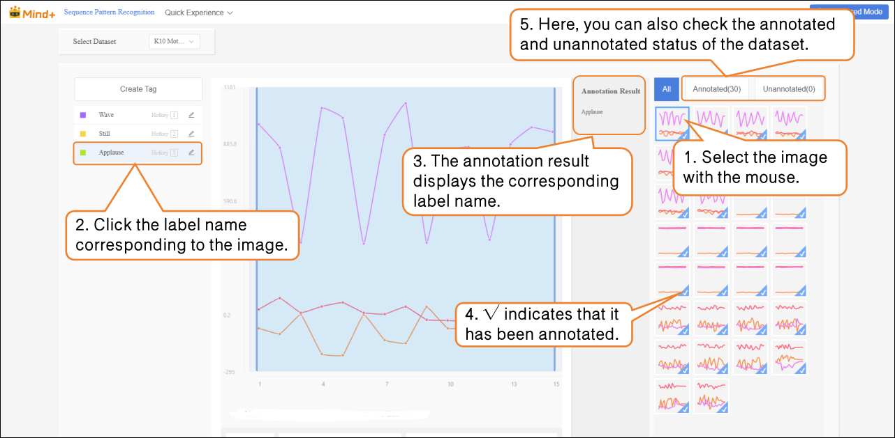

-  Import Method 2: Annotation Data  

- - Directly upload labeled data as a **.zip** archive.
  - Organize the folder structure according to platform requirements. After uploading, manual labeling is not needed — you can proceed directly to model training.  

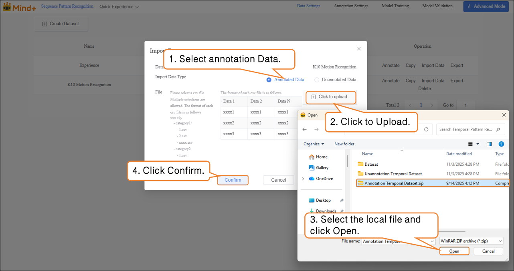

## Model Training

- After all temporal data has been labeled, switch to the **Model Training** module.

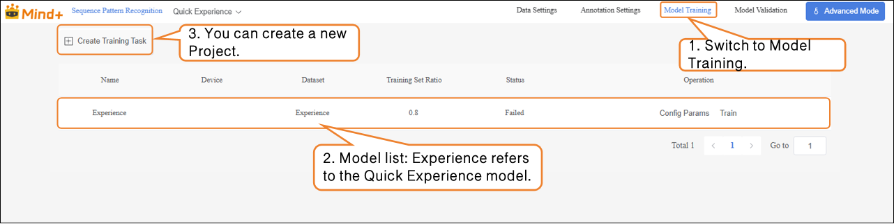

-  Click **Create Training Task**, and in the pop-up window, configure the following settings:  

- - **Name:** K10 Motion Recognition Model (customize as needed)
  - **Device:** Select the corresponding main board (**UNIHIKER K10**)
  - **Dataset:** K10 Motion Recognition (In **Data Settings**, we have created and named the dataset “K10 Motion Recognition”; in **Annotation Settings**, the temporal data labeling and organization are complete. The dataset now has the full structure required for model training. In the next stage, the system will learn temporal features from this dataset, enabling action recognition based on acceleration values. Therefore, select the **K10 Motion Recognition** dataset here.)
  - **Training Set Ratio:** Choose according to your needs (or keep the default).  

| **Training Task Parameter** | **Purpose**                                                  | **Description**                                              |
| --------------------------- | ------------------------------------------------------------ | ------------------------------------------------------------ |
| Name                        | Used to distinguish and manage different training tasks; does not affect model performance. | Acts as a label for this experiment, making it easier to review and compare later. |
| Device                      | Specifies which main board to use.                           | Select the device corresponding to the main board in use.    |
| Dataset                     | Indicates which data the model should learn from.            | Acts as the “textbook”; the model learns to recognize different actions from the dataset’s images and labels. |
| Training Set Ratio          | Determines what proportion of the dataset is used for training and validation. | Training set = examples used by the model to learn. Validation set = examples used to test the model’s learning (unseen by the model). |

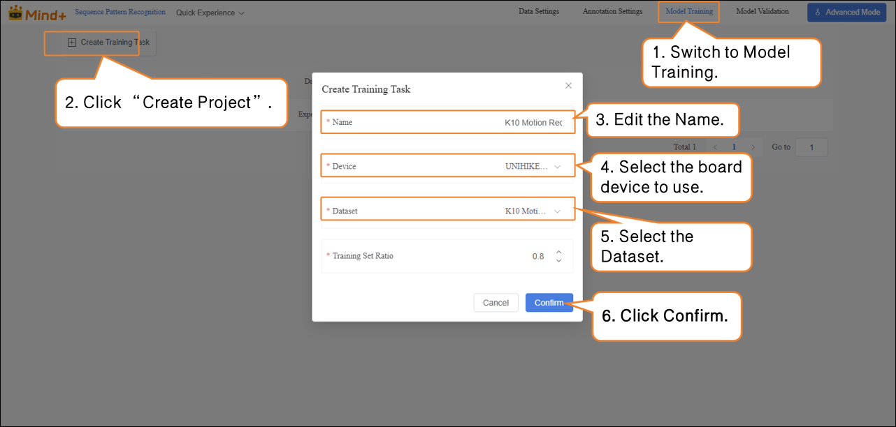

- After the model training task is successfully created, click **Config Params** to enter the training parameter configuration interface. You can adjust the parameters as needed or start training directly with the default settings.
- **Parameters:** Data Time Interval, Epochs, Batch Size, Learning Rate

| Parameter          | Description                                                  | Notes                                                      | Recommended Setting                         |
| ------------------ | ------------------------------------------------------------ | ---------------------------------------------------------- | ------------------------------------------- |
| Data Time Interval | The time interval between two sensor samples. Shorter intervals capture more details but generate more data. | Frequency of recorded actions                              | 100 ms (default, can be adjusted as needed) |
| Batch Size         | Number of data samples sent into the model for training at one time. Large datasets are split into batches to avoid computational overload. Example: default batch size is 16, meaning 16 images are used per training step. | How much content is learned at a time                      | 16 (default)                                |
| Epochs             | One complete pass of all training data through the model is called an epoch. Multiple epochs are needed to solidify learning. Example: default is 100 epochs; small datasets can use fewer epochs. | How many times to learn the data                           | 100 (reduce for small datasets if needed)   |
| Learning Rate      | Determines the size of the step taken when updating model parameters. Too large may overshoot the optimum, too small may learn too slowly. | Step size: too big may overshoot, too small slows learning | 0.005 (default)                             |

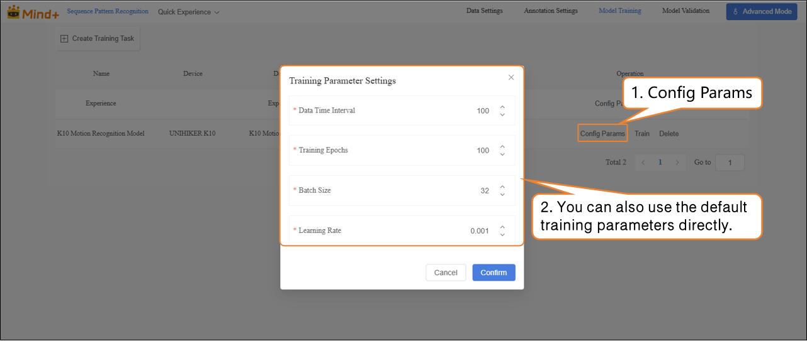

- Click **Train** to start the model training.

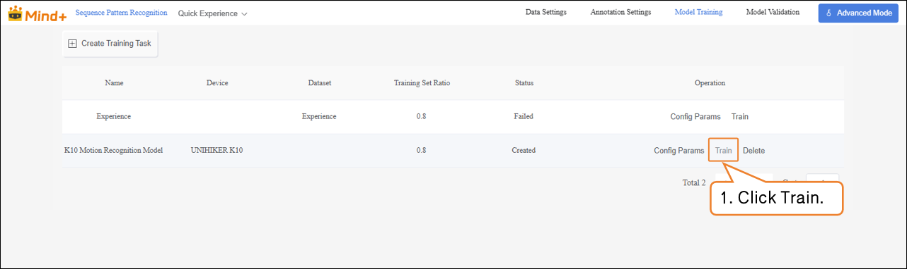

- After training is complete, click **Training Results** in the operation bar to check the model’s key metrics, including the highest validation accuracy, the best validation loss, and the final accuracy and loss values, which are used to evaluate the training performance.

| **Metric Name**          | **Description**                                              | **Interpretation (Simple Understanding)**                    |
| ------------------------ | ------------------------------------------------------------ | ------------------------------------------------------------ |
| Best Validation Accuracy | The highest recognition accuracy the model achieved during training. | Higher is better; indicates the model can accurately recognize training samples. |
| Best Validation Loss     | The lowest loss value obtained on the validation dataset.    | Lower is better; indicates smaller prediction errors on the validation set. |
| Final Accuracy           | The model’s accuracy at the end of the last training epoch.  | If close to the highest accuracy, the training is stable.    |
| Final Loss               | The model’s loss value at the end of the last training epoch. | Lower is better; if significantly higher than the lowest loss, the model may need further training or parameter adjustment. |

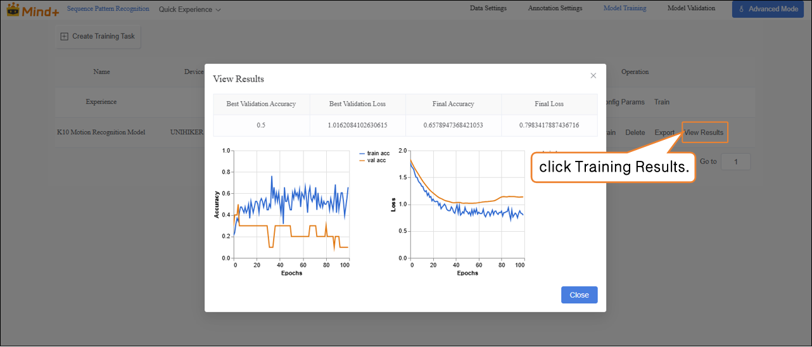

## Model Validation  

- Switch to the **Model Validation** module, select the training project **K10 Motion Recognition**, and choose the model **model.pt**.

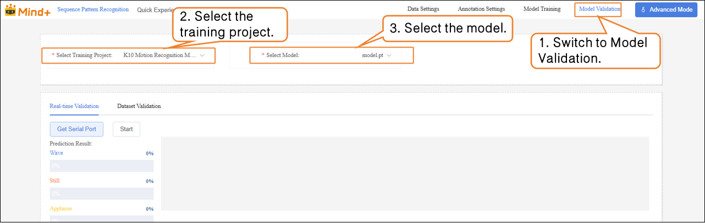

- In **Real-Time Validation**, first click **Get Serial Port**, and select the corresponding UNIHIKER K10 serial port device.

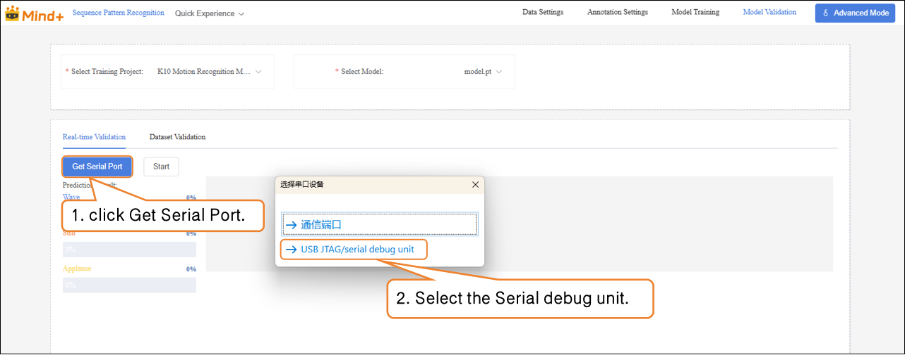

- After the device is successfully connected, click **Start** to perform action recognition and output the corresponding prediction results based on the temporal data.

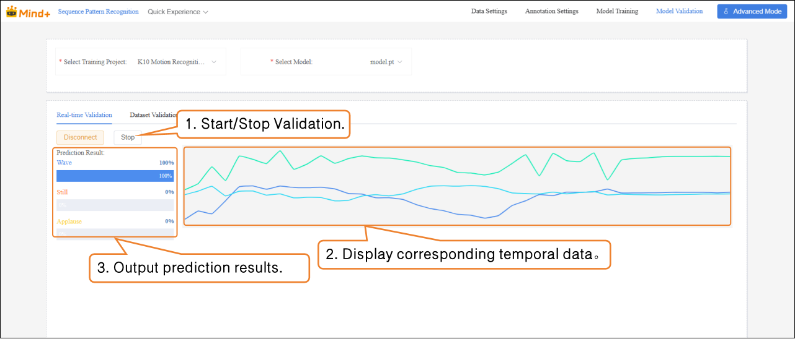

## Model Export  

- When the model test results meet your requirements, switch to the **Model Training** module to export the model.  

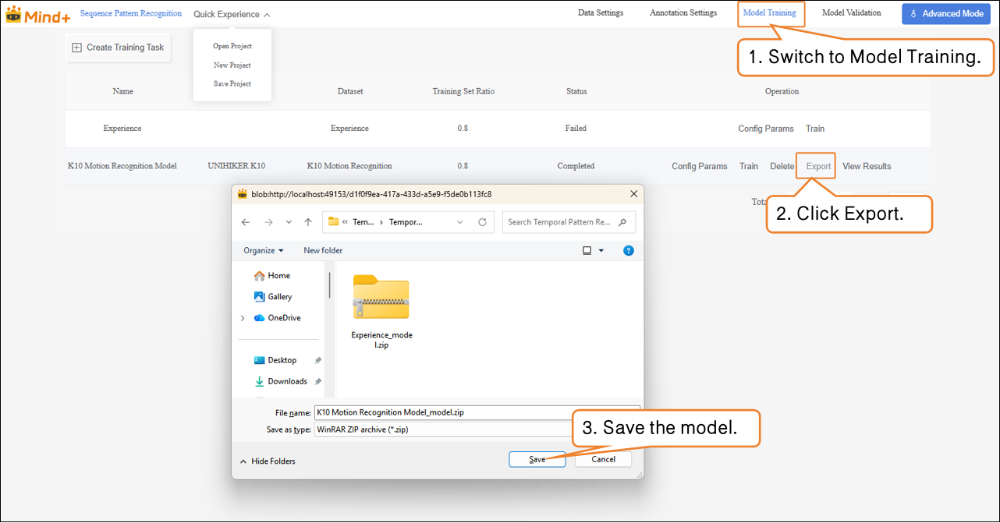

The exported model can be used for deployment. To learn how to operate model deployment, you can refer to Section [4.1.4 Model Deploy.](https://www.yuque.com/joanna-rqvih/ilxuhv/aepmmgw4s77247vi)

## **Common Issues**

| Issue                                                     | Possible Cause                                               | Solution                                                     |
| --------------------------------------------------------- | ------------------------------------------------------------ | ------------------------------------------------------------ |
| Poor model training performance, low recognition accuracy | Insufficient data, incomplete coverage of action sequences Labeling not precise, contains errors or ambiguities High similarity between actions, unclear features | Increase samples with varying speed and intensity Check and correct labeling Adjust training parameters (increase epochs / optimize learning rate) |
| Unstable real-time recognition results                    | Sensor sampling frequency inconsistent with training Large differences in test action amplitude or speed | Keep sampling settings consistent with training Add training samples with varying amplitude and speed to improve generalization |
| Errors or unrecognized data import                        | Dataset naming or structure does not meet requirements Missing or incorrectly formatted annotation files | Check annotation file completeness and format; refer to example dataset |
| Confusion between stillness and slight movements          | Insufficient collection of still data, incomplete coverage Slight movements have features similar to stillness | Increase still samples in different postures Clarify data collection standards and ensure labeling accuracy |