Taking the UNIHIKER K10 Motion Recognition case as an example, this Quick Experience guide demonstrates how to use time-series data from an accelerometer to perform pattern training and recognition. This case mainly showcases the practical application of temporal pattern recognition: the model can distinguish between different motions based on three-axis acceleration data and recognize real-time sensor inputs, helping users intuitively understand the fundamental principles and practical value of temporal pattern recognition.

**Effect:**
By collecting and training the accelerometer’s x, y, and z axis data, the model can recognize different motion patterns such as clapping, waving, and staying still. The recognition results will be displayed on the screen in the form of labels.

###  Coding  

#### **Step 1: Create a New Project**

- Open Mind+, select “New Project” from the menu bar, then click “Coding”.
  Choose “Upload Mode” and click to complete the project creation.  

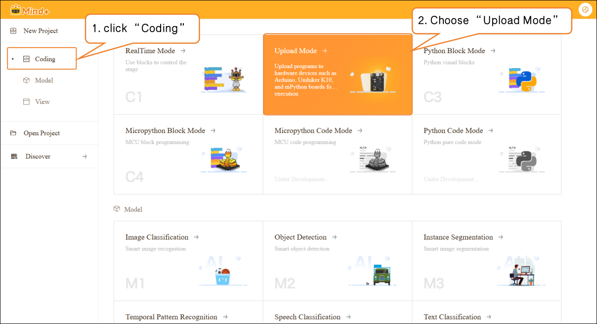

#### Step 2: Add Board

- Click **Extensions**, then find **UNIHIKER K10** under **Main Board** and download it. After the download is complete, click **UNIHIKER K10** to load the main board. Once the main board is successfully loaded, click **Return** to switch to the coding interface.

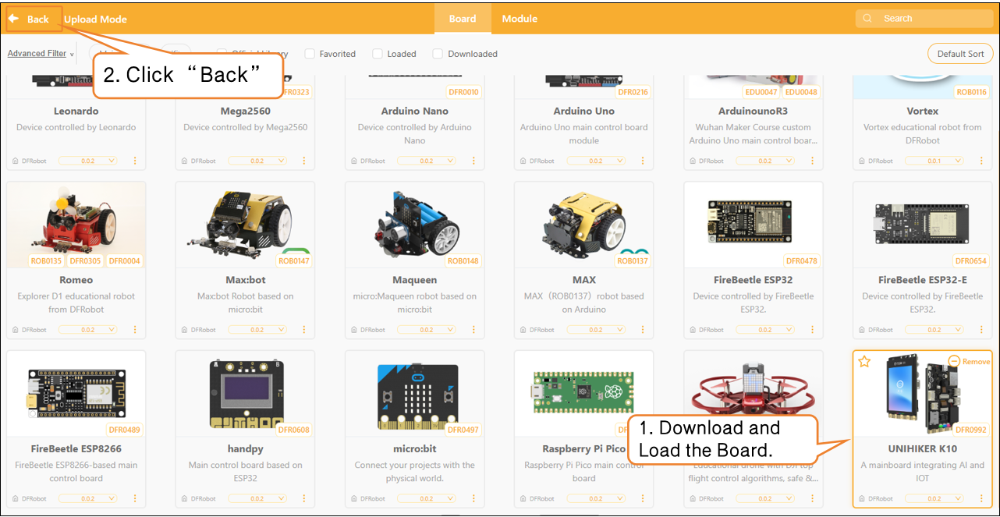

#### Step 3: Programming

- Use the built-in accelerometer on the UNIHIKER K10 to collect real-time three-axis data (x, y, z). Set the sampling interval to 0.2 s (i.e., 20 Hz) and output the acceleration data via the serial port.
  **Note:** Separate the output characters with commas (,) in English input mode.

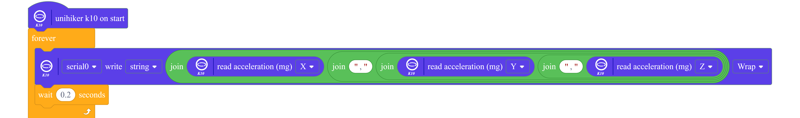

#### Step 4: Upload the Program

- Click **Connect Device**, select the detected **UNIHIKER K10** port, and complete the connection.

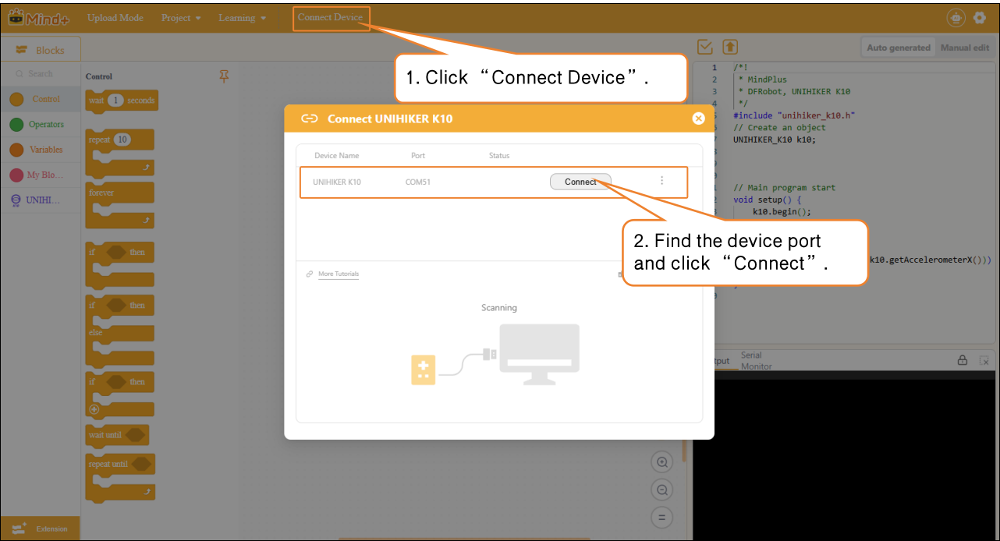

- After the device is successfully connected, click Run and wait for the program to finish uploading.

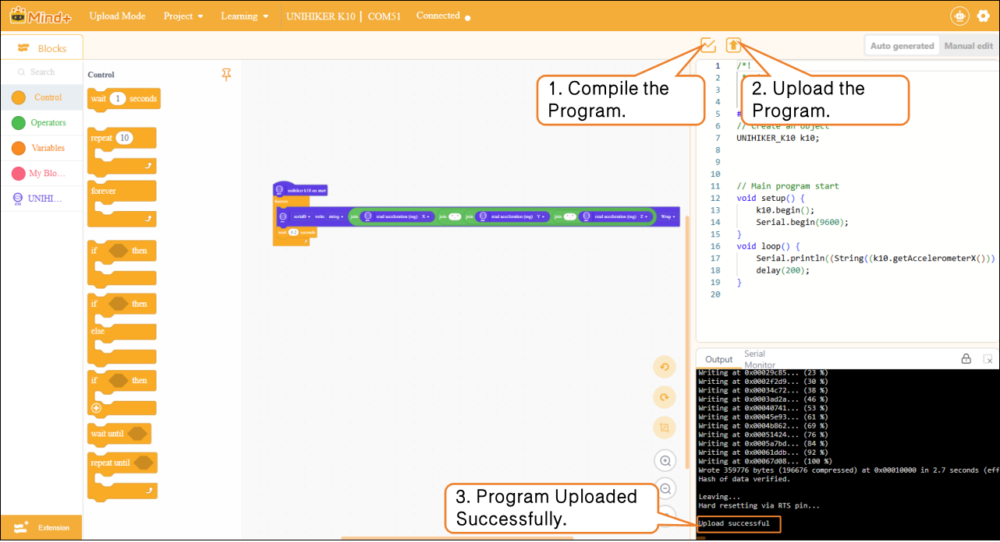

- After the program is successfully uploaded, disconnect the device promptly to avoid serial port conflicts when adding sample data.

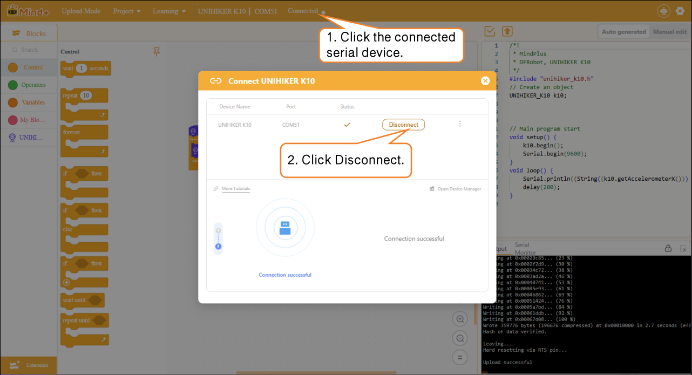

### Model Training

#### Step 1: Create a New Project

- Click the **Home** icon to return to the Mind+ homepage. In the menu bar, select **Create New Project**, then click **Model**. In the training options, find **Temporal Pattern Recognition (M4)** and click it to create the project.

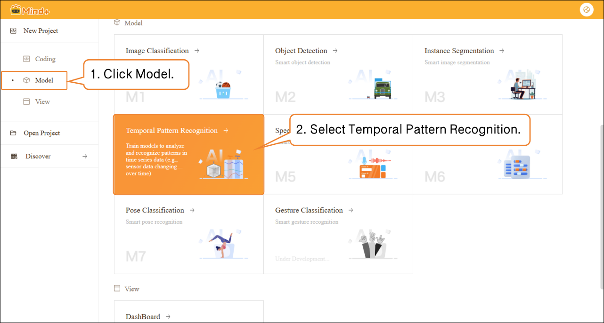

- After the project is successfully created, it will navigate to the new **Temporal Pattern Recognition Quick Experience** interface.

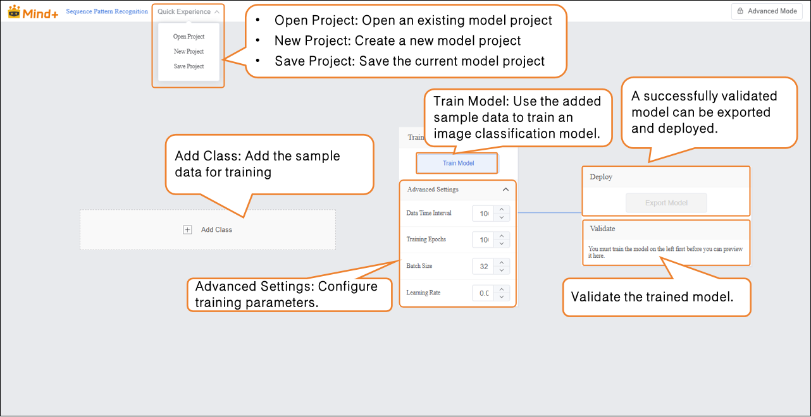

#### Step 2: Add Sample Data

- Click the **Add Class** button to create the required categories for the image classification task. Users can add multiple categories according to the project requirements for subsequent data collection and model training.

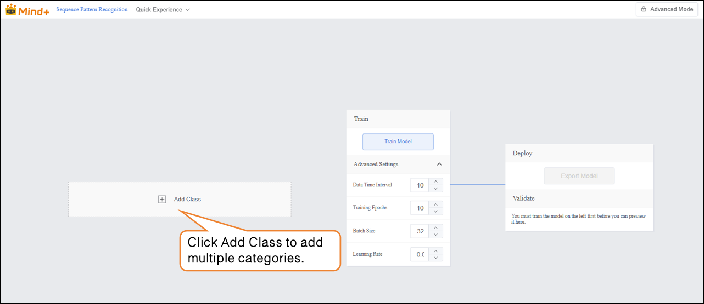

- After creating the categories, sample data can be added in the following two ways:

- - **Collect:** Collect real-time data directly via the serial port.
  - **Upload:** Import prepared data files, supporting batch addition and management.

- Using these two methods, users can efficiently and flexibly build a dataset, laying the foundation for model training.

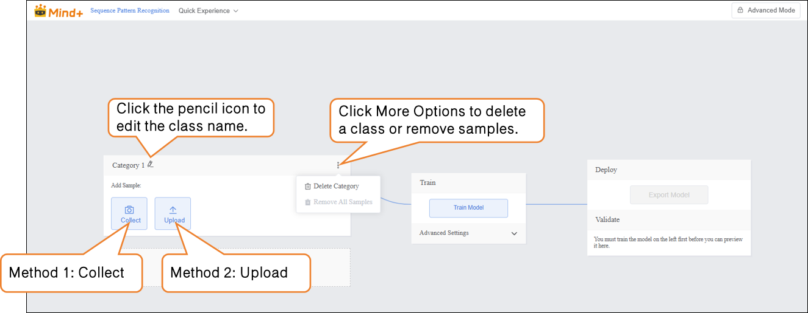

- Sample Addition Method 1: Collect

- - Click **Collect**, then in the serial port section, click **Get Serial Port**. In the pop-up **Select Serial Port Device** window, choose the serial debug unit.

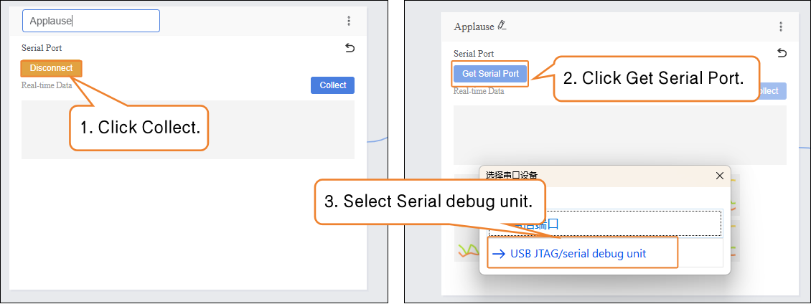

- Once the development board is successfully connected via the serial port, click **Collect** to start real-time data acquisition. In the **Real-Time Data** interface, you can see a continuously updating line chart, visually showing the temporal changes of the sensor output.
- Do not disconnect the UNIHIKER K10 from the computer during data collection.
- During data collection, hold the UNIHIKER K10 and perform the corresponding actions.
- It is recommended to collect at least 10 samples, keeping the actions consistent during data collection.
- The duration of each sample collection is best controlled within 3–5 seconds.

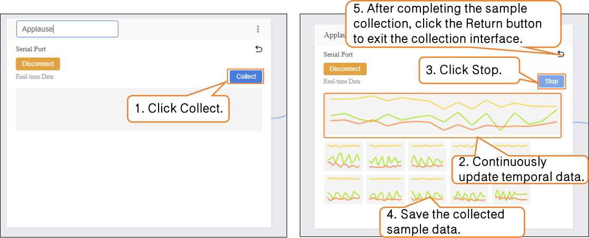

- 样本添加方式2：上传

- - 点击“添加类别”，新建另一类别（如“挥手”）→ 点击 “上传”，选择电脑本地csv数据批量导入。

这种方式，适合有对应的csv文件，才能完成数据样本添加。

提供简单的鼓掌、挥手、静止的csv文件供大家体验上传的操作。

- Sample Addition Method 2: Upload

- - Click **Add Class** to create a new class (e.g., “Wave”) → Click **Upload** and select local CSV files on your computer for batch import.

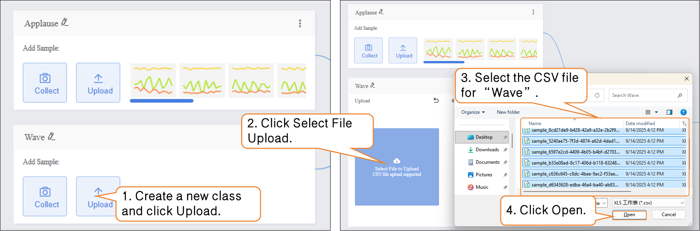

- After the data upload is complete, click Return to exit the data upload interface.

Next, you can choose either of the above data addition methods to add sample data for the “Still” class.

#### Step 3: Train Model

- Before training the model, click **Advanced** to set training parameters such as Data Time Interval, epochs, batch size, and learning rate.

| Parameter          | Description                                                  | Notes                                                      | Recommended Setting                         |
| ------------------ | ------------------------------------------------------------ | ---------------------------------------------------------- | ------------------------------------------- |
| Data Time Interval | The time interval between two sensor samples. Shorter intervals capture more details but generate more data. | Frequency of recording actions                             | 100 ms (default, can be adjusted as needed) |
| Batch Size         | The number of data samples sent into the model for training at one time. Large datasets are split into batches to avoid computational overload. Example: default batch size is 16, meaning 16 images are used per training step. | How much content is learned at a time                      | 16 (default)                                |
| Epochs             | One complete pass of all training data through the model is called an epoch. Multiple epochs are needed to solidify learning. Example: default is 100 epochs; small datasets can use fewer epochs. | How many times to learn the data                           | 100 (reduce for small datasets if needed)   |
| Learning Rate      | Determines the size of the step taken when updating model parameters. Too large may overshoot the optimum, too small may learn too slowly. | Step size: too big may overshoot, too small slows learning | 0.005 (default)                             |

- After completing the training parameter settings, click **Train Model** to start training (if no settings are adjusted, the system default parameters will be used).

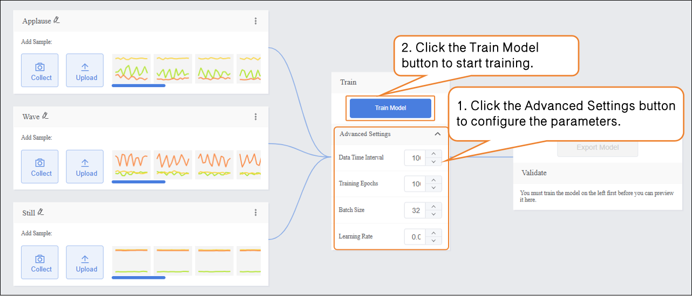

#### Step 4: Model Validation

- After the model training is complete, test the model in the validation area. Hold the UNIHIKER K10 and perform actions, observing whether the output matches the actual actions to evaluate the model’s accuracy.

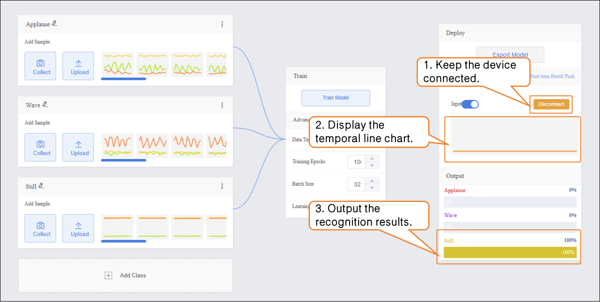

#### Step 5: Real-Time Result Push

##### Environment Preparation

- After validation, the model can push prediction results in real time. Real-time result push uses MQTT for wireless network transmission, so the computer’s actual IP address must be entered. The procedure is as follows: first, start the data transfer tool (run the .bat batch file), then obtain the computer’s IP address.
- Do not close the transfer tool during operation.

SIoT Tool Download Links:

- Tencent Weiyun (recommended): https://share.weiyun.com/6SFhgLQj
- Baidu Cloud: https://pan.baidu.com/s/17clVjJXWTZh02FteKy3mcA?pwd=mind (Access code: mind)
- Aliyun Drive: https://www.aliyundrive.com/s/tCqwJwGtZzL (Access code: 3h4x)
- Google Drive: [Click to download](https://drive.google.com/drive/folders/16Lf0itQ-v2oZrUJEFHrOhjfgS68eN6bn)

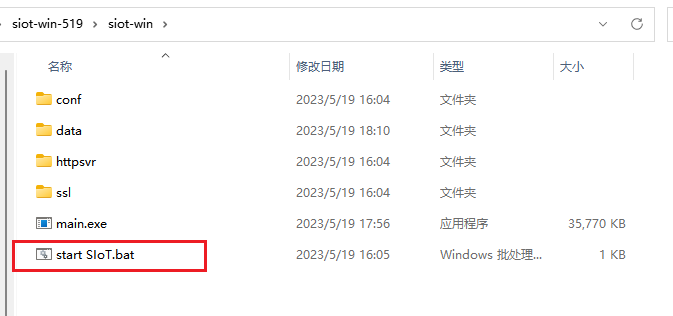

##### Programming

- Add the main board and extension libraries

- - Create a new program to receive real-time results. Go to the homepage, and in **Coding**, select **Upload Mode**.

- - Add Board: Click **Extensions**, then under **Board**, add the main board **UNIHIKER K10**.

- - Add Extension Libraries: Click “Extensions,” then in the search box of “Model,” enter “Wi-Fi” and “MQTT” separately, download and add them.

- **Program Example**
- Receive real-time result messages pushed to MQTT and analyze the MQTT messages. If the MQTT message is **Applause**, the RGB light on the UNIHIKER K10 displays red; if the MQTT message is **Wave**, the RGB light displays blue; if the MQTT message is **Still**, the RGB light displays yellow.

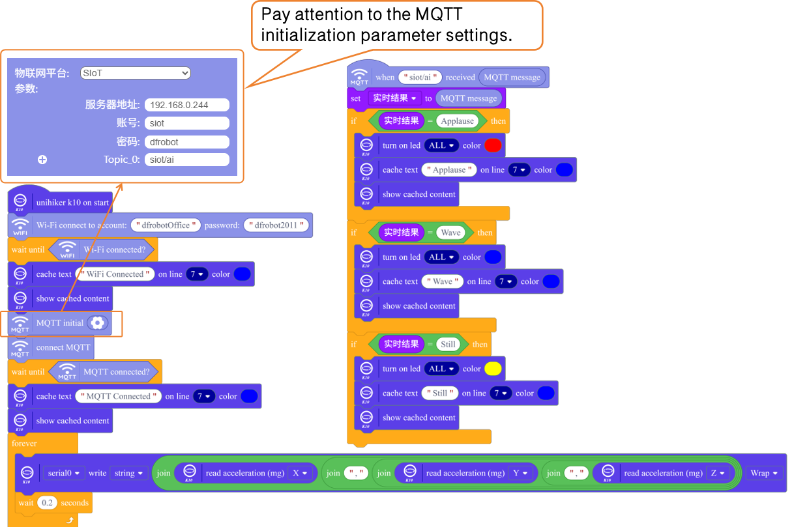

- - After the program is uploaded, disconnect the device.

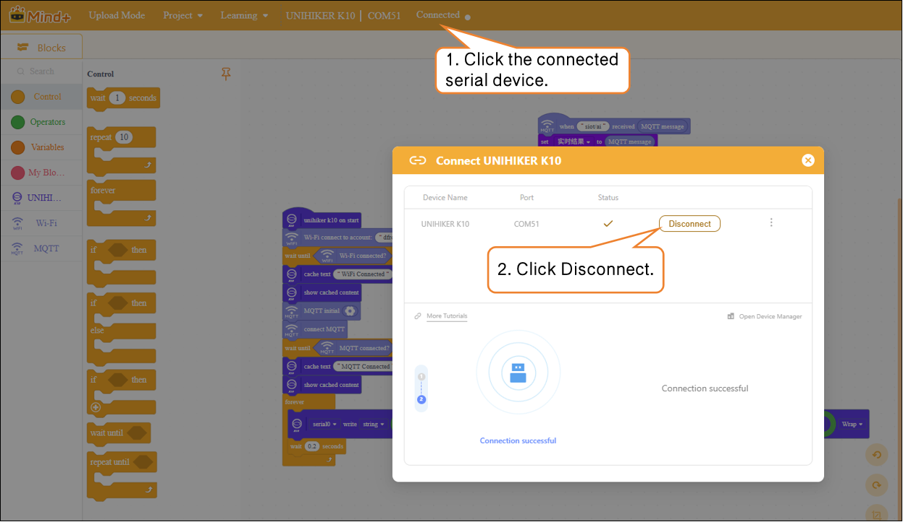

##### Real-Time Result Push

- Click **Real-Time Result Push**. In **Real-Time Server Settings**, change the MQTT server address to the local IP address (can be found in the data transfer tool).
- The result push here refers to the model prediction results pushed by the system after **Step 4: Model Validation** is successful.

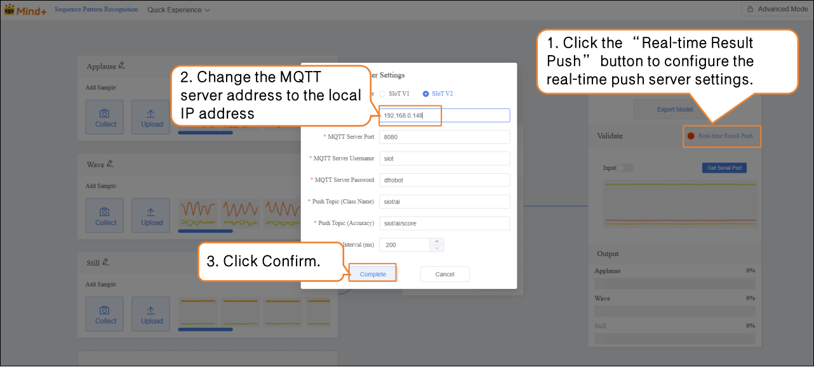

- - Once the server is successfully connected, the **Real-Time Result Push** button turns green.

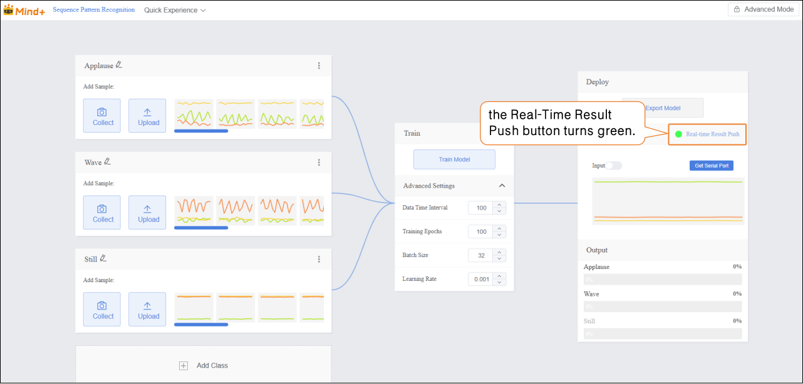

- - Click **Get Serial Port Device** to start action recognition and enable real-time result push.

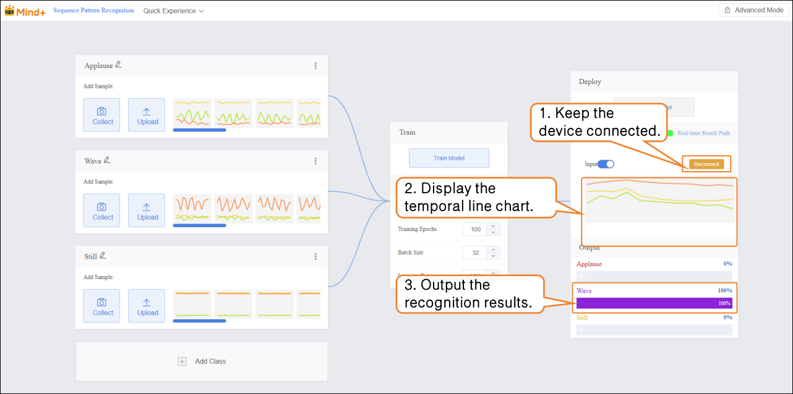

##### Testing and Running

| Real-Time Result Push                                        | UNIHIKER K10 Performance                                     |
| ------------------------------------------------------------ | ------------------------------------------------------------ |
| 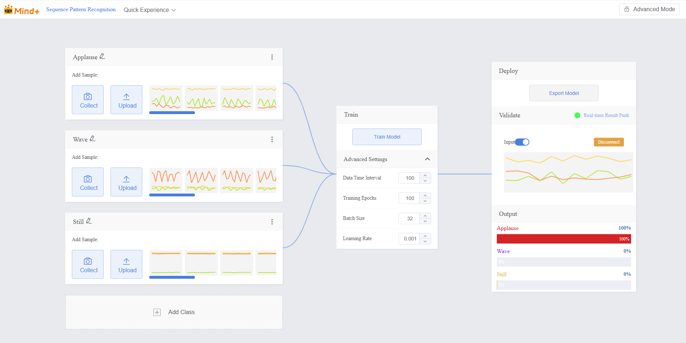 | 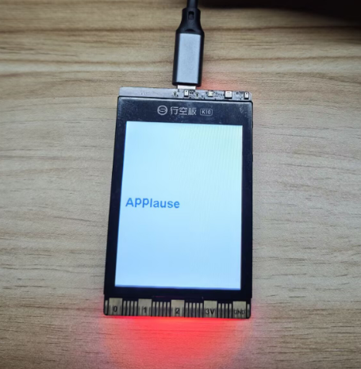 |
| 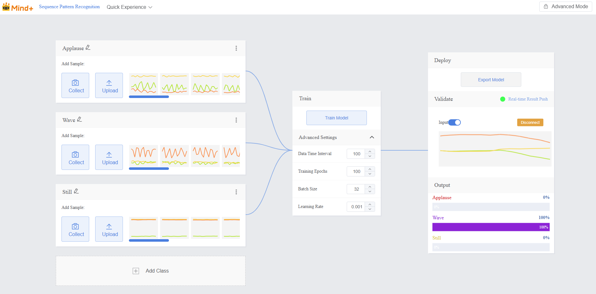 | 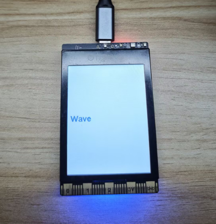 |
| 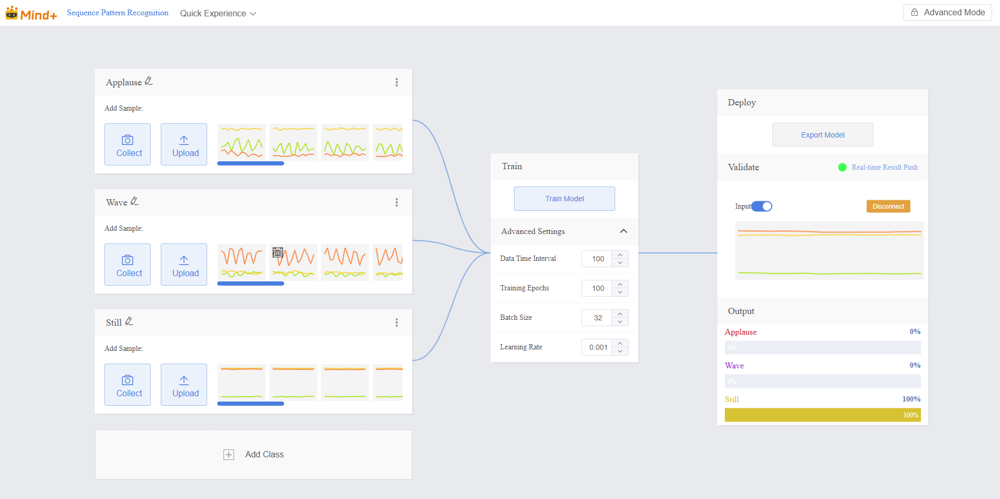 | 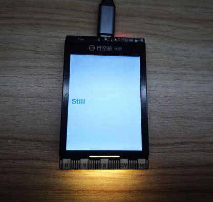 |

#### Step 6: Model Deploy

-  Once the model validation results meet the requirements, you can proceed to deployment

- - “Deploy” → Click “Export Model”.
  - The platform supports exporting the model in ONNX format, making it easy to use in other environments or for secondary development.

Tip: ONNX is an open model format that can run across various deep learning frameworks and devices. This allows you not only to test on the platform but also to apply the model in real projects.  

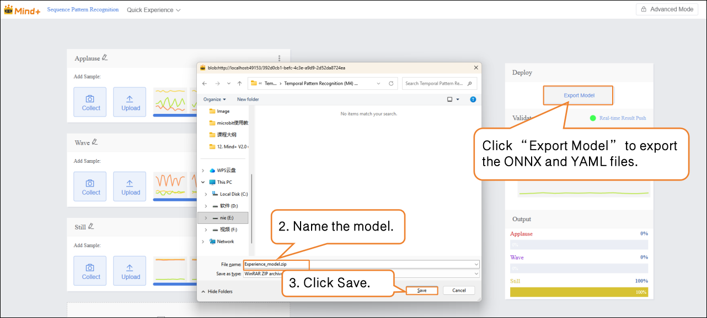

For instructions on model deployment and real-time result push, please refer to section [4.1.4 Model Deploy](https://www.yuque.com/joanna-rqvih/ilxuhv/aepmmgw4s77247vi) & [4.1.5Real-Time Result Push.](https://www.yuque.com/joanna-rqvih/ilxuhv/ph3e9rp4q7c7x1oe)

## Common Issues in Model Training  

| Common Issue                       | Possible Cause                                               | Solution                                                     |
| ---------------------------------- | ------------------------------------------------------------ | ------------------------------------------------------------ |
| Insufficient sample data           | Too few samples collected for each action, making it difficult for the model to learn action features. | Collect at least 10–30 samples per action; more for complex actions. |
| Inconsistent actions or high noise | Large differences in action amplitude, speed, or posture.    | Keep actions consistent during collection; minor variations are acceptable. |
| Unreasonable sampling interval     | Interval too long misses action details; too short increases data volume and computational load. | Typically set around 100 ms; adjust based on action speed.   |
| Low recognition accuracy           | Too few samples, noisy actions, or unclear features.         | Increase sample quantity, ensure standard actions, or adjust training parameters. |
| Real-time recognition delay        | Low sampling rate, slow data transmission, or model inference speed. | Increase sampling rate, optimize the model or hardware performance. |
| Large validation action error      | Actions performed during validation differ from training actions. | Keep validation actions consistent with training in amplitude and speed. |