# Model Training and Inference Library

This document will explain how to use the model training and inference library in Python mode within the Mind+ programming software to load and apply models you have trained yourself in the Mind+ model training module, and how to build a complete AI project application in conjunction with a host device (such as the UNIHIKER M10).

Using this library, users can deploy their self-trained image and time-series models to real hardware environments to implement a variety of AI applications—including image classification, object detection, instance segmentation, and Temporal Pattern Recognition—and complete the entire practical workflow from model training to project deployment.

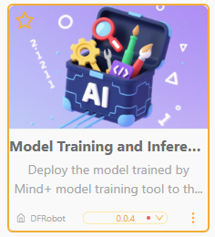

# Feature Overview

Using the model training and inference library, users can load image classification models, object detection models, instance segmentation models, and temporal pattern recognition models that have been trained in the Mind+ model training module. In the Python mode of the Mind+ programming software, they can perform inference and analysis on input data and obtain corresponding recognition results, such as category IDs, label names, confidence scores, and segmentation results.

Using this library, users can not only quickly apply their self-trained models to real-world projects—such as image classification, object detection, instance segmentation, and temporal pattern recognition—but also intuitively understand and experience the entire application workflow, from data input and model inference to result output. Through visualized inference results and interaction with real hardware, it helps students understand the fundamental principles and practical applications of artificial intelligence.

## Preparations

### Hardware Preparation

* a computer
* A webcam (either the one built into your computer or a USB webcam)

### Software Preparation

Install Mind+ version 2.0.4 or later. Click here to view the Mind+ installation guide. For instructions on how to check your software version, see the FAQ.

## Model Preparation

Before creating an AI project using the model training and inference library, you must first train and export the corresponding model in the Mind+ Model Training module.

Users can train models using the various functional modules in the Mind+ model training module—such as image classification, object detection, instance segmentation, and temporal pattern recognition—depending on the project type.

Once model training is complete, please export the model. The exported model file is a compressed archive with a .zip extension.

Unzip the archive. In subsequent projects, you will use the `best.onnx` and `data.yaml` files contained within the archive to perform inference and analysis on image data captured by a camera or time-series data collected by sensors, thereby enabling AI applications such as image classification, object detection, instance segmentation, and time-series pattern recognition.

Please refer to the following tutorial to prepare the appropriate models in advance for use in future projects:

[Tutorial on Training and Exporting Image Classification Models ](../../AITools/Detailed_explanation/image_classification/quick_experience/quick-experience.md)

[Tutorial on Training and Exporting Object Detection Models](../../AITools/Detailed_explanation/object_detection/quick_experience/quick-experience.md)

[Tutorial on Training and Exporting Instance Segmentation Models ](../../AITools/Detailed_explanation/instance_segmentation/quick_experience/quick-experience.md)

[Tutorial on Training and Exporting Time-Series Pattern Recognition Models](../../AITools/Detailed_explanation/time_series_recognition/quick_experience/quick-experience.md)

# Loading the Model Training and Inference Library

This library requires Python version 3.12.7. This model training and inference library has no mandatory hardware platform dependencies and can essentially run in any Python environment that meets the requirements.

If you want to use this library in conjunction with UNIHIKER M10, please refer directly to: How to Use the Model Training and Inference Library with UNIHIKER M10.

If you are using this library solely on a computer or in conjunction with other control hardware, please configure your Python 3.12.7 environment yourself.

Next, we’ll explain how to load this library in Mind+ version 2.0.4 or later.

Open Mind+ version 2.0.4 or later, and click to enter Python mode.

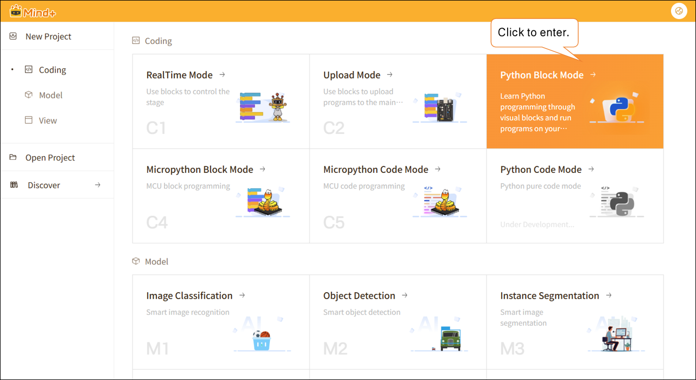

In Python mode, click "Extensions" in the lower-left corner, search for "Model Training and Inference Library" in the search box, and click "Load this library."

Once loading is complete, return to the Python programming page. Click "Model Training and Inference" to find the blocks for this library, as shown below.

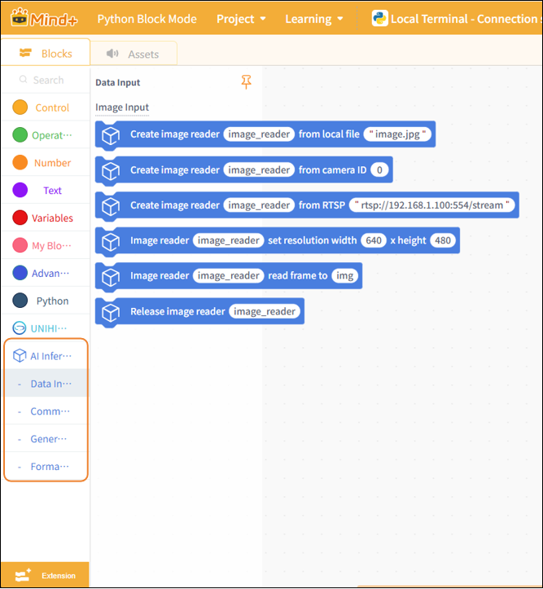

If you are connected to the internet, the required dependencies will be automatically downloaded and installed when you load this library. If you receive an installation failure message, as shown in the figure below, it may be due to an incompatible Python version. Please check whether your system’s Python version is 3.12.7.

## How to Use the Model Training and Inference Library with UNIHIKER M10

The UNIHIKER M10 (system version 0.4.1) comes with a preconfigured and optimized Python environment capable of running this library. If you wish to use this library with the Xingkong Board M10, please follow the tutorial below to load the library.

For instructions on how to check the UNIHIKER M10 system version and update the firmware, see the [FAQ](#frequently-asked-questions) at the end of this document.

**(1) Load the UNIHIKER M10**

Connect the UNIHIKER M10 to your computer via USB, open the Mind+ programming software, and select Python mode under “Programming.”

Click "Extensions" in the lower-left corner to go to the Extensions page, search for "UNIHIKER," download the "UNIHIKER M10" library, and click "Load."

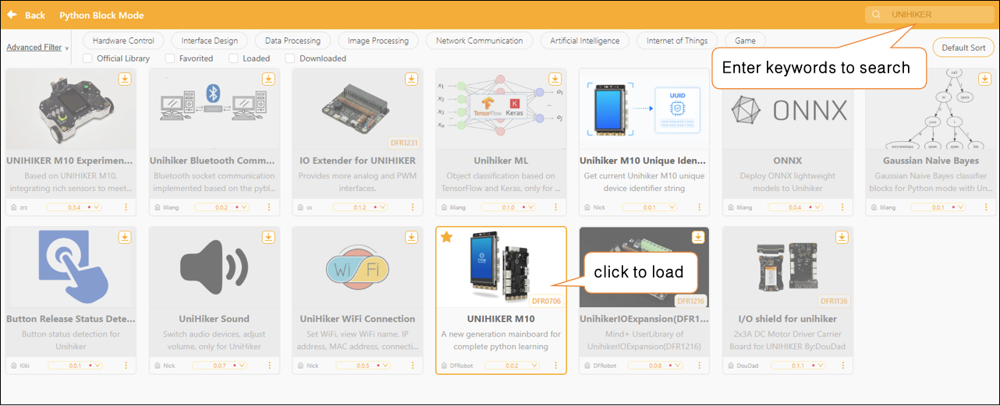

**(2) Switch Python versions**

Return to the programming page, select "Default-10.1.2.3" from the terminal connection options, and wait for the connection to the UNIHIKER M10 to succeed.

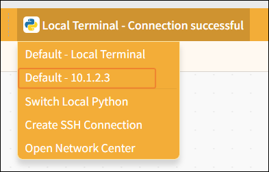

In the terminal, type: `python --version`, then press Enter to check the Python version on the M10 board. See the image below.

If you are not using Python version 3.12.7, enter the following command:

`pyenv global 3.12.7`

to switch to Python version 3.12.7. Once the switch is complete, you can use the command mentioned earlier to check your current Python version.

Note: If you see the message “pyenv: command not found,” it means that pyenv is not included in the current UNIHIKER system firmware. Please first upgrade to the latest system following the instructions in the UNIHIKER M10 tutorial: Click here to view the upgrade tutorial

**(3) Load the model training and inference library**

Once the environment is set up, you can load the Model Training and Inference Library. Click "Extensions," search for "Model Training and Inference Library" in the search box, and click "Load this library."

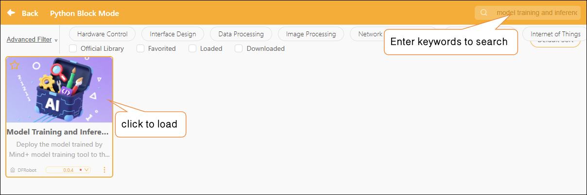

Once loading is complete, return to the Python programming page. Click "Model Training and Inference" to find the blocks for this library, as shown below.

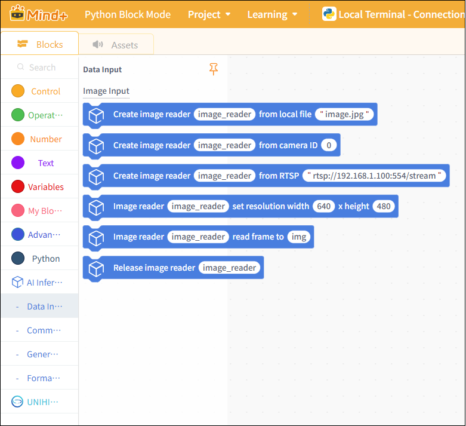

# Usage Instructions

The Model Training and Inference Library provides a set of general-purpose, composable workflows for model inference, enabling the rapid deployment of various types of AI models—such as image classification, object detection, instance segmentation, and temporal pattern recognition—into real-world projects.

When using a model training and inference library, the overall process can be summarized as follows:

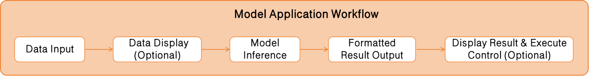

## Module Descriptions

**(1) Data Entry**

The data input module is used to provide the input data required for model inference. Depending on the project type, the input data can take the following forms:

Image Data: Used for image recognition projects. Includes: local image files; real-time images from cameras; RTSP network video streams.

Users can select appropriate data sources as inputs for model inference based on the specific project requirements. The model training and inference library does not require the use of the data input modules provided by this library. As long as the input data type is correct and the format meets the model’s requirements, it can be used as input for inference.

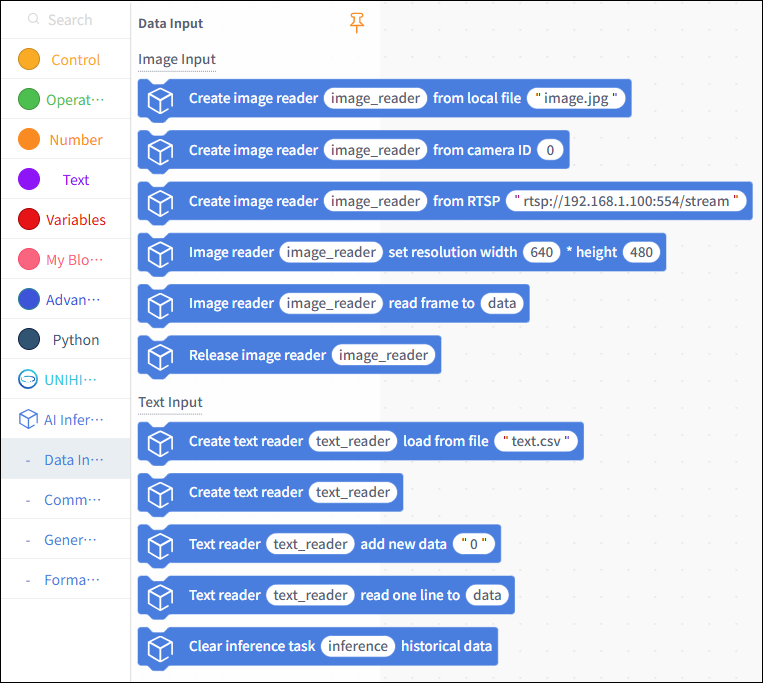

**(2) Common Display**

The Common Display Module is used to display image data. In addition to the image display blocks provided by this library, users can utilize display-related blocks from other libraries—such as OpenCV or UNIHIKER M10—based on their project requirements.

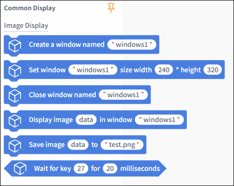

**(3) General Reasoning**

The General Inference Module is the core module of the model training and inference library, unifying the inference execution methods for different types of models. Users can use this module to load models and perform inference, obtaining the raw inference result data output by the model.

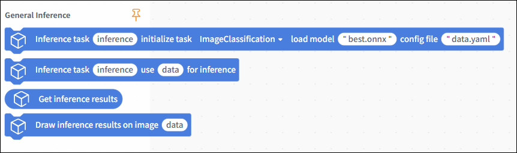

**(4) Formatted Output**

The formatted output module is used to convert the model’s raw inference results into standard data that can be directly used for program logic control, decision-making, and display. The inference results vary depending on the model type.

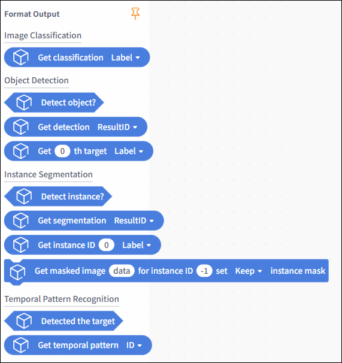

# Image Recognition Projects

In the following section, we will use examples to demonstrate how to use the UNIHIKER M10 in conjunction with a USB camera to deploy image recognition models, perform inference on real-time video captured by the camera, and complete image-related AI projects such as image classification and object detection.

## Hardware Preparation

|  |  | 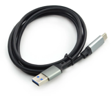 | 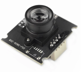 |
| :-----------------------------------------------------------------------------------------------------------------------------: | ------------------------------------------------------------------------------------------------------------------------------- | ------------------------------------------------------------------------------------------------------------------------------- | ------------------------------------------------------------------------------------------------------------------------------- |
|                                                            Computer                                                            | [UNIHIKER M10 (System Version: 0.4.1)](https://www.dfrobot.com/product-2691.html)                                                  | [USB Cable](https://www.dfrobot.com/product-2171.html)                                                                             | [USB Camera](https://www.dfrobot.com/product-2089.html)                                                                            |

## Wiring Diagram

Please refer to the connection diagram below to connect the computer, the UNIHIKER M10, and the USB camera.

### Image Classification Example—Cat and Dog Classification

This example demonstrates how to use the UNIHIKER M10 to deploy a self-trained cat-and-dog image classification model, perform inference on real-time video captured by a camera to classify cats and dogs, and display the recognition results on the UNIHIKER M10.

In this example, the sample model used is a cat-and-dog image classification model. In practice, you can replace the sample model with an image classification model that you have trained yourself or an existing one, while keeping the rest of the code flow the same.

### Sample Program

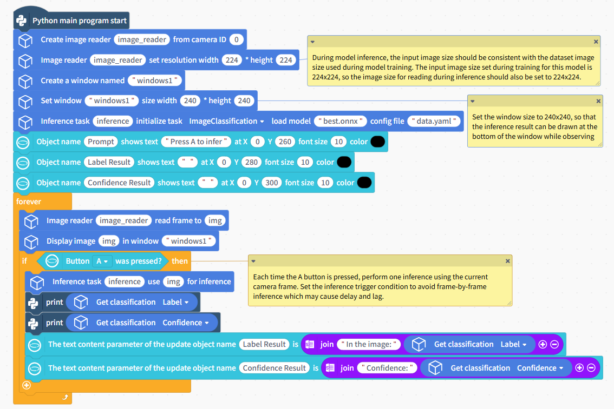

### Uploading Model Files

To use an image classification model, you need to upload the model files. Click "Assets," select "Upload Files," locate the folder containing the exported and unzipped image classification model, select the ONNX and YAML files, click "Open," and complete the model upload.

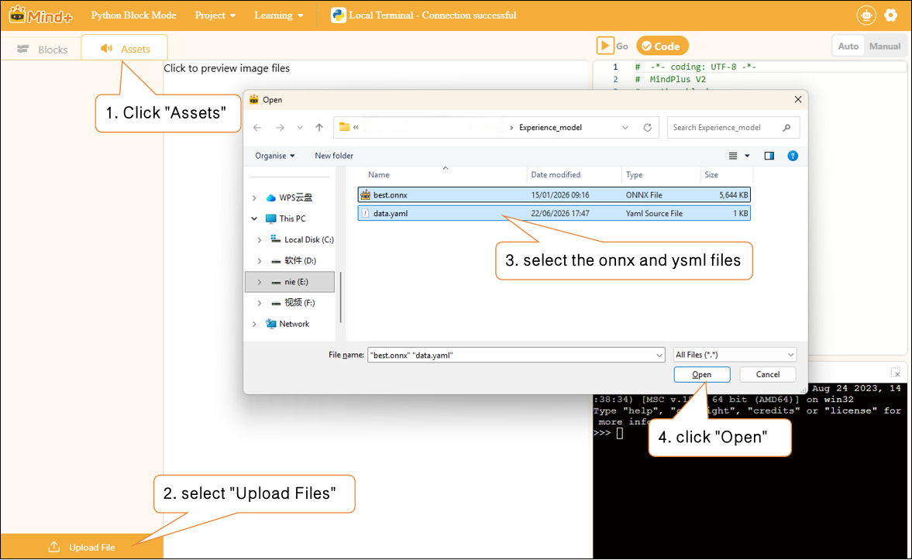

### Runtime Results

After running the program, observe the real-time video feed captured by the camera on the UNIHIKER M10 screen. Point the camera at the image to be classified, follow the on-screen prompts, press the A key, and observe the labels and confidence scores in the image classification model inference results displayed on the UNIHIKER M10.

Search results related to terminal printing.

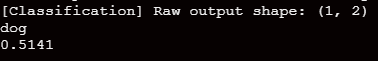

### Object Detection Example—Traffic Sign Detection

This example demonstrates how to use the UNIHIKER M10 to deploy a self-trained traffic sign object detection model, perform inference on real-time video captured by a camera, detect and annotate traffic signs appearing in the video in real time, and output the object detection results.

In this example, the model used is a traffic sign object detection model (which can recognize four types of traffic signs: “Turn Left,” “Turn Right,” “Go,” and “Stop”).

In practice, you can replace the example model with a target detection model that you have trained yourself or one you already have, while keeping the rest of the code flow the same.

### Sample Program

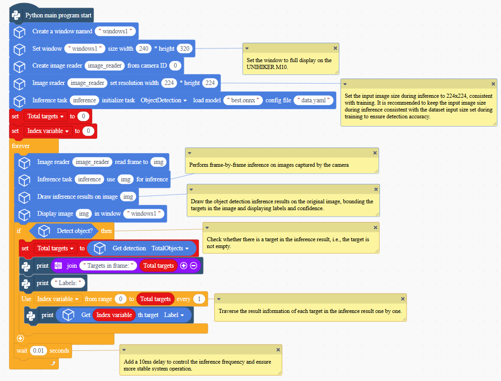

### Uploading Model Files

To use an Object Detection model, you need to upload the model files. Click "Assets," select "Upload Files," locate the folder containing the exported and unzipped image classification model, select the ONNX and YAML files, click "Open," and complete the model upload.

### Runtime Results

After running the program, observe the UNIHIKER M10 screen displaying the real-time camera feed. Traffic signs in the frame are highlighted in real-time with bounding boxes, labels, and confidence values.

Examine the relevant data for each flag detected by the terminal printer.

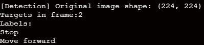

### Example of Instance Segmentation—Flower Instance Segmentation

This example demonstrates how to use the UNIHIKER M10 to deploy a self-trained flower instance segmentation model and perform inference on images captured by a camera. It boxes the flower instances appearing in the images, marks their outlines, and outputs instance segmentation-related data.

In this example, the model used is a flower instance segmentation model (which can recognize various types of flowers and draw their outlines).

In practice, you can replace the example model with a model you’ve trained yourself or an existing instance segmentation model, while keeping the rest of the code flow the same.

### Sample Program

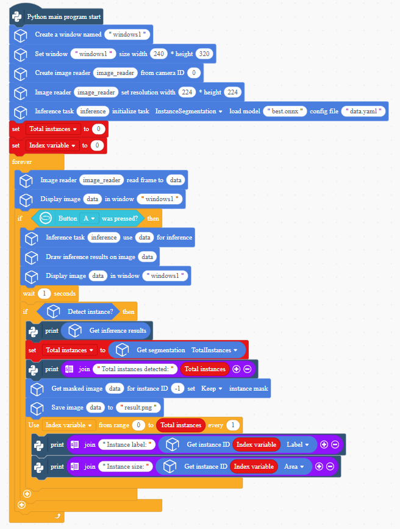

### Uploading Model Files

To use an Object Detection model, you need to upload the model files. Click "Assets," select "Upload Files," locate the folder containing the exported and unzipped image classification model, select the ONNX and YAML files, click "Open," and complete the model upload.

### Runtime Results

After running the program, observe the real-time video feed from the camera displayed on the UNIHIKER M10 screen. Press the A key to perform an instance segmentation inference task, which identifies instances of flowers appearing in the video and marks their outlines within one second.

The terminal prints the segmentation inference results.

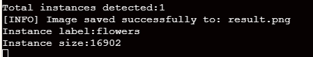

You can find the saved images of the extracted flower outlines in the corresponding program directory for UNIHIKER M10.

### Timeporal Pattern Recognition Projects

## Hardware Preparation

|  |  |  |  |
| :-----------------------------------------------------------------------------------------------------------------------------: | ------------------------------------------------------------------------------------------------------------------------------- | ------------------------------------------------------------------------------------------------------------------------------- | ------------------------------------------------------------------------------------------------------------------------------- |
|                                                            Computer                                                            | [UNIHIKER M10 (System Version: 0.4.1)](https://www.dfrobot.com/product-2691.html)                                                  | [USB Cable](https://www.dfrobot.com/product-2171.html)                                                                             | [USB Camera](https://www.dfrobot.com/product-2089.html)                                                                            |

## Wiring Diagram

Please refer to the connection diagram below to connect the computer, the UNIHIKER M10, and the USB camera.

### Example of Temporal Pattern Recognition—Action Recognition

This project demonstrates how to use a pre-trained temporal pattern recognition model to analyze continuous data collected by the UNIHIKER M10 accelerometer, extract label data from the inference results, and perform motion recognition.

In this example, the model used is a temporal pattern recognition model capable of distinguishing between three states: clapping, tapping, and silence.

In practice, you can replace the example model with a model you’ve trained yourself or an existing time-series data recognition model, while keeping the rest of the code flow the same. For common questions about time-series pattern recognition, see the FAQ at the end of the documentation.

### Sample Program

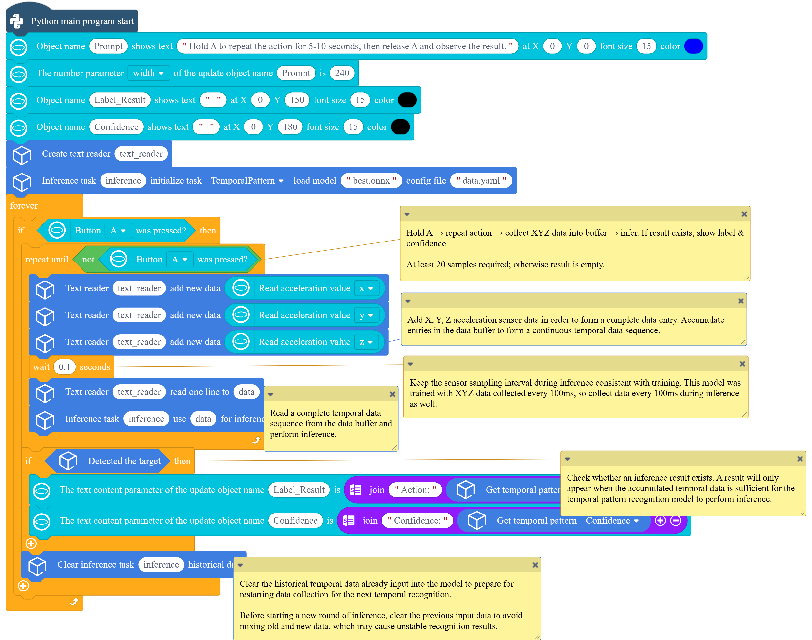

To use an temporal pattern recognition model, you need to upload the model files. Click "Assets," select "Upload Files," locate the folder containing the exported and unzipped image classification model, select the ONNX and YAML files, click "Open," and complete the model upload.

### Runtime Results

fter the program has finished uploading, press and hold the A button on the UNIHIKER M10 with one hand while performing a clapping or tapping gesture. Maintain the gesture for approximately 5 to 10 seconds. Then release the A button. Observe the recognized action label, category ID, and corresponding confidence score displayed on the screen. Repeat the above steps to perform a new round of action recognition.

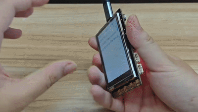

# Block Instructions

| Data Input Blocks                                                                                                               | Feature Description                                                                                                                                                                                                        |
| ------------------------------------------------------------------------------------------------------------------------------- | -------------------------------------------------------------------------------------------------------------------------------------------------------------------------------------------------------------------------- |
|  | Create an image reader object to load image data from a specified local image file for use in the inference of an image recognition model.                                                                                 |
|  | Create an image reader object to capture real-time video data from the camera and provide input for inference by the image recognition model class.                                                                        |
|  | Create an image reader object, connect to a network camera or video stream via the RTSP protocol, and retrieve real-time image data for use in the inference of image recognition models.                                  |
|  | Used to set the dimensions of the input image. When working on image recognition projects, the dimensions of the image input during inference should match the input dimensions of the dataset used during model training. |
|  | The image reader retrieves a single frame from the input source and stores it in the `data` variable, which is then used for model inference.                                                                            |
|  | This is commonly used to free up resources after an image recognition model has completed its inference task.                                                                                                              |
|  | Create a text reader to read plain text files.                                                                                                                                                                             |
|  | Create a text reader.                                                                                                                                                                                                      |
|  | Add new data items one by one to the text reader object. Each time this function is called, a new data item is appended to the end, with each item separated by a comma                                                    |
|  | Read a segment of text from the text reader's buffer and store it in the variable `data` for use in subsequent model inference.                                                                                          |
|  | Clear inference task history data                                                                                                                                                                                          |

| Common Display Blocks                                                                                                           | Feature Description                                                                                                           |
| ------------------------------------------------------------------------------------------------------------------------------- | ----------------------------------------------------------------------------------------------------------------------------- |
|  | Create a window that can be used to display images, camera feeds, and other information.                                      |
|  | Adjusting the window size is typically done after the window has been created.                                                |
|  | Closes the specified window created earlier; this is typically done when the program ends.                                    |
|  | Display the image data stored in the\`data\` variable in the specified window.                                                |
|  | Save the image data stored in the `data` variable as an image file with the specified name.                                 |
|  | To determine whether a specific key has been pressed; the time specified here is the maximum wait time for each listen event. |

| General Inference Building Blocks                                                                                               | Feature Description                                                                                                                                                                                                                                         |
| ------------------------------------------------------------------------------------------------------------------------------- | ----------------------------------------------------------------------------------------------------------------------------------------------------------------------------------------------------------------------------------------------------------- |
|  | Create and initialize the corresponding model inference tasks, such as image classification, object detection, instance segmentation, and temporal pattern recognition. You must specify the paths to the corresponding ONNX and YAML files for each model. |
|  | Enter the data to be inferred and perform an inference for a specified task.                                                                                                                                                                                |
|  | Retrieve the raw inference results data.                                                                                                                                                                                                                    |
|  | Plotting inference results on the original image is commonly used in tasks such as object detection and instance segmentation to display results—such as detection boxes, labels, confidence scores, and masks—directly on the original image.            |

| Formatted Output Block                                                                                                          | Feature Description                                                                                                                                                                                                                                                                                                                                             |
| ------------------------------------------------------------------------------------------------------------------------------- | --------------------------------------------------------------------------------------------------------------------------------------------------------------------------------------------------------------------------------------------------------------------------------------------------------------------------------------------------------------- |
|  | Retrieve the labels and confidence scores from the inference results of an image classification task.                                                                                                                                                                                                                                                           |
|  | Determines whether a target has been detected; returns true if detected, and false if not.                                                                                                                                                                                                                                                                      |
|  | Determines whether a target has been detected; returns true if detected, and false if not.                                                                                                                                                                                                                                                                      |
|  | Retrieve detailed information about the target with the specified index from the inference results of the object detection model, including the label, confidence score, center X coordinate, center Y coordinate, width, and height. Enter the index of the detected target you want to retrieve in the box, starting from 0.                                  |
|  | Determines whether an instance has been detected; returns true if detected, false otherwise.                                                                                                                                                                                                                                                                    |
|  | In an instance segmentation task, the IDs of the detected instances and the total number of instances in a single inference result                                                                                                                                                                                                                              |
|  | Retrieve detailed information about the instance with the specified index from the inference results of the instance segmentation model, including the label, confidence score, bounding box, X-coordinate, Y-coordinate, mask area, and mask bounding box. Enter the index of the detected instance you want to retrieve in the box, starting from 0.          |
|  | Based on the inference results of instance segmentation, configure whether to retain the mask effect on the returned inference image. Specify whether to retain or remove the mask for a particular class by entering its ID.                                                                                                                                   |
|  | Determines whether an inference result exists for a time-series pattern recognition task. If an inference result exists, return True; otherwise, return False. If False is returned, it may be because there is insufficient time-series data, resulting in no inference result. Extend the time-series data collection period and attempt the inference again. |
|  | Retrieve the inference results for a single time-series pattern recognition task. This includes the category ID, category label name, or corresponding confidence score.                                                                                                                                                                                        |

## Frequently Asked Questions

| Q | How do I check the version number of the Mind+ software?                                                                                                                                                                                                                                                                                                                                                  |
| - | --------------------------------------------------------------------------------------------------------------------------------------------------------------------------------------------------------------------------------------------------------------------------------------------------------------------------------------------------------------------------------------------------------- |
| A | Open the Mind+ programming software and click the system settings icon in the upper-right corner. In the system settings panel of Mind+ version 2.0.4 and later, a new section titled "Version Updates" has been added. Click "Version Updates" to view the current version of Mind+. 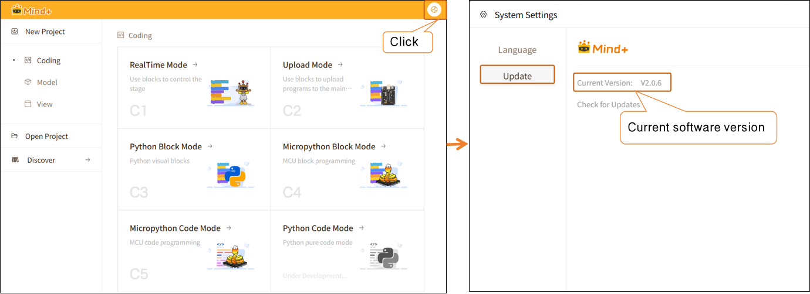 |

**Questions Regarding the UNIHIKER M10**

| Q | How do I check if the system version of the UNIHIKER M10 is 0.4.1?                                                                                                       |
| :- | ------------------------------------------------------------------------------------------------------------------------------------------------------------------------- |
| A | After powering on the UNIHIKER M10, press and hold the Home button to enter the menu. Locate “View System Information” to check the system version of the Xingkong M10. |
| Q | How do I flash version 0.4.1 of the UNIHIKER M10 firmware?                                                                                                                |
| A | UNIHIKER M10 Firmware Logs and Flashing Guide:[Click to View](https://www.unihiker.com/wiki/SystemAndConfiguration/UnihikerOS/unihiker_os_image/)                            |

**Questions Related to Instance Segmentation**

| Q | What is instance segmentation, and what does “instance” refer to here?                                                                                                                                                                                                                                                                                                                                                               |
| - | -------------------------------------------------------------------------------------------------------------------------------------------------------------------------------------------------------------------------------------------------------------------------------------------------------------------------------------------------------------------------------------------------------------------------------------- |
| A | Instance segmentation is a computer vision task that involves identifying and distinguishing each specific object in an image and precisely delineating the pixel regions occupied by each object. An instance refers to a specific individual within a given class. In general, instance segmentation can: identify what something is, distinguish between individual instances, and draw the complete outline of each instance. |

**Issues Related to Temporal Pattern Recognition**

| Q | What is time-series data, and what is time-series pattern recognition?                                                                                                                                                                                                                                                                                                                                                                                                                                                                                                                                                                                                                                                                                                                                                                                                                                                                                                                                                                                              |
| - | ------------------------------------------------------------------------------------------------------------------------------------------------------------------------------------------------------------------------------------------------------------------------------------------------------------------------------------------------------------------------------------------------------------------------------------------------------------------------------------------------------------------------------------------------------------------------------------------------------------------------------------------------------------------------------------------------------------------------------------------------------------------------------------------------------------------------------------------------------------------------------------------------------------------------------------------------------------------------------------------------------------------------------------------------------------------- |
| A | Time-series pattern recognition refers to the use of models to analyze a continuous sequence of time-series data and identify the actions, behaviors, or patterns of change contained within it. Rather than focusing on individual data values, the model comprehensively assesses the overall characteristics of data changes over a period of time to perform recognition and classification. Time-series data refers to data collected continuously in chronological order. Unlike a single image or a single input, time-series data reflects the process of how data changes over time. For example, the X, Y, and Z-axis data continuously collected by the Xingkong K10 accelerometer over a period of time constitute a time-series data set.                                                                                                                                                                                                                                                                                                         |
| Q | The trained temporal pattern recognition model is not performing well and has a low accuracy rate. How can we improve it?                                                                                                                                                                                                                                                                                                                                                                                                                                                                                                                                                                                                                                                                                                                                                                                                                                                                                                                                           |
| A | You can try optimizing in the following areas: (1) Increase the number of training samples and retrain the model. When collecting training data, appropriately extend the duration of each data collection session to capture more complete and stable time-series features. (2) When applying the model, ensure that the data input method remains consistent with that used during the training phase. For example, when conducting a project on time-series pattern recognition using accelerometers, ensure that the orientation of the K10 board is consistent and that the range of motion and execution method are uniform. (3) In practical applications, appropriately extend the input duration for time-series data of the same type. For example, when working on a project involving time-series pattern recognition for accelerometers, repeat the same action for 5–10 seconds to ensure that the model has access to sufficient continuous time-series data during inference, thereby improving recognition stability and accuracy. |

# Recommended Community Projects

| Project Category              | Related Projects                                                                                                   | Project Overview                                                                                                                                                                                                                           |
| ----------------------------- | ------------------------------------------------------------------------------------------------------------------ | ------------------------------------------------------------------------------------------------------------------------------------------------------------------------------------------------------------------------------------------ |
| Image Classification Examples | [Image Classification Based Emotion-Recognition Driving Companion](https://community.dfrobot.com/makelog-318402.html) | Using a camera and the UNIHIKER M10, the system detects the driver’s emotional state—whether they are happy, angry, or drowsy. It ensures driving safety through a three-pronged interactive approach combining text, images, and music. |
| Object Detection Examples     | [Object Detection-Based Self Checkout System ](https://community.dfrobot.com/makelog-318320.html)                     | Turn a compact UNIHIKER M10 into an AI cashier—it can use its camera to recognize products in front of it in real time, automatically label their names, highlight their locations, and quickly calculate the total price.                |
