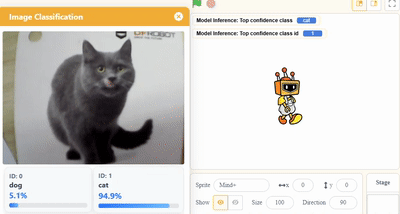
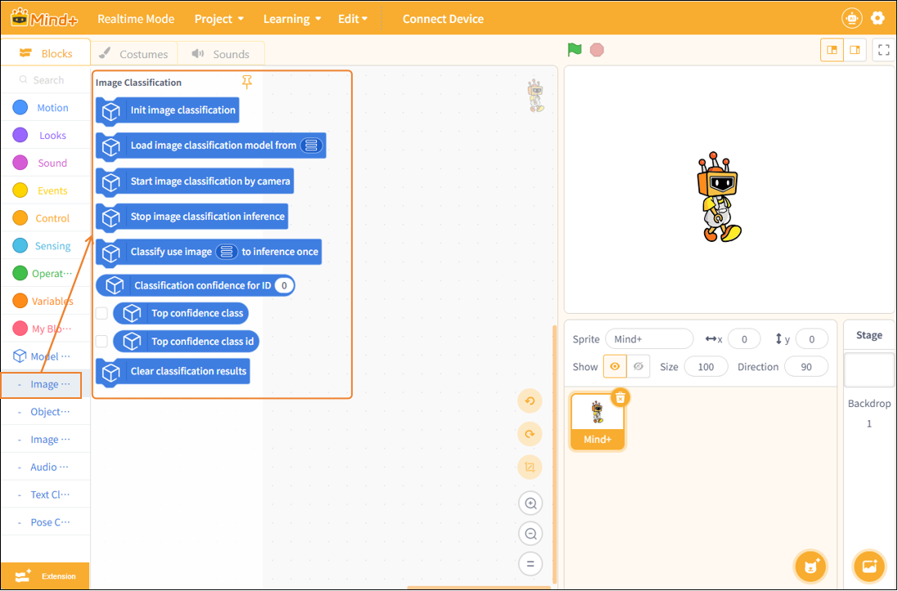
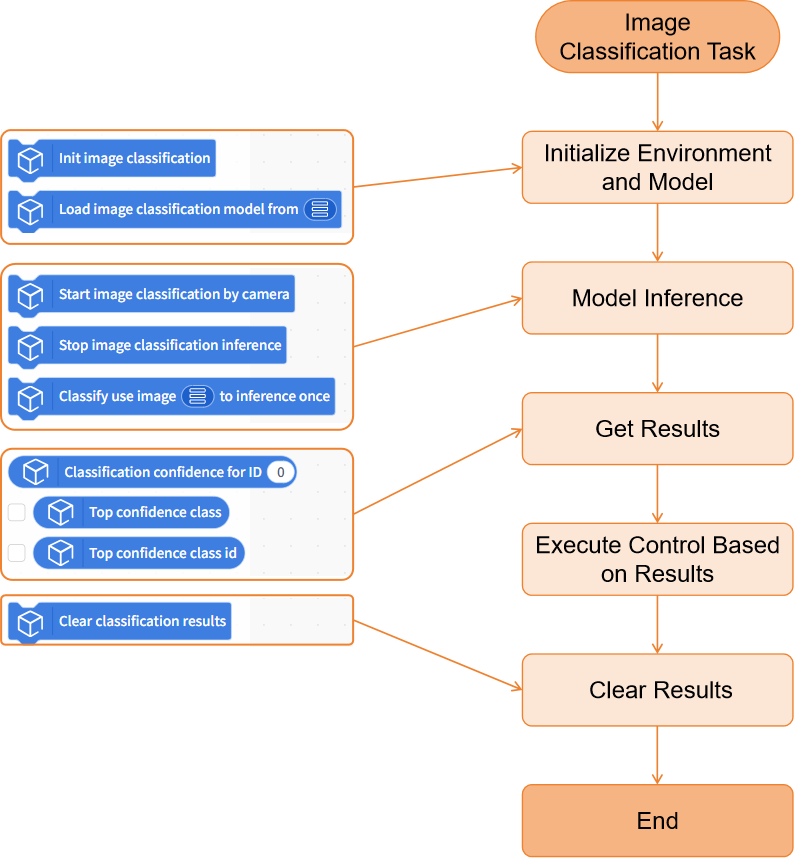
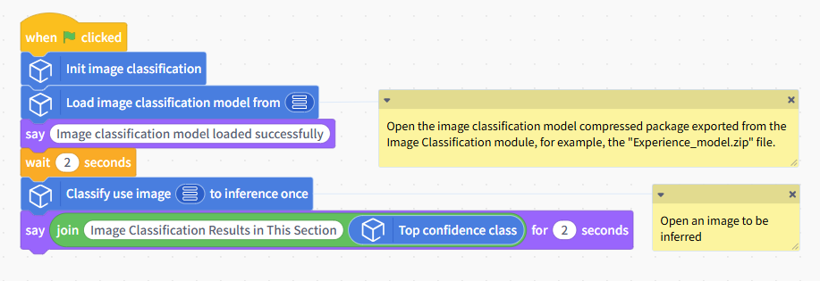
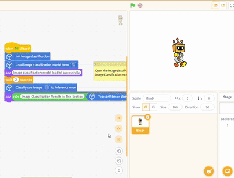
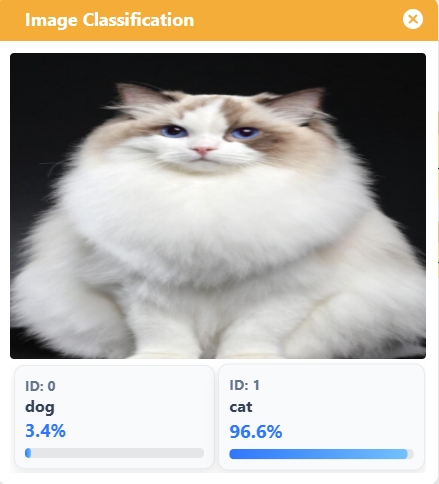
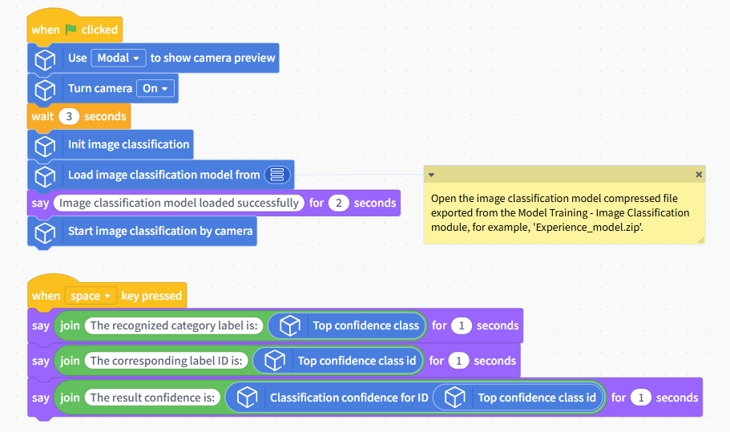
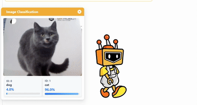

# Image Classification

This document will explain how to use the "Image Classification" module in the Model Training and Inference Library under Mind+ > Programming > Real-Time Mode to apply a self-trained image classification model and complete an image classification project.

## Features

Using the image classification module, users can load pre-trained image classification models to perform inference and classification on local images or camera feeds, and obtain results such as the corresponding category ID, label, and confidence score.

This allows users not only to quickly deploy their self-trained image classification models to create various image classification projects, but also to intuitively understand and experience the entire application process—from image input and model inference to result output.

## Preparations

### Hardware Preparation

* a computer
* A webcam (either the one built into your computer or a USB webcam)

### Software Preparation

Install Mind+ version 2.0.4 or later. Click here to view the Mind+ installation guide. For instructions on how to check your software version, see the FAQ.

### Model Preparation

Before creating an image classification project, you must first train and export an image classification model. You can use the Image Classification module in the Mind+ V2.0 model training tool to train the model and export it for subsequent inference. The exported image classification model is a compressed file with the extension `**.zip`. In subsequent projects, you will use this compressed file directly to load the image classification model and perform inference for image classification tasks.

Please refer to the tutorial below to set up an image classification model for use in the upcoming project.

* Tutorial on Training Image Classification Models: [Image Classification—Training the Model](../../AITools/Detailed_explanation/image_classification/quick_experience/quick-experience.md#step-3-train-model)
* Tutorial on Exporting Image Classification Models: [Image Classification - Model Export](../../AITools/Detailed_explanation/image_classification/quick_experience/quick-experience.md#step-5-model-deploy)

### Load the model training and inference library

Open Mind+ version 2.0.4 or later, and tap to enter "RealTime Mode."

In RealTime mode, click "Extensions" in the lower-left corner, locate "Model Training and Inference " in the Stage Extensions, and click "Load."

Once loading is complete, return to the RealTime programming page and click "Image Classification" under "Model Inference" to find the image classification blocks, as shown below.

### Usage Instructions

### Project 1: Local Image Classification

This project demonstrates how to use a pre-trained image classification model to recognize a local image and obtain the corresponding classification result.

In this example, the sample model used is a cat-and-dog image classification model. In practice, you can replace the sample model with an image classification model that you have trained yourself or an existing one, while keeping the rest of the code flow the same.

## Sample Program

## Runtime Results

After running the program, a window displaying the model's inference results will pop up, showing the confidence scores for each label. The label with the highest confidence score will be used as the final classification result for the image.

## Project 2: Real-Time Image Classification Using a Camera

This project demonstrates how to use a pre-trained image classification model to continuously recognize real-time footage captured by a camera and obtain real-time image classification results.

The model used in this example is the same as the one in Project 1. You can replace it with an image classification model you’ve trained yourself or one you already have; the rest of the code remains the same.

## Sample Program

## Runtime Results

After running the program, a window displaying the model inference results will appear. Once the image classification model has finished loading, the system will continuously perform image classification inference on the real-time footage captured by the camera and display the classification results in the window in real time.

Press the Spacebar to display the image classification results for the current frame, including: the classification label with the highest confidence; the corresponding category ID; and the confidence value for that classification result.

## Building Block Instructions

| Image Classification Blocks                                                                                    | Feature Description                                                                                                                                                                                                                                                                                               |
| --------------------------------------------------------------------------------------------------------------- | ----------------------------------------------------------------------------------------------------------------------------------------------------------------------------------------------------------------------------------------------------------------------------------------------------------------- |
|  | Initialize the image classification task. You must run this block before using any image classification-related blocks.                                                                                                                                                                                           |
|  | Load a pre-trained image classification model file from the local directory for use in image classification inference tasks. The image classification model here refers to a compressed model file trained and exported under the "Model Training - Image Classification" module, such as 'Experience_model.zip'. |
|  | Perform continuous image classification inference on real-time footage captured by the camera.                                                                                                                                                                                                                    |
|  | Stop the image classification inference for the camera feed.                                                                                                                                                                                                                                                      |
|  | Perform an image classification inference on a specified image and display the corresponding recognition result.                                                                                                                                                                                                  |
|  | Retrieves the confidence score corresponding to a specified category ID from the image classification results. Enter an integer starting from 0 for the ID; you can also use an\`int\` type variable.                                                                                                             |
|  | Retrieve the classification label with the highest confidence score from the current image classification results. This is often used directly as the final image classification label.                                                                                                                           |
|  | Retrieve the category ID corresponding to the classification with the highest confidence in the current image classification results.                                                                                                                                                                             |
|  | Clear the currently saved image classification results.                                                                                                                                                                                                                                                           |

| Camera-related Blocks                                                                                           | Feature Description                                                                                                                                                                                                                                                                |
| --------------------------------------------------------------------------------------------------------------- | ---------------------------------------------------------------------------------------------------------------------------------------------------------------------------------------------------------------------------------------------------------------------------------- |
|  | Turn on the camera. If the image is upside down, you can enable the mirroring feature. Some computer cameras take a moment to start up, so you may want to add a few seconds of wait time at the end.                                                                              |
|  | Switch cameras. If your computer is connected to multiple cameras, you can use this block to retrieve the feed from a specific camera. If no camera is detected, try restarting the software or use your computer's built-in camera software to check if the camera is recognized. |
|  | To display the camera feed, you can use a pop-up window or the Object Stage.                                                                                                                                                                                                       |
|  | When displaying a camera feed on the stage, you can use this block to adjust the transparency so that the stage background and the camera feed appear together.                                                                                                                    |
|  | Infer the results in real time and display them on the camera feed.                                                                                                                                                                                                                |
|  | Use the computer's webcam to take a photo and save it to a specified folder on the computer.                                                                                                                                                                                       |

## Frequently Asked Questions

| Q | How do I check the version number of the Mind+ software?                                                                                                                                                                                                                                                                                                                                                   |
| - | ---------------------------------------------------------------------------------------------------------------------------------------------------------------------------------------------------------------------------------------------------------------------------------------------------------------------------------------------------------------------------------------------------------- |
| A | Open the Mind+ programming software and click the system settings icon in the upper-right corner. In the system settings panel of Mind+ version 2.0.4 and later, a new section titled "Version Updates" has been added. Click "Version Updates" to view the current version of Mind+.  |
