# Instance Segmentation

This document will explain how to use the "Instance Segmentation" feature module in the Model Training and Inference Library under Mind+ > Programming > Real-Time Mode to apply a self-trained instance segmentation model and complete an instance segmentation project.

## Features

Using the Instance Segmentation module, users can load a pre-trained instance segmentation model to perform inference and recognition on local images or real-time footage captured by a camera. This allows users to obtain information such as the number of instances detected in the image, as well as the class labels, confidence scores, center point X/Y coordinates, width, and height for each instance, which can be used for subsequent logical decisions, interactive control, or visualization.

With this feature, users can not only quickly apply pre-trained instance segmentation models to complete various instance segmentation projects, but also intuitively experience the entire application workflow—from image input and model inference to result output—enabling them to build AI projects with “perceptual, decision-making, and interactive” capabilities, thereby providing foundational support for both educational instruction and practical applications.

For an introduction to instance segmentation, see the FAQ at the end of this document.

## Preparations

### Hardware Preparation

* a computer
* A webcam (either the one built into your computer or a USB webcam)

### Software Preparation

Install Mind+ version 2.0.4 or later. Click here to view the Mind+ installation guide. For instructions on how to check your software version, see the FAQ.

### Model Preparation

Before creating an instance segmentation project, you must first train and export an instance segmentation model. You can use the Instance Segmentation module in the Mind+ V2.0 model training tool to train the model and export it for subsequent inference. The exported instance segmentation model is a compressed file with the suffix `**.zip`. In subsequent projects, this compressed file will be used directly to load the instance segmentation model and perform instance segmentation.

Please refer to the tutorial below to prepare a segmented model for use in your upcoming project.

* Tutorial on Training Instance Segmentation Models: Instance Segmentation—Training the Model
* Tutorial on Exporting Instance Segmentation Models: Instance Segmentation—Model Export

## Load the model training and inference library

Open Mind+ version 2.0.4 or later, and tap to enter "RealTime Mode."

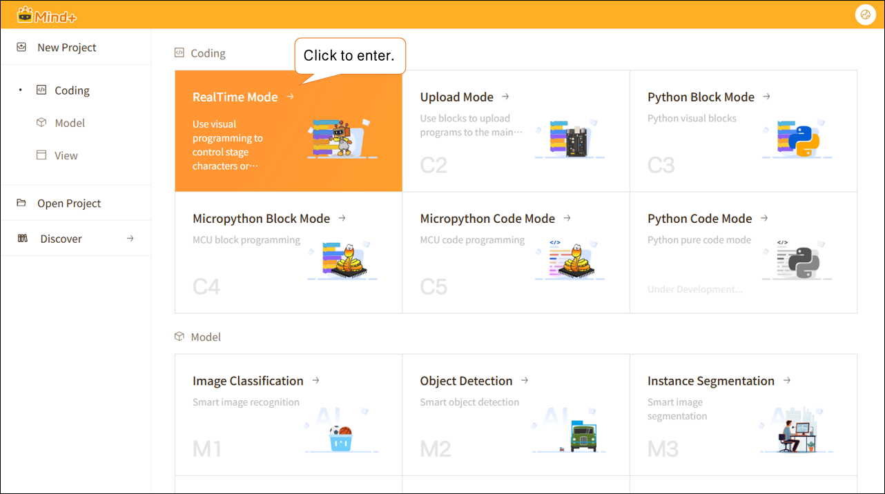

In RealTime mode, click "Extensions" in the lower-left corner, locate "Model Training and Inference " in the Stage Extensions, and click "Load."

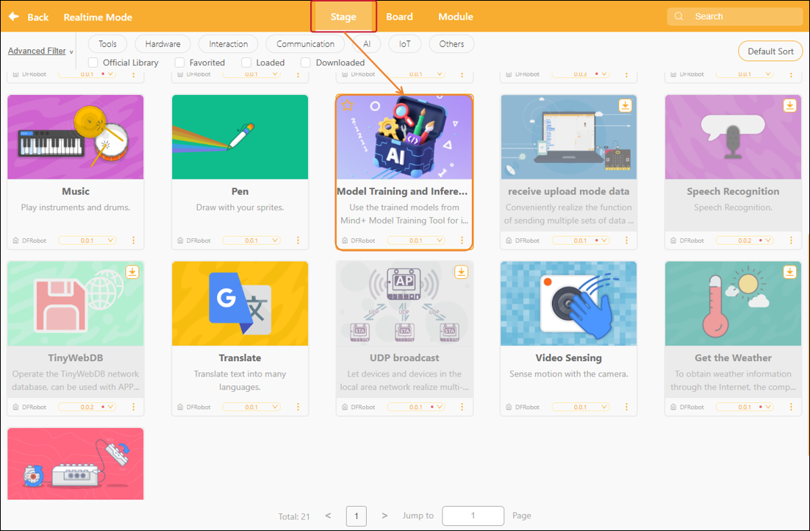

Once loading is complete, return to the real-time mode programming page and click "Instance Segmentation" under "Model Inference" to find the instance segmentation building blocks, as shown below.

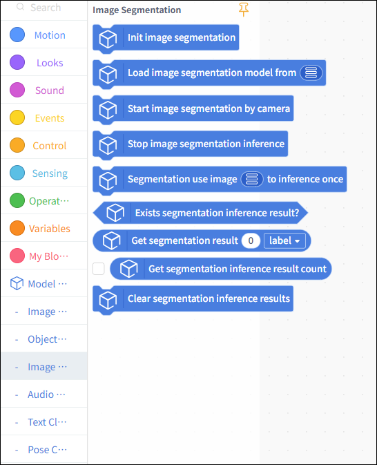

## Usage Instructions

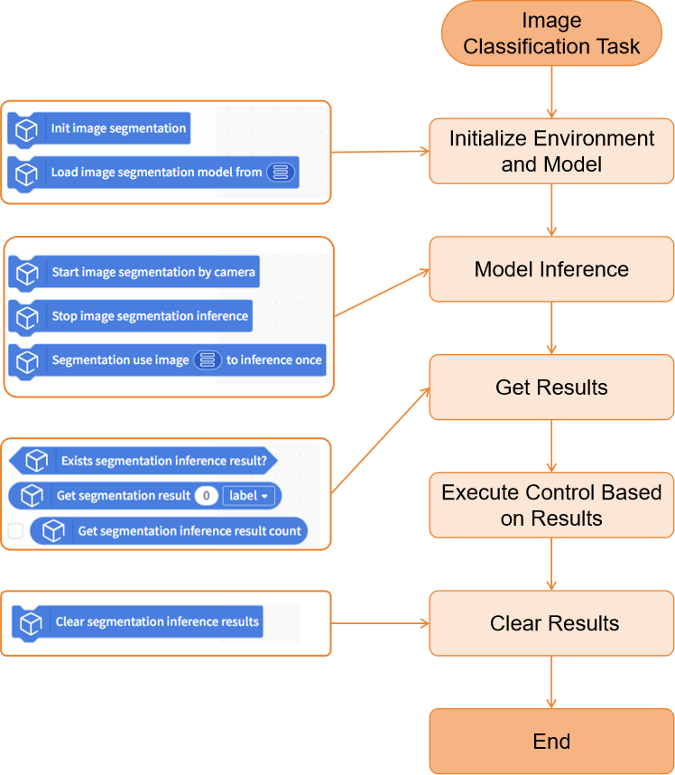

## Project 1: Local Image Instance Segmentation

This project demonstrates how to use a pre-trained instance segmentation model to recognize a local image and obtain inference results such as the number of instances, labels, and confidence scores.

In this example, the model used is a flower instance segmentation model (which can recognize various types of flowers and draw their outlines).

In practice, you can replace the example model with a model you’ve trained yourself or an existing instance segmentation model, while keeping the rest of the code flow the same.

## Sample Program

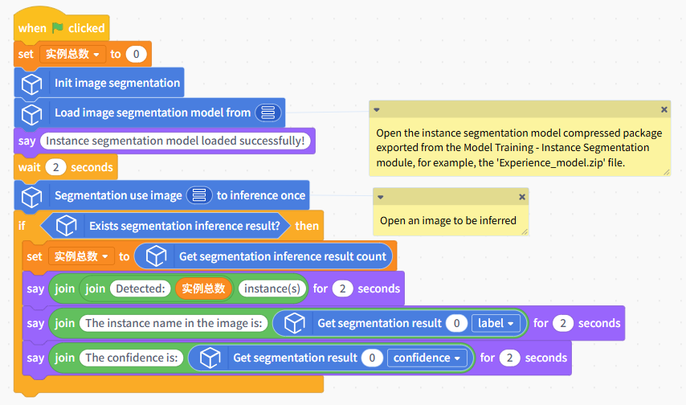

## Runtime Results

After running the program, a window displaying the model's inference results will pop up. The detection results will be overlaid on the original image, showing the outlines of the detected flowers and labeling them with their corresponding categories and confidence scores.

## Project 2: Real-Time Object Segmentation Using a Camera

This project demonstrates how to use a pre-trained instance segmentation model to continuously recognize objects in real-time video feed from a camera, overlay the recognition results on the video in real time, and obtain inference results such as the number of instances, their labels, and the center coordinates of each instance.

The model used in this example is the same as the one in Project 1. You can replace it with a model you’ve trained yourself or an existing instance segmentation model; the rest of the code flow remains the same.

## Sample Program

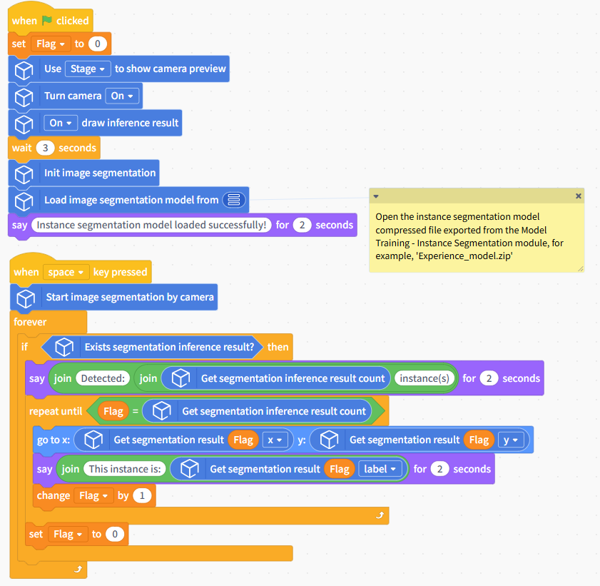

## Runtime Results

Once the program starts, the camera feed will be displayed in real time on the stage area. After the instance segmentation model has finished loading, press the spacebar to begin the instance segmentation inference task. The program will then draw the outline of each detected flower in real time on the screen, labeling it with its corresponding category and confidence score. The Mind+ character will move sequentially to the center of each instance and announce the category label for that instance.

## Building Block Instructions

| Instance Segmentation Block                                                                                      | Feature Description                                                                                                                                                                                                                                                                                                                                        |
| ---------------------------------------------------------------------------------------------------------------- | ---------------------------------------------------------------------------------------------------------------------------------------------------------------------------------------------------------------------------------------------------------------------------------------------------------------------------------------------------------- |
| 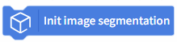 | Initialize the instance segmentation task. You must run this block before using any instance segmentation-related blocks.                                                                                                                                                                                                                                  |
|  | Load a pre-trained instance segmentation model file from the local directory for use in instance segmentation inference tasks. The instance segmentation model referred to here is the compressed model file trained and exported in the "Model Training - Instance Segmentation Model" module, such as 'Experience\_model.zip'.                           |
| 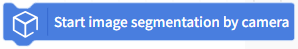 | Perform continuous instance segmentation inference on real-time footage captured by the camera.                                                                                                                                                                                                                                                            |
|  | Stop the instance segmentation inference on the camera feed.                                                                                                                                                                                                                                                                                               |
| 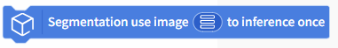 | Perform an instance segmentation inference on a specified image and draw the inference results on the image.                                                                                                                                                                                                                                               |
| 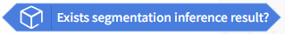 | Determines whether an instance has been detected; returns true if detected, false if not                                                                                                                                                                                                                                                                   |
| 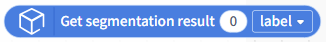 | Retrieve detailed information about the instance with the specified index from the inference results of the instance segmentation model, including the label, confidence score, center point X coordinate, center point Y coordinate, width, and height. Enter the index of the detected instance you want to retrieve in the box; counting starts from 0. |
| 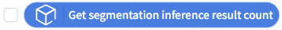 | Used to retrieve the total number of instances detected in a single inference result                                                                                                                                                                                                                                                                       |
| 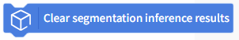 | Clear the currently saved instance-segmented inference results.                                                                                                                                                                                                                                                                                            |

| Camera-related Blocks                                                                                           | Feature Description                                                                                                                                                                                                                                                                |
| --------------------------------------------------------------------------------------------------------------- | ---------------------------------------------------------------------------------------------------------------------------------------------------------------------------------------------------------------------------------------------------------------------------------- |
| 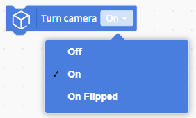 | Turn on the camera. If the image is upside down, you can enable the mirroring feature. Some computer cameras take a moment to start up, so you may want to add a few seconds of wait time at the end.                                                                              |
| 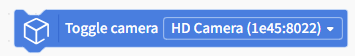 | Switch cameras. If your computer is connected to multiple cameras, you can use this block to retrieve the feed from a specific camera. If no camera is detected, try restarting the software or use your computer's built-in camera software to check if the camera is recognized. |
| 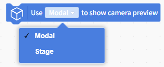 | To display the camera feed, you can use a pop-up window or the Object Stage.                                                                                                                                                                                                       |
| 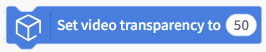 | When displaying a camera feed on the stage, you can use this block to adjust the transparency so that the stage background and the camera feed appear together.                                                                                                                    |
| 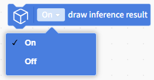 | Infer the results in real time and display them on the camera feed.                                                                                                                                                                                                                |
| 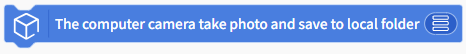 | Use the computer's webcam to take a photo and save it to a specified folder on the computer.                                                                                                                                                                                       |

## Frequently Asked Questions

| Q | How do I check the version number of the Mind+ software?                                                                                                                                                                                                                                                                                                                                                                                      |
| - | --------------------------------------------------------------------------------------------------------------------------------------------------------------------------------------------------------------------------------------------------------------------------------------------------------------------------------------------------------------------------------------------------------------------------------------------- |
| A | Open the Mind+ programming software and click the system settings icon in the upper-right corner. In the system settings panel of Mind+ version 2.0.4 and later, a new section titled "Version Updates" has been added. Click "Version Updates" to view the current version of Mind+.                                     |
| Q | What is instance segmentation, and what does “instance” refer to here?                                                                                                                                                                                                                                                                                                                                                                      |
| A | Instance segmentation is a computer vision task that involves identifying and distinguishing each specific object in an image and precisely delineating the pixel regions occupied by each object. An instance refers to “a specific individual” within the same class. In general, instance segmentation can: identify what an object is, distinguish between individual instances, and draw the complete shape contours of each instance. |
