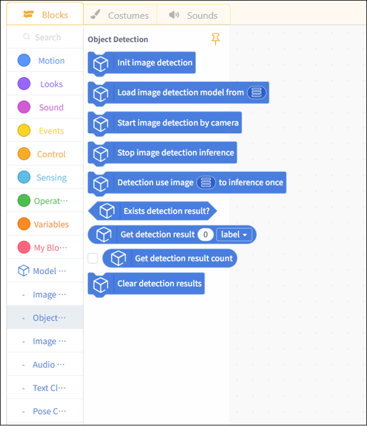
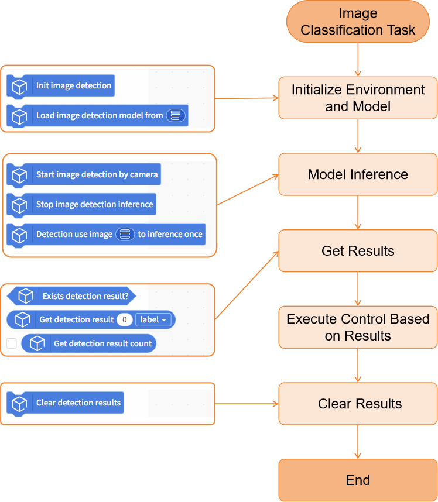
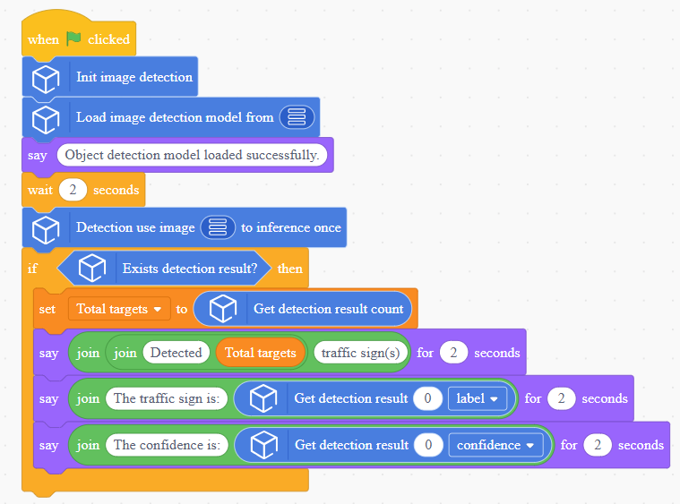
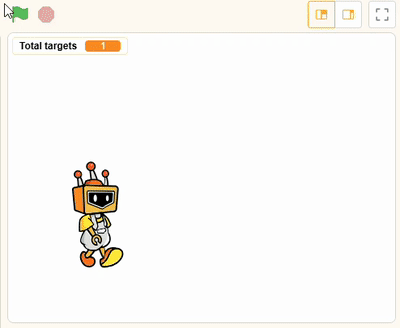
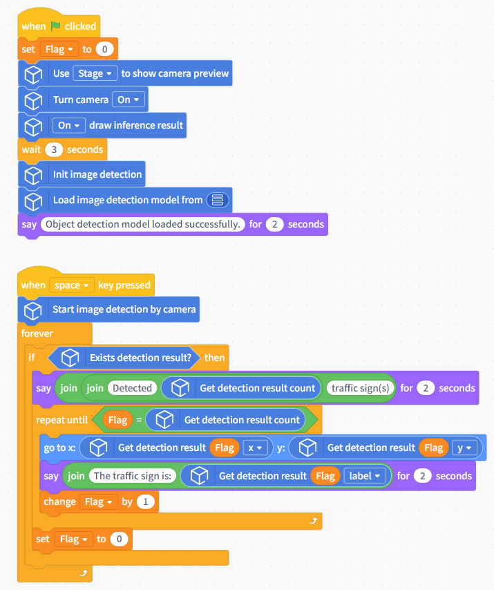
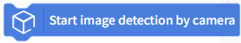

# Object Detection

This document will explain how to use the "Object Detection" module in the Model Training and Inference Library under Mind+ > Programming > Real-Time Mode to apply an object detection model you have trained yourself and complete an object detection project.

## Features

Using the object detection module, users can load pre-trained object detection models to perform inference and recognition on local images or live camera feeds. This allows them to obtain results such as the object’s label, confidence score, center point X and Y coordinates, width, and height, which can then be used for subsequent logical decisions, interactive control, or visual display.

With this, users can not only quickly apply pre-trained object detection models to create various object detection projects, but also gain an intuitive understanding of the entire application process—from image input to model inference to result output—enabling them to build AI projects with the capabilities to “see, judge, and interact,” thereby providing foundational support for both educational instruction and practical applications.

## Preparations

### Hardware Preparation

* a computer
* A webcam (either the one built into your computer or a USB webcam)

### Software Preparation

Install Mind+ version 2.0.4 or later. Click here to view the Mind+ installation guide. For instructions on how to check your software version, see the FAQ.

### Model Preparation

Before creating an object detection project, you must first train and export an object detection model. You can use the Object Detection module in the Mind+ V2.0 model training tool to train the model and export it for subsequent inference. The exported object detection model is a compressed file with the extension `**.zip`. In subsequent projects, this compressed file will be used directly to load the object detection model and perform inference for object detection tasks.

Please refer to the tutorial below to prepare an object detection model for use in the upcoming project.

* Object Detection Model Training Tutorial: [Object Detection—Training the Model](../../AITools/Detailed_explanation/object_detection/quick_experience/quick-experience.md#step-3-train-model)
* Tutorial on Exporting Object Detection Models: [Object Detection—Model Export](../../AITools/Detailed_explanation/object_detection/quick_experience/quick-experience.md#step-5-model-deploy)

## Load the model training and inference library

Open Mind+ version 2.0.4 or later, and tap to enter "RealTime Mode."

In RealTime mode, click "Extensions" in the lower-left corner, locate "Model Training and Inference " in the Stage Extensions, and click "Load."

Once loading is complete, return to the real-time programming page and click "Object Detection" under "Model Inference" to find the object detection building blocks, as shown below.

## Usage Instructions

## Project 1: Local Image Object Detection

This project demonstrates how to use a pre-trained object detection model to recognize a local image and obtain the corresponding detection results.

In practice, you can replace the example model with a target detection model that you have trained yourself or one you already have, while keeping the rest of the code flow the same.

## Sample Program

## Runtime Results

After running the program, a window displaying the model’s inference results will pop up. The detection results will be overlaid on the original image, with boxes drawn around the recognized traffic signs; the corresponding labels and confidence scores will be displayed in the upper-right corner of each box.

## Project 2: Real-Time Object Detection with a Camera

This project demonstrates how to use a pre-trained object detection model to continuously detect objects in real-time video feed from a camera and obtain detection results—such as the number of objects, object labels, and the coordinates of the object centers—in real time.

The model used in this example is the same as the one in Project 1. You can replace it with an object detection model you’ve trained yourself or one you already have; the rest of the code flow remains the same.

## Sample Program

## Runtime Results

After running the program, observe the camera feed displayed on the stage. Once the object detection model has finished loading, press the spacebar to start real-time traffic sign detection. The detection results will be overlaid on the video feed in real time, with boxes drawn around all traffic signs that appear.

Based on the detection data it receives, the Mind+ character will move sequentially to the center of each corresponding marker and say the corresponding label.

## Building Block Instructions

| Instance Segmentation Block                                                                                 | Feature Description                                                                                                                                                                                                                                                                                                            |
| ----------------------------------------------------------------------------------------------------------- | ------------------------------------------------------------------------------------------------------------------------------------------------------------------------------------------------------------------------------------------------------------------------------------------------------------------------------ |
|  | Initialize the object detection task. You must run this block before using any object detection-related blocks.                                                                                                                                                                                                                |
|  | Load a pre-trained object detection model file from the local directory for use in object detection inference tasks. The object detection model used here is a compressed model file trained and exported under the "Model Training - Object Detection" module, such as 'Experience_model.zip'.                                |
|  | Perform continuous object detection inference on real-time footage captured by the camera.                                                                                                                                                                                                                                     |
|  | Stop object detection inference on the camera feed.                                                                                                                                                                                                                                                                            |
|  | Perform an object detection inference on a specified image and overlay the inference results on the image.                                                                                                                                                                                                                     |
|  | Determines whether a target has been detected; returns true if detected, and false if not.                                                                                                                                                                                                                                     |
|  | Retrieve detailed information about the target with the specified index from the inference results of the object detection model, including the label, confidence score, center X coordinate, center Y coordinate, width, and height. Enter the index of the detected target you want to retrieve in the box, starting from 0. |
|  | Used to retrieve the total number of targets detected in a single inference result                                                                                                                                                                                                                                             |
|  | Clear the currently saved object detection inference results.                                                                                                                                                                                                                                                                  |

| Camera-related Blocks                                                                                           | Feature Description                                                                                                                                                                                                                                                                |
| --------------------------------------------------------------------------------------------------------------- | ---------------------------------------------------------------------------------------------------------------------------------------------------------------------------------------------------------------------------------------------------------------------------------- |
|  | Turn on the camera. If the image is upside down, you can enable the mirroring feature. Some computer cameras take a moment to start up, so you may want to add a few seconds of wait time at the end.                                                                              |
|  | Switch cameras. If your computer is connected to multiple cameras, you can use this block to retrieve the feed from a specific camera. If no camera is detected, try restarting the software or use your computer's built-in camera software to check if the camera is recognized. |
|  | To display the camera feed, you can use a pop-up window or the Object Stage.                                                                                                                                                                                                       |
|  | When displaying a camera feed on the stage, you can use this block to adjust the transparency so that the stage background and the camera feed appear together.                                                                                                                    |
|  | Infer the results in real time and display them on the camera feed.                                                                                                                                                                                                                |
|  | Use the computer's webcam to take a photo and save it to a specified folder on the computer.                                                                                                                                                                                       |

## Frequently Asked Questions

| Q | How do I check the version number of the Mind+ software?                                                                                                                                                                                                                                                                                                                                                   |
| - | ---------------------------------------------------------------------------------------------------------------------------------------------------------------------------------------------------------------------------------------------------------------------------------------------------------------------------------------------------------------------------------------------------------- |
| A | Open the Mind+ programming software and click the system settings icon in the upper-right corner. In the system settings panel of Mind+ version 2.0.4 and later, a new section titled "Version Updates" has been added. Click "Version Updates" to view the current version of Mind+.  |
