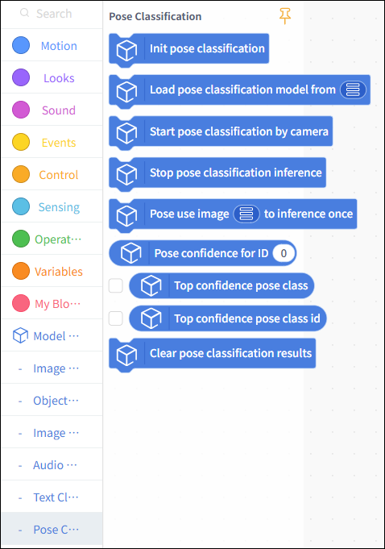
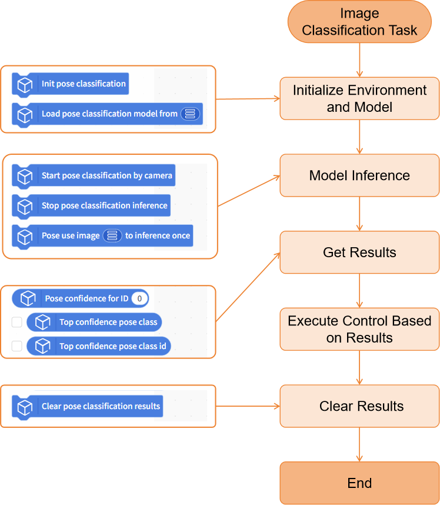
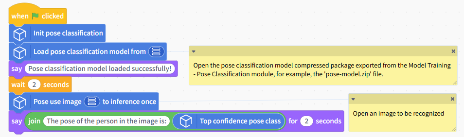
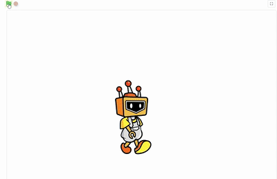
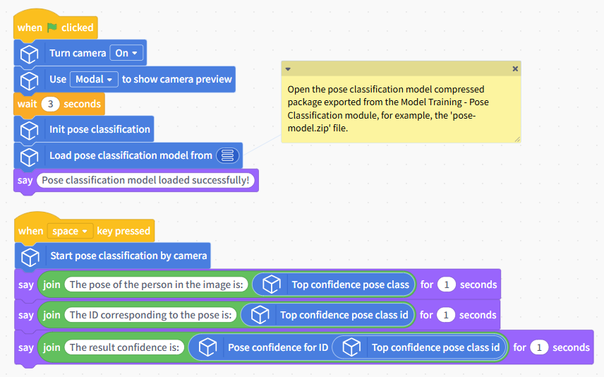
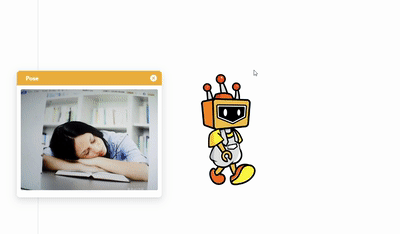

# Pose Classification

This document will explain how to use the "Posture Classification" module in the Model Training and Inference Library under Mind+ > Programming > Real-Time Mode to apply a posture classification model you have trained yourself and complete a posture classification project.

## Features

Using the pose classification module, users can load a pre-trained pose classification model to perform inference and classification on local images or live camera feeds, and obtain results such as the corresponding pose category label, ID, and confidence score.

With this, users can not only quickly apply their self-trained pose classification models to create various projects related to human pose classification, but also gain an intuitive understanding of the entire application process—from image input to model inference to result output—and build AI projects with “perception, decision-making, and interaction” capabilities, thereby providing foundational support for both course instruction and practical applications.

## Preparations

### Hardware Preparation

* a computer
* A webcam (either the one built into your computer or a USB webcam)

### Software Preparation

Install Mind+ version 2.0.4 or later. Click here to view the Mind+ installation guide. For instructions on how to check your software version, see the FAQ.

### Model Preparation

Before creating a pose classification project, you must first train and export a pose classification model. You can use the Pose Classification module in the Mind+ V2.0 model training tool to train the model and export it for subsequent inference. The exported pose classification model is a compressed file with the suffix `**.zip`. In subsequent projects, this compressed file will be used directly to load the image classification model and perform inference for the pose classification task.

Please refer to the tutorial below to set up a pose classification model for use in the upcoming project.

* Tutorial on Training a Pose Classification Model: [Pose Classification—Training the Model](../../AITools/Detailed_explanation/pose_classification/quick_experience/quick-experience.md#step-4-train-model)
* Tutorial on Exporting Pose Classification Models: [Pose Classification—Model Export](../../AITools/Detailed_explanation/pose_classification/quick_experience/quick-experience.md#step-6-model-deploy)

## Load the model training and inference library

Open Mind+ version 2.0.4 or later, and tap to enter "RealTime Mode."

In RealTime mode, click "Extensions" in the lower-left corner, locate "Model Training and Inference " in the Stage Extensions, and click "Load."

Once loading is complete, return to the real-time programming page and click "Posture Classification" under "Model Inference" to find the posture classification blocks, as shown below.

## Usage Instructions

## Project 1: Local Image Pose Classification

This project demonstrates how to use a pre-trained pose classification model to recognize a local image and obtain the corresponding classification result.

In this example, the pose classification model used can distinguish between two different poses—'sleeping' and 'reading'—in a library setting. In practical applications, you can replace the example model with a pose classification model you have trained yourself or an existing one, while keeping the rest of the code flow the same.

## Sample Program

## Runtime Results

After running the program, the system will display a window showing the model’s inference results, with the detected human body keypoints overlaid on the original image. At the same time, the confidence scores for the human pose in each category will be displayed below the image, and the category with the highest confidence score will be used as the final classification result for the human pose in that image.

## Project 2: Real-Time Camera Pose Classification

This project demonstrates how to use a pre-trained pose classification model to continuously analyze real-time video captured by a camera and obtain real-time human pose classification results.

The model used in this example is the same as the one in Project 1. You can replace it with a pose classification model you’ve trained yourself or one you already have; the rest of the code flow remains the same.

## Sample Program

## Runtime Results

After running the program, a window displaying the model’s inference results will pop up. Once the pose classification model has finished loading, it will continuously perform inference on the real-time video feed from the camera, plot the human body’s keypoints, and display the human pose classification results in the window in real time.

Press the spacebar to display the pose classification results for the current frame, including: the classification label with the highest confidence; the corresponding category ID; and the confidence value for that classification result.

## Building Block Instructions

| Instance Segmentation Block                                                                                    | Feature Description                                                                                                                                                                                                                                                                                       |
| -------------------------------------------------------------------------------------------------------------- | --------------------------------------------------------------------------------------------------------------------------------------------------------------------------------------------------------------------------------------------------------------------------------------------------------- |
|  | Initialize the pose classification task. You must run this block before using the pose classification-related blocks.                                                                                                                                                                                     |
|  | Load a pre-trained pose classification model file from the local directory for use in pose classification inference tasks. The pose classification model here refers to the compressed model file trained and exported under the "Model Training - Pose Classification" module, such as 'pose-model.zip'. |
|  | Perform continuous pose classification inference on real-time footage captured by the camera.                                                                                                                                                                                                             |
|  | Stop the pose classification inference for the camera feed.                                                                                                                                                                                                                                               |
|  | Perform a single pose classification inference on a specified image and display the corresponding recognition results.                                                                                                                                                                                    |
|  | Retrieves the confidence score corresponding to a specified category ID from the pose classification results. Enter an integer starting from 0 for the ID; you can also use an\`int\`-type variable.                                                                                                      |
|  | Retrieve the classification label with the highest confidence from the current pose classification results. This is often used directly as the final pose classification label.                                                                                                                           |
|  | Retrieve the category ID corresponding to the classification with the highest confidence in the current pose classification results.                                                                                                                                                                      |
|  |  Clear the currently saved pose classification inference results.                                                                                                                                                                                                                                    |

| Camera-related Blocks                                                                                           | Feature Description                                                                                                                                                                                                                                                                |
| --------------------------------------------------------------------------------------------------------------- | ---------------------------------------------------------------------------------------------------------------------------------------------------------------------------------------------------------------------------------------------------------------------------------- |
|  | Turn on the camera. If the image is upside down, you can enable the mirroring feature. Some computer cameras take a moment to start up, so you may want to add a few seconds of wait time at the end.                                                                              |
|  | Switch cameras. If your computer is connected to multiple cameras, you can use this block to retrieve the feed from a specific camera. If no camera is detected, try restarting the software or use your computer's built-in camera software to check if the camera is recognized. |
|  | To display the camera feed, you can use a pop-up window or the Object Stage.                                                                                                                                                                                                       |
|  | When displaying a camera feed on the stage, you can use this block to adjust the transparency so that the stage background and the camera feed appear together.                                                                                                                    |
|  | Infer the results in real time and display them on the camera feed.                                                                                                                                                                                                                |
|  | Use the computer's webcam to take a photo and save it to a specified folder on the computer.                                                                                                                                                                                       |

## Frequently Asked Questions

| Q | How do I check the version number of the Mind+ software?                                                                                                                                                                                                                                                                                                                                                   |
| - | ---------------------------------------------------------------------------------------------------------------------------------------------------------------------------------------------------------------------------------------------------------------------------------------------------------------------------------------------------------------------------------------------------------- |
| A | Open the Mind+ programming software and click the system settings icon in the upper-right corner. In the system settings panel of Mind+ version 2.0.4 and later, a new section titled "Version Updates" has been added. Click "Version Updates" to view the current version of Mind+.  |
