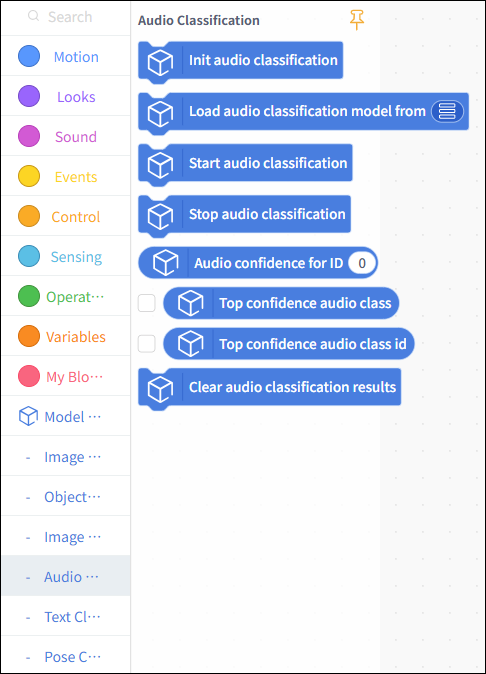
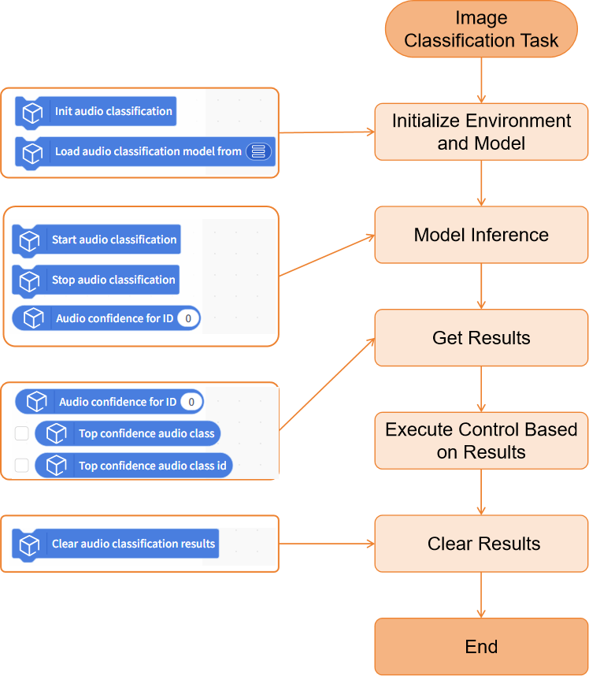
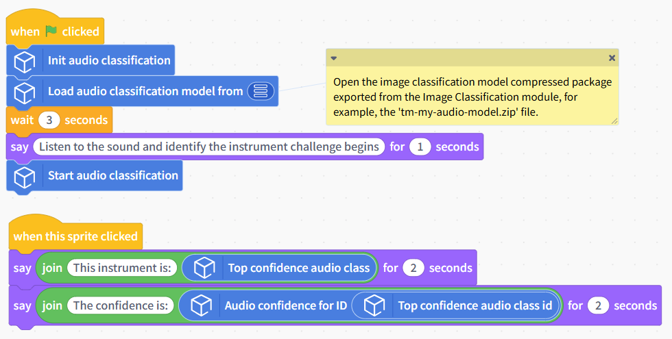

# Speech Classification

This document will explain how to use the "Speech Classification" module in the Model Training and Inference Library under Mind+ > Programming > Real-Time Mode to apply a speech classification model you have trained yourself and complete an audio classification project.

## Features

Using the speech classification module, users can load a pre-trained speech classification model to perform real-time inference and classification on audio input from a microphone, and obtain results such as the corresponding category ID, label, and confidence score.

With this tool, users can not only quickly apply their self-trained speech classification models to create various audio classification projects and identify the events or emotional characteristics represented by audio clips, but they can also visually examine multi-dimensional features such as frequency, intensity, duration, and rhythm, thereby gaining a comprehensive understanding of the entire application process—from audio input and model inference to result output.

## Preparations

### Hardware Preparation

* a computer
* A webcam (either the one built into your computer or a USB webcam)

### Software Preparation

Install Mind+ version 2.0.4 or later. Click here to view the Mind+ installation guide. For instructions on how to check your software version, see the FAQ.

### Model Preparation

Before creating an image classification project, you must first train and export a speech classification model. You can use the Speech Classification module in the Mind+ V2.0 model training tool to train the model and export it for subsequent inference. The exported speech classification model is a compressed file with the suffix `**.zip**`. In subsequent projects, you will use this compressed file directly to load the speech classification model and perform inference for speech classification tasks.

Please refer to the tutorial below to set up an image classification model for use in your upcoming project.

* Image Classification Model Training Tutorial: Speech Classification—Training the Model
* Image Classification Model Export Tutorial: Speech Classification—Model Export

## Load the model training and inference library

Open Mind+ version 2.0.4 or later, and tap to enter "RealTime Mode."

In RealTime mode, click "Extensions" in the lower-left corner, locate "Model Training and Inference " in the Stage Extensions, and click "Load."

Once loading is complete, return to the real-time programming page. Click "Speech Classification" under "Model Inference" to find the speech classification blocks, as shown below.

## Usage Instructions

## Project: Identifying Musical Instruments by Sound

This project demonstrates how to use a pre-trained speech classification model to perform classification inference on real-time audio captured from a microphone, obtain the corresponding classification results, and identify musical instruments while listening to music.

In this example, the sample model used is an audio classification model capable of distinguishing between the sounds of three instruments (piano, guitar, and drum set). In practical applications, you can replace the sample model with a speech classification model that you have trained yourself or an existing one, while keeping the rest of the code flow the same.

## Sample Program

## Runtime Results

After running the program and successfully loading the speech classification model, a model inference window will pop up. You can observe the audio input from the microphone in real time, and the real-time inference results of the speech classification model will be displayed below, with the label having the highest confidence level serving as the final classification result.

## Building Block Instructions

| Speech Classification Building Blocks                                                                            | Feature Description                                                                                                                                                                                                                                                                                                    |
| ---------------------------------------------------------------------------------------------------------------- | ---------------------------------------------------------------------------------------------------------------------------------------------------------------------------------------------------------------------------------------------------------------------------------------------------------------------- |
|  | Initialize the speech classification task. You must run this block before using any speech classification-related blocks.                                                                                                                                                                                              |
|  | Load a pre-trained speech classification model file from the local directory for use in speech classification inference tasks. The speech classification model here refers to a compressed model file trained and exported under the "Model Training - Speech Classification" module, such as 'tm-my-audio-model.zip'. |
|  | Perform continuous speech classification inference on real-time audio captured by the microphone.                                                                                                                                                                                                                      |
|  | Stop audio capture from the microphone and voice classification inference.                                                                                                                                                                                                                                             |
|  | Retrieves the confidence score corresponding to a specified category ID from the speech classification results. Enter an integer starting from 0 for the ID; you can also use an\`int\`-type variable.                                                                                                                 |
|  | Retrieves the classification label with the highest confidence from the current speech classification results. This is often used directly as the final speech classification label.                                                                                                                                   |
|  | Retrieve the category ID corresponding to the classification with the highest confidence in the current speech classification results.                                                                                                                                                                                 |
|  | lear the currently saved speech classification results.                                                                                                                                                                                                                                                                |

## Frequently Asked Questions

| Q | How do I check the version number of the Mind+ software?                                                                                                                                                                                                                                                                                                                                                   |
| - | ---------------------------------------------------------------------------------------------------------------------------------------------------------------------------------------------------------------------------------------------------------------------------------------------------------------------------------------------------------------------------------------------------------- |
| A | Open the Mind+ programming software and click the system settings icon in the upper-right corner. In the system settings panel of Mind+ version 2.0.4 and later, a new section titled "Version Updates" has been added. Click "Version Updates" to view the current version of Mind+.  |
