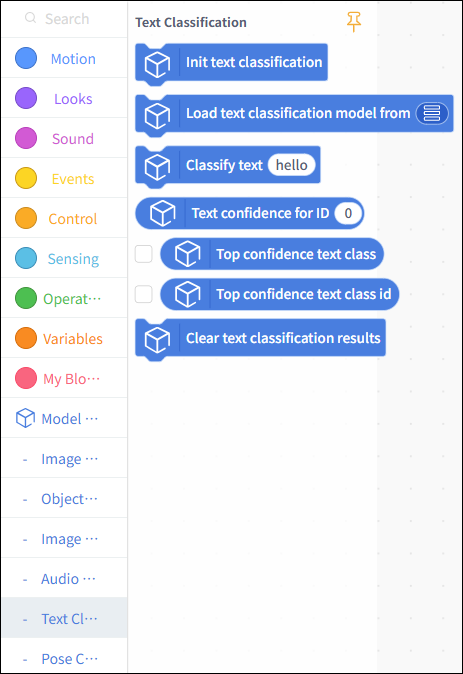
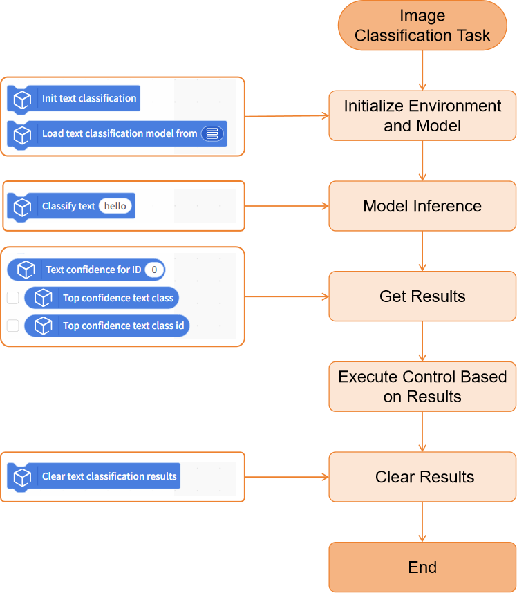
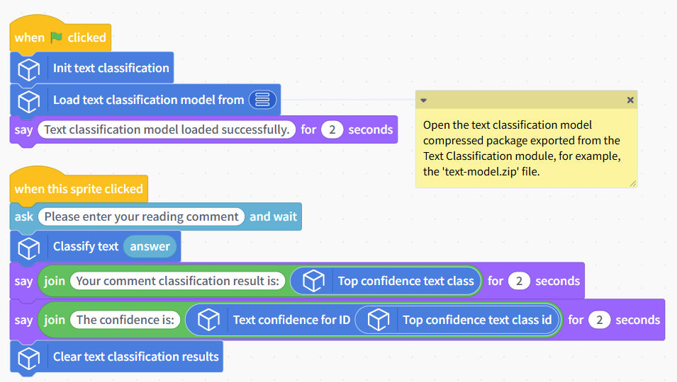
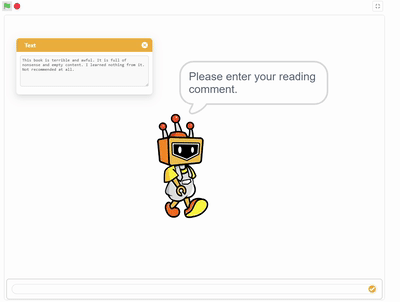

# Text Classification

This document will explain how to use the "Text Classification" module in the Model Training and Inference Library under Mind+ > Programming > Real-Time Mode to apply a text classification model you have trained yourself and complete a text classification project.

## Features

Using the text classification module, users can load a pre-trained text classification model to classify input text and obtain results such as the corresponding category ID, label, and confidence score.

In this way, users can not only quickly apply their self-trained text classification models to create various text classification projects, but also intuitively experience the entire application process—from text input to model inference to result output—and clearly understand the core principles of text classification (based on feature extraction such as text semantics and sentiment words, and category matching) as well as its practical value.

## Preparations

### Hardware Preparation

* a computer
* A webcam (either the one built into your computer or a USB webcam)

### Software Preparation

Install Mind+ version 2.0.4 or later. Click here to view the Mind+ installation guide. For instructions on how to check your software version, see the FAQ.

### Model Preparation

Before creating an image classification project, you must first train and export an image classification model. You can use the Image Classification module in the Mind+ V2.0 model training tool to train the model and export it for subsequent inference. The exported image classification model is a compressed file with the extension `**.zip**`. In subsequent projects, you will use this compressed file directly to load the image classification model and perform inference for image classification tasks.

Please refer to the tutorial below to set up an Text classification model for use in your upcoming project.

* Text Classification Model Training Tutorial: [Text Classification—Training the Model](../../AITools/Detailed_explanation/text_classification/quick_experience/quick-experience.md#step-3-train-model)
* Tutorial on Exporting Text Classification Models: [Text Classification—Model Export](../../AITools/Detailed_explanation/text_classification/quick_experience/quick-experience.md#step-5-model-deploy)

## Load the model training and inference library

Open Mind+ version 2.0.4 or later, and tap to enter "RealTime Mode."

In RealTime mode, click "Extensions" in the lower-left corner, locate "Model Training and Inference " in the Stage Extensions, and click "Load."

Once loading is complete, return to the real-time programming page. Click "Text Classification" under "Model Inference" to find the text classification blocks, as shown below.

## Usage Instructions

## Project: Categorization of Reader Reviews

This project demonstrates how to use a pre-trained text classification model to analyze input text and obtain results such as the corresponding classification label and confidence score.

In this example, the sample model used is a reader review classification model that can distinguish between three types of reader reviews: positive, negative, and neutral. In practice, you can replace the sample model with a text classification model that you have trained yourself or an existing one, while keeping the rest of the code flow the same.

## Sample Program

### Runtime Results

After running the program, click the Mind+ sprite, enter the reading comment in the input box, and observe the text classification label and confidence result. The category label with the highest confidence is used as the final reader comment category.

## Building Block Instructions

| Speech Classification Building Blocks                                                                          | Feature Description                                                                                                                                                                                                                                                      |
| -------------------------------------------------------------------------------------------------------------- | ------------------------------------------------------------------------------------------------------------------------------------------------------------------------------------------------------------------------------------------------------------------------ |
|  | Initialize the text classification task. This block must be executed before using text classification-related block functions.                                                                                                                                           |
|  | Load a trained text classification model file from the local system for text classification inference tasks. The text classification model here is a model compressed file exported from the Model Training - Text Classification module, for example, 'text-model.zip'. |
|  | Perform a text classification inference on the text in the input box. Enter the text to be recognized in the input box.                                                                                                                                                  |
|  | Get the confidence value corresponding to the specified category ID in the text classification result. The ID should be an integer starting from 0, and an int type variable can also be used.                                                                           |
|  | Get the classification label with the highest confidence in the current text classification result. Commonly used as the final text classification label result.                                                                                                         |
|  | Get the category ID corresponding to the classification with the highest confidence in the current text classification result.                                                                                                                                           |
|  | Clear the currently saved text classification inference result.Frequently Asked Questions                                                                                                                                                                                |

## Frequently Asked Questions

| Q | How do I check the version number of the Mind+ software?                                                                                                                                                                                                                                                                                                                                                  |
| - | --------------------------------------------------------------------------------------------------------------------------------------------------------------------------------------------------------------------------------------------------------------------------------------------------------------------------------------------------------------------------------------------------------- |
| A | Open the Mind+ programming software and click the system settings icon in the upper-right corner. In the system settings panel of Mind+ version 2.0.4 and later, a new section titled "Version Updates" has been added. Click "Version Updates" to view the current version of Mind+.  |
