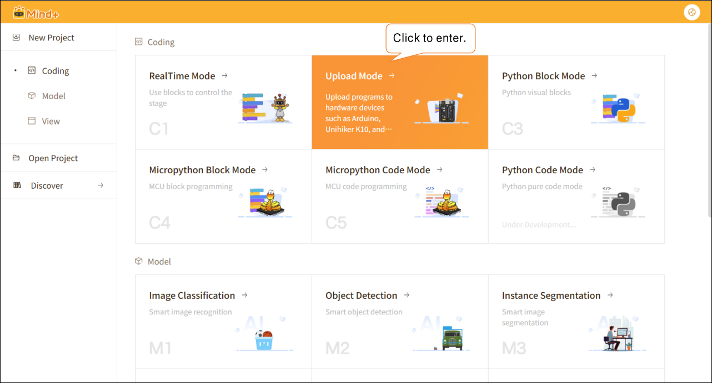
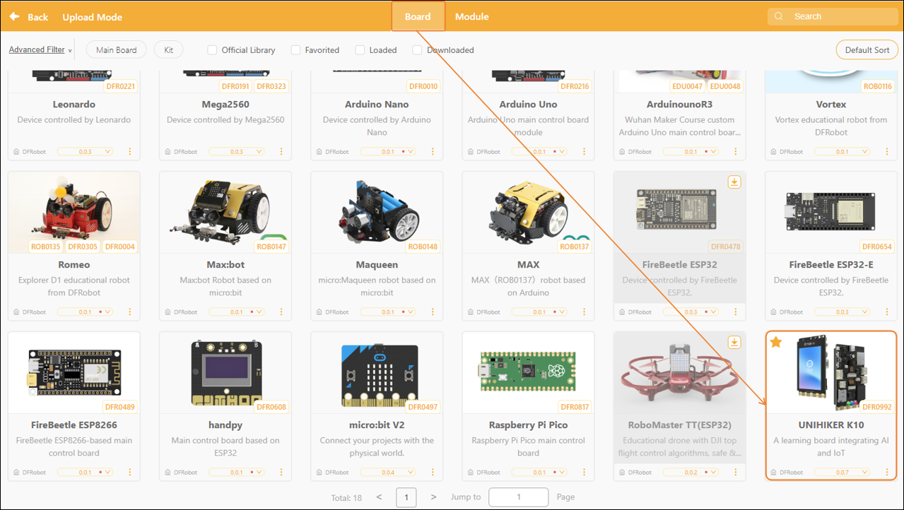
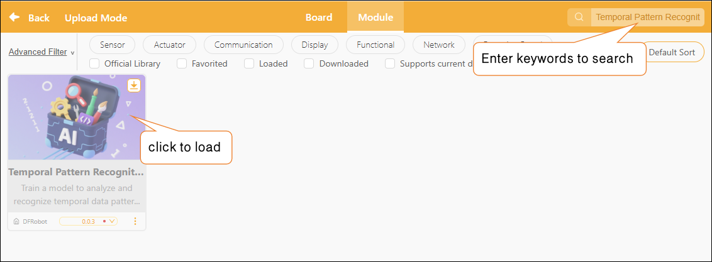
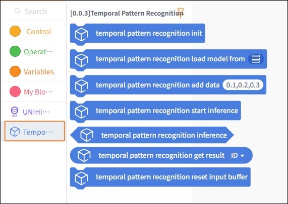
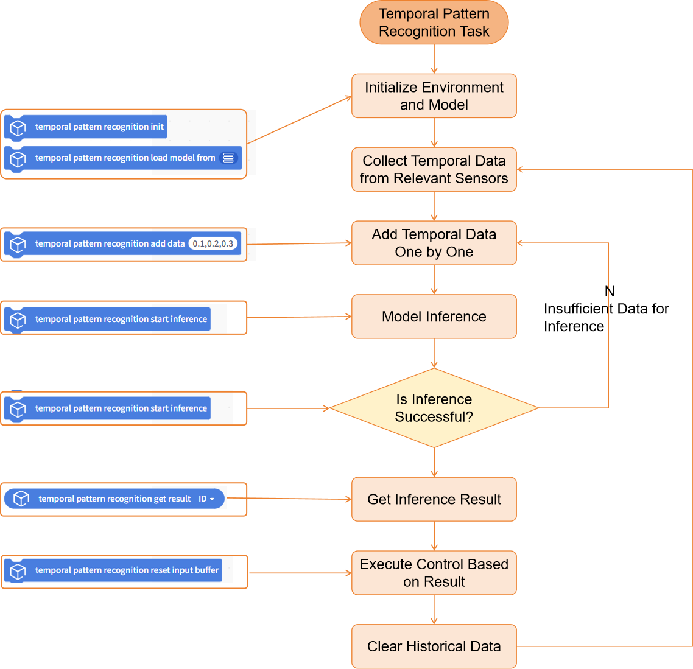
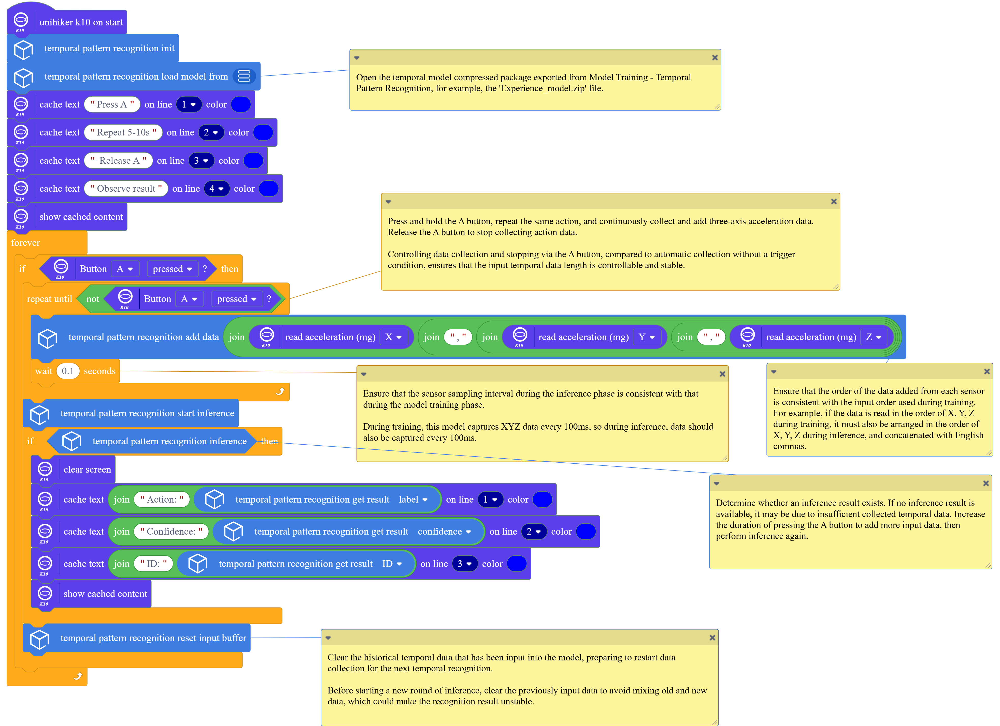
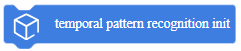
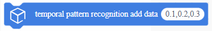

# Temporal Pattern Recognition

This document will explain how to use the Time Series Pattern Recognition Library in Mind+ > Programming Software > Upload Mode to apply a Temporal Pattern Recognition model and complete a time series pattern recognition project using the UNIHIKER K10.

## Feature Overview

Using the Temporal Pattern Recognition library, users can load Temporal Pattern Recognition models to perform real-time recognition and classification of continuous sensor time-series data, and obtain results such as the corresponding category ID, label name, and confidence score.

Using this library, users can not only quickly deploy Temporal Pattern Recognition models to build various applications based on sensor time-series data—such as motion recognition, state change detection, behavior classification, and trigger control—but also intuitively understand and experience the entire application workflow, from data collection and model inference to result output, thereby gaining a deep understanding of the fundamental principles and practical value of temporal pattern recognition.

## Preparations

### Hardware Preparation

* a computer
* A webcam (either the one built into your computer or a USB webcam)

### Software Preparation

Install Mind+ version 2.0.4 or later. Click here to view the Mind+ installation guide. For instructions on how to check your software version, see the FAQ.

### Model Preparation

Before developing a time-series data recognition project, you must first train and export a model for recognizing time-series data. You can use the Temporal Pattern Recognition module in the Mind+ V2.0 model training tool to train the model and export it for subsequent inference. The exported time-series data recognition model is a compressed file with the suffix `**.zip`. In subsequent projects, this compressed file will be used directly to load the time-series pattern recognition model and perform time-series pattern recognition tasks.

Please refer to the tutorial below to prepare a model for recognizing time-series data for use in your upcoming project.

Tutorial on Training Temporal Pattern Recognition Models: [Temporal Pattern Recognition—Training the Model](../../AITools/Detailed_explanation/time_series_recognition/quick_experience/quick-experience.md#step-3-train-model)

Tutorial on Exporting Temporal Pattern Recognition Models: [Temporal Pattern Recognition—Model Export](../../AITools/Detailed_explanation/time_series_recognition/quick_experience/quick-experience.md#step-6-model-deploy)

## Load the model training and inference library

Open Mind+ version 2.0.4 or later, and tap to enter "Upload Mode."

In upload mode, click “Extensions” in the lower-left corner, then click “Board” In the Master Control Extensions list, select “UNIHIKER K10,” and click to load the “UNIHIKER K10” library.

After the UNIHIKER K10 library has finished loading, click "Module" then enter the keyword "Temporal Pattern Recognition" in the search box in the upper-right corner to perform a search. Once the result is found, click to load the "Temporal Pattern Recognition" library.

Once loading is complete, return to the upload mode programming page and click "Temporal Pattern Recognition" to locate the Temporal Pattern Recognition blocks, as shown below.

## Usage Instructions

## Project: Action Recognition

This project demonstrates how to use a pre-trained temporal pattern recognition model to analyze continuous data collected by the UNIHIKER K10 accelerometer, extract label data from the inference results, and perform motion recognition.

In practice, you can replace the example model with a model you’ve trained yourself or an existing time-series data recognition model, while keeping the rest of the code flow the same. For common questions about Temporal Pattern Recognition, see the FAQ at the end of the documentation.

## Sample Program

## Runtime Results

Click "Connect Device." When the interface indicates that the connection was successful, click "Upload" and wait for the program to finish uploading.

After the program has finished uploading, press and hold the A button on UNIHIKER K10 with one hand while performing a clapping or tapping gesture. Maintain the gesture for approximately 5 to 10 seconds. Then release the A button. Observe the recognized action label, category ID, and corresponding confidence score displayed on the screen. Repeat the above steps to perform a new round of action recognition.

## Building Block Instructions

| Blocks                                                                                                                     | Feature Description                                                                                                                                                                                                                                                                                                                                                                                                 |
| -------------------------------------------------------------------------------------------------------------------------- | ------------------------------------------------------------------------------------------------------------------------------------------------------------------------------------------------------------------------------------------------------------------------------------------------------------------------------------------------------------------------------------------------------------------- |
|   | Initialize the temporal pattern recognition task. You must run this block before using any blocks related to temporal pattern recognition.                                                                                                                                                                                                                                                                          |
|        | Load a pre-trained temporal pattern recognition model file from the local directory for use in temporal pattern recognition inference tasks. The temporal pattern recognition model here refers to a compressed model file trained and exported in the "Model Training - Temporal Pattern Recognition" module, such as 'Experience-model.zip'.                                                                      |
|        | Used to add a new time-series data point to the data buffer. Multiple values must be separated by commas `,`. By calling this block repeatedly, data can be entered incrementally to build a complete time-series dataset, which is used for subsequent time-series pattern recognition and inference. The length and order of the data here must match the length and order of the data used to train the model. |
|        | Clear historical data: Before starting a new round of data input and inference, clear any old data from the data buffer to ensure that the new round of inference is based solely on newly collected time-series data.                                                                                                                                                                                              |
|        | Perform a time-series pattern inference using the time-series data accumulated in the data buffer. The time-series data accumulated in the data buffer must include at least the number of time-series data points required by the model for the inference to succeed and produce results; a minimum of 20 time-series data points is required.                                                                     |
|        | To determine whether time-series pattern inference was successful, if an inference result exists, return True; otherwise, return False. If False is returned, it may be because there is insufficient time-series data collected to produce an inference result. Extend the time-series data collection period and attempt the inference again.                                                                     |
|        | Retrieve the inference results for a single time-series pattern recognition task. This includes the category ID, category label name, or corresponding confidence score.                                                                                                                                                                                                                                            |

## Frequently Asked Questions

| Q | How do I check the version number of the Mind+ software?                                                                                                                                                                                                                                                                                                                                                                                                                                                                                                                                                                                                                                                                                                                                                                                                                                                                                                                                                                                                                  |
| - | ------------------------------------------------------------------------------------------------------------------------------------------------------------------------------------------------------------------------------------------------------------------------------------------------------------------------------------------------------------------------------------------------------------------------------------------------------------------------------------------------------------------------------------------------------------------------------------------------------------------------------------------------------------------------------------------------------------------------------------------------------------------------------------------------------------------------------------------------------------------------------------------------------------------------------------------------------------------------------------------------------------------------------------------------------------------------- |
| A | Open the Mind+ programming software and click the system settings icon in the upper-right corner. In the system settings panel of Mind+ version 2.0.4 and later, a new section titled "Version Updates" has been added. Click "Version Updates" to view the current version of Mind+.                                                                                                                                                                                                                                                                                                                                                                                                                                                                                                                                                                                                                                                                  |
| Q | What is time-series data, and what is temporal pattern recognition?                                                                                                                                                                                                                                                                                                                                                                                                                                                                                                                                                                                                                                                                                                                                                                                                                                                                                                                                                                                                       |
| A | temporal pattern recognition refers to the use of models to analyze a continuous sequence of time-series data and identify the action, behavior, or change patterns contained within it. Rather than focusing on individual data values, the model comprehensively assesses the overall characteristics of data changes over a period of time to perform recognition and classification. Time-series data refers to data collected continuously in chronological order. Unlike a single image or a single input, time-series data reflects the process of how data changes over time. For example, the X, Y, and Z-axis data continuously collected by the K10 accelerometer on a flight test board over a period of time constitutes a time-series data set.                                                                                                                                                                                                                                                                                                            |
| Q | The trained temporal pattern recognition model is not performing well and has a low accuracy rate. How can we improve it?                                                                                                                                                                                                                                                                                                                                                                                                                                                                                                                                                                                                                                                                                                                                                                                                                                                                                                                                                 |
| A | You can try optimizing the model in the following ways: (1) Increase the number of training samples and retrain the model. When collecting training data, appropriately extend the duration of each data collection session to capture more complete and stable time-series features. (2) When applying the model, ensure that the data input method remains consistent with that used during the training phase. For example, when working on a project involving time-series pattern recognition for accelerometers, ensure that the orientation of the K10 board is consistent and that the amplitude and execution method of the movements are uniform. (3) During actual application, appropriately extend the input duration for the same type of time-series data. For example, when conducting a project involving time-series pattern recognition using an accelerometer, repeat the same motion for 5–10 seconds to ensure the model can obtain sufficient continuous time-series data during inference, thereby improving recognition stability and accuracy. |
| Q | Which controllers is this library compatible with?                                                                                                                                                                                                                                                                                                                                                                                                                                                                                                                                                                                                                                                                                                                                                                                                                                                                                                                                                                                                                        |
| A | In upload mode, thetemporal pattern recognition  library supports only the UNIHIKER K10 controller.                                                                                                                                                                                                                                                                                                                                                                                                                                                                                                                                                                                                                                                                                                                                                                                                                                                                                                                                                                      |
