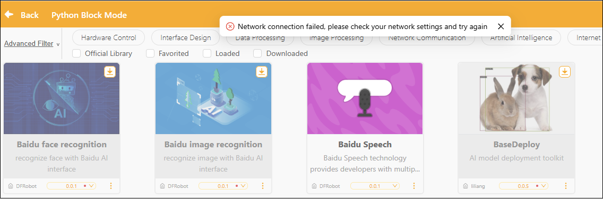

# How to Fix Extension Library Download Failure

What should I do if I can't download the extension library? How do I install the extension library offline?

## Problem Description

* When adding an extension library, the system displays the message "Network connection failed. Please check your network settings and try again," preventing the extension library from downloading and installing properly.
* Extension libraries cannot be downloaded properly in server rooms or in environments without internet access.

## Analysis of Causes

* Mind+ 2.x adopts a distribution model that separates the software from the extension libraries to reduce the size of software update packages; extension libraries can be updated independently and added as needed.
* The extension library requires an internet connection to retrieve the list of extension packages and resources when used for the first time; the initial download cannot be completed in an offline environment.
* Some extension libraries also require access to third-party dependency sources during installation or runtime, which may result in loading failures when network access is restricted.

## Solution

### 1. Check the network status

* Check whether your computer is connected to the Internet.
* Try opening your browser and visiting another website to verify your internet connection.
* WiFi Make sure you have a stable internet connection and avoid using unreliable Wi-Fi.

### 2. Check Domain Access Permissions

Some school or corporate networks may restrict access to the following domains, preventing the extension library from being downloaded:

**Mind+ Official Domain:**

\*.mindplus.top

\*.mindplus.cc

\*.dfrobot.com.cn

**Third-party Python library sources:**

pypi.org

pypi.tuna.tsinghua.edu.cn

mirrors.aliyun.com

If this occurs, please contact your school or company’s network administrator to request that access to these domains be enabled.

### 3. Deploying Using an Offline Resource Package

* For environments without internet access or server rooms, we provide an offline installer and an extension library resource package (updated periodically).
* Download links for the offline installer and extension library resources: [Click to download](https://h7dvigefi0.feishu.cn/drive/folder/Qh7kfvla8lG6VCdhUr8cmr0snrm).
* After downloading, please review the PDF tutorial included in the compressed file (e.g., “Mind+ V2.X Extension Library Offline Installation Tutorial—2026.0407.pdf”) before proceeding.

**Important Reminder**: Please ensure that your extension library resource packages and Mind+ version are up to date;
