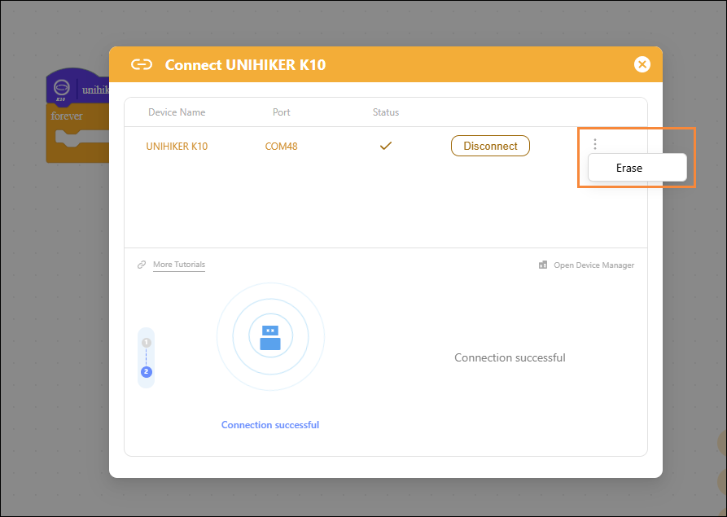

# How do I restore the firmware in upload mode?

## Problem Description

I can't find the "Restore Device to Factory Settings" screen in Mind+ version 2.x

## Solution

1. Connect Devices
1. Tap the three-dot button

1. Click the "Erase" button
1. Wait for the device to restart to restore the default settings.

