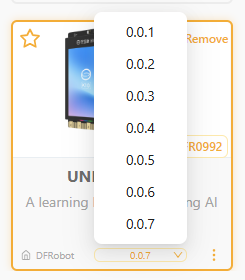

# What should I do if I get a K10 character quotation mark error?

## Problem Description

The following error occurred while programming using the UINIHIKER K10:

* error: stray '\350' in program
* Text displayed without quotation marks

## Analysis of Causes

The Mind+ 2.1.0 software changed the logic of the quotation mark input field, causing K10 (version 0.0.1) to fail to generate quotation marks.

## Solution

1. Click the "Extensions" panel in the lower-right corner of the Mind+ interface
1. Find the K10 Mainboard Expansion

1. Update the K10 controller to version 0.0.2 or later. See the figure below.

