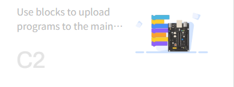
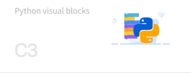
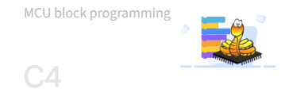
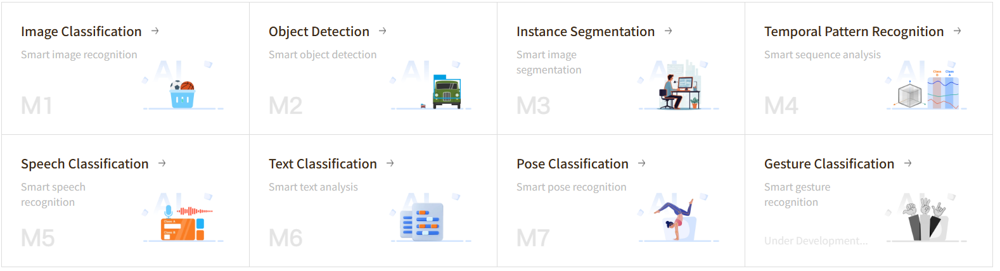
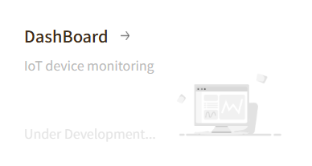

Welcome to the Mind+ FAQ page! This page compiles various issues and solutions that users encounter while using Mind+ software.

## 🔍 Quick Navigation

Select the corresponding category based on the type of issue you encounter:

### Coding

- **[Real-time Mode](Coding/RealTimeMode/index.md)**  
    [{width=400, style="display:block;margin: 10px auto"}](Coding/RealTimeMode/index.md)

- **[Upload Mode](Coding/UploadMode/index.md)**  
    [{width=400, style="display:block;margin: 10px auto"}](Coding/UploadMode/index.md)

- **[Python Block Mode](Coding/PythonBlockMode/index.md)**  
    [{width=400, style="display:block;margin: 10px auto"}](Coding/PythonBlockMode/index.md)

- **[MicroPython Block Mode](Coding/MicroPythonBlockMode/index.md)**  
    [{width=400, style="display:block;margin: 10px auto"}](Coding/MicroPythonBlockMode/index.md)

### Model

- **[Model](AITools/index.md)**  
    [{style="display:block;margin: 10px auto"}](AITools/index.md)

### View

- **[View](ViewDesign/index.md)**  
    [{style="display:block;margin: 10px auto"}](ViewDesign/index.md)

<!-- - **[Extension Libraries](UserExtension/index.md)**  
    [{style="display:block;margin: 10px auto"}](UserExtension/index.md) -->

## 💡 Usage Tips

- **Quick Search**: <button onclick="openSearch()" style="background: #1976d2; color: white; border: none; padding: 4px 12px; border-radius: 4px; cursor: pointer; font-size: 0.9em;">🔍 Click to Search</button> 
- **Issue Feedback**: If you can't find your issue, you can provide feedback through  forum  
- **Continuous Updates**: We will continuously update the FAQ based on user feedback

