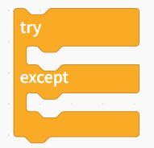

控制指令根据结构和使用逻辑，可大致分为4类：while循环、for循环、条件判断结构、异常处理结构。

**循环控制**

用于重复执行某段程序。

| **积木**                                                     | **说明**                                                     |
| ------------------------------------------------------------ | ------------------------------------------------------------ |
|  | 无限次循环，重复执行模块内的所有程序。                       |
|  | 直到条件为真，才继续向下执行。                               |
|  | 一直执行模块内的程序，直到条件为真时，跳出循环。             |
|  | 循环中断条件选择中断循环：完全跳出循环，执行循环体后面的语句；继续下一次循环：跳出本次循环，执行下一次；注意：这个指令必须在循环中使用。 |
|  | 程序执行到此处位置，等到1秒后，才能执行下面的程序。          |

**for循环**用于按次数或集合进行循环。

| **积木**                                                     | **说明**                           |
| ------------------------------------------------------------ | ---------------------------------- |
|  | 固定循环次数，执行 10 次循环。     |
|  | 自定义范围循环，从1-10，步长为1。  |
|  | 遍历循环，编列列表中的每一个元素。 |

**条件判断结构**

根据条件执行不同逻辑

| **积木**                                                     | **说明**                                           |
| ------------------------------------------------------------ | -------------------------------------------------- |
|  | 单分支判断，条件成立时执行循环体中的程序。         |
|  | 双分支判断，条件成立时，执行程序1，否则执行程序2。 |

**异常处理结构**

用户捕获程序中可能出现的错误，增强程序稳定性。

| **积木**                                                     | **说明**                                                     |
| ------------------------------------------------------------ | ------------------------------------------------------------ |
|  | 异常处理语句，当try的从属代码执行遇到错误时，中断try从属代码并执行except的从属语句。 |
|  | 异常处理语句，当try的从属代码执行遇到错误时，中断try从属代码并执行except的从属语句，但无论是否有异常，都会执行finally的从属代码。 |

##### 