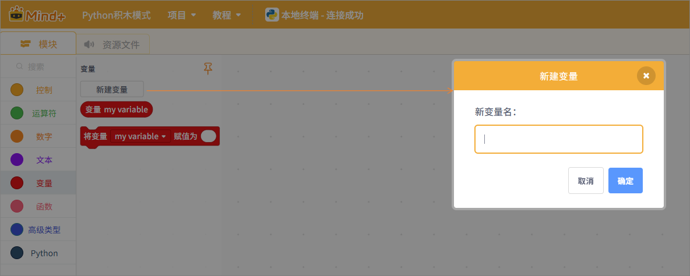

变量是存放数据的容器，在MicroPython中变量不需要使用任何特定类型的声明，甚至可以在设置后更改其类型。

**新建变量**

新建变量时，变量名中不能包含特殊字符“\`~!-@#$%^&*()+<>?:{},./;\'[]\”。

| **积木**                                                     | **说明**                                           |
| ------------------------------------------------------------ | -------------------------------------------------- |
|  | 名称为“my variable”的变量。                        |
|  | 可以修改变量的名称或者删除变量，并对变量进行赋值。 |