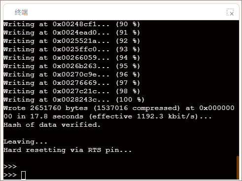

终端显示区用于展示程序在运行过程中的输出结果与调试信息。当用户执行程序时，所有通过“打印（print）”指令输出的内容都会在此区域中实时显示，帮助用户观察程序执行过程并验证逻辑是否正确。在终端显示区中，你可以：

1. 查看程序的运行结果与输出内容；
2. 观察变量数值变化或传感器数据反馈；
3. 调试程序逻辑，定位错误；
4. 在部分情况下输入数据与程序进行交互（如需要键盘输入时）。

终端显示区是连接“程序逻辑”与“运行结果”的窗口，对于理解 MicroPython 积木的执行机制与进行项目调试具有重要作用。

