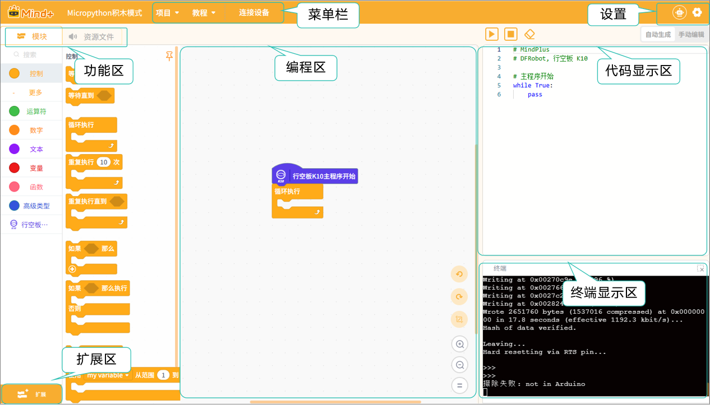

# 3.4 MicroPython积木模式
MicroPython 积木模式是 Mind+ 提供的一种图形化编程方式，它结合了 Python 编程语言的语法特点，同时保留了积木式编程的直观性与易用性。在该模式下，用户可以通过拖拽积木完成程序设计，并自动生成等效的 Python 代码，实现对硬件的控制与逻辑编程。

MicroPython 是 Python 的精简版本，专为嵌入式设备（如掌控板、行空板 K10 等）设计，可在资源有限的硬件上运行。它保留了 Python 的核心语法，同时对部分库和功能进行了精简或改写，以适应硬件环境。

**特点：**

图形化与代码结合：积木模式背后对应Python 代码，用户可以随时查看、理解Python 代码。

硬件支持广泛：支持 Mind+ 主控板（如K10、掌控板）及其扩展模块，如传感器、舵机、电机、显示屏等。

模块化积木：积木按功能分组，覆盖控制、运算符、数字、文本、变量、函数、高级类型等常用编程功能。

低门槛学习：即使没有编程基础的用户，也可以通过拖拽积木完成程序设计，同时逐步理解 Python 语法和逻辑结构。

### 界面认识

进入MicroPython积木模式后，你将看到如下界面。

整个界面可分为7个区域：菜单栏、设置、功能区、扩展区、编程区、代码显示区、终端显示区。

接下来，我们将针对这些区域进行详细的了解，每个区域的详细功能介绍，可点击跳转：

| [菜单栏](MenuBar.md)       | [设置](Settings.md)   | [功能区-模块](FunctioModule/index.md) | [功能区-资源文件](Resources.md) |
| ------ | ------ | ----------- | --------------- |
| [**扩展区**](Expansion.md) | [**编程区**](Programming.md) | [**代码显示区**](CodeDisplay.md)  | [**终端显示区**](TerminalDisplay.md)      |