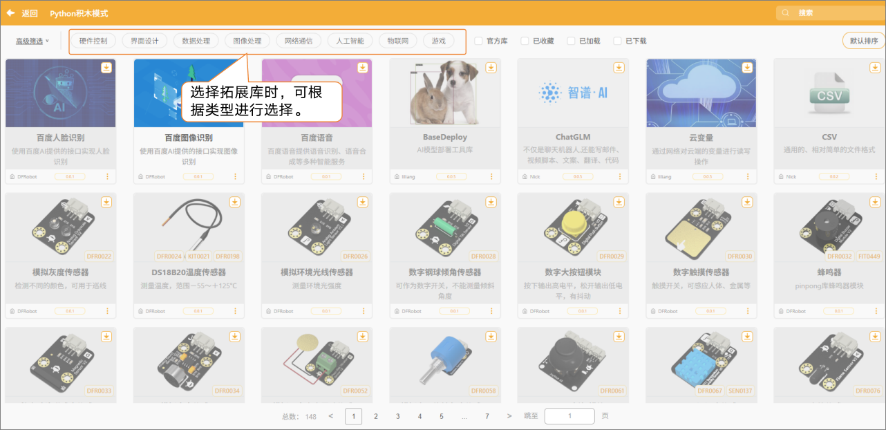
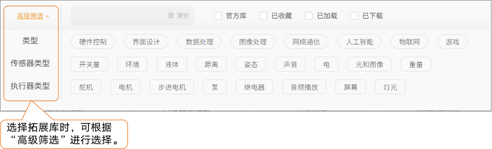

在 Python 积木模式中，用户可以通过“扩展库”功能添加各类传感器或执行器模块。扩展库相当于为系统安装对应的模块驱动，添加成功后会自动生成与之匹配的 Python 积木指令，帮助用户快速实现数据读取或动作控制，从而大大提升编程效率，拓展硬件互动项目的可能性。  

**注意：** 如需了解某个扩展库中各积木的具体功能与使用方法，可在“[扩展库]()”列表中点击该模块查看详细说明。  

此外，还可以通过“高级筛选”功能，根据传感器类型或执行器类别进行精准选择，更快速地找到所需的扩展库。  

