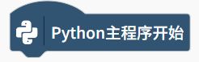
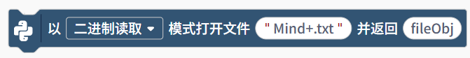
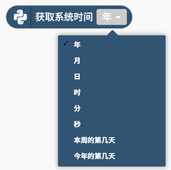

Python 内置模块指令提供了一系列基础且强大的功能，涵盖了程序控制、用户交互、文件操作和系统时间处理等核心领域，这些指令使得开发者能够快速实现标准化的程序流程。

| **积木**                                                     | **说明**                                                     |
| ------------------------------------------------------------ | ------------------------------------------------------------ |
|  | Python主程序开始。                                           |
|  | input（）函数功能，获取终端中的键盘输入，提示语为“Please input”，一般配合打印函数，丹樱键盘输入的内容。 |
|  | 打印输出内容。                                               |
|  | 打开文件，并返回文件对象。                                   |
|  | 可以通过二进制读取、二进制写入、二进制追加，对文件进行操作。 |
|  | 关闭文件对象，关闭后文件不能再进行读取操作，注意，在文件操作完成后一点要关闭文件。 |
|  | 读取文件对象内容。                                           |
|  | 将字符串写入文件                                             |
|  | 获取系统时间。可以获取年、月、日、时、分、秒、本周的第几天、本年的第几天。 |
|  | 获取系统时间，不同系统时间的组合。                           |
|  | 获取上系统时间戳。时间戳就是一个数字身份证，唯一标识着地球上的某一个瞬间。它让计算机能够精确、高效地处理所有与时间相关的操作，是现代软件开发中不可或缺的基础概念。 |
|  | 获取系统时间，并对获取的时间进行格式化。                     |