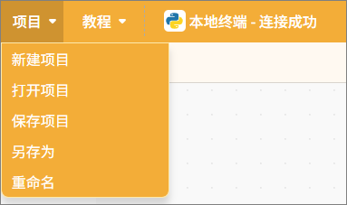
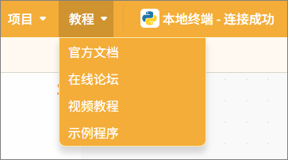
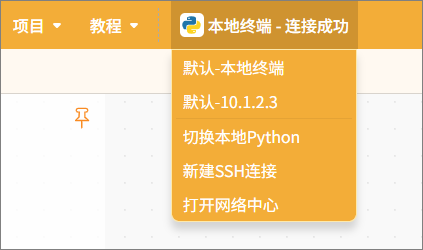

在Python积木模式中，单栏区域提供了三种不同的项目操作方式：项目、教程、本地终端。  

#### 1. 项目

提供项目管理操作，包含新建项目、打开项目、保存项目、另存为、重命名等操作，方便用户对编程项目进行完整管理。

| **功能** | **说明**                                                     |
| -------- | ------------------------------------------------------------ |
| 新建项目 | 创建一个空白项目，并清除当前加载的所有扩展指令，便于从零开始编程。 |
| 打开项目 | 打开已保存的项目文件，继续编辑或运行。                       |
| 保存项目 | 将当前项目保存到计算机上，更新原有文件内容。                 |
| 另存为   | 将当前项目保存为新的文件，用户可指定文件名和位置，原项目不会被覆盖，适合创建备份或新版本。 |
| 重命名   | 修改已有项目的名称，不改变项目内容或保存位置，便于整理和管理文件。 |

#### 2. 教程

提供丰富的学习资源，包含官方文档、在线论坛、视频教程、示例程序。

**注意：**示例程序是根据选择的主控板自动调整内容，便于实际操作学习。

| **功能** | **说明**                                                     |
| -------- | ------------------------------------------------------------ |
| 官方文档 | 打开官方文档页面，可查看大量教程                             |
| 在线论坛 | 打开Mind+官网论坛，可查看大量项目及反馈交流。                |
| 视频教程 | 对于刚入门，可观看一些简单例子。                             |
| 示例程序 | 提供当前主控板的示例程序，注意需要先在扩展中选择主控板之后才有示例程序。 |

#### 3. 本地终端

本地终端不仅是“运行 Python 程序的地方”，它还是一个环境选择与终端连接中心，支持在电脑、本地解释器、行空板 M10或远程设备之间自由切换，满足不同项目的执行需求。  

| **功能**              | **说明**                                                  |
| --------------------- | --------------------------------------------------------- |
| 默认-本地终端         | 连接当前电脑环境，直接执行 Python程序（本地运行）。       |
| 默认-10.1.2.3（示例） | 连接已识别的远程设备（如行空板 M10）进行代码执行。        |
| 切换本地Python        | 更换本地 Python 解释器版本（如 Python3.8 / Python3.10）。 |
| 新建 SSH 连接         | 手动建立远程终端连接（适用于支持 SSH 的设备）。           |
| 打开网络中心          | 进入网络设备管理界面，管理远程连接和设备状态。            |