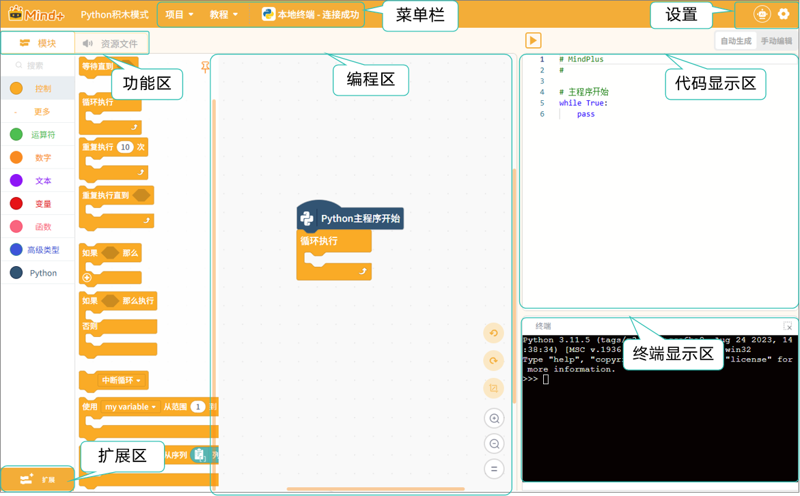

# 3.3 Python积木模式
Python积木模式是 Mind+ 程序设计中面向 Python 入门学习的一种编程方式。它以积木形式呈现 Python 编程逻辑，结合图形化拖拽操作与代码实时生成展示的双重优势，帮助初学者轻松理解程序结构与语法。用户可通过拖动积木快速搭建程序，系统会在代码区同步生成对应的 Python 代码。完成的程序可直接在电脑端或行空板 M10 上运行，实现即学即用。  

### 界面认识

入Python积木模式后，你将看到如下界面。

整个界面可分为7个区域：菜单栏、设置、功能区、扩展区、编程区、代码显示区、终端显示区。

接下来，我们将针对这些区域进行详细的了解，每个区域的详细功能介绍，可点击跳转：

| [菜单栏](MenuBar.md) | [设置](Settings.md)   | [功能区-模块](FunctioModule/index.md) | [功能区-资源文件](Resources.md) |
| ------ | ------ | ----------- | --------------- |
| [**扩展区**](Expansion.md) | [**编程区**](Programming.md) | [**代码显示区**](CodeDisplay.md)  | [**终端显示区**](TerminalDisplay.md)      |

 