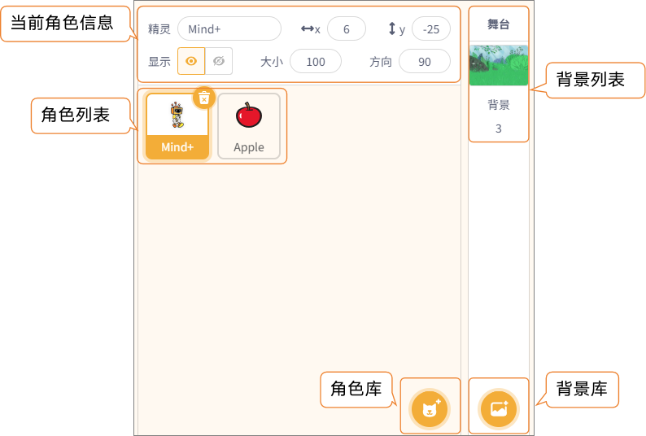
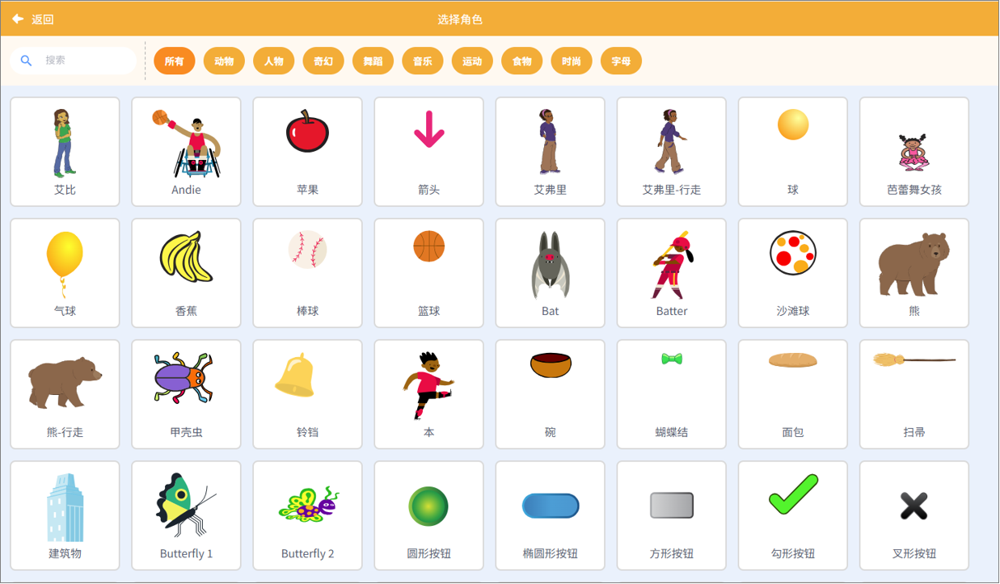
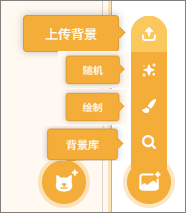
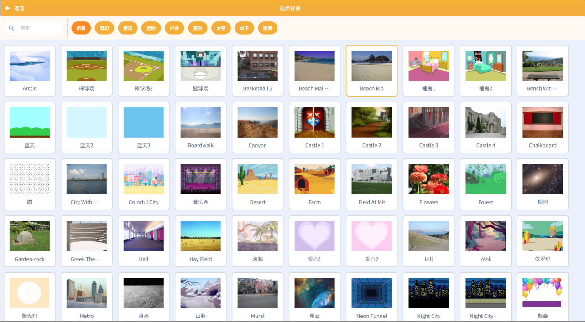

角色及背景区位于舞台区的右下册，用于管理项目中的所有角色和舞台背景。

| **功能**     | **说明**                                                     |
| ------------ | ------------------------------------------------------------ |
| 当前角色信息 | 显示当前选中角色的名称、位置（X/Y 坐标）、方向和大小等属性，用户可在此进行修改。 |
| 角色列表     | 显示项目中所有角色的缩略图，点击角色即可切换编辑对象。       |
| 背景列表     | 展示当前舞台背景，与角色类似，背景也可进行独立程序编写（背景程序）。 |
| 角色库       | 用户可从角色库选择、上传图片、使用随机生成或绘图工具创建新角色。 |
| 背景库       | 支持从背景库选择、上传、绘制或随机生成舞台背景。             |

##### 1. 角色库

| **功能** | **说明**                                   |
| -------- | ------------------------------------------ |
| 上传角色 | 导入本地图片作为角色造型。                 |
| 随机     | 系统随机挑选一个角色添加到舞台中。         |
| 绘制角色 | 通过绘图工具创建自定义角色图像。           |
| 角色库   | 从角色库中选择人物、动物、物品等角色模型。 |

**注意：** 角色库内置700余种角色资源，按主题分类展示，包括人物、动物、奇幻、舞台、音乐、运动、食物、时尚、字母等多个类别，方便用户快速匹配场景并构建故事内容。  

##### 2. 背景库

| **功能** | **说明**                                             |
| -------- | ---------------------------------------------------- |
| 上传背景 | 将本地图片导入为背景。                               |
| 随机     | 自动随机生成一个背景。                               |
| 绘制     | 手动画出原创背景画面。                               |
| 选择背景 | 从背景库中选择预设场景，如奇幻、音乐、运动、图案等。 |

**注意：** 背景库中内置110余种场景资源，按照主题分类呈现，包括奇幻、音乐、运动、户外、室内、太空、水下、图案等，让用户能够根据作品内容快速选择合适的舞台环境。  

