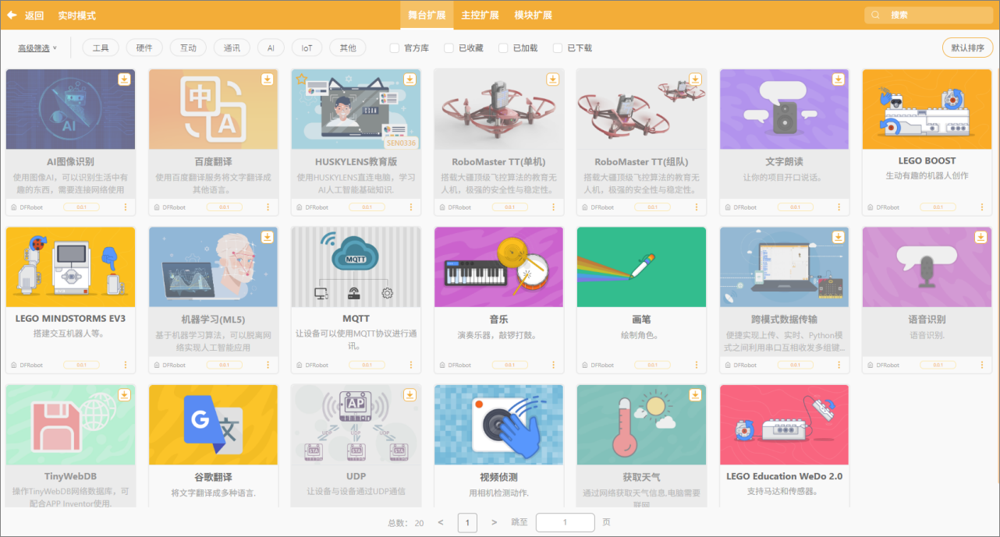
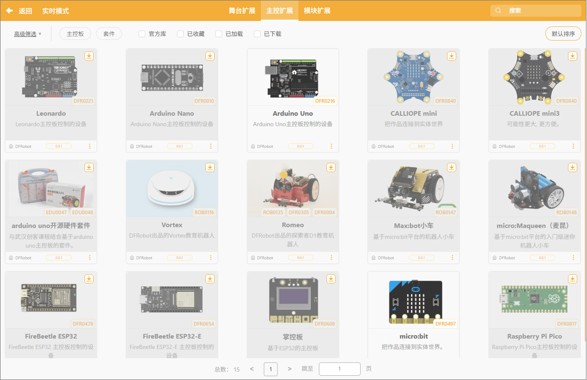
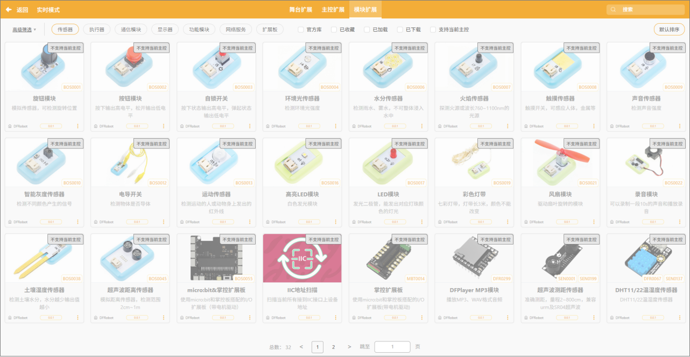

在实时模式中，扩展区是构建项目功能的重要入口。通过选择合适的舞台扩展、主控扩展或模块扩展，用户可以从虚拟舞台动画扩展到真实硬件交互，实现从软件到硬件的全面创作体验。  

 想深入了解每个扩展库的指令？点击“[扩展库]()”即可查看详细说明。  

#### 1. 舞台扩展

在实时模式中，进入“积木扩展”后选择“舞台扩展”分类，即可引入多种与舞台互动相关的功能扩展模块。这些扩展主要用于增强虚拟舞台场景中的交互表现，例如添加声音识别、翻译功能、AI识别控制、图像绘制、网络通信等功能。  

**特别注意：** 扩展中的库在初次使用时必须先完成下载操作，成功下载后才能加载并使用相关功能。  

将舞台扩展的内容，按照用途分类，可分为以下7种不同的类型：

| 类型           | 示例扩展                                                    | 功能说明                                     |
| -------------- | ----------------------------------------------------------- | -------------------------------------------- |
| AI 互动类      | AI图像识别、机器学习（ML5）、语音识别                       | 通过图像或语音识别实现智能互动。             |
| 翻译类         | 百度翻译、谷歌翻译                                          | 将文字实时翻译为其他语言，可与朗读配合使用。 |
| 感知类         | 视频侦测                                                    | 使用摄像头追踪动作，实现互动体验。           |
| 舞台表达类     | 文字朗读、音乐、画笔                                        | 让角色说话、播放音乐或绘制图形。             |
| 教育机器人联动 | HUSKYLENS教育版、RoboMaster TT、LEGO BOOST / EV3 / WeDo 2.0 | 舞台动画与机器人编程互动结合。               |
| 数据/网络通信  | MQTT、UDP、TinyWebDB、跨模式数据传输                        | 支持网络通信或跨模式数据交互。               |
| 信息获取类     | 获取天气                                                    | 通过网络实时获取天气信息并展示在舞台上。     |

#### 2. 主控扩展

在实时模式中选择“积木扩展”并进入“主控扩展”栏目后，用户可以加载各类主控板（硬件控制板）的专属指令积木。加载后，舞台编程区将新增对应主控的硬件控制积木，使用户能够实现与现实世界设备的互动控制。

主控扩展适用于连接各种物理硬件主板，通过图形化积木控制电机、传感器、显示屏、机器人平台等设备。

#### 3. 模块扩展

 当用户在实时模式中已经选择了某一主控板（如 micro:bit、Arduino、掌控板等）后，系统会对“模块扩展”栏目进行筛选，仅显示与该主控可兼容的传感器模块、执行模块及功能扩展板。通过加载对应模块扩展，用户可在编程区获得该模块的专属控制积木，用于实现传感器数据读取、输入响应、动作执行等功能。  

将模块按照不同的功能进行分类，可分为以下几种类型：

| 模块类型        | 示例模块                                                     | 功能特点                                 | 常用场景                 |
| --------------- | ------------------------------------------------------------ | ---------------------------------------- | ------------------------ |
| 输入检测类      | 旋钮模块、按键模块、触摸传感器、电导开关                     | 用于采集手动/物理输入                    | 互动装置、小车控制       |
| 环境感知类      | 环境光传感器、水分传感器、火焰传感器、声敏传感器、湿度传感器 | 用于监测光线、水位、火焰、声音等环境参数 | 智能预警系统、自动监测站 |
| 状态检测类      | 智能灰度传感器、运动传感器、土壤湿度传感器、超声波测距模块   | 检测物体位置、运动状态或距离             | 避障车、距离报警器       |
| 输出执行类      | 高亮LED模块、彩色灯带模块、风扇模块、录音模块                | 控制灯光、风扇、电机或声音输出           | 情感灯、小风扇工程       |
| 通讯/扩展接口类 | IIC地址扫描模块、micro:bit扩展板、掌控扩展板                 | 扩展IO口、支持更多模块连接               | 大项目扩展/系统性搭建    |
| 功能增强类      | DFPlayer MP3模块                                             | 播放音频/语音提示                        | 智能语音提醒系统         |
| 特殊场景类      | 火焰传感器、湿度警戒提醒模块                                 | 针对场景功能模块                         | 安防/农业/实验项目       |
