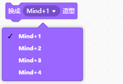
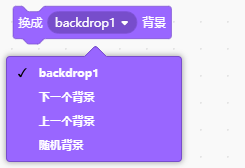
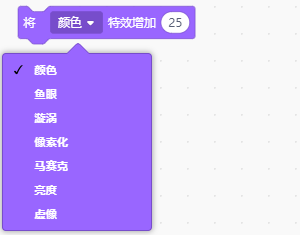
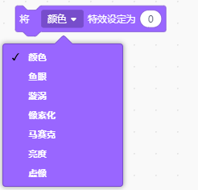
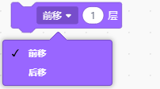

外观类积木用于控制角色或界面的视觉表现，例如切换造型、显示文字、调整颜色特效或隐藏角色，使程序在执行过程中呈现出更丰富的视觉效果。  

| **积木**                                                     | **说明**                                                     |
| ------------------------------------------------------------ | ------------------------------------------------------------ |
|  | 让角色以气泡框形式显示“你好”，并设定显示时间后消失。         |
|  | 让角色以气泡框形式显示“你好”并保持显示。                     |
|  | 让角色以气泡框形式显示思考“嗯......”，并设定显示时间后消失。 |
|  | 让角色以气泡框形式显示思考“嗯......”并保持显示。             |
|  | 将角色切换到指定造型。                                       |
|  | 将角色造型切换到造型列表中的下一个造型。                     |
|  | 将舞台背景切换到指定背景。                                   |
|  | 将舞台背景切换到背景列表中的下一个背景。                     |
|  | 将角色大小增加指定百分比，负数则为减小百分比。               |
|  | 将角色大小设定为指定百分比，默认100%。                       |
|  | 将角色指定特效增加指定百分比，负数则为减小百分比。特效有七种：颜色、鱼眼、漩涡、像素化、马赛克、亮度、虚像。 |
|  | 将角色指定特效设定为指定百分比。特效有七种：颜色、鱼眼、漩涡、像素化、马赛克、亮度、虚像。 |
|  | 清除角色图形特效。                                           |
|  | 显示角色在舞台上。                                           |
|  | 隐藏角色，停止在舞台上显示的角色。                           |
|  | 将角色移到最前面或最后面图层。                               |
|  | 将角色前移或后移指定量图层。                                 |
|  | 角色的造型编号或名称， 勾选小方块可在舞台上显示。 |
|  | 背景的编号或名称， 勾选小方块可在舞台上显示。 |
|  | 角色大小， 勾选小方块可在舞台上显示。 |
