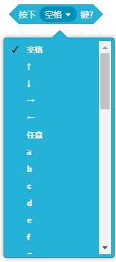
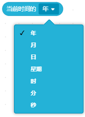

侦测类积木用于检测程序运行中的状态或外部条件，例如判断是否按键、是否接触到对象、声音大小或坐标变化，为程序逻辑的判断和响应提供数据支持。  

| **积木**                                                     | **说明**                                                     |
| ------------------------------------------------------------ | ------------------------------------------------------------ |
|  | 当角色碰到"鼠标指针"或"舞台边缘" 的位置时此条件成立，否则不成立。 |
|  | 当角色碰到颜色（可任意选择颜色）时此条件成立，否则不成立。   |
|  | 当角色身上的某种颜色碰到其它颜色时此条件成立，否则不成立。   |
|  | 返回角色到鼠标指针的距离，注意鼠标需要在舞台上。             |
|  | 舞台显示输入框，并等待，用于键盘给使用者通过键盘输入信息。   |
|  | 返回上一条输入的结果， 勾选小方块可在舞台上显示 |
|  | 当按下电脑键盘上的某个按键时此条件成立，否则不成立。         |
|  | 当按下鼠标时此条件成立，否则不成立。                         |
|  | 获取鼠标所在舞台位置的x坐标。                                |
|  | 获取鼠标所在舞台位置的y坐标。                                |
|  | 将角色的拖动方式设为鼠标"可拖动"或"不可拖动"。               |
|  | 获取电脑麦克风的响度，勾选小方块可在舞台上显示。 |
|  | 计时器会自动随时间从0增加，勾选小方块可在舞台上显示。 |
|  | 将计时器时间归零。                                           |
|  | 获取舞台的"背景编号"、"背景名称"以及"声音"中设置的音量"。    |
|  | 获取当前时间的"年"、"月"、"日"、"星期"、"时"、"分"、以及"秒"。 |
|  | 获取2000年至今的天数。                                       |
