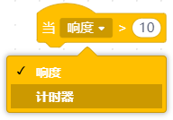

事件类积木用于响应程序启动或外部触发行为，例如点击旗帜、按下按键、接收广播消息等，用于控制程序在何时开始执行或对外部操作作出反应。  

| **积木**                                                     | **说明**                                                     |
| ------------------------------------------------------------ | ------------------------------------------------------------ |
|  | 当绿旗被点击一下，开始按序执行下方每一行指令积木，常用作在后面紧跟需要初始化的操作。 |
|  | 当按下键盘上的按键，开始按序执行下方每一行指令积木           |
|  | 当点一下角色，开始按序执行下方每一行指令积木                 |
|  | 当背景切换为“backdrop1”，开始按序执行下方每一行指令积木      |
|  | 当侦测电脑麦克风响度或计时器大于10，开始按序执行下方每一行指令积木 |
|  | 当接收到广播消息，开始按序执行下方每一行指令积木             |
|  | 发送广播消息给所有角色及舞台                                 |
|  | 传送消息给所有角色及舞台并等待直到所有角色及舞台都接收到     |
