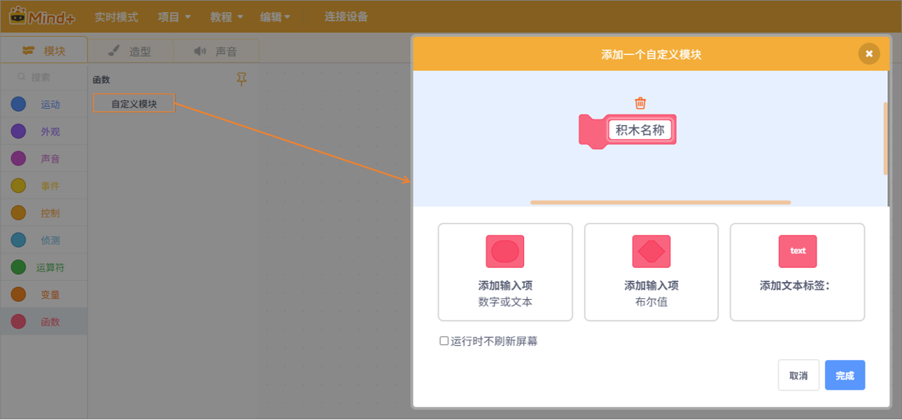

函数类积木用于创建可重复执行的自定义功能模块，用户可以将一段逻辑代码封装成函数并在程序中多次调用，从而提高程序的可读性与复用效率。

| **积木**                                                     | **说明**                         |
| ------------------------------------------------------------ | -------------------------------- |
|  | 增添输入项 数字或文本            |
|  | 增添输入项 为布尔值              |
|  | 在函数积木上增加文本标签利于观看 |
