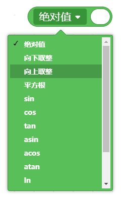

运算符类积木用于进行数学计算、条件比较、逻辑判断及文本处理，为程序中的侦测、控制判断和数据分析提供运算基础。  

| **积木**                                                     | **说明**                                                     |
| ------------------------------------------------------------ | ------------------------------------------------------------ |
|  | 加运算                                                       |
|  | 减运算                                                       |
|  | 乘运算                                                       |
|  | 除运算                                                       |
|  | 在给定范围内产生随机数，包括头尾1和10。                      |
|  | 大于判断                                                     |
|  | 小于判断                                                     |
|  | 等于判断                                                     |
|  | 逻辑与运算，两个条件均满足才返回条件真，否则返回假。         |
|  | 逻辑或运算，两个条件任意一个满足则返回条件真，否则返回假。   |
|  | 逻辑非运算，输入内容为真则返回假，输入内容为假则返回真。     |
|  | 合并字符串                                                   |
|  | 获取字符串中单个字符，从1开始。                              |
|  | 获取字符串字符数。                                           |
|  | 判断字符串中是否包含某个字符。                               |
|  | 获取字符串中某一段字符。                                     |
|  | 获取字符在字符串中首次或最后一次出现的位置。                 |
|  | 求余运算                                                     |
|  | 四舍五入运算                                                 |
|  | 对数值进行取绝对值、向下取整 、向上取郑、平方根等常用高级数学计算。 |
|  | 对数值进行映射运算，将一个范围内容的值平均对应为另外一个范围的值。 |
|  | 对数值进行约束，使输出值不超过最大值与最小值。               |
