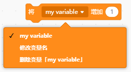
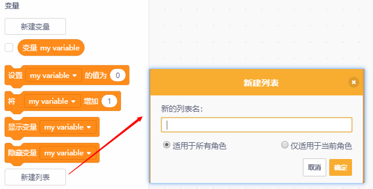
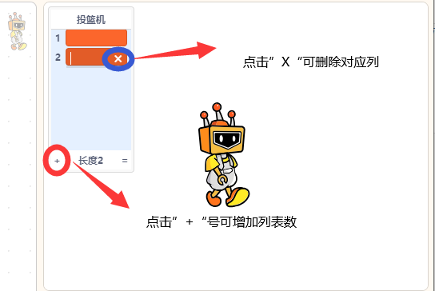

变量类积木用于创建并保存动态数据，例如分数、计数或文本信息，用户可以通过设置或修改变量内容实现程序中的数据记录与传递。  

| **积木**                                                     | **说明**                                                     |
| ------------------------------------------------------------ | ------------------------------------------------------------ |
|  | 新建一个变量并设置适用范围。                                 |
|  | 获取变量my variable的值，勾选可在舞台显示值。                |
|  | 设置变量my variable的值为**0。**                             |
|  | 将变量my variable增加**0。**                                 |
|  | 在舞台显示变量my variable。                                  |
|  | 在舞台隐藏变量my variable。                                  |
|  | 新建列表并设置列表名，且列表名不能为空。                     |
|   | 这里设置列表名为“投篮机”，勾选指令区”列表 投篮机“可在舞台显示。 |
|   | 新增一个名为”东西“的列表项。                                 |
|  | 删除”投篮机“列表的第一项。                                   |
|  | 删除删除”投篮机“列表的所有项。                               |
|  | 在”投篮机“的第1项中插入1，具体数据都可以修改。               |
|  | 将”投篮机“的第1项替换为1，具体数据都可以修改。               |
|  | 获取”投篮机“列表的第一项数据。                               |
|  | 获取”投篮机“列表的第一”东西“的编号。                         |
|  | 获取”投篮机“的项目数。                                       |
|  | 判断列表”投篮机“中是否含有”东西“。                           |
|  | 显示或者隐藏”投篮机“列表。                                   |

### 
