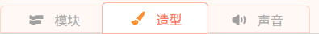
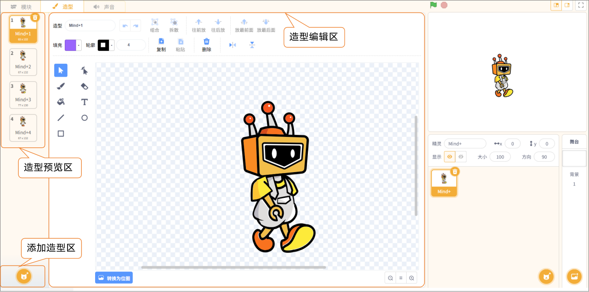
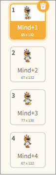
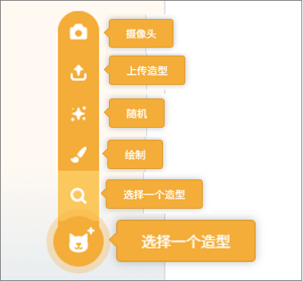
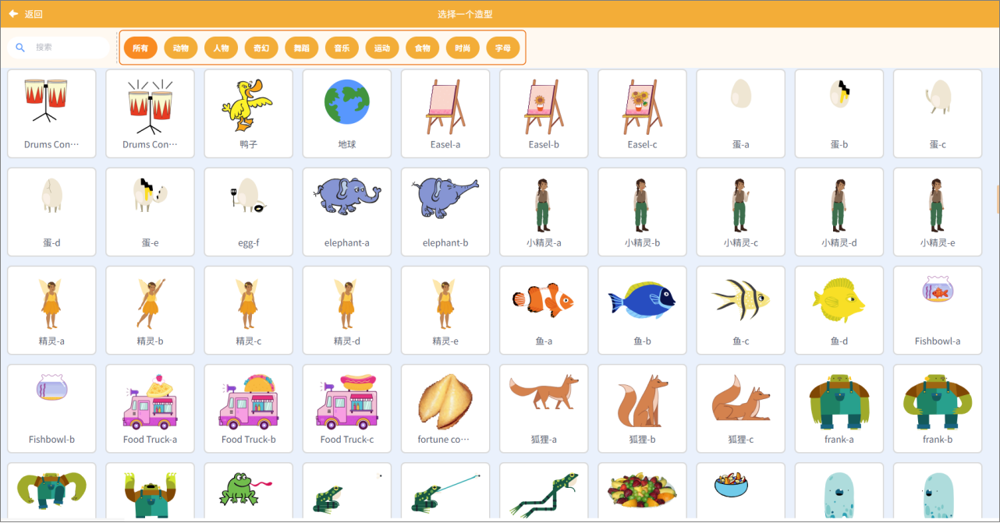
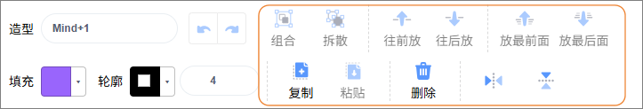

功能区是实时模式中操作的重要区域，功能区将程序操作、视觉效果与声音控制击中在一起，方便用户快速进行创作与调试，主要包括模块、造型、声音。

造型功能区用于管理和编辑角色外观，让角色在舞台上呈现丰富动作和表情，主要分为造型预览区、添加造型区、造型编辑区。  

##### 1. 造型预览区

用于浏览角色当前拥有的所有造型，用户可以快速查看不同造型的外观，并选择其中一个进行编辑或应用于程序中。  

##### 2. 添加造型区

用于为角色添加新造型，支持从通过摄像头拍摄造型、上传本地图片、获取随机造型、或使用绘图工具创建新造型等操作。  

| **功能**     | **说明**                                                     |
| ------------ | ------------------------------------------------------------ |
| 摄像头       | 使用设备的摄像头拍摄图片，并将拍摄内容直接生成一个新的造型。 |
| 上传造型     | 从本地电脑上传图片文件（如 JPG、PNG 等），作为角色的新造型。 |
| 随机         | 系统从造型库中随机选择一个造型并添加到当前角色中。           |
| 绘制         | 打开造型编辑器，用户可以使用画笔工具手动绘制全新的造型。     |
| 选择一个造型 | 进入造型库，从预设的约700多种分类造型中选择一个并添加到角色中。 |

**注意：**选择造型时，可以通过选择一个造型功能， 从造型库中挑选所需造型。造型库提供约 700 多种丰富的造型，涵盖动物、人物、奇幻、舞蹈、音乐、运动、食物、时尚、字母等多种类型，满足用户多样化创作需求。  

##### 3. 造型编辑区

 用于对选中的造型进行编辑与优化，支持组合、拆分、复制、粘贴、镜像等操作，并可调整造型元素的前后层级（前移、后移、置于最前、置于最后），帮助用户灵活修改角色外观。  

| **功能** | **说明**                   |
| -------- | -------------------------- |
| 组合     | 可对每个角色模块进行组合。 |
| 拆散     | 可对角色进行拆分。         |
| 往前放   | 把模块放在另一个前。       |
| 往前后   | 把模块放在另一个后。       |
| 放最前面 | 把模块放在最前面。         |
| 放最后面 | 把模块放在最后面。         |
| 复制     | 复制选择的模块。           |
| 粘贴     | 粘贴所选择的模块。         |
| 删除     | 删除所选择的模块。         |
| 水平翻转 | 水平翻转。                 |
| 垂直翻转 | 垂直翻转。                 |
