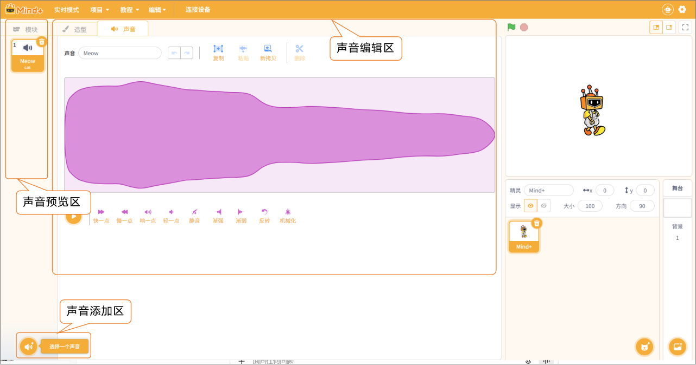
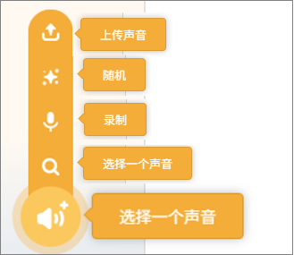
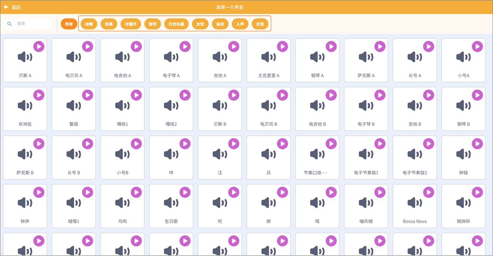
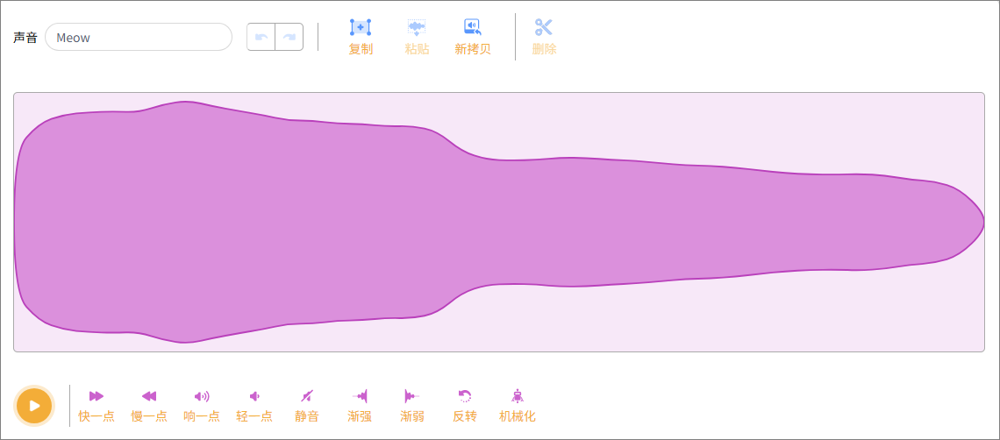

功能区是实时模式中操作的重要区域，功能区将程序操作、视觉效果与声音控制击中在一起，方便用户快速进行创作与调试，主要包括模块、造型、声音。

声音功能区用于管理与编辑角色所使用的音效和背景音乐，帮助角色实现说话、跳跃、表情变化等具有听觉反馈的交互效果。  

##### 1. 声音预览区

用于查看角色当前拥有的所有声音文件。  

##### 2. 声音添加区

用于为角色添加新声音资源。  

| **功能**     | **说明**                                                     |
| ------------ | ------------------------------------------------------------ |
| 上传声音     | 从本地电脑导入音频文件（如 WAV、MP3 等），添加为角色的新声音。 |
| 随机         | 系统从声音库中随机挑选一段音效或音乐，并添加到角色的声音列表中。 |
| 录制         | 启用麦克风录音功能，用户可录制自己的声音或环境音作为角色音效。 |
| 选择一个声音 | 打开声音库，从预设的声音资源中选择合适的音效添加到角色中。声效类型丰富，适用于不同场景。 |

**注意：** 声音库内收录了超过 300 种音效类型，包含动物叫声、效果音、可循环、音符、打击乐器、太空、运动、人声及古怪音效等多种分类，方便用户根据创意快速选用合适的声音素材。  

##### 3. 声音编辑区

对选中的声音进行处理和优化。 声音编辑区提供多种编辑工具，用户可对选中的声音进行以下操作：播放、加快或减慢速度、提高或降低音量、静音处理、添加渐强/渐弱效果、反转音频，以及应用机械化等特殊音效。  

| **功能名称** | **功能说明**                                               |
| ------------ | ---------------------------------------------------------- |
| 播放         | 预听当前声音效果，便于编辑前后对比。                       |
| 快一点       | 提升声音的播放速度。                                       |
| 慢一点       | 降低声音的播放速度。                                       |
| 响一点       | 增加声音音量，使其更突出。                                 |
| 轻一点       | 减小声音音量，使其更柔和。                                 |
| 静音         | 将声音音量设置为零，实现完全无声效果。                     |
| 渐强         | 为声音添加由弱到强的音量变化效果。                         |
| 渐弱         | 为声音添加由强到弱的音量变化效果。                         |
| 反转         | 将声音倒放，形成独特的音效体验。                           |
| 机械化       | 为声音增加机械风格的特殊音效处理，使音质更科技感或电子化。 |
