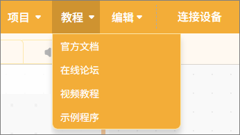
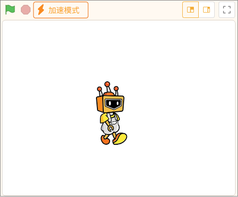
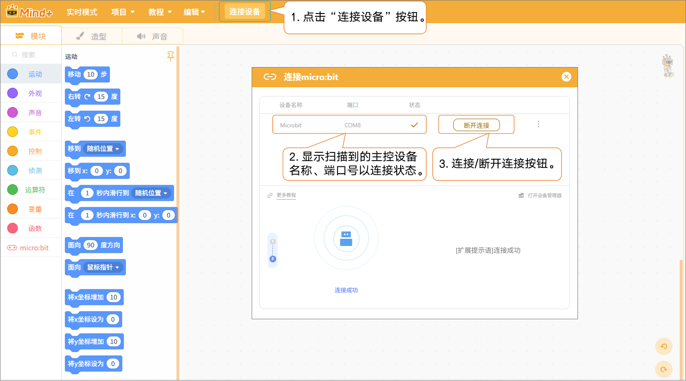

菜单栏提供了针对实时模式的项目操作，包含项目、教程、编辑、连接设备。

#### 1. 项目

提供项目管理操作，包含新建项目、打开项目、保存项目、另存为、重命名等操作，方便用户对编程项目进行完整管理。

| **功能** | **说明**                                                     |
| -------- | ------------------------------------------------------------ |
| 新建项目 | 创建一个空白项目，并清除当前加载的所有扩展指令，便于从零开始编程。 |
| 打开项目 | 打开已保存的项目文件，继续编辑或运行。                       |
| 保存项目 | 将当前项目保存到计算机上，更新原有文件内容。                 |
| 另存为   | 将当前项目保存为新的文件，用户可指定文件名和位置，原项目不会被覆盖，适合创建备份或新版本。 |
| 重命名   | 修改已有项目的名称，不改变项目内容或保存位置，便于整理和管理文件。 |

#### 2. 教程

提供丰富的学习资源，包含官方文档、在线论坛、视频教程、示例程序。

**注意：**示例程序是根据选择的主控板自动调整内容，便于实际操作学习。

| **功能** | **说明**                                                     |
| -------- | ------------------------------------------------------------ |
| 官方文档 | 打开官方文档页面，可查看大量教程                             |
| 在线论坛 | 打开Mind+官网论坛，可查看大量项目及反馈交流。                |
| 视频教程 | 对于刚入门，可观看一些简单例子。                             |
| 示例程序 | 提供当前主控板的示例程序，注意需要先在扩展中选择主控板之后才有示例程序。 |

#### 3. 编辑

支持编辑操作，可恢复删除的角色，并开启或关闭加速模式，提高编程效率。

**恢复删除：**可恢复上一步删除的角色/造型/声音/背景。但是与撤销/恢复功能不同。

**打开/关闭加速模式：**打开或关闭加速模式，打开后舞台程序运行速度加快，延时变短，打开后舞台上方有“加速模式”的文字显示。

#### 4. 连接设备

在实时模式下，当添加了主控设备后，可通过点击“连接设备”按钮，实现硬件的连接或断开。同时还提供了快捷入口“教程”以及“打开设备管理起”方便排查硬件连接故障。

