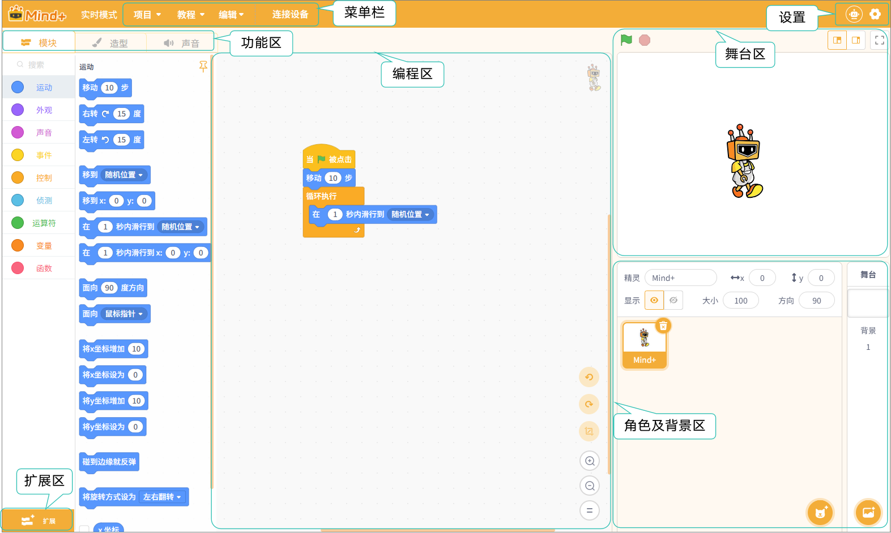

# 3.1 实时模式
实时模式是Mind+中的一种基础编程方式，它允许用户通过积木编程实时控制硬件或舞台角色的行为。程序在电脑上运行时，指令会即时传输到设备或舞台，实现互动式控制。这种模式适合没有编程基础的用户，或者想要快速验证想法、制作互动项目的人群。

**特点：**

**指令执行即时响应，操作直观。**

无需上传程序到硬件，可随时调整和测试。

适合初学者和快速原型制作。

### 界面认识

进入实时模式后，你将看到如下界面。

整个界面可分为7个区域：菜单栏、设置、功能区、扩展区、舞台区、角色及背景区。

接下来，我们将针对这7个区域进行详细的了解，每个区域的详细功能介绍，可点击跳转：

| [菜单栏](MenuBar.md)       | [设置](Settings.md)   | [功能区-模块](FunctioModule/index.md) | [功能区-造型](FunctionalModeling.md) |
| ------------ | ------ | ----------- | ----------- |
| [**功能区-声音**](FunctionalSound.md)  | [**扩展区**](Expansion.md) | [**编程区**](Programming.md)      | [**舞台区**](Stage.md)      |
| [**角色及背景区**](CharactersAndBackground.md) |        |             |             |

