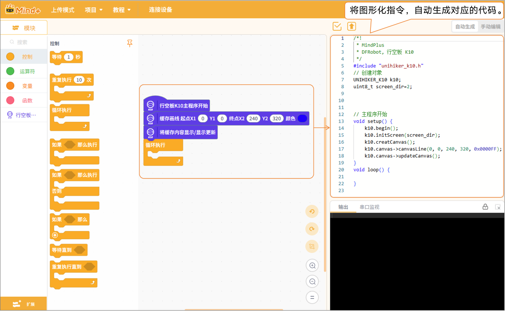
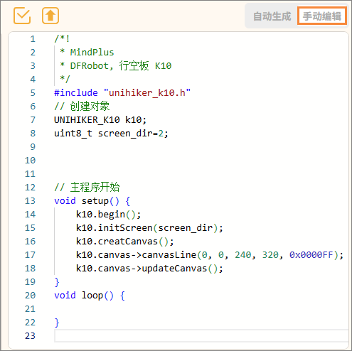

代码显示区用于展示程序的代码形式，并支持两种使用方式：自动生成与手动编辑。

#### 1. 自动生成

当用户使用图形化积木进行编程时，系统会自动将积木指令转换为对应的代码，并实时显示在该区域中，帮助用户理解图形化指令与代码之间的对应关系，便于进阶学习。

#### 2. 手动编辑

在代码显示区，用户也可以切换为手动编辑模式，在代码编辑界面中直接手动输入代码，编写完整的程序，适合有编程基础用户的需求。

