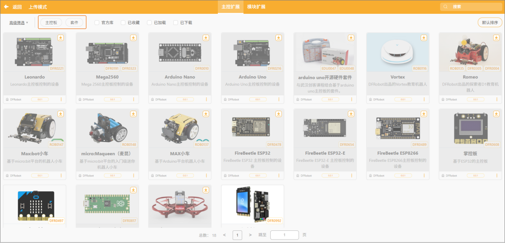
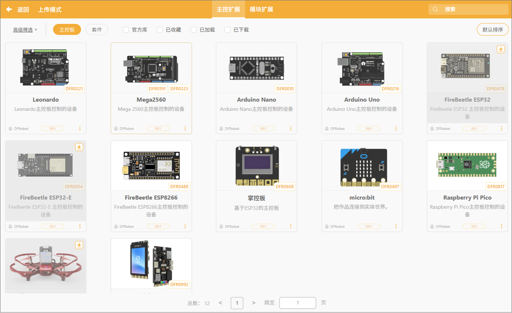
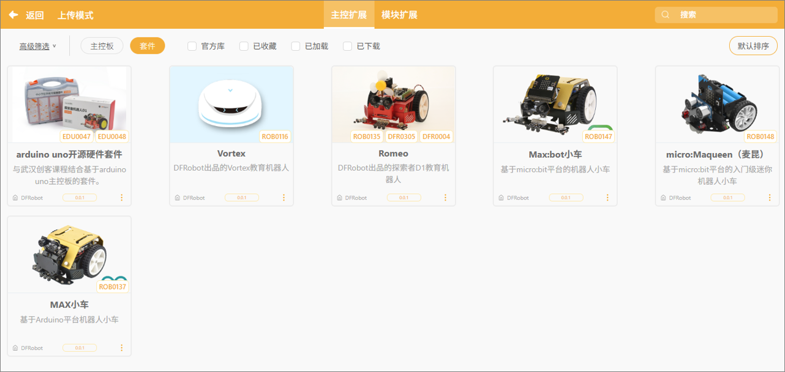
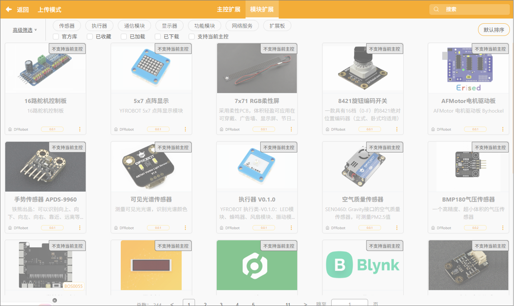

在上传模式下，扩展区支持添加两类扩展内容：

1. **主控扩展**：用于选择或更换当前编程所使用的硬件主控板，例如 Arduino、micro:bit、行空板K10 等。
2. **模块扩展**：在主控选择完成后，可进一步添加适配该主控的传感器、执行器或功能模块扩展，丰富程序功能实现。

通过扩展区的配置，用户可以根据项目需求灵活选择硬件主控，并加载相应模块，实现更多硬件交互功能。

想深入了解每个扩展库的指令？点击“[扩展库]())”即可查看上传模式中扩展库的详细说明。  

#### 1. 主控扩展

主控扩展是系统识别和控制硬件的核心部分，加载后可驱动对应主控板及其套件。主控扩展进一步分为：主控板和套件。

**主控板**：核心控制单元，处理数据和控制外设，是项目运行的“大脑”，支持12种不同类型的主控。

**套件**：套件是与主控板配套的传感器、执行模块或配件组合，扩展主控板功能，让创意项目更丰富。上传模式中，支持6种不同的套件。

#### 2. 模块扩展

模块扩展是在选择好主控板后自动匹配显示的功能区域，系统会根据该主控支持的硬件列出可用模块，用户可根据项目需求手动选择添加。这些模块可用于增强项目功能，实现更丰富的交互与控制。

在模块扩展中，模块共分为 **7 大类**，涵盖多种硬件形式：

| **模块类别** | **用途**                                  |
| ------------ | ----------------------------------------- |
| 传感器       | 采集环境数据，如温度、光线、声音等        |
| 执行器       | 输出动作效果，如舵机、电机、蜂鸣器、LED灯 |
| 通信模块     | 支持无线传输或设备间通信                  |
| 显示器       | 图像或文本信息显示，如屏幕                |
| 功能模块     | 提供特定算法或逻辑功能                    |
| 网络服务     | 连接互联网，实现在线功能                  |
| 扩展板       | 扩展引脚或增强连接能力                    |